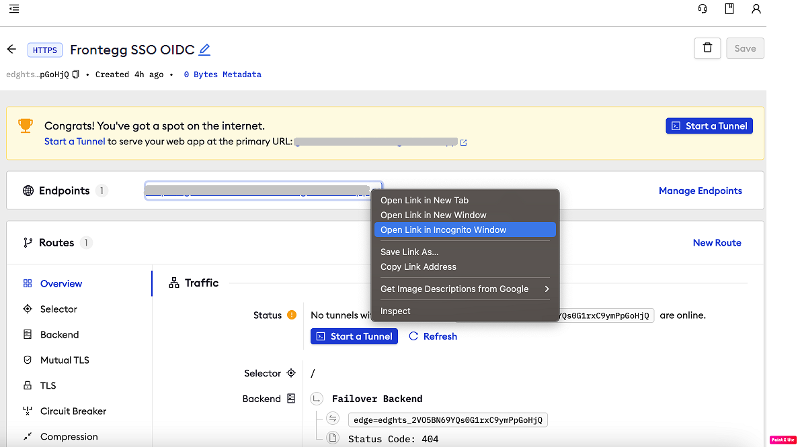

# Frontegg SSO (OpenID Connect)

:::tip TL;DR

To secure access to ngrok with Frontegg Single Sign-On (SSO) using OpenID Connect:

1. [Configure Frontegg SSO](#configure-frontegg)
1. [Configure ngrok](#configure-ngrok)
1. [Test access to ngrok with Frontegg SSO](#test-sso)

:::

This article details how to configure Frontegg as the primary Identity Provider (IDP) for ngrok endpoints.
By integrating Frontegg SSO with ngrok, you can:

- **Restrict access to ngrok endpoints** only to users authenticated via Frontegg
- **Use Frontegg security policies and MFA authenticators**.
- **Use Frontegg's Dashboard to facilitate access to ngrok apps**.

## Supported Features

The ngrok integration with Frontegg supports:

- **SP-Initiated SSO**: In this mode, users access ngrok endpoints and are redirected to Frontegg for authentication.

## Requirements

To configure an ngrok edge with Frontegg, you must have:

- A Frontegg account with administrative rights to create apps
- An [ngrok Enterprise Account](https://ngrok.com/pricing) with an authtoken or admin access to configure edges with OpenID Connect.

## Configuration Steps

To integrate ngrok with Frontegg SSO, you will need to:

1. Configure Frontegg with the ngrok app
1. Configure ngrok with the SSO settings provided by Frontegg

## **Step 1**: Configure Frontegg {#configure-frontegg}

### Add the ngrok App in Frontegg

1. Access the [Frontegg Portal](https://portal.frontegg.com/), and sign in using your Frontegg administrator account.

1. On the left menu, click the environment you want to integrate with ngrok. In this example click the **Development** environment.

1. On the left menu, click **Authentication**, click **Login method**, enter the URL `https://idp.ngrok.com/oauth2/callback` under the **Hosted login** field, and then click **Save**.
   

1. On the left menu, click **Env settings**, and copy the value of both the **Client ID** and the **API key** fields.

1. Click the **Domains** tab, and copy the value of the **Domain name**.

### Grant access to Frontegg users

Create a Frontegg user:

1. On the left menu of the [Frontegg Portal](https://portal.frontegg.com/), click your environment, click **Backoffice**, click **Accounts**, and then click **Add New**.

1. On the **Add new account** popup, enter a name for the account, `ngrok.com` in the **Domain** field, and then click **Save**.

1. On the left menu, click **Backoffice**, click **Users**, and then click **Add New**.

1. On the **Add new user** popup, enter a name, email, select the account you have created, and then click **Save**.
   **Note**: by default, the user is assigned the **Admin** role.

## **Step 2**: Configure ngrok {#configure-ngrok}

ngrok can leverage Frontegg SSO in two ways:

- From the ngrok CLI (using the `--oidc` parameter)
- From the ngrok dashboard

### **Option 1**: ngrok CLI

> **Note:** For this tutorial, we assume you have an app running locally (i.e., on localhost:3000) with the ngrok client installed.

1. Launch a terminal

1. Enter the following command to launch an ngrok tunnel with Frontegg SSO:

   ```bash
   ngrok http 3000 --oidc=FRONTEGG_OAUTH_URL \
   --oidc-client-id=FRONTEGG_CLIENT_ID \
   --oidc-client-secret=FRONTEGG_CLIENT_SECRET \
   ```

   **Note**: Replace the following with the values:

   - FRONTEGG_OAUTH_URL: Your Frontegg **Domain name** URL (i.e. `https://app-123456.frontegg.com`).
   - FRONTEGG_CLIENT_ID: The client id you copied from Frontegg.
   - FRONTEGG_CLIENT_SECRET: The API key you copied from Frontegg.

   Alternatively, add the `--url YOUR_DOMAIN` argument to get your custom URL, replacing `YOUR_DOMAIN` with your URL of preference.

1. Copy the URL available next to **Forwarding** (for example, `https://frontegg-sso-test.ngrok.app`).

1. Skip to **Step 3**

### **Option 2**: ngrok Edge

To configure an edge with Frontegg:

1. Access the [ngrok Dashboard](https://dashboard.ngrok.com/) and sign in using your ngrok account.

1. On the left menu, click **Cloud Edge** and then click **Edges**.

1. If you don't have an edge already set to add Frontegg SSO, create a test edge:

   - Click **+ New Edge**.
   - Click **Create HTTPS Edge**.
   - Click the **pencil icon** next to "no description", enter `Frontegg SSO OIDC` as the edge name and click **Save**.

1. On the edge settings menu, click **OIDC**.

1. Click **Begin setup** and enter the following values into the fields:
   

   - **Issuer URL**: Your Frontegg **Domain name** URL (i.e. `https://app-123456.frontegg.com`).
   - **Client ID**: The client id you copied from Frontegg.
   - **Client Secret**: The API key you copied from Frontegg.

1. Click **Save** at the top, and then click the left arrow to go back to the **Edges** page.

1. Launch a tunnel connected to your Frontegg edge:

:::tip Note
For this step, we assume you have an app running locally (i.e. on localhost:3000) with the ngrok client installed.
:::

1. Click **Start a tunnel**.

1. Click the **copy icon** next to the tunnel command.
   

1. Launch a tunnel:

   - Launch a terminal.
   - Paste the command but replace `http://localhost:80` with your localhost app address (i.e., `http://localhost:3000`).
   - Click **Enter** and an ngrok tunnel associated with your edge configuration will launch.

1. To confirm that the tunnel is connected to your edge:

   - Return to the ngrok dashboard
   - Close the **Start a tunnel** and the **Tunnel group** tabs
   - Refresh the test edge page. Under traffic, you will see the message _You have 1 tunnel online. Start additional tunnels to begin load balancing._
     

1. In the test edge, copy the **endpoint URL** (you use this URL to test the Frontegg Authentication).
   

## Step 3: Test the integration {#test-sso}

1. In your browser, launch an incognito window.

1. Access your ngrok tunnel (i.e., `https://frontegg-sso-test.ngrok.app`). Use the copied endpoint URL.

1. You should be prompted to log in with your Frontegg credentials.

1. After logging in, you should be able to see your web app.
