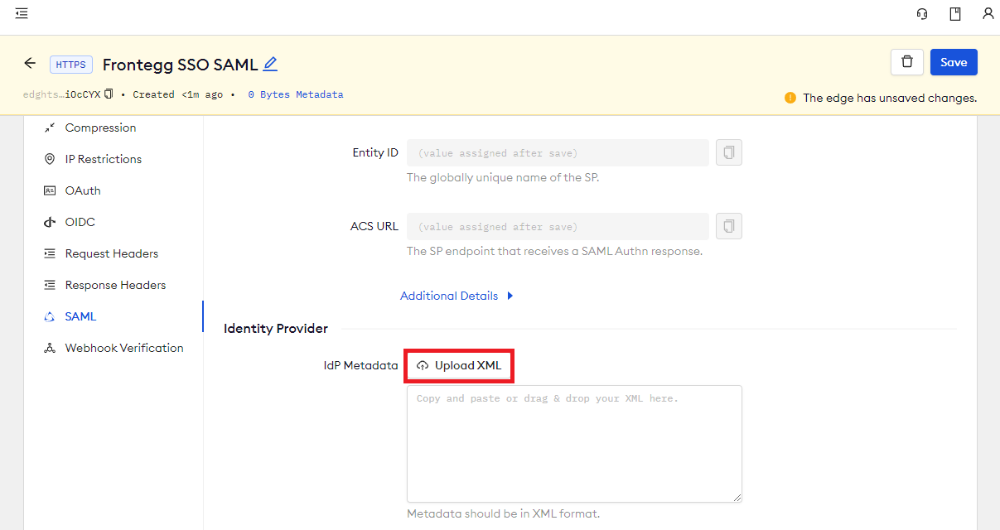

# Frontegg SSO (SAML)

---

:::tip TL;DR

To secure access to ngrok with Frontegg Single Sign-On using SAML:

1. [Configure Frontegg SSO](#configure-frontegg)
1. [Configure ngrok](#configure-ngrok)
1. [Test access to ngrok with Frontegg SSO](#test-sso)

:::

This article details how to configure Frontegg as the primary Identity Provider for ngrok tunnels.
By integrating Frontegg SSO with ngrok, you can:

- **Restrict access to ngrok tunnels** only to users authenticated via Frontegg
- **Use Frontegg security policies and MFA authenticators**.
- **Use Frontegg's Dashboard to facilitate access to ngrok apps**.

## Requirements

To configure ngrok tunnels with Frontegg, you must have:

- an Frontegg account with administrative rights to create apps
- an [ngrok Enterprise Account](https://ngrok.com/pricing) with an authtoken or admin access to configure edges with SAML.

## Configuration Steps

To integrate ngrok with Frontegg SSO, you will need to:

1. Configure Frontegg with the ngrok app
1. Configure ngrok with the SSO settings provided by Frontegg

## **Step 1**: Configure Frontegg {#configure-frontegg}

1. Access the [Frontegg Portal](https://portal.Frontegg.com/) and sign in using your Frontegg administrator account.

1. On the left menu, click your environemtn under **Environments** and then click **Env settings**.

1. On the **General Settings** page, copy both the **Client ID** and **API Key** values.

1. Open a terminal window and run the following command to get a access token:

   ```bash
   curl --request POST \
     --url https://api.frontegg.com/auth/vendor/ \
     --header 'accept: application/json' \
     --header 'content-type: application/json' \
     --data '{"clientId": "CLIENT_ID","secret": "API_KEY"}'
   ```

    **Note**: Replace the following with values:

    - CLIENT_ID: The client id value you copied before.
    - API_KEY: The api key value you copied before.

1. Copy the value of the **token** attribute from the response.

1. In the terminal window, run the following command to create a SAML configuration and to download de metadata from Frontegg:

   ```bash
   curl --location --request POST 'https://api.frontegg.com/oauth/resources/configurations/saml/v1/ENCODED-ENTITY-ID-FROM-NGROK' \
   --header 'frontegg-vendor-host: YOUR-FRONTEGG-HOST-URL' \
   --header 'Authorization: Bearer TOKEN' \
   --header 'Content-Type: application/json' \
   --data-raw '{
      "acsUrl": "ACS-URL-FROM-NGROK",
      "entityId": "ENTITY-ID-FROM-NGROK",
      "singleLogoutService": "REDIRECT-URL-AFTER-LOGOUT"
   }'
   ```

   **Note**: Replace the following with values copied on previous steps:

   - ENCODED-ENTITY-ID: Base64 value of the ngrok entity ID.
   - YOUR-FRONTEGG-HOST-URL: The value of the **Domain name** from the **Env settings** > **Domains** tab.
   - TOKEN: The token you copied before.
   - ACS-URL-FROM-NGROK: 
   - ENTITY-ID-FROM-NGROK: 
   - REDIRECT-URL-AFTER-LOGOUT: 


1. On the **New Application** popup, enter `ngrok saml` in the **Display Label** field.

1. Click the **SSO** tab, enter `https://ngrok-Frontegg` in the **IdP Entity ID** field, enter temporary values (i.e., `https://temporary`) in both the **SP Entity ID** and the **ACS URL** fields, and then click **activate**.

### **Step 2**: Download the IdP metadata {#idp-metadata}

1. On the **SSO** page of the [Frontegg Console](https://console.Frontegg.com/), click your **Custom SAML App**, click the **SSO** tab, click **Export Metadata**, and then save the XML file on your desktop.

### **Step 3**: Configure ngrok {#configure-ngrok}

To configure an edge with Frontegg:

1. Access the [ngrok Dashboard](https://dashboard.ngrok.com/) and sign in using your ngrok account.

1. On the left menu, click **Cloud Edge** and then click **Edges**.

1. If you don't have an edge already set to add Frontegg SSO, create a test edge:

   - Click **+ New Edge**.
   - Click **Create HTTPS Edge**.
   - Click the **pencil icon** next to "no description", enter `Edge with Frontegg SSO SAML` as the edge name, and click **Save**.

1. On the edge settings menu, click **SAML**.

1. On the **SAML** page, click **Begin setup**, click **Upload XML**, and then open the XML metadata file you downloaded from Frontegg (See [Download the IdP metadata](#idp-metadata)).
   

1. Click **Save** at the top.

### **Step 4**: Download the SP metadata {#sp-metadata}

1. On the **SAML** page of your [ngrok edge](https://dashboard.ngrok.com/cloud-edge/edges), click the three dots close to the **SP Metadata** field, click **Download XML File**, and then save the XML file on your desktop.

### **Step 5**: Link Frontegg with ngrok {#sp-metadata}

1. Access the [Frontegg Portal](https://portal.Frontegg.com/), click **SSO**, click your **Custom SAML App**, click the **SSO** tab, click **Upload Metadata**, and then open the XML metadata file you downloaded from ngrok (See [Download the SP metadata](#sp-metadata)).
   

1. Click **Save**.

### **Step 6**: Start a Tunnel {#start-tunnel}

1. Access the [ngrok edges page](https://dashboard.ngrok.com/cloud-edge/edges), click your edge, and then click **Start a tunnel**.

:::tip Note
For this step, we assume you have an app running locally (i.e. on localhost:3000) with the ngrok client installed.
:::

1. Click the **copy icon** next to the tunnel command.
   

1. Launch a tunnel:

   - Launch a terminal.
   - Paste the command but replace `http://localhost:80` with your localhost app address (i.e., `http://localhost:3000`).
   - Click **Enter** and an ngrok tunnel associated with your edge configuration will launch.

1. To confirm that the tunnel is connected to your edge:

   - Return to the ngrok dashboard
   - Close the **Start a tunnel** and the **Tunnel group** tabs
   - Refresh the test edge page. Under traffic, You will see the message _You have 1 tunnel online. Start additional tunnels to begin load balancing._
     

1. In the test edge, copy the **endpoint URL**. (You use this URL to test the Frontegg Authentication)
   

## Grant access to Frontegg users {#users}

Frontegg allows administrators to restrict access to SSO apps — such as ngrok — via user group assignments. By default, apps created in Frontegg have no group assignments — in other words, nobody can use Frontegg SSO to access ngrok until you assign a group to the app.

To assign Frontegg groups to the ngrok app:

1. On the left menu of the [Frontegg Portal](https://portal.Frontegg.com/), click **SOO** and click the ngrok custom SAML app you created.

1. On the app popup, click the **User Groups** tab, click the checkbox of the **All Users** group, and then click **Save**.
   **Tip**: Make sure to add Frontegg users to this group when you create or manage users that need access to the ngrok app.

## Test the integration {#test-sso}

1. In your browser, launch an incognito window.

1. Access your ngrok tunnel (i.e., `https://frontegg-sso-test.ngrok.app` or using the copied endpoint URL).

1. You should be prompted to log in with your Frontegg credentials.

1. After logging in, you should be able to see your web app.
