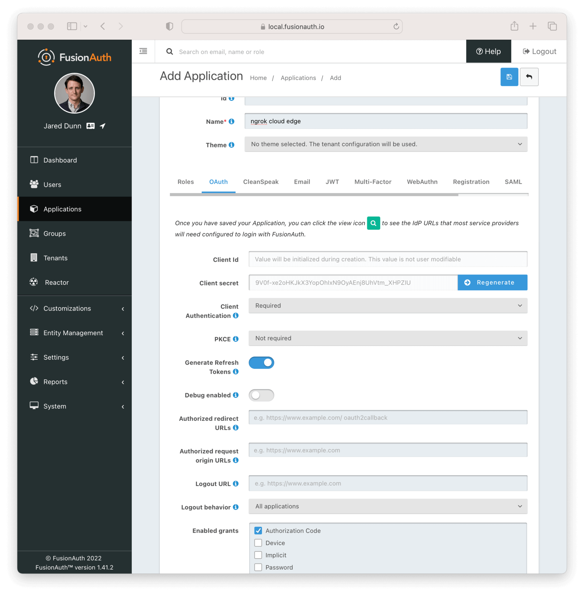
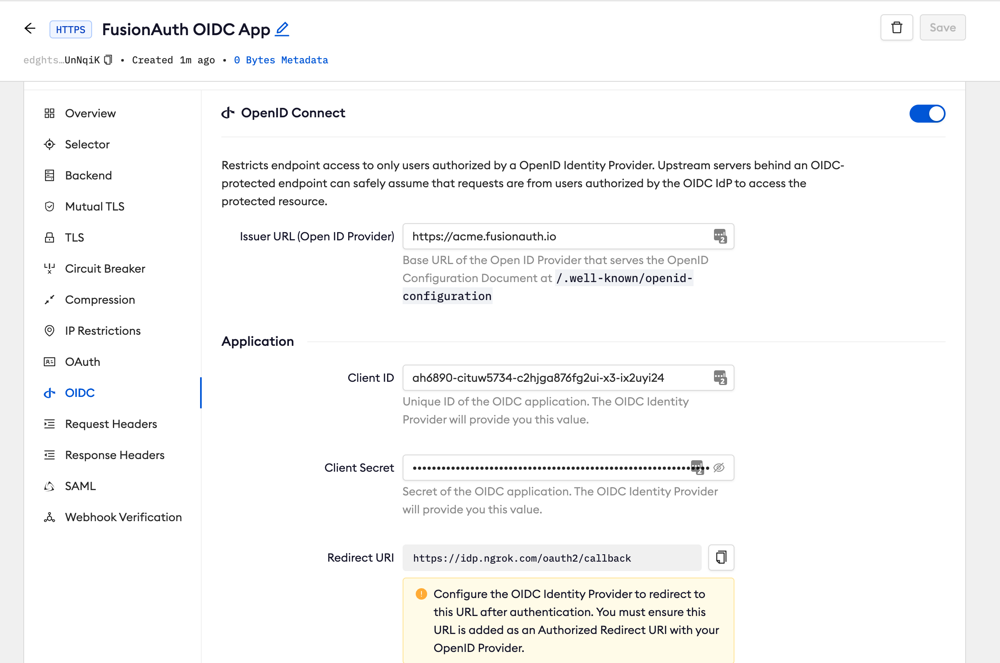
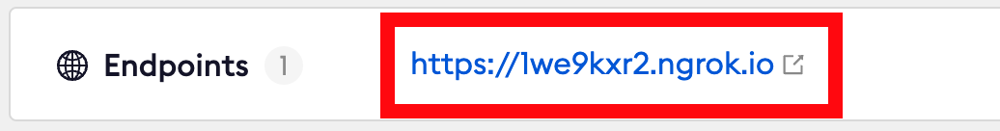

# FusionAuth SSO (OpenID Connect)

:::tip TL;DR

To secure access to ngrok with FusionAuth Single Sign-On using OpenID Connect:

1. [Configure FusionAuth SSO](#configure-FusionAuth)
1. [Configure ngrok](#configure-ngrok)
1. [Test access to ngrok with FusionAuth SSO](#test-sso)

:::

This article details how to configure FusionAuth as the primary Identity Provider for ngrok tunnels.
By integrating FusionAuth SSO with ngrok, you can:

- **Restrict access to ngrok tunnels** only to users authenticated via FusionAuth
- **Use FusionAuth Premium Features and Login Methods** — including Advanced Registration Forms, Passwordless Login, WebAuthn, **and Advanced Threat Detection to control access to ngrok tunnels**.

## Supported Features

The ngrok integration with FusionAuth supports:

- **OIDC based SSO**: In this mode, users access ngrok edges and tunnels and are redirected to FusionAuth for authentication.

## Requirements

To configure ngrok tunnels with FusionAuth, you must have:

- A public facing FusionAuth instance. You can spin up a basic [FusionAuth Cloud instance](https://fusionauth.io/pricing) or [install it on any server](https://fusionauth.io/docs/v1/tech/installation-guide/).
- An [ngrok Enterprise Account](https://ngrok.com/pricing) with an authtoken or admin access to configure edges with OpenID Connect.
- A local web app or application that needs to be protected by Fusion Auth.

## Configuration Steps

To integrate ngrok with FusionAuth SSO, you will need to:

1. Configure FusionAuth with the ngrok app
1. Configure ngrok with the SSO settings provided by FusionAuth

## **Step 1**: Configure FusionAuth {#configure-FusionAuth}

### Add the ngrok App in FusionAuth

1. Navigate to your FusionAuth instance.
1. Navigate to **Tenants** > **Your Tenant** and change the issuer to the URL of your FusionAuth instance. For example, https://acme.fusionauth.io.
1. Navigate to **Applications** and then create a new Application. Fill out the **Name** field, then click the **OAuth** tab.
1. Make sure that the **Enabled grants** checkboxes have the **Authorization Code** and **Refresh Token** grants enabled.
1. In the **Authorized redirect URLs** field add `https://idp.ngrok.com/oauth2/callback`
1. Click the `Save` button.
1. You should see values in the **Client Id** and **Client secret** fields. Copy them; ou’ll use them in the [Configure ngrok](#configure-ngrok) step.
1. Your Application should look like this:
   

## **Step 2**: Configure ngrok {#configure-ngrok}

ngrok can leverage FusionAuth SSO in two ways:

- From the ngrok CLI (using the `--oidc` parameter)
- From the ngrok dashboard

### **Option 1**: ngrok CLI

> **Note:** For this tutorial, we assume you have an app running locally (i.e., on localhost:3000) with the ngrok client installed.

1. Launch a terminal
1. Enter the following command to launch an ngrok tunnel with FusionAuth SSO. Replace `<FusionAuth_url>` with your FusionAuth org address (i.e., https://acme.fusionauth.com) and the `<FusionAuth_client_id>` and `<FusionAuth_client_secret>` with the respective values copied from the ngrok app registered at FusionAuth:

   ```bash
   ngrok http 3000 --oidc=<FusionAuth_url> \
   --oidc-client-id=<FusionAuth_client_id> \
   --oidc-client-secret=<FusionAuth_client_secret> \
   --url=fusionauth-sso-test.ngrok.dev
   ```

1. Skip to **Step 3**

### **Option 2**: ngrok Edge

To configure an edge with FusionAuth:

1. Go to dashboard.ngrok.com.
1. Click **Cloud Edge** > **Edges**
1. If you don't have an edge already set to add FusionAuth SSO, create a test edge:
   - Click **New Edge**
   - Click **HTTPS Edge**
   - Click the **pencil icon** next to "no description". Enter _Edge with FusionAuth SSO_ as the edge name and click **Save**.
1. On the edge settings, click **OIDC**.
1. Click **Begin setup** and enter the following:

   

   - **Issuer URL**: Your FusionAuth tenant url (i.e. https://acme.fusionauth.com).
   - **Client ID**: The client id copied from FusionAuth
   - **Client Secret**: The client secret copied from FusionAuth

1. Click **Save**.

1. Launch a tunnel connected to your FusionAuth edge:

:::tip Note
For this step, we assume you have an app running locally (i.e. on localhost:3000) with the ngrok client installed.
:::

1.  Click **Start a tunnel**.
1.  Click the **copy icon** next to the tunnel command.

    

1.  Launch a tunnel:
    - Launch a terminal
    - Paste the command. Replace http://localhost:80 with your local web app addess (i.e., http://localhost:3000)
    - hit **Enter**. an ngrok tunnel associated to your edge configuration is launched.
1.  To confirm that the tunnel is connected to your edge:

    - Return to the ngrok dashboard
    - Close the **Start a tunnel** and the **Tunnel group** tabs
    - Refresh the test edge page. Under traffic, You will see the message _You have 1 tunnel online. Start additional tunnels to begin load balancing_

    

1.  In the **Endpoints** section, copy the **endpoint URL**. (you will use this url to test the FusionAuth Authentication)
    

## Step 3: Test the integration {#test-sso}

1. In your browser, launch an incognito window.
1. Access your ngrok tunnel (i.e., https://fusionauth-sso-test.ngrok.io or using a copied URL).
1. You should be prompted to log in with your FusionAuth credentials.
1. After login, you should be able to see your web app.
