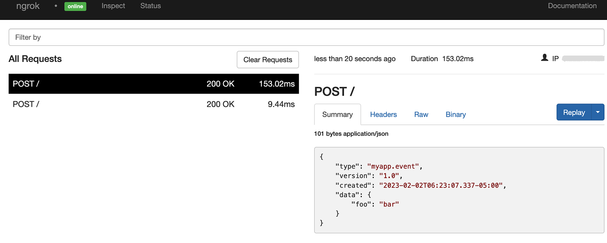

# HostedHooks Webhooks
------------

:::tip TL;DR

To integrate HostedHooks webhooks with ngrok:
1. [Launch your local webhook.](#start-your-app) `npm start`
1. [Launch ngrok.](#start-ngrok) `ngrok http 3000`
1. [Configure HostedHooks webhooks with your ngrok URL.](#setup-webhook)
1. **Bonus!** [Use ngrok like a PRO.](#security)

:::


This guide covers how to use ngrok to integrate your localhost app with HostedHooks by using Webhooks.
HostedHooks webhooks can be used to route requests to HostedHooks servers to your localhost app.

By integrating ngrok with HostedHooks, you can:

- **Develop and test HostedHooks webhooks locally**, eliminating the time in deploying your development code to a public environment and setting it up in HTTPS.
- **Inspect and troubleshoot requests from HostedHooks** in real-time via the inspection UI and API.
- **Modify and Replay HostedHooks Webhook requests** with a single click and without spending time reproducing events manually in your HostedHooks account.
- **Secure your app with HostedHooks validation provided by ngrok**. Invalid requests are blocked by ngrok before reaching your app.


## **Step 1**: Start your app {#start-your-app}

For this tutorial, we'll use the [sample NodeJS app available on GitHub](https://github.com/ngrok/ngrok-webhook-nodejs-sample). 

To install this sample, run the following commands in a terminal:

```bash
git clone https://github.com/ngrok/ngrok-webhook-nodejs-sample.git
cd ngrok-webhook-nodejs-sample
npm install
```

This will get the project installed locally.

Now you can launch the app by running the following command: 

```bash
npm start
```

The app runs by default on port 3000. 

You can validate that the app is up and running by visiting http://localhost:3000. The application logs request headers and body in the terminal and responds with a message in the browser.


## **Step 2**: Launch ngrok {#start-ngrok}

Once your app is running successfully on localhost, let's get it on the internet securely using ngrok! 

1. If you're not an ngrok user yet, just [sign up for ngrok for free](https://ngrok.com/signup).

1. [Download the ngrok agent](https://ngrok.com/download).

1. Go to the [ngrok dashboard](https://dashboard.ngrok.com) and copy your Authtoken. <br />
    **Tip:** The ngrok agent uses the auth token to log into your account when you start a tunnel.
    
1. Start ngrok by running the following command:
    ```bash
    ngrok http 3000
    ```

1. ngrok will display a URL where your localhost application is exposed to the internet (copy this URL for use with HostedHooks).
    


## **Step 3**: Integrate HostedHooks {#setup-webhook}

To register a webhook on your HostedHooks account follow the instructions below:

1. Access [HostedHooks](https://www.hostedhooks.com/) and sign in using your HostedHooks account.

1. Click **Apps** on the left menu, and then click **Setup New App**.

1. On the **Setup Your Application** page, enter `My App` in the **App Name** field and then click **Save App**.

1. On the app page, click **Create Your Webhook Event** (Step 1), enter `myapp.event` in the **Event Type** field, and then click **Savve Webhook Event**.

1. On the app page, click **Create your first Subscriber** (Step 2), enter `My Localhost App` in the **Subscription Name** field, and then click **Save Subscription**.

1. On the **My Localhost App Subscription** page, click **+ New Endpoint**.

1. On the **New Endpoint** page, enter the URL provided by the ngrok agent to expose your application to the internet in the **Webhook URL** field (i.e. `https://1a2b-3c4d-5e6f-7g8h-9i0j.sa.ngrok.io`).
    

1. Enter `1.0` in the **Version** field, enter `ngrok` in the **Description** field, and then click **Save Endpoint**.

1. Click the left arrow to go back to the app page and then click **Subscribe to a webhook event** (Step 4).

1. On the **Details** page, select **myapp.event** in the **Subscribed Events** combobox and then click **Add Event**.

1. Click the left arrow twice to go back to the app page and then click **Send a test webhook message**.

    Confirm your localhost app receives the **myapp.event** event notification and logs both headers and body in the terminal.


### Run Webhooks with HostedHooks and ngrok

Whenever you post a message to HostedHooks message endpoint passing the **myapp.event** event type inside the body of the request, HostedHooks routes this message to your localhost app through your ngrok URL.
You can trigger new calls from HostedHooks to your application by following the instructions below.

1. Open a terminal window and run the following command:
    ```bash
    curl --request POST --url https://hostedhooks.com/api/v1/apps/APP_ID/messages
 \
    --header 'Authorization: Bearer TOKEN' \
    --header 'Content-Type: application/json' --data '{

    }'
    ```
    **Note**: Replace the following with values copied on previous steps:
    - URL: the URL provided by the ngrok agent to expose your application to the internet (i.e. `https://1a2b-3c4d-5e6f-7g8h-9i0j.sa.ngrok.io`).
    - TOKEN: the Calendly token.
    - ORGANIZATION_URL: The **current_organization** field you copied before.
    - USER_URL: The **uri** field you copied before.
    -
    

1. On the **New Project** popup, enter a project name and then click **Create Project**.

    Confirm your localhost app receives the create-project event notification and logs both headers and body in the terminal.

Optionally, you can verify the log of the webhook call in HostedHooks:

1. In the same browser, access [HostedHooks Developer](https://developer.HostedHooks/).

1. On the top menu of the developer site, click **DEVELOPER TOOLS** and then click **Webhooks**.

1. On the **Webhooks** page, click **View logs** close to your webhook.

1. On the **Webhook Logs** page, click **View details** and confirm 
    


### Inspecting requests

When you launch the ngrok agent on your local machine, you can see two links: one for the tunnel to your app (it ends up in `ngrok.io` unless you're using custom domains) and a local URL for the Web Interface (a.k.a **Request Inspector**).

The Request Inspector shows all the requests made through your ngrok tunnel to your localhost app. When you click on a request, you can see details of both the request and the response.

Seeing requests is an excellent way of validating the data sent to and retrieved by your app via the ngrok tunnel. That alone can save you some time dissecting and logging HTTP request and response headers, methods, bodies, and response codes within your app just to confirm you are getting what you expect.

To inspect HostedHooks's webhooks call, launch the ngrok web interface (i.e. `http://127.0.0.1:4040`), and then click one of the requests sent by HostedHooks.

From the results, review the response body, header, and other details:




### Replaying requests

The ngrok Request Inspector provides a replay function that you can use to test your code without the need to trigger new events from HostedHooks. To replay a request:

1. In the ngrok inspection interface (i.e. `http://localhost:4040`), select a request from HostedHooks.

1. Click **Replay** to execute the same request to your application or select **Replay with modifications** to modify the content of the original request before sending the request.

1. If you choose to **Replay with modifications**, you can modify any content from the original request. For example, you can modify the **id** field inside the body of the request.

1. Click **Replay**.

Verify that your local application receives the request and logs the corresponding information to the terminal.


## **Bonus**: Secure webhook requests {#security}

The ngrok signature webhook verification feature allows ngrok to assert that requests from your HostedHooks webhook are the only traffic allowed to make calls to your localhost app.

**Note:** This ngrok feature requires a Pro or Enterprise license.

This is a quick step to add extra protection to your application.

1. Access [HostedHooks Developer](https://developer.HostedHooks/).

1. On the top menu of the developer site, click **DEVELOPER TOOLS** and then click **Webhooks**.

1. On the **Webhooks** page, click **Copy** to copy the **Secret** value.

1. Restart your ngrok agent by running the command, replacing `{your webhook secret}` with the value you have copied before (See [Integrate ngrok and HostedHooks.](#setup-webhook)):
    ```bash
    ngrok http 3000 --verify-webhook hostedhooks --verify-webhook-secret {your webhook secret}
    ```

1. Access [HostedHooks](https://HostedHooks/) and create a new project.

Verify that your local application receives the request and logs information to the terminal.
