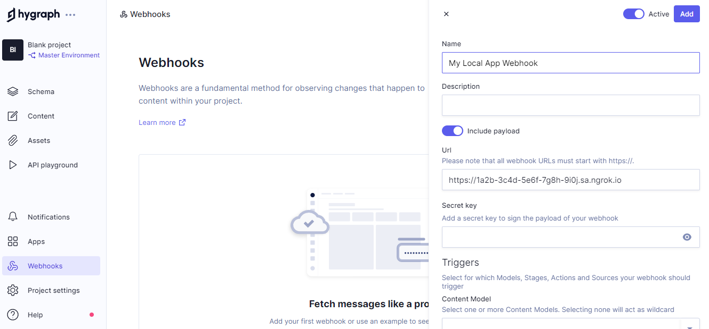
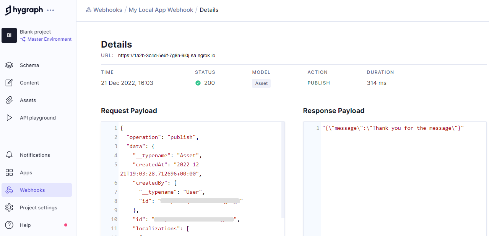
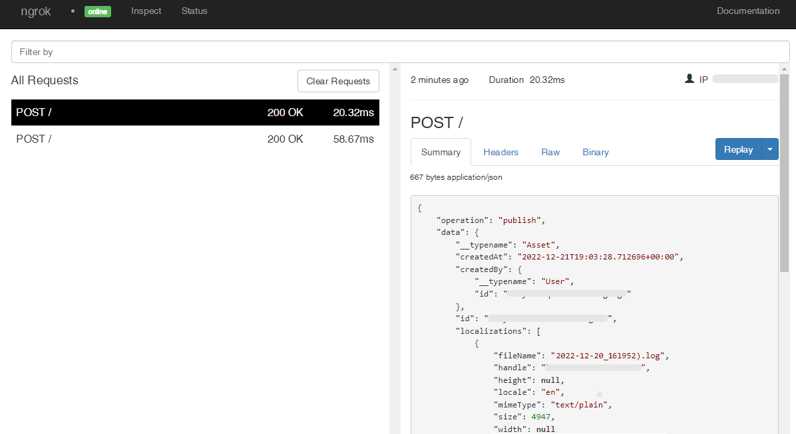

# Hygraph Webhooks
------------

:::tip TL;DR

To integrate Hygraph webhooks with ngrok:
1. [Launch your local webhook.](#start-your-app) `npm start`
1. [Launch ngrok.](#start-ngrok) `ngrok http 3000`
1. [Configure Hygraph webhooks with your ngrok URL.](#setup-webhook)
1. **Bonus!** [Use ngrok like a PRO.](#security)

:::


This guide covers how to use ngrok to integrate your localhost app with Hygraph by using Webhooks.
Hygraph webhooks can be used to notify an external application whenever specific events occur in your Hygraph account. 

By integrating ngrok with Hygraph, you can:

- **Develop and test Hygraph webhooks locally**, eliminating the time in deploying your development code to a public environment and setting it up in HTTPS.
- **Inspect and troubleshoot requests from Hygraph** in real-time via the inspection UI and API.
- **Modify and Replay Hygraph Webhook requests** with a single click and without spending time reproducing events manually in your Hygraph account.
- **Secure your app with Hygraph validation provided by ngrok**. Invalid requests are blocked by ngrok before reaching your app.


## **Step 1**: Start your app {#start-your-app}

For this tutorial, we'll use the [sample NodeJS app available on GitHub](https://github.com/ngrok/ngrok-webhook-nodejs-sample). 

To install this sample, run the following commands in a terminal:

```bash
git clone https://github.com/ngrok/ngrok-webhook-nodejs-sample.git
cd ngrok-webhook-nodejs-sample
npm install
```

This will get the project installed locally.

Now you can launch the app by running the following command: 

```bash
npm start
```

The app runs by default on port 3000. 

You can validate that the app is up and running by visiting http://localhost:3000. The application logs request headers and body in the terminal and responds with a message in the browser.


## **Step 2**: Launch ngrok {#start-ngrok}

Once your app is running successfully on localhost, let's get it on the internet securely using ngrok! 

1. If you're not an ngrok user yet, just [sign up for ngrok for free](https://ngrok.com/signup).

1. [Download the ngrok agent](https://ngrok.com/download).

1. Go to the [ngrok dashboard](https://dashboard.ngrok.com) and copy your Authtoken. <br />
    **Tip:** The ngrok agent uses the auth token to log into your account when you start a tunnel.
    
1. Start ngrok by running the following command:
    ```bash
    ngrok http 3000
    ```

1. ngrok will display a URL where your localhost application is exposed to the internet (copy this URL for use with Hygraph).
    


## **Step 3**: Integrate Hygraph {#setup-webhook}

To register a webhook on your Hygraph account follow the instructions below:

1. Access [Hygraph](https://app.hygraph.com/) and sign in using your Hygraph account.

1. On the left menu, click **Webhooks** and then click **Add Webhook**.

1. On the webhook popup, enter a name in the **Name** field and enter the URL provided by the ngrok agent to expose your application to the internet in the **URL** field (i.e. `https://1a2b-3c4d-5e6f-7g8h-9i0j.sa.ngrok.io`).
    

1. Select **Asset** in the **Content Model** field and then click **Add** at the top of the popup screen.


### Run Webhooks with Hygraph and ngrok

Hygraph sends different request body contents depending on the event that is being triggered.
You can trigger new calls from Hygraph to your application by following the instructions below.

1. On the Hygraph home page, click **Assets** and then click **+ Add entry**.

1. On the **Assets** page, click **Upload**, select a file from your desktop, click **Upload**, and then click **Save & Publish**.

    Confirm your localhost app receives event notifications and logs both headers and body in the terminal.

    Alternatively, you can verify the log of the webhook call in Hygraph:

    1. On the left menu, click **Webhooks** and then click **View Logs** for your webhook, and then click one of the messages.
        


### Inspecting requests

When you launch the ngrok agent on your local machine, you can see two links: one for the tunnel to your app (it ends up in `ngrok.io` unless you're using custom domains) and a local URL for the Web Interface (a.k.a **Request Inspector**).

The Request Inspector shows all the requests made through your ngrok tunnel to your localhost app. When you click on a request, you can see details of both the request and the response.

Seeing requests is an excellent way of validating the data sent to and retrieved by your app via the ngrok tunnel. That alone can save you some time dissecting and logging HTTP request and response headers, methods, bodies, and response codes within your app just to confirm you are getting what you expect.

To inspect Hygraph's webhooks call, launch the ngrok web interface (i.e. `http://127.0.0.1:4040`), and then click one of the requests sent by Hygraph.

From the results, review the response body, header, and other details:




### Replaying requests

The ngrok Request Inspector provides a replay function that you can use to test your code without the need to trigger new events from Hygraph. To replay a request:

1. In the ngrok inspection interface (i.e. `http://localhost:4040`), select a request from Hygraph.

1. Click **Replay** to execute the same request to your application or select **Replay with modifications** to modify the content of the original request before sending the request.

1. If you choose to **Replay with modifications**, you can modify any content from the original request. For example, you can modify the **operation** field inside the body of the request.

1. Click **Replay**.

Verify that your local application receives the request and logs the corresponding information to the terminal.


## **Bonus**: Secure webhook requests {#security}

The ngrok signature webhook verification feature allows ngrok to assert that requests from your Hygraph webhook are the only traffic allowed to make calls to your localhost app.

**Note:** This ngrok feature requires a Pro or Enterprise license.

This is a quick step to add extra protection to your application.

1. Access [Hygraph](https://app.hygraph.com/) and sign in using your Hygraph account.

1. On the left menu, click **Webhooks**, and click the pencil icon in your webhook tile.

1. On the popup, enter a secret key that is at least 32 characters long in the **Secret key** field, and then click **Update** at the top of the popup screen.

1. Restart your ngrok agent by running the command, replacing `{your secret key}` with the value you used in the **Secret key** field:
    ```bash
    ngrok http 3000 --verify-webhook graphcms --verify-webhook-secret {your secret key}
    ```

1. On the Hygraph home page, create a new asset.

Verify that your local application receives the request and logs information to the terminal.
