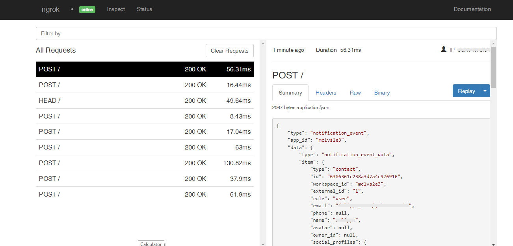

# Intercom Webhooks

---

:::tip TL;DR

To integrate Intercom webhooks with ngrok:

1. [Launch your local webhook.](#start-your-app) `npm start`
1. [Launch ngrok.](#start-ngrok) `ngrok http 3000`
1. [Configure Intercom webhooks with your ngrok URL.](#setup-webhook)
1. [Secure your webhook requests with verification.](#security)

:::

This guide covers how to use ngrok to integrate your localhost app with Intercom by using Webhooks.
Intercom webhooks can be used to notify an external application whenever specific events occur in your Intercom account.

By integrating ngrok with Intercom, you can:

- **Develop and test Intercom webhooks locally**, eliminating the time in deploying your development code to a public environment and setting it up in HTTPS.
- **Inspect and troubleshoot requests from Intercom** in real-time via the inspection UI and API.
- **Modify and Replay Intercom Webhook requests** with a single click and without spending time reproducing events manually in your Intercom account.
- **Secure your app with Intercom validation provided by ngrok**. Invalid requests are blocked by ngrok before reaching your app.

## **Step 1**: Start your app {#start-your-app}

For this tutorial, we'll use the [sample NodeJS app available on GitHub](https://github.com/ngrok/ngrok-webhook-nodejs-sample).

To install this sample, run the following commands in a terminal:

```bash
git clone https://github.com/ngrok/ngrok-webhook-nodejs-sample.git
cd ngrok-webhook-nodejs-sample
npm install
```

This will get the project installed locally.

Now you can launch the app by running the following command:

```bash
npm start
```

The app runs by default on port 3000.

You can validate that the app is up and running by visiting http://localhost:3000. The application logs request headers and body in the terminal and responds with a message in the browser.

## **Step 2**: Launch ngrok {#start-ngrok}

Once your app is running successfully on localhost, let's get it on the internet securely using ngrok!

1. If you're not an ngrok user yet, just [sign up for ngrok for free](https://ngrok.com/signup).

1. [Download the ngrok agent](https://ngrok.com/download).

1. Go to the [ngrok dashboard](https://dashboard.ngrok.com) and copy your Authtoken. <br />
   **Tip:** The ngrok agent uses the auth token to log into your account when you start a tunnel.
1. Start ngrok by running the following command:

   ```bash
   ngrok http 3000
   ```

1. ngrok will display a URL where your localhost application is exposed to the internet (copy this URL for use with Intercom).
   

## **Step 3**: Integrate Intercom {#setup-webhook}

To register a webhook on your Intercom account follow the instructions below:

1. Access the [Intercom Home](https://app.intercom.com/) page, and sign in using your Intercom account.

1. On the left menu, click your avatar icon and then click **Settings**.
   **Tip**: The avatar icon is below the **What's new** bell icon. If your avatar icon doesn't appear, zoom out on the page.

1. In the **Settings** menu, expand the **Apps & Integrations** section and then click **Developer Hub**.
   **Tip**: If the **Developer Guidelines** popup appears, accept the guidelines by clicking **Accept and Continue**.

1. In the **Developer Hub** page, click **New App**.

1. In the **New app** popup window, provide a name for the app, select the appropriate workspace in which you work, keep **Internal integration** selected, and then click **Create app**.

1. In your app page, click **Webhooks** under the **Configure** section of the left menu.

1. In the **Your request endpoint URL** field enter the URL provided by the ngrok agent to expose your application to the internet (i.e. `https://1a2b-3c4d-5e6f-7g8h-9i0j.sa.ngrok.io`).
   

1. In the **Webhook topics**, select **contact.user.created** and then click **Save**.

   After you add a webhook to your Intercom account, Intercom will submit a test post request to your application through ngrok.
   Confirm your localhost app receives this test notification in the terminal.

1. Optionally, in the Intercom **Webhooks** page, you can click **Send a test request** to resend this test post request to your application.

### Run Webhooks with Intercom and ngrok

Because you've selected the **contact.user.created** event, you can trigger new calls from Intercom to your application by following the instructions below:

1. In the same browser, access [Intercom Home](https://app.intercom.com/) page, and then click the **Contacts** icon.

1. On the left menu, click **New**, click **New users or leads**, and then click **Create new user**.

1. In the **Create a new user** popup window, provide a **Name**, an **Email**, a **User UI**, and then click **Create a user**.

Confirm your localhost app receives the create user event notification and logs both headers and body in the terminal.

**Tip:** Intercom sends different request body contents depending on the event you select during the webhook registration.

### Inspecting requests

When you launch the ngrok agent on your local machine, you can see two links:

- The URL to your app (it ends with `ngrok-free.app` for free accounts or `ngrok.app` for paid accounts when not using custom domains)
- A local URL for the Web Interface (a.k.a **Request Inspector**).

The Request Inspector shows all the requests made through your ngrok tunnel to your localhost app. When you click on a request, you can see details of both the request and the response.

Seeing requests is an excellent way of validating the data sent to and retrieved by your app via the ngrok tunnel. That alone can save you some time dissecting and logging HTTP request and response headers, methods, bodies, and response codes within your app just to confirm you are getting what you expect.

To inspect Intercom's webhooks call, launch the ngrok web interface (i.e. `http://127.0.0.1:4040`), and then click one of the requests sent by Intercom.

From the results, review the response body, header, and other details:



### Replaying requests

The ngrok Request Inspector provides a replay function that you can use to test your code without the need to trigger new events from Intercom. To replay a request:

1. In the ngrok inspection interface (i.e. `http://localhost:4040`), select a request from Intercom.

1. Click **Replay** to execute the same request to your application or select **Replay with modifications** to modify the content of the original request before sending the request.

1. If you choose to **Replay with modifications**, you can modify any content from the original request. For example, you can modify the **email** field inside the body of the request.

1. Click **Replay**.

Verify that your local application receives the request and logs the corresponding information to the terminal.

## Secure webhook requests {#security}

The ngrok signature webhook verification feature allows ngrok to assert that requests from your Intercom webhook are the only traffic allowed to make calls to your localhost app.

**Note:** This ngrok feature is limited to 500 validations per month on free ngrok accounts. For unlimited, upgrade to Pro or Enterprise.

This is a quick step to add extra protection to your application.

1. Access the Intercom **Developer Hub** page, click your app name, and then click **Basic information** on the left menu.

1. In the **Basic information** page, copy the **Client secret** value.

1. Restart your ngrok agent by running the command, replacing `{your client secret}` with the value you copied before:

   ```bash
   ngrok http 3000 --verify-webhook intercom --verify-webhook-secret {your client secret}
   ```

1. Access the [Intercom Home](https://app.intercom.com/) page and create a new contact.

Verify that your local application receives the request and logs information to the terminal.
