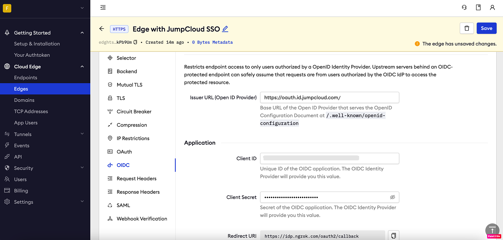
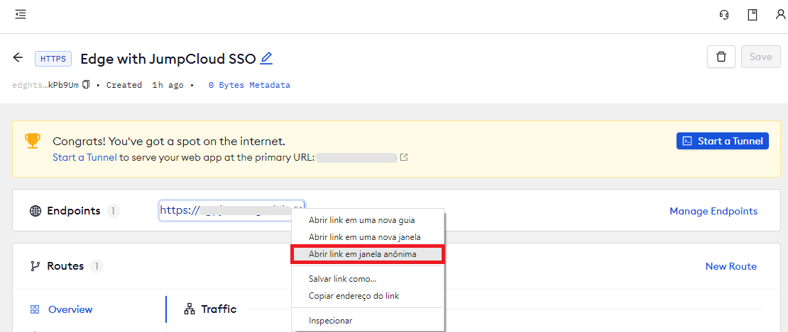

# JumpCloud SSO (OpenID Connect)

:::tip TL;DR

To secure access to ngrok with JumpCloud Single Sign-On using OpenID Connect:

1. [Configure JumpCloud SSO](#configure-jumpcloud)
1. [Configure ngrok](#configure-ngrok)
1. [Test access to ngrok with JumpCloud SSO](#test-sso)

:::

This article details how to configure JumpCloud as the primary Identity Provider for ngrok tunnels.
By integrating JumpCloud SSO with ngrok, you can:

- **Restrict access to ngrok tunnels** only to users authenticated via JumpCloud
- **Use JumpCloud security policies and MFA authenticators**.
- **Use JumpCloud's Dashboard to facilitate access to ngrok apps**.

## Supported Features

The ngrok integration with JumpCloud supports:

- **SP-Initiated SSO**: In this mode, users access ngrok edges and tunnels and are redirected to JumpCloud for authentication.

## Requirements

To configure ngrok tunnels with JumpCloud, you must have:

- a JumpCloud account with administrative rights to create apps
- an [ngrok Enterprise Account](https://ngrok.com/pricing) with an authtoken or admin access to configure edges with OpenID Connect.

## Configuration Steps

To integrate ngrok with JumpCloud SSO, you will need to:

1. Configure JumpCloud with the ngrok app
1. Configure ngrok with the SSO settings provided by JumpCloud

## **Step 1**: Configure JumpCloud {#configure-jumpcloud}

### Add the ngrok App in JumpCloud

1. Access the [JumpCloud Console](https://console.jumpcloud.com/), and sign in using your JumpCloud administrator account.

1. On the left menu, click **SSO**, click **Get Started** or **+ Add New Application**, and then click **Custom OIDC App**.

1. On the **New Application** popup, enter `ngrok oidc` in the **Display Label** field.

1. Click the **SSO** tab, enter `https://idp.ngrok.com/oauth2/callback` in the **Redirect URIs** field, select **Client Secret Basic** as the **Client Authentication Type**, and enter the URL provided by the ngrok agent to expose your application to the internet in the **Login URL** (i.e. `https://myexample.ngrok.dev`).
   

1. Click **Activate**.
1. On the **Application Saved** popup, copy the value of both the **Client ID** and the **Client Secret** fields, and then click **Got It**.

### Grant access to JumpCloud users

JumpCloud allows administrators to restrict access to SSO apps — such as ngrok — via user group assignments. By default, apps created in JumpCloud have no group assignments — in other words, nobody can use JumpCloud SSO to access ngrok until you assign a group to the app.

To assign JumpCloud groups to the ngrok app:

1. On the left menu of the [JumpCloud Console](https://console.jumpcloud.com/), click **SOO** and click the ngrok custom OIDC app you created.

1. On the app popup, click the **User Groups** tab, click the checkbox of the **All Users** group, and then click **Save**.
   **Tip**: Make sure to add JumpCloud users to this group when you create or manage users that need access to the ngrok app.

## **Step 2**: Configure ngrok {#configure-ngrok}

ngrok can leverage JumpCloud SSO in two ways:

- From the ngrok CLI (using the `--oidc` parameter)
- From the ngrok dashboard

### **Option 1**: ngrok CLI

> **Note:** For this tutorial, we assume you have an app running locally (i.e., on localhost:3000) with the ngrok client installed.

1. Launch a terminal

1. Enter the following command to launch an ngrok tunnel with JumpCloud SSO:

   ```bash
   ngrok http 3000 --oidc=JUMPCLOUD_OAUTH_URL \
   --oidc-client-id=JUMPCLOUD_CLIENT_ID \
   --oidc-client-secret=JUMPCLOUD_CLIENT_SECRET \
   ```

   **Note**: Replace the following with values:

   - JUMPCLOUD_OAUTH_URL: Your JumpCloud OIDC base URL (i.e. `https://oauth.id.jumpcloud.com/`).
   - JUMPCLOUD_CLIENT_ID: The client id you copied from JumpCloud.
   - JUMPCLOUD_CLIENT_SECRET: The client secret you copied from JumpCloud.

   Alternatively, add the `--url YOUR_DOMAIN` argument to get your custom URL, replacing `YOUR_DOMAIN` with your URL of preference.

1. Copy the URL available next to **Forwarding** (for example, `https://jumpcloud-sso-test.ngrok.dev`).

1. Skip to **Step 3**

### **Option 2**: ngrok Edge

To configure an edge with JumpCloud:

1. Access the [ngrok Dashboard](https://dashboard.ngrok.com/) and sign in using your ngrok account.

1. On the left menu, click **Cloud Edge** and then click **Edges**.

1. If you don't have an edge already set to add JumpCloud SSO, create a test edge:

   - Click **+ New Edge**.
   - Click **Create HTTPS Edge**.
   - Click the **pencil icon** next to "no description", enter `Edge with JumpCloud SSO OIDC` as the edge name and click **Save**.

1. On the edge settings menu, click **OIDC**.

1. Click **Begin setup** and enter the following values into the fields:
   

   - **Issuer URL**: Your JumpCloud OIDC base URL (i.e. `https://oauth.id.jumpcloud.com/`).
   - **Client ID**: The client id you copied from JumpCloud.
   - **Client Secret**: The client secret you copied from JumpCloud.

1. Click **Save** at the top, and then click the left arrow to go back to the **Edges** page.

1. Launch a tunnel connected to your JumpCloud edge:

:::tip Note
For this step, we assume you have an app running locally (i.e. on localhost:3000) with the ngrok client installed.
:::

1.  Click **Start a tunnel**.

1.  Click the **copy icon** next to the tunnel command.
    

1.  Launch a tunnel:

    - Launch a terminal.
    - Paste the command but replace `http://localhost:80` with your localhost app address (i.e., `http://localhost:3000`).
    - Click **Enter** and an ngrok tunnel associated with your edge configuration will launch.

1.  To confirm that the tunnel is connected to your edge:

    - Return to the ngrok dashboard
    - Close the **Start a tunnel** and the **Tunnel group** tabs
    - Refresh the test edge page. Under traffic, You will see the message _You have 1 tunnel online. Start additional tunnels to begin load balancing._
      

1.  In the test edge, copy the **endpoint URL**. (You use this URL to test the JumpCloud Authentication)
    

## Step 3: Test the integration {#test-sso}

1. In your browser, launch an incognito window.

1. Access your ngrok tunnel (i.e., `https://jumpcloud-sso-test.ngrok.io` or using the copied endpoint URL).

1. You should be prompted to log in with your JumpCloud credentials.

1. After logging in, you should be able to see your web app.
