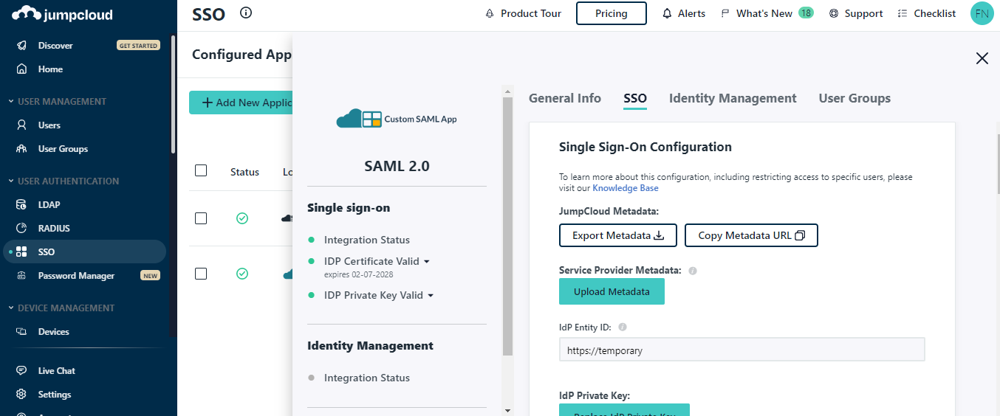

# JumpCloud SSO (SAML)
------------

:::tip TL;DR

To secure access to ngrok with JumpCloud Single Sign-On using SAML:
1. [Configure JumpCloud SSO](#configure-jumpcloud)
1. [Configure ngrok](#configure-ngrok)
1. [Test access to ngrok with JumpCloud SSO](#test-sso)

:::

This article details how to configure JumpCloud as the primary Identity Provider for ngrok tunnels.
By integrating JumpCloud SSO with ngrok, you can:

- **Restrict access to ngrok tunnels** only to users authenticated via JumpCloud
- **Use JumpCloud security policies and MFA authenticators**.
- **Use JumpCloud's Dashboard to facilitate access to ngrok apps**.

## Requirements

To configure ngrok tunnels with JumpCloud, you must have:

- an JumpCloud account with administrative rights to create apps
- an ngrok enterprise account with an access token or admin access to configure edges with SAML.

## Configuration Steps

To integrate ngrok with JumpCloud SSO, you will need to:

1. Configure JumpCloud with the ngrok app
1. Configure ngrok with the SSO settings provided by JumpCloud

## **Step 1**: Configure JumpCloud {#configure-jumpcloud}

### Add the ngrok App in JumpCloud

1. Access the [JumpCloud Console](https://console.jumpcloud.com/), and sign in using your JumpCloud administrator account.

1. On the left menu, click **SSO**, click **Get Started** or **+ Add New Application**, and then click **Custom SAML App**.

1. On the **New Application** popup, enter `ngrok saml` in the **Display Label** field.

1. Click the **SSO** tab, enter temporary ...

1. Access your JumpCloud Dashboard as an administrator and then click **Admin**.
1. Click **Application** > **Applications** .
1. Click **Create App Integration**, 
1. Select _SAML 2.0_, and then click **Next**. 
1. Enter the **Application label** — this is the app name that will be displayed in the JumpCloud dashboard for end users — and click **Next**. 
1. Enter in temporary values for "Single sign on URL" and "Audience URI" and select "EmailAddress" for "Name ID format" and then click "Next".
    1. **Single sign-on URL** : `https://temporary`
    1. **Audience URI (SP Entity ID)** : `https://temporary`
    1. **Name ID format** : Email
1. Select **I’m an JumpCloud customer adding an internal app** and click **Finish**.
1. Click **Done**. 
1. Under the **Sign On** tab of the ngrok application, **copy the Client ID and Client Secret**. These values will be used at ngrok to complete the configuration.

### Download the IdP metadata
1. Navigate to the **Sign On** Tab on the new app and click on **Actions** under the Active SHA-2 certificate and select **View IdP metadata**. The metadata will open in a new tab.
    
1. In the new tab, Select **Save As** from the File menu to save your metadata.xml file for uploading into ngrok in a later step.
    

### Grant access to JumpCloud people and groups

JumpCloud allows administrators to restrict access to SSO apps — such as ngrok — via assignments. By default, apps created in JumpCloud have no assignments — in other words, nobody can use JumpCloud SSO to access ngrok until you assign them to the app. To assign JumpCloud users and groups to the ngrok app:

1. Navigate to the **Assignments** Tab.
1. Use the **Assign** button to associate groups and users with the ngrok app. **To test the SSO with ngrok, make sure you're assigned to the app**.

## **Step 2**: Configure ngrok {#configure-ngrok}

### ngrok Edge

To configure an edge with JumpCloud:

1. Go to dashboard.ngrok.com.
1. Click **Cloud Edge** > **Edges**
1. If you don't have an edge already set to add JumpCloud SSO, create a test edge:
    * Click **New Edge**
    * Click **HTTPS Edge**
    * Click the **pencil icon** next to "no description". Enter _Edge with JumpCloud SSO_ as the edge name and click **Save**.
1. On the edge settings, click **SAML**. 
1. Click **Begin setup** and click on **Upload XML** beside **IdP Metadata** under **Identity Provider** and select your metadata file saved from the steps above:

    

1. Click **Save** at the top.
1. After you save, the SP Metadata will appear. Copy these values into the JumpCloud where temporary values were placed above:
    
1. Save the changes in JumpCloud.
1. Launch a tunnel connected to your JumpCloud edge:

    :::tip Note 
    For this step, we assume you have an app running locally (i.e. on localhost:3000) with the ngrok client installed.
    :::

    1. Click **Start a tunnel**.
    1. Click the **copy icon** next to the tunnel command.

        

    1. Launch a tunnel:
        * Launch a terminal 
        * Paste the command. Replace `http://localhost:80` with your local web app addess (i.e., `http://localhost:3000`)
        * hit **Enter**. an ngrok tunnel associated to your edge configuration is launched.
    1. To confirm that the tunnel is connected to your edge:
        * Return to the ngrok dashboard
        * Close the **Start a tunnel** and the **Tunnel group** tabs
        * Refresh the test edge page. Under traffic, You will see the message _You have 1 tunnel online. Start additional tunnels to begin load balancing._

        

1. In the test edge, copy the **endpoint URL**. (you will use this url to test the JumpCloud Authentication)
    

## Step 3: Test the integration {#test-sso}

1. In your browser, launch an incognito window.
1. Access your ngrok tunnel (i.e., `https://jumpcloud-sso-test.ngrok.io` or using a copied URL).
1. You should be prompted to log in with your JumpCloud credentials.
1. After login, you should be able to see your web app.

