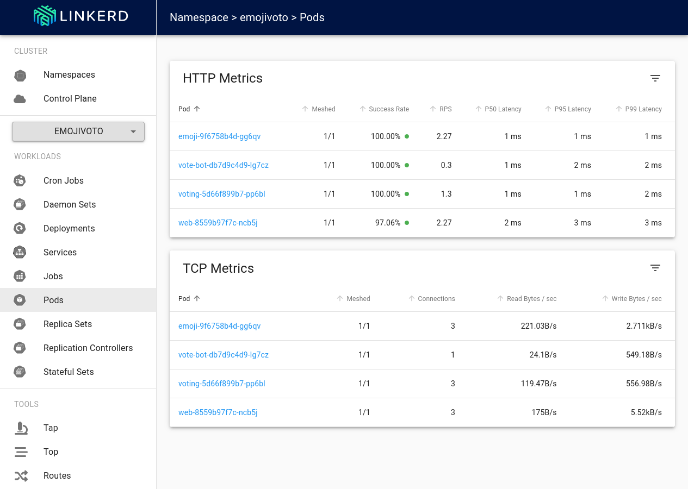

# Ingress to a microservices-based application connected via Linkerd's service mesh

---

:::tip TL;DR

To use the ngrok Ingress Controller for Kubernetes with Linkerd in a local cluster:

1. [Set up a local testing cluster](#set-up-a-local-development-cluster)
1. [Deploy Linkerd's service mesh to your cluster](#deploy-linkerds-service-mesh)
1. [Install the ngrok Ingress Controller](#install-the-ngrok-ingress-controller)
1. [Deploy an example microservices-based application](#deploy-an-example-microservices-based-application)
1. [Add Linkerd's dashboard and verify mTLS](#add-linkerds-dashboard-and-verify-mtls)

:::

The ngrok Ingress Controller for Kubernetes is the official controller for adding secure public ingress and middleware execution to your Kubernetes applications with ngrok's Cloud Edge. With ngrok, you can manage and secure traffic to your applications at every stage of the development lifecycle while also benefiting from simpler configurations, security, and edge acceleration.

Linkerd is an open source [service mesh](https://linkerd.io/what-is-a-service-mesh/#), which is a set of network proxies that handle communications between microservices to add in observability, security, and reliability at the platform level, rather than the application level, of your cloud native infrastructure. For example, Linkerd enables mutual TLS (mTLS) between microservices, which ensures confidentiality (encryption) and authenticity (identity validation) on both sides of the connection. After you deploy Linkerd's control plane, you can then install extensions for additional functionality, like a dashboard for debugging errors, exploring workloads, and more.

When integrated, the ngrok Ingress Controller and Linkerd abstract complexity away from your entire networking stack (both internal and external traffic), while giving you access to additional monitoring features and more resiliency.

Using this guide, you will launch a local cluster (or use an existing local/remote cluster) to mesh a microservices-based application with Linkerd, and leverage ngrok to route public traffic through an encrypted tunnel to your cluster.

:::caution This tutorial requires:

1. An [ngrok account](https://ngrok.com/signup).
2. The [Linkerd 2.x CLI](https://linkerd.io/2.14/getting-started/#step-1-install-the-cli) installed locally with either
   the helper script, Homebrew, or by downloading the binary in your `$PATH`.
3. [kubectl](https://kubernetes.io/docs/tasks/tools/install-kubectl/) installed locally.
4. [Helm 3.0.0+](https://helm.sh/docs/intro/install/) installed locally.
5. An existing remote or local Kubernetes cluster _OR_ the [minikube CLI](https://minikube.sigs.k8s.io/docs/start/)
   installed locally to create a new testing cluster.

:::

## **Step 1**: Set up a local development cluster {#set-up-a-local-development-cluster}

1. Create a local Kubernetes cluster with minikube. You will assign it a profile named `ngrok-linkerd` with `-p`, and for the best compatibility with Linkerd, you will use the `containerd` [container runtime](https://minikube.sigs.k8s.io/docs/runtimes/).

   ```bash
   minikube start -p ngrok-linkerd --container-runtime=containerd
   ```

   :::tip

   If your OS does not support containerd, you can run minikube without specifying the container runtime.

   ```bash
   minikube start -p ngrok-linkerd
   ```

   If minikube defaults to using the `docker` runtime, you will likely see an error related to root privileges when installing Linkerd to your cluster. The error includes a workaround to let you install Linkerd despite using the `docker` runtime.

   :::

1. Use `kubectl` to verify your local cluster is running properly.

   ```bash
   kubectl get namespaces

   NAME              STATUS   AGE
   default           Active   72s
   kube-node-lease   Active   72s
   kube-public       Active   72s
   kube-system       Active   72s
   ```

## **Step 2**: Deploy Linkerd's service mesh to your cluster {#deploy-linkerds-service-mesh}

1. Verify your Linkerd CLI is working correctly with `linkerd version`, which should display the same output as below. The `Server version: unavailable` is expected at this point.

   ```bash
   linkerd version
   Client version: stable-2.14.2
   Server version: unavailable
   ```

1. Validate that your Kubernetes cluster is ready to deploy Linkerd with `linkerd check --pre`. You should see the following output at the end:

   ```bash
   linkerd check --pre
   ...
   Status check results are √
   ```

1. Generate and deploy the Kubernetes manifests required to run Linkerd on your cluster, starting with the CRDs.

   ```bash
   linkerd install --crds | kubectl apply -f -
   ```

   Followed by the core resources.

   ```bash
   linkerd install | kubectl apply -f -
   ```

1. Check that Linkerd installed correctly with `linkerd check`. You should a number of successful checks in your terminal output, with a final verification at the end.

   ```bash
   linkerd check
   ...
   Status check results are √
   ```

   :::note

   These steps are based on the [Linkerd documentation](https://linkerd.io/2.14/getting-started/), which we encourage you to explore for additional details on the value of a service mesh, additional Linkerd features, and more.

   :::

## **Step 3**: Install the ngrok Ingress Controller {#install-the-ngrok-ingress-controller}

Even though you have no applications currently running on your local cluster, you can configure and deploy the [ngrok Kubernetes Ingress
Controller](https://github.com/ngrok/kubernetes-ingress-controller) to simplify how you'll enable ingress in the future.

1. Add the ngrok Helm repository if you haven't already.

   ```bash
   helm repo add ngrok https://charts.ngrok.com
   ```

1. Set up the `AUTHTOKEN` and `API_KEY` exports, which allows Helm to install the Ingress Controller using your ngrok credentials. Find your `AUTHTOKEN` under [**Your Authtoken**](https://dashboard.ngrok.com/get-started/your-authtoken) in the ngrok dashboard.

   To create a new API key, navigate to the [**API** section](https://dashboard.ngrok.com/api) of the ngrok dashboard, click the **New API Key** button, change the description or owner, and click the **Add API Key** button. Copy the API key token shown in the modal window before closing it, as the ngrok dashboard will not show you the token again.

   ```bash
   export NGROK_AUTHTOKEN=[YOUR-AUTHTOKEN]
   export NGROK_API_KEY=[YOUR-API-KEY]
   ```

1. Install the ngrok Ingress Controller with Helm under a new `ngrok-ingress-controller` namespace.

   ```bash
   helm install ngrok-ingress-controller ngrok/kubernetes-ingress-controller \
     --namespace ngrok-ingress-controller \
     --create-namespace \
     --set credentials.apiKey=$NGROK_API_KEY \
     --set credentials.authtoken=$NGROK_AUTHTOKEN
   ```

1. Verify you have installed the ngrok Ingress Controller successfully and that pods are healthy.

   ```bash
   kubectl get pods -l 'app.kubernetes.io/name=kubernetes-ingress-controller' --namespace ngrok-ingress-controller

   NAME                                                              READY   STATUS    RESTARTS   AGE
   ngrok-ingress-controller-kubernetes-ingress-controller-man2fg5p   1/1     Running   0          2m23s
   ```

## **Step 4**: Deploy an example microservices-based application {#deploy-an-example-microservices-based-application}

To demonstrate how Linkerd and the ngrok Ingress Controller integrate to add additional observability, security, and reliability into your cluster, you'll deploy the [Emojivoto](https://github.com/BuoyantIO/emojivoto) demo application, which was developed by Buoyant, the company that originally developed Linkerd.

1. Create an ngrok static subdomain for ingress if you don't have one already. Navigate to the [**Domains**
   section](https://dashboard.ngrok.com/cloud-edge/domains) of the ngrok dashboard and click **Create Domain** or **New
   Domain**. This static subdomain will be your `NGROK_DOMAIN` for the remainder of this guide.

   By creating a subdomain on the ngrok Edge, you provide a public route to accept HTTP, HTTPS, and TLS traffic.

1. Deploy Emojivoto to the `emojivoto` namespace.

   ```bash
   curl --proto '=https' --tlsv1.2 -sSfL https://run.linkerd.io/emojivoto.yml \
     | kubectl apply -f -
   ```

1. Add meshing capabilities by injecting Linkerd's data plane proxies into each pod with a rolling deploy. The following command retrieves all the deployments created in the previous step, injects the Linkerd proxy, and then redeploys each pod.

   ```bash
   kubectl get -n emojivoto deploy -o yaml \
     | linkerd inject - \
     | kubectl apply -f -
   ```

1. Verify your data plane with `linkerd -n emojivoto check --proxy`, which should end with a healthy status check.

   ```bash
   linkerd -n emojivoto check --proxy
   ...
   Status check results are √
   ```

1. Create a new `emojivoto-ingress.yml` file and add the [following YAML content](https://linkerd.io/2.14/tasks/using-ingress/#ngrok), which defines the ngrok Ingress Controller for routing traffic arriving on your `NGROK_DOMAIN` to the `web-svc` deployment, which you created when deploying Emojivoto.

   :::tip

   Make sure you edit line `9` of the manifest below, which contains the `NGROK_DOMAIN` variable, with your ngrok subdomain. It should look something like `one-two-three.ngrok.app`.

   :::

   ```yaml showLineNumbers
   apiVersion: networking.k8s.io/v1
   kind: Ingress
   metadata:
     name: emojivoto-ingress
     namespace: emojivoto
   spec:
     ingressClassName: ngrok
     rules:
       # highlight-start
       - host: NGROK_DOMAIN
         # highlight-end
         http:
           paths:
             - path: /
               pathType: Prefix
               backend:
                 service:
                   name: web-svc
                   port:
                     number: 80
   ```

1. Apply the `emojivoto-ingress.yaml` manifest you just created.

   ```bash
   kubectl apply -f emojivoto-ingress.yaml
   ```

   Give your cluster a few moments to launch the necessary resources and for ngrok's Cloud Edge to pick up the new tunnel created by the ngrok Ingress Controller.

   :::tip

   If you see an error when applying the manifest, double-check that you've updated the `NGROK_DOMAIN` value and try again.

   :::

1. Access your Emojivoto application by navigating to the your ngrok domain, e.g. `https://one-two-three.ngrok.app`, in your browser.

   

## **Step 5**: Add Linkerd's dashboard to verify meshing and mTLS {#add-linkerds-dashboard-and-verify-mtls}

Given that one of the key benefits of a service mesh is increased observability, and the inherent security enhancements that come from mTLS connections between your microservices, you'll want to double-check that your deployments and pods are properly meshed.

1. Install the Linkerd dashboard.

   ```bash
   linkerd viz install | kubectl apply -f -
   ```

1. To [verify mTLS](https://linkerd.io/2.14/tasks/validating-your-traffic/), first restart all pods in the `emojivoto` namespace to enable ["tapping"](https://linkerd.io/2.14/reference/cli/viz/#tap).

   ```bash
   kubectl -n emojivoto rollout restart deploy
   ```

1. Then use Linkerd's tap feature, with `linkerd viz -n emojivoto tap deploy`, to pipe the traffic stream from all pods in the `emojivoto` namespace to your terminal. Because the Emojivoto app is designed to automatically generate traffic, you'll see a consistent stream of requests.

   ```bash
   linkerd viz -n emojivoto tap deploy
   ...
   req id=0:11 proxy=out src=10.244.0.15:43706 dst=10.244.0.2:8080 tls=true :method=POST :authority=emoji-svc.emojivoto:8080 :path=/emojivoto.v1.EmojiService/ListAll
   ```

   You should see `tls=true` in all of these requests between these pods. You can also use `kubectl get pods -o wide` to see the IP address of each pod, which lets you verify the source and destination of each request. For example, the request shown above is the `web-svc` service sending a POST request, with mTLS enabled, to the `emoji-svc` service, which maintains and stores the votes database.

1. Run `linkerd viz dashboard &`, which will open the Linkerd dashboard in your browser. The default dashboard shows various "golden metrics" like real-time success rates, traffic (in requests per second), and latencies per namespace. The first column after the **Namespace** also displays the number of meshed pods in that namespace, providing additional verification that your services and pods are meshed via Linkerd.

   Some of the automatically generated traffic is designed to fail, causing the errors you'll see throughout—and showcasing how you can use Linkerd's dashboard to debug issues with pod-to-pod communications.

   

## What's next?

You've now integrated a demo microservices application with Linkerd's service mesh and ngrok's Kubernetes Ingress Controller to add multiple new layers of security and reliability without having to worry about configuring middleware, network interfaces, [mTLS](https://linkerd.io/2.14/features/automatic-mtls/), or deploying new [monitoring services](https://linkerd.io/2.14/features/telemetry/) for observing the external behavior of your code.

After deploying this local demo, you have a few options for moving forward.

### Clean up

If you're looking to clean up from the work you've done for this local demo, stop and delete your minikube cluster with the `minikube` CLI:

```
minikube stop -p ngrok-linkerd
minikube delete -p ngrok-linkerd
```

Then remove the Linkerd CLI from your local workstation:

```bash
rm -rf $HOME/.linkerd2
```

### Extend your ngrok Ingress Controller and Linkerd integration

To bring this integration to a production-grade Kubernetes environment and a real-world application, you will want to explore [installing Linkerd with Helm](https://linkerd.io/2.14/tasks/install-helm/) and Buoyant's official [Linkerd Production Handbook](https://docs.buoyant.io/runbook/getting-started/).

Even in more complex scenarios, you can follow the same procedures listed above to install the ngrok Ingress Controller and configure an Ingress service, letting ngrok's Cloud Edge handle routing and middleware execution for simplicity, global load balancing, and automatic encryption.

Learn more about the ngrok Ingress Controller, or contribute to its ongoing development, by checking out the [GitHub repository](https://github.com/ngrok/kubernetes-ingress-controller) and the [project-specific documentation](https://github.com/ngrok/kubernetes-ingress-controller/tree/main/docs).
