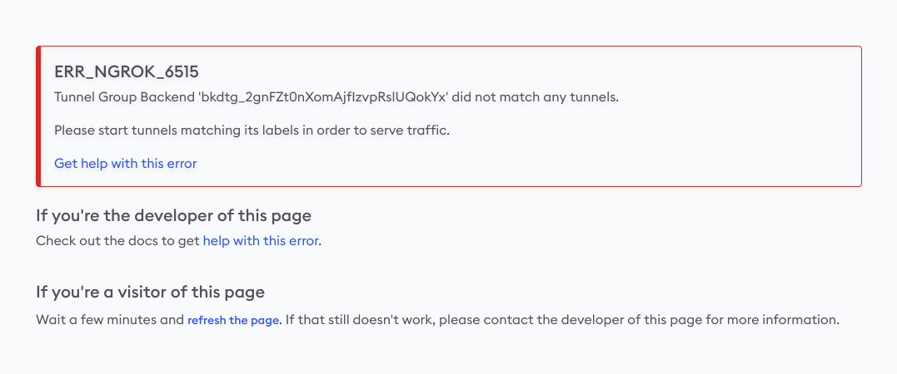
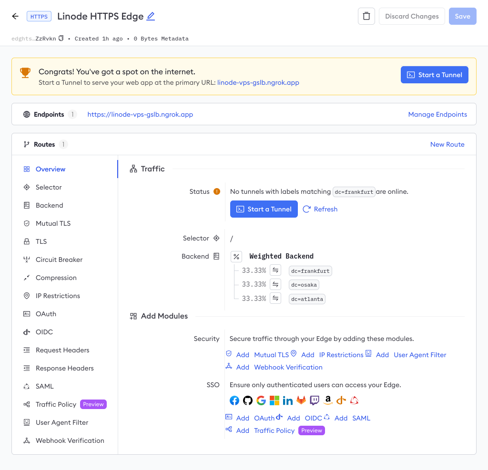
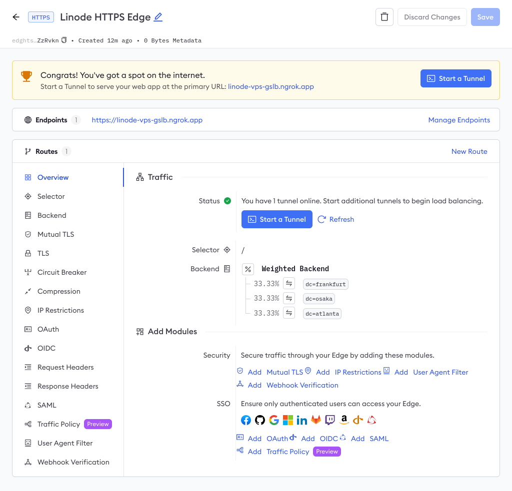

# Use ngrok's Global Server Load Balancing with Linode

:::tip TL;DR

To use ngrok's [Global Server Load Balancing](https://ngrok.com/docs/network-edge/gslb/) with Linode:

1. [Reserve your ngrok domain](#reserve-domain)
2. [Create your ngrok Edge](#create-edge)
3. [Create Tunnel Group backends for your VMs](#create-tunnel-group-backends)
4. [Create a Weighted Backend and Route on your Edge](#create-weighted-backend)
5. [Install the ngrok agent and an example workload on each VM](#install-ngrok-agent)
6. [Test out ngrok's Global Server Load Balancing](#test-gslb)
7. [(optional) Enable the Traffic Policy module for API gateway features](#enable-traffic-policy)

:::

In this guide, you'll learn how to layer ngrok's [Global Server Load Balancing](https://ngrok.com/docs/network-edge/gslb/) (GSLB) on top of a VM-based deployment on Linode.

GLSB improves the performance and resiliency for your apps by distributing traffic to the nearest Point of Prescence (PoP) and the upstream service. Unlike a traditional GSLB deployment, ngrok automatically routes traffic without requiring you to deploy new infrastructure, provision IPs, or change DNS records. All you have to do is configure your ngrok agents for a simple path to high availability, horizontal scaling, A/B testing, and more.

ngrok's GSLB even works on top of Linode's internal load balancing mechanism, NodeBalancer, for additional global resiliency and latency improvements.

:::caution This how-to guide requires:

1. An [ngrok account](https://ngrok.com/signup).
1. An account with [Linode](https://login.linode.com/signup).
1. Three Ubuntu 24.04 virtual machines (VMs) in three globally-distributed regions (e.g. Atlanta, Osaka, and Frankfurt):
   - Hostnames should be unique, ideally using the location of the datacenter (e.g. `atlanta`, `osaka`, and `frankfurt`).
   - [Docker](https://docs.docker.com/engine/install/) and [Docker Compose](https://docs.docker.com/compose/install/) installed on each VM.

:::

## **Step 1**: Reserve your ngrok domain {#reserve-domain}

Your first task is to [generate a new API key](https://dashboard.ngrok.com/api) in the ngrok dashboard. Make sure you save the API key before you close the modal, because it won't be displayed again.

To simplify authenticating your account with the ngrok API, export the API key on your local workstation.

```bash
export NGROK_API_KEY=<YOUR-API-KEY>
```

Next, you need to reserve your subdomain with an [ngrok-managed domain](https://ngrok.com/docs/network-edge/domains-and-tcp-addresses/) like `.ngrok.app`, `.ngrok.dev`, `.ngrok.pro`, or even `.ngrok.pizza`. For an example deployment like this, `YOUR_COMPANY-linode-gslb.ngrok.app` would work great.

You can reserve your domain in one of two ways: with the [ngrok API](https://ngrok.com/docs/api/), or in the [ngrok dashboard](https://dashboard.ngrok.com/cloud-edge/domains).

With the ngrok API, reserve your domain on the [`/reserved_domains` endpoint](https://ngrok.com/docs/api/resources/reserved-domains/) using the `NGROK_API_KEY` and `NGROK_DOMAIN` variables you exported.

```bash
curl \
  -X POST https://api.ngrok.com/reserved_domains \
  -H "Authorization: Bearer ${NGROK_API_KEY}" \
  -H "Content-Type: application/json" \
  -H "Ngrok-Version: 2" \
  -d '{"description":"Linode Load Balancing","domain":"'${NGROK_DOMAIN}'"}'
```

Export a variable for your new domain, which will be used in following API calls.

```bash
export NGROK_DOMAIN=<YOUR-NGROK-DOMAIN>
```

:::tip Custom domains within ngrok

Using CNAMEs, ngrok can host an endpoint on your dowmain while also managing the complete TLS certificate lifecycle on your behalf. If you'd prefer to use a custom domain rather than an ngrok-managed one, [follow our guide](https://ngrok.com/docs/guides/how-to-set-up-a-custom-domain/) to set up your DNS and replace your custom domain in the `export` command above.

:::

## **Step 2**: Create your ngrok Edge {#create-edge}

With ngrok, you can manage multiple endpoints, such as domains or routes, using a single [Edge](https://ngrok.com/docs/network-edge/edges/) configuration in the cloud. Edges let you update endpoints without taking them offline, connect multiple ngrok agents to a single endpoint, apply modules like [OAuth](https://ngrok.com/docs/http/oauth/) or [IP restrictions](https://ngrok.com/docs/http/ip-restrictions/), and balance the load between your upstream services.

Send a `POST` request to the [`/edges/https` endpoint](https://ngrok.com/docs/api/resources/edges-https/), replacing the `description` field below as needed.

```bash
curl \
  -X POST https://api.ngrok.com/edges/https \
  -H "Authorization: Bearer ${NGROK_API_KEY}" \
  -H "Content-Type: application/json" \
  -H "Ngrok-Version: 2" \
  -d '{"description":"Linode HTTPS Edge","hostports":["'${NGROK_DOMAIN}':443"]}'
```

Export the `id` in this response, which begins with `edghts_...`, for future use.

```bash
export EDGE_ID=edghts_...
```

## **Step 3**: Create Tunnel Group backends for your VMs {#create-tunnel-group-backends}

Next, create a Tunnel Group for each of your globally-distributed VMs. A Tunnel Group uses one or more labels to identify which agent-created tunnels it should attach to a given Edge and route, which you'll create in a moment.

You'll need to run the API request to the [`/backends/tunnel_group` endpoint](https://ngrok.com/docs/api/resources/tunnel-group-backends/) for **each** of your VMs, changing the `<LOCATION_NAME>` with the name of the city or region of the data center where they're deployed (e.g. `atlanta`, `osaka`, and `frankfurt`).

```bash
curl \
  -X POST https://api.ngrok.com/backends/tunnel_group \
  -H "Authorization: Bearer ${NGROK_API_KEY}" \
  -H "Content-Type: application/json" \
  -H "Ngrok-Version: 2" \
  -d '{"labels":{"dc":"<LOCATION_NAME>"}}'
```

Export the `id`, beginning with `bkdtg_...`, returned from the ngrok API for each Tunnel Group you create.

```bash
export BACKEND_ID_01=bkdtg_...
export BACKEND_ID_02=bkdtg_...
export BACKEND_ID_03=bkdtg_...
```

## **Step 4**: Create a Weighted Backend and Route on your Edge {#create-weighted-backend}

With a [Weighted Backend](/docs/network-edge/edges#weighted), you can specify custom weights for Tunnel Group backends, shaping precisely how to load-balance traffic across the infrastructure you've distributed around the globe. Without a Weighted Backend, the ngrok Edge and [GSLB](https://ngrok.com/docs/network-edge/gslb/) will always favor the Point of Presence (PoP) and VM nearest the user making requests.

Create a Weighted Backend at the [`/backends/weighted` endpoint](https://ngrok.com/docs/api/resources/weighted-backends/) using your Tunnel Group backend `id`s exported from the previous step. The `curl` command below creates equal weighting for your backends, but you can use integers between `0-10000` to configure precise proportional weights.

```bash
curl \
	-X POST https://api.ngrok.com/backends/weighted \
	-H "Authorization: Bearer ${NGROK_API_KEY}" \
	-H "Content-Type: application/json" \
	-H "Ngrok-Version: 2" \
	-d '{"backends":{"'${BACKEND_ID_01}'":1,"'${BACKEND_ID_02}'":1,"'${BACKEND_ID_03}'":1}}'
```

Export the `id` of your new Weighted Backend.

```bash
export WEIGHTED_BACKEND_ID=bkdwd_...
```

You can now create an catch-all Edge Route at `/` using your Weighted Backend using the [`/edges/https/{EDGE_ID}/routes` endpoint](https://ngrok.com/docs/api/resources/edges-https-routes/).

```bash
curl \
  -X POST "https://api.ngrok.com/edges/https/${EDGE_ID}/routes" \
  -H "Authorization: Bearer ${NGROK_API_KEY}" \
  -H "Content-Type: application/json" \
  -H "Ngrok-Version: 2" \
  -d '{"match":"/","match_type":"path_prefix","backend":{"enabled":true,"backend_id":"'${WEIGHTED_BACKEND_ID}'"}}' \
```

You now have an active domain, Edge, Tunnel Group backends, a Weighted Backend, and a route. If you open a new tab and navigate to `https://<YOUR_NGROK_DOMAIN>` right now, you'll see an error message from ngrok. You've successfully reserved a domain and created an edge, but don't yet have ngrok agents or active tunnels.



You can also navigate to the [Edges dashboard](https://dashboard.ngrok.com/cloud-edge/edges) to see your Edge configuration, on the domain you reserved, with no online tunnels.



## **Step 5**: Install the ngrok agent and an example workload on each VM {#install-ngrok-agent}

To get some tunnels online and quickly see how ngrok's GSLB works, you'll use an [example API deployment](https://github.com/joelhans/ngrok-vps-gslb-demo). This demo deployment has four parts:

1. A straightforward Go-based API with a single endpoint at `/api`, which returns a randomly generated UUID and the machine's `hostname`, which should reflect the regions of your VMs.
2. A `Dockerfile` for containerizing said Go-based API.
3. A `docker-compose.yml` file for starting the API container and a containerized edition of the ngrok agent on the same network.
4. A `ngrok.yml` [agent configuration file](/docs/agent/config/v3/) to connect the agent to your ngrok account and one of the Tunnel Group backends you previously created.

Repeat the following steps on **each** VM:

1. Clone the demo repository.

   ```bash
   git clone https://github.com/joelhans/ngrok-vps-gslb-demo
   cd ngrok-vps-gslb-demo
   ```

2. Edit the `ngrok.yml` [ngrok agent configuration file](https://ngrok.com/docs/agent/config/) with your `<YOUR_NGROK_AUTHTOKEN>`, which you can in the [ngrok dashboard](https://dashboard.ngrok.com/get-started/your-authtoken)&mdash;note that it's different from the API key you created in the first step. Next, edit the `<LOCATION_NAME>` for that VM, matching the labels you created in [step 3](#create-tunnel-group-backends) (e.g. `atlanta`, `osaka`, and `frankfurt`).

   ```yaml
   version: 2
   authtoken: <YOUR_NGROK_AUTHTOKEN>
   log_level: debug
   log: stdout
   tunnels:
     vps-demo:
       addr: 5000
       labels:
         - dc=<LOCATION_NAME>
   ```

3. Build and start the containerized API deployment, passing the hostname of the VM to the hostname of the Docker container.

   ```bash
   HOSTNAME=$(hostname -f) docker compose up -d
   ```

## **Step 6**: Test out ngrok's Global Server Load Balancing {#test-gslb}

ngrk is now load-balancing your single API endpoint across all three distributed VMs.

You can now ping your demo API at `<YOUR_NGROK_DOMAIN>/api` to see which backend responds.

```bash
curl ${NGROK_DOMAIN}/api
[{"id":"1cf26269-ce8b-4f16-91f1-fdf7bc6d9e80","dc":"atlanta"}]
```

To see the weighting in action, try a batch of `curl` requests.

```bash
for i in `seq 1 20`; do \
  curl  \
    -X GET "${NGROK_DOMAIN}/api" ; \
  done
```

You should see each VM respond with similar frequency:

```json
[{"id":"c46bdbd9-b588-4ffa-8018-d299d0918bbc","dc":"osaka"}]
[{"id":"dce5a46e-15af-4479-a073-8fbc7f0097c5","dc":"atlanta"}]
[{"id":"ecc6451c-bc25-43bd-8cb6-a162f019adf3","dc":"frankfurt"}]
[{"id":"ecc6451c-bc25-43bd-8cb6-a162f019adf3","dc":"frankfurt"}]
[{"id":"ecc6451c-bc25-43bd-8cb6-a162f019adf3","dc":"frankfurt"}]
[{"id":"c46bdbd9-b588-4ffa-8018-d299d0918bbc","dc":"osaka"}]
[{"id":"c46bdbd9-b588-4ffa-8018-d299d0918bbc","dc":"osaka"}]
[{"id":"ecc6451c-bc25-43bd-8cb6-a162f019adf3","dc":"frankfurt"}]
[{"id":"ecc6451c-bc25-43bd-8cb6-a162f019adf3","dc":"frankfurt"}]
[{"id":"dce5a46e-15af-4479-a073-8fbc7f0097c5","dc":"atlanta"}]
[{"id":"ecc6451c-bc25-43bd-8cb6-a162f019adf3","dc":"frankfurt"}]
[{"id":"dce5a46e-15af-4479-a073-8fbc7f0097c5","dc":"atlanta"}]
[{"id":"dce5a46e-15af-4479-a073-8fbc7f0097c5","dc":"atlanta"}]
[{"id":"c46bdbd9-b588-4ffa-8018-d299d0918bbc","dc":"osaka"}]
[{"id":"ecc6451c-bc25-43bd-8cb6-a162f019adf3","dc":"frankfurt"}]
[{"id":"c46bdbd9-b588-4ffa-8018-d299d0918bbc","dc":"osaka"}]
[{"id":"c46bdbd9-b588-4ffa-8018-d299d0918bbc","dc":"osaka"}]
[{"id":"dce5a46e-15af-4479-a073-8fbc7f0097c5","dc":"atlanta"}]
[{"id":"ecc6451c-bc25-43bd-8cb6-a162f019adf3","dc":"frankfurt"}]
[{"id":"dce5a46e-15af-4479-a073-8fbc7f0097c5","dc":"atlanta"}]
```

To confirm your global load balancing, head over to the [Edges dashboard](https://dashboard.ngrok.com/cloud-edge/edges) once again to confirm your tunnels are online and weighted equally at 33.33%.



## **Step 7** (optional): Enable the Traffic Policy module for API gateway features {#enable-traffic-policy}

Your demo API is already globally load-balanced, but if you want to extend your ngrok usage even further, you can enable one or more [Traffic Policy modules](/docs/http/traffic-policy/index.mdx) on your Edge to control traffic or establish standards for how your upstream services are accessed.

You have two options:

- Using `curl` with the ngrok API's [`/edges/https/{edge_id}/routes/{id}/policy` endpoint](/docs/api/resources/edge-route-traffic-policy-module.mdx). For this, you will need find the `id` of the catch-all Route you created in [step 4](#create-weighted-backend).

  ```bash
  export ROUTE_ID=edghtsrt_...

  curl \
    -X PUT "https://api.ngrok.com/edges/https/${EDGE_ID}/routes/${ROUTE_ID}/policy" \
    -H "Authorization: Bearer ${NGROK_API_KEY}" \
    -H "Content-Type: application/json" \
    -H "Ngrok-Version: 2" \
    -d '{"enabled":true,"outbound":[{"actions":[{"type":"add-headers","config":{"headers": {"is-ngrok": "1","country": "${.ngrok.geo.country_code}"}}}],"name":"Add ngrok headers"}]}'
  ```

- In the Traffic Policy module section of your [Edge](https://dashboard.ngrok.com/cloud-edge/edges) in the ngrok dashboard, where you can click the **Edit Traffic Policy** button and add the YAML below.

  ```yaml
  inbound: []
  outbound:
    - expressions: []
      name: Add ngrok headers
      actions:
        - type: add-headers
          config:
            headers:
              country: ${.ngrok.geo.country_code}
              is-ngrok: "1"
  ```

When you request your API again, the response includes the `country` (with the appropriate code for where you're generating said request) and `is-ngrok` headers.

```bash
curl -s -I -X GET https://<YOUR_NGROK_DOMAIN>/api

HTTP/2 200
content-type: application/json
country: US
date: Wed, 22 May 2024 14:53:42 GMT
is-ngrok: 1
content-length: 63
```

## What's next?

You now have a globally load-balanced API deployment using three Linode VMs, three ngrok agents, three secure tunnels, one ngrok Edge, and a single convenient endpoint for your users.

From here, you have many options for extending your use of ngrok's GSLB:

- Spread the load from user requests further by creating additional deployments in more regions, adding a new Tunnel Group backend for each, and [patching](https://ngrok.com/docs/api/resources/weighted-backends/#update-weighted-backend) your Weighted Backend configuration.
- Add more VMs to a region with existing deployments and add them to the relevant Tunnel Group backend. Ngrok will then load-balance between those specific VMs equally _after_ weighting requests on the Backend level.
  - Alternatively, use [NodeBalancers](https://www.linode.com/docs/products/networking/nodebalancers/) for
- Provision a Kubernetes cluster with the same workload and the ngrok [Kubernetes Operator](/docs/k8s/index.mdx) to load-balance between VM- and Kubernetes-based deployments of the same API or application.
- Use your Weighted Backend for A/B tests by changing your deployments between different regions and VMs.

If you're eager to learn more about ngrok's GSLB, give the following a read:

- [Introducing Always-On Global Server Load Balancing](https://ngrok.com/blog-post/what-is-gslb-global-server-load-balancing)
- [What is global server load balancing (GSLB)?](https://ngrok.com/blog-post/what-is-gslb-global-server-load-balancing)
