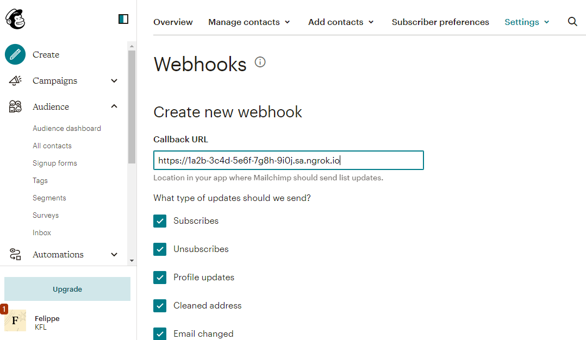
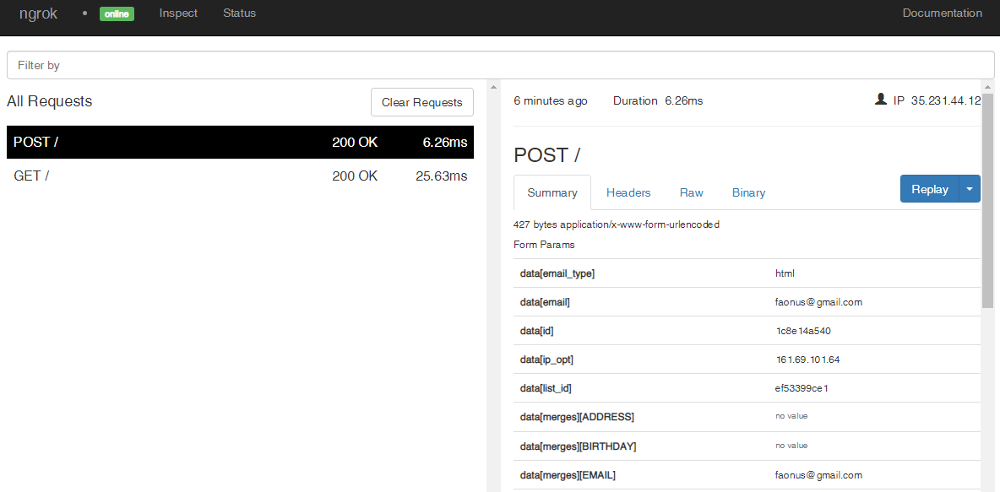

# Mailchimp Webhooks

---

:::tip TL;DR

To integrate Mailchimp webhooks with ngrok:

1. [Launch your local webhook.](#start-your-app) `npm start`
1. [Launch ngrok.](#start-ngrok) `ngrok http 3000`
1. [Configure Mailchimp webhooks with your ngrok URL.](#setup-webhook)

:::

This guide covers how to use ngrok to integrate your localhost app with Mailchimp by using Webhooks.
Mailchimp webhooks can be used to notify an external application whenever specific events occur in your Mailchimp account.

By integrating ngrok with Mailchimp, you can:

- **Develop and test Mailchimp webhooks locally**, eliminating the time in deploying your development code to a public environment and setting it up in HTTPS.
- **Inspect and troubleshoot requests from Mailchimp** in real-time via the inspection UI and API.
- **Modify and Replay Mailchimp Webhook requests** with a single click and without spending time reproducing events manually in your Mailchimp account.

## **Step 1**: Start your app {#start-your-app}

For this tutorial, we'll use the [sample NodeJS app available on GitHub](https://github.com/ngrok/ngrok-webhook-nodejs-sample).

To install this sample, run the following commands in a terminal:

```bash
git clone https://github.com/ngrok/ngrok-webhook-nodejs-sample.git
cd ngrok-webhook-nodejs-sample
npm install
```

This will get the project installed locally.

Now you can launch the app by running the following command:

```bash
npm start
```

The app runs by default on port 3000.

You can validate that the app is up and running by visiting http://localhost:3000. The application logs request headers and body in the terminal and responds with a message in the browser.

## **Step 2**: Launch ngrok {#start-ngrok}

Once your app is running successfully on localhost, let's get it on the internet securely using ngrok!

1. If you're not an ngrok user yet, just [sign up for ngrok for free](https://ngrok.com/signup).

1. [Download the ngrok agent](https://ngrok.com/download).

1. Go to the [ngrok dashboard](https://dashboard.ngrok.com) and copy your Authtoken. <br />
   **Tip:** The ngrok agent uses the auth token to log into your account when you start a tunnel.
1. Start ngrok by running the following command:

   ```bash
   ngrok http 3000
   ```

1. ngrok will display a URL where your localhost application is exposed to the internet (copy this URL for use with Mailchimp).
   

## **Step 3**: Integrate Mailchimp {#setup-webhook}

To register a webhook on your Mailchimp account follow the instructions below:

1. Access [Mailchimp](https://https://mailchimp.com/) and sign in using your Mailchimp account.

1. On the Mailchimp **Home** page, click **Audience** on the left menu and then click **Audience dashboard**.

1. On the **Audience** page, click **Manage Audience** and then click **Settings**.

1. On the **Settings** page, click **Webhooks** and then click **Create New Webhook**.

1. On the **Create new webhook** page, enter the URL provided by the ngrok agent to expose your application to the internet in the **Callback URL** field (i.e. `https://1a2b-3c4d-5e6f-7g8h-9i0j.sa.ngrok.io`) and then click **Save**.
   

   Confirm your localhost app receives a GET request and logs both headers and body in the terminal.

### Run Webhooks with Mailchimp and ngrok

Mailchimp sends different request body contents depending on the audience you register your webhook, as well as depending on the event taking place.
You can trigger new calls from Mailchimp to your application by following the instructions below.

1. On the Mailchimp **Home** page, click **Audience** on the left menu and then click **All Contacts**.

1. On the **Audience** page, click **Add contacts** and then click **Add a subscriber**.

1. On the **Add subscriber** page, enter a valid email address in the **Email Address** field, click the **This person gave me permission to email them** checkbox, and then click **Subscribe**.
   **Note**: If you don't have the email address on your contact list, you need to import this contact.

   Confirm your localhost app receives the create-project event notification and logs both headers and body in the terminal.

### Inspecting requests

When you launch the ngrok agent on your local machine, you can see two links:

- The URL to your app (it ends with `ngrok-free.app` for free accounts or `ngrok.app` for paid accounts when not using custom domains)
- A local URL for the Web Interface (a.k.a **Request Inspector**).

The Request Inspector shows all the requests made through your ngrok tunnel to your localhost app. When you click on a request, you can see details of both the request and the response.

Seeing requests is an excellent way of validating the data sent to and retrieved by your app via the ngrok tunnel. That alone can save you some time dissecting and logging HTTP request and response headers, methods, bodies, and response codes within your app just to confirm you are getting what you expect.

To inspect Mailchimp's webhooks call, launch the ngrok web interface (i.e. `http://127.0.0.1:4040`) and then click one of the requests sent by Mailchimp.

From the results, review the response body, header, and other details:



### Replaying requests

The ngrok Request Inspector provides a replay function that you can use to test your code without the need to trigger new events from Mailchimp. To replay a request:

1. In the ngrok inspection interface (i.e. `http://localhost:4040`), select a request from Mailchimp.

1. Click **Replay** to execute the same request to your application or select **Replay with modifications** to modify the content of the original request before sending the request.

1. If you choose to **Replay with modifications**, you can modify any content from the original request. For example, you can modify the **data email** field inside the body of the request.

1. Click **Replay**.

Verify that your local application receives the request and logs the corresponding information to the terminal.
