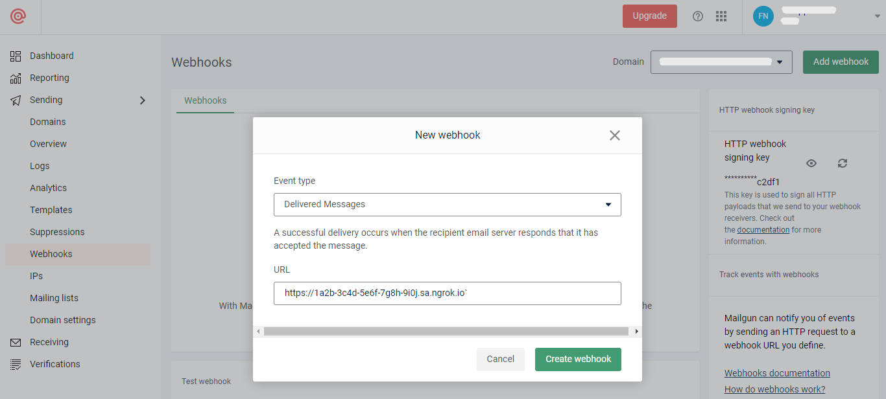
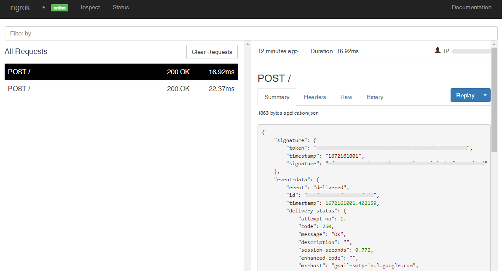

# Mailgun Webhooks

---

:::tip TL;DR

To integrate Mailgun webhooks with ngrok:

1. [Launch your local webhook.](#start-your-app) `npm start`
1. [Launch ngrok.](#start-ngrok) `ngrok http 3000`
1. [Configure Mailgun webhooks with your ngrok URL.](#setup-webhook)
1. [Secure your webhook requests with verification.](#security)

:::

This guide covers how to use ngrok to integrate your localhost app with Mailgun by using Webhooks.
Mailgun webhooks can be used to notify an external application whenever specific events occur in your Mailgun account.

By integrating ngrok with Mailgun, you can:

- **Develop and test Mailgun webhooks locally**, eliminating the time in deploying your development code to a public environment and setting it up in HTTPS.
- **Inspect and troubleshoot requests from Mailgun** in real-time via the inspection UI and API.
- **Modify and Replay Mailgun Webhook requests** with a single click and without spending time reproducing events manually in your Mailgun account.
- **Secure your app with Mailgun validation provided by ngrok**. Invalid requests are blocked by ngrok before reaching your app.

## **Step 1**: Start your app {#start-your-app}

For this tutorial, we'll use the [sample NodeJS app available on GitHub](https://github.com/ngrok/ngrok-webhook-nodejs-sample).

To install this sample, run the following commands in a terminal:

```bash
git clone https://github.com/ngrok/ngrok-webhook-nodejs-sample.git
cd ngrok-webhook-nodejs-sample
npm install
```

This will get the project installed locally.

Now you can launch the app by running the following command:

```bash
npm start
```

The app runs by default on port 3000.

You can validate that the app is up and running by visiting http://localhost:3000. The application logs request headers and body in the terminal and responds with a message in the browser.

## **Step 2**: Launch ngrok {#start-ngrok}

Once your app is running successfully on localhost, let's get it on the internet securely using ngrok!

1. If you're not an ngrok user yet, just [sign up for ngrok for free](https://ngrok.com/signup).

1. [Download the ngrok agent](https://ngrok.com/download).

1. Go to the [ngrok dashboard](https://dashboard.ngrok.com) and copy your Authtoken. <br />
   **Tip:** The ngrok agent uses the auth token to log into your account when you start a tunnel.
1. Start ngrok by running the following command:

   ```bash
   ngrok http 3000
   ```

1. ngrok will display a URL where your localhost application is exposed to the internet (copy this URL for use with Mailgun).
   

## **Step 3**: Integrate Mailgun {#setup-webhook}

To register a webhook on your Mailgun account follow the instructions below:

1. Access [Mailgun](https://app.mailgun.com/) and sign in using your Mailgun account.

1. On the **Dashboard** page, click **Sending** in the left menu, click **Webhooks** and then click **Add webhook**.

1. On the **New webhook** popup, select **Delivered Messages** in the **Event type** field, and enter the URL provided by the ngrok agent to expose your application to the internet in the **URL** field (i.e. `https://1a2b-3c4d-5e6f-7g8h-9i0j.sa.ngrok.io`).
   

1. Click **Create webhook**.

To test the webhook follow the instructions below:

1. On the **Webhooks** page, select **Delivered Messages** in the **Event type** combobox, enter the ngrok URL in the **URL to test** field, and then click **Test webhook**.

   Confirm your localhost app receives the event notification and logs both headers and body in the terminal. Also, confirm a **Response** message appears on the **Webhooks** page.

### Run Webhooks with Mailgun and ngrok

Mailgun sends different request body contents depending on the event that is being triggered.
You can trigger new calls from Mailgun to your application by following the instructions below.

1. Access the [Mailgun Dashboard](https://app.mailgun.com/), click **Sending** in the left menu, and then click **Overview**.

1. Enter a valid email address in the **Email address** field in the **Authorized Recipients** section, and then click **Save Recipient**.

Verify the recipient receives an email from Mailgun asking to agree to receive emails from your Mailgun account, click the **I Agree** link in the body of the email and then click **Yes**.

1. In the [Mailgun Dashboard](https://app.mailgun.com/), click **Select** in the **API** tile and choose one of the options that appears on the screen to send emails. For example, open a terminal window and run the following command using curl:

   ```bash
   curl --location --request POST 'API_BASE_URL/messages' \
   --header 'Authorization: Basic api:API_KEY' \
   --form 'from="mailgun@YOUR_DOMAIN"' \
   --form 'to="AUTHORIZED_RECIPIENT"' \
   --form 'subject="Hello from Mailgun"' \
   --form 'text="Testing some Mailgun email!"'
   ```

   **Note**: Replace the following with values from your Mailgun account:

   - API_BASE_URL: **API base URL** value that appears on the **Overview** page.
   - API_KEY: **API Key** value that appears on the **Overview** page.
   - YOUR_DOMAIN: Find your domain by clicking **Domains** in the left menu.
   - AUTHORIZED_RECIPIENT: the **Email address** you registered as an authorized recipient.

   Confirm your localhost app receives an event notification and logs both headers and body in the terminal.

### Inspecting requests

When you launch the ngrok agent on your local machine, you can see two links:

- The URL to your app (it ends with `ngrok-free.app` for free accounts or `ngrok.app` for paid accounts when not using custom domains)
- A local URL for the Web Interface (a.k.a **Request Inspector**).

The Request Inspector shows all the requests made through your ngrok tunnel to your localhost app. When you click on a request, you can see details of both the request and the response.

Seeing requests is an excellent way of validating the data sent to and retrieved by your app via the ngrok tunnel. That alone can save you some time dissecting and logging HTTP request and response headers, methods, bodies, and response codes within your app just to confirm you are getting what you expect.

To inspect Mailgun's webhooks call, launch the ngrok web interface (i.e. `http://127.0.0.1:4040`), and then click one of the requests sent by Mailgun.

From the results, review the response body, header, and other details:



### Replaying requests

The ngrok Request Inspector provides a replay function that you can use to test your code without the need to trigger new events from Mailgun. To replay a request:

1. In the ngrok inspection interface (i.e. `http://localhost:4040`), select a request from Mailgun.

1. Click **Replay** to execute the same request to your application or select **Replay with modifications** to modify the content of the original request before sending the request.

1. If you choose to **Replay with modifications**, you can modify any content from the original request. For example, you can modify the **message** field inside the body of the request.

1. Click **Replay**.

Verify that your local application receives the request and logs the corresponding information to the terminal.

## Secure webhook requests {#security}

The ngrok signature webhook verification feature allows ngrok to assert that requests from your Mailgun webhook are the only traffic allowed to make calls to your localhost app.

**Note:** This ngrok feature is limited to 500 validations per month on free ngrok accounts. For unlimited, upgrade to Pro or Enterprise.

This is a quick step to add extra protection to your application.

1. Access [Mailgun](https://app.mailgun.com/) and sign in using your Mailgun account.

1. On the **Dashboard** page, click **Sending** in the left menu and then click **Webhooks**.

1. On the **Webhooks** page, click the eye icon near the **HTTP webhook signing key** text and copy the value that appears.

1. Restart your ngrok agent by running the command, replacing `{webhook signing key}` with the value you have copied before:

   ```bash
   ngrok http 3000 --verify-webhook mailgun --verify-webhook-secret {webhook signing key}
   ```

1. Access [Mailgun](https://app.mailgun.com/) and send a new email to an authorized recipient.

Verify that your local application receives the request and logs information to the terminal.
