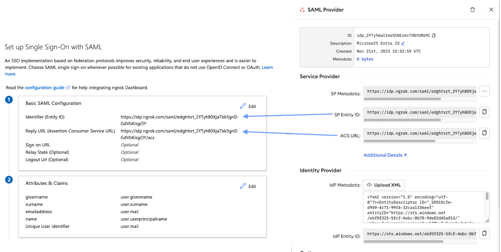

# Microsoft Entra ID SSO (SAML)

---

:::tip TL;DR

To secure access to ngrok Dashboard using Microsoft Entra ID Single Sign-On with SAML:

1. [Configure Entra ID SSO](#configure-entra)
1. [Configure ngrok](#configure-ngrok)
1. [Test access to ngrok with Entra ID SSO](#test-sso)

:::

This article details how to configure Microsoft Entra ID as the primary Identity Provider for the ngrok Dashboard.
By integrating Entra ID SSO with ngrok, you can:

- **Restrict access to the ngrok Dashboard** only to users authenticated via Entra ID
- **Use Entra ID's Dashboard to facilitate access to the ngrok app**.

## Requirements

To configure the ngrok Dashboard with Microsoft Entra ID, you must have:

- an ngrok account with administrative rights to modify the account settings
- an [ngrok Account](https://ngrok.com/pricing) with access to configure SAML SSO.

## Configuration Steps

To integrate ngrok with Entra ID SSO, you will need to:

1. Configure Entra ID with the ngrok app
1. Configure ngrok with the SSO settings provided by Entra ID

## **Step 1**: Configure Entra ID {#configure-entra}

### Create the ngrok App in Entra ID

1. Access your Entra ID Dashboard as an administrator.
1. Click **Enterprise Applications**.
1. Click **New application** > **Create your own application**.
1. Provide a name for the app (e.g. ngrok Dashboard) and choose the **Non-gallery** option and click **Create**.
1. Select **Single sign-on**, and then choose **SAML**.
1. Enter in temporary values for "Identifier" and "Reply URL" and modify the value of "Unique User Identifier" to equal "user.mail".
   1. **Identifier (Entity ID)**: https://temporary
   1. **Reply URL (Assertion Consumer Service URL)**: https://temporary
   1. **Unique User Identifier**: user.mail
      :::tip Note
      This value can differ based upon setup, it is required that this user property value is an email address
      :::

### Download the IdP metadata

1. From within the **Single sign-on** section on the ngrok Dashboard app, click on the **Download** option for **Federation Metadata XML**. Download the metadata XML.

### Grant access to users and groups

Entra ID allows administrators to restrict access to SSO apps — such as the ngrok Dashboard — via assignments. By default, apps created in Entra ID have no assignments — in other words, nobody can use Entra ID SSO to access the ngrok Dashboard until you assign them to the app. To assign users and groups to the ngrok Dashboard app:

1. Navigate to the **User and groups** from within the application.
1. Use the **Add user/group** button to associate groups and users with the ngrok app. **To test the SSO with ngrok, make sure you're assigned to the app**.

## **Step 2**: Configure ngrok {#configure-ngrok}

### ngrok Dashboard SSO

To configure ngrok Dashboard SSO with Entra ID:

1. Go to the [ngrok Dashboard](https://dashboard.ngrok.com).
1. Click **Settings** > **Account**
1. Within the **Single Sign-On (SSO)** section, click **New Identity Provider** > **New SAML Provider**
   
1. On the SAML Provider settings, provide a **Description** and click **Upload XML**
1. Select your metadata file saved from the steps above and **Save**
1. After you save, the SP Metadata will appear. Copy these values into the Entra ID ngrok Dashboard app **Single sign-on** settings where temporary values were placed above:
   
1. Save the changes in Entra ID.

## Step 3: Test the integration {#test-sso}

1. Navigate to the Entra ID ngrok Dashboard app **Single sign-on** settings.
1. Scroll to the bottom of the settings and click **Test** > **Test sign in**
1. You should be redirected to the ngrok Dashboard.
   1. If the current user is not a member of the ngrok account and JIT is enabled, the user will be prompted to join.
      
   1. If the current user is already a member, they will be successfully authenticated into the ngrok Dashboard.
