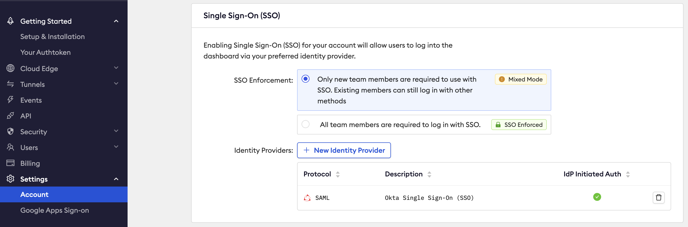
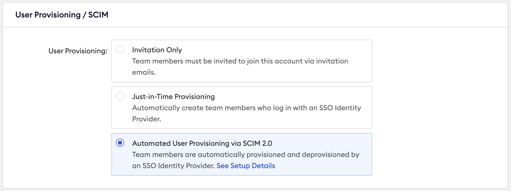
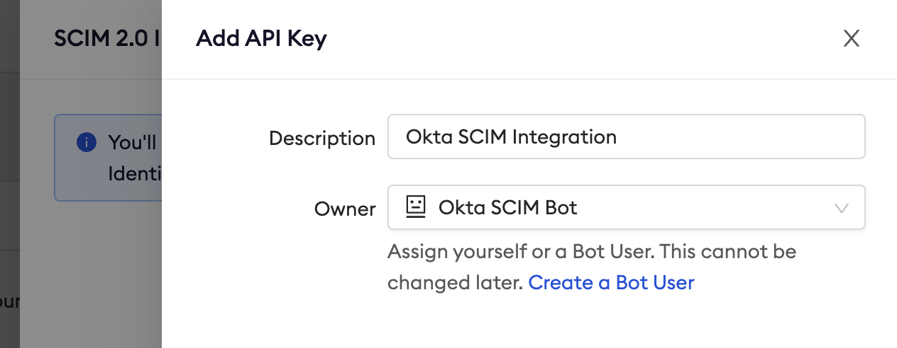
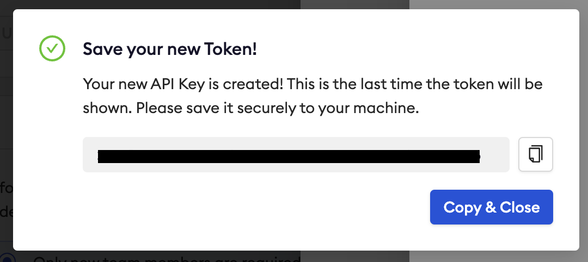
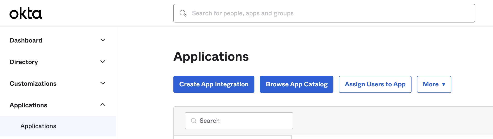
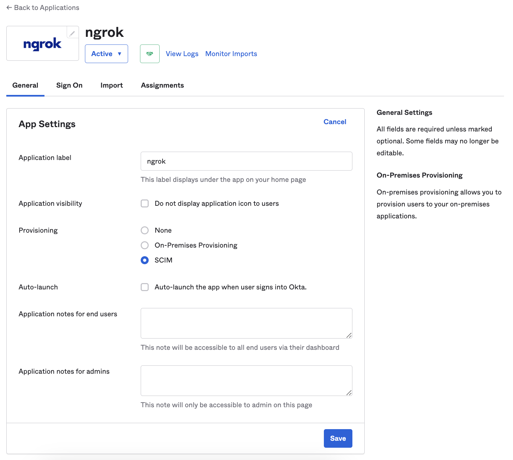
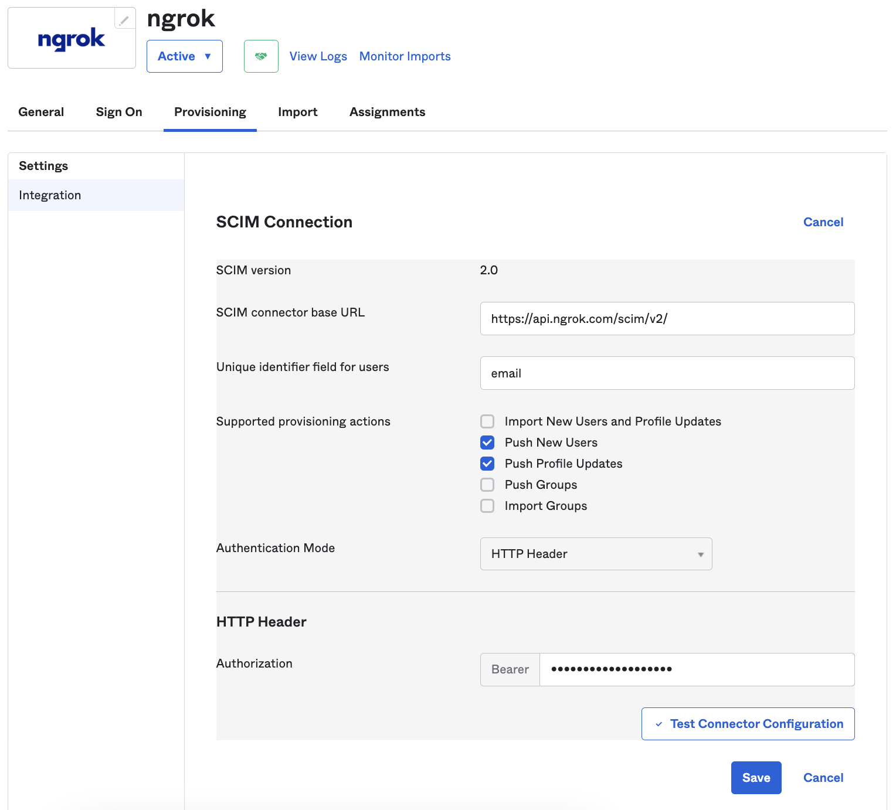

# Automated User Provisioning via SCIM with Okta

---

## Configuring ngrok

Start by logging into your ngrok Dashboard as an admin user.

1. Navigate to the **Settings**, **Account** menu in the left side of the page.

   

1. Go to the **User Provisioning / SCIM** section and toggle on the **Automated User Provisioning via SCIM 2.0** option to on. This will open a drawer and prompt you to create a new API key. It is recommended to use a unique key just for SCIM.

   

1. Give the API key a descriptive name and assign it either to an administrator user or a bot user. Bot users are ideal for this integration because they will not be deactivated when a user leaves the account.

   

1. Save the API key somewhere safe or keep this window up while we complete the next steps in Okta.

   

## Configuring Okta SCIM

This document assumes you have already set up [Okta for dashboard SSO](https://ngrok.com/docs/guides/dashboard-sso-okta-setup). Once you've completed those steps, you can continue here.

Open a new tab in your browser, then log in to the Okta admin console as a user with the ability to manage the ngrok application.

1. In the Okta admin console navigate to the to **Applications/Applications** menu on the left side.

   

1. Open the ngrok app you created.

1. Enable SCIM on the general tab in the ngrok application you created under the Provisioning section:

   

1. Switch to the Provisioning tab in your Okta application configuration
   - SCIM connector base URL:
     - https://api.ngrok.com/scim/v2/
   - Unique identifier field for users
     - `email`
   - Supported provisioning actions
     - Push new users
     - Push profile updates
   - Authentication mode:
     - HTTP Header
   - Authorization:
     - This is the ngrok API key that you saved or copied earlier
1. The configuration should look like this:

   

1. Click **Test Connect Configuration** and you should see a success message.

If you get an error message that states no users were returned then you have an error in the configuration and should check the configuration for typos and leading or trailing spaces.
