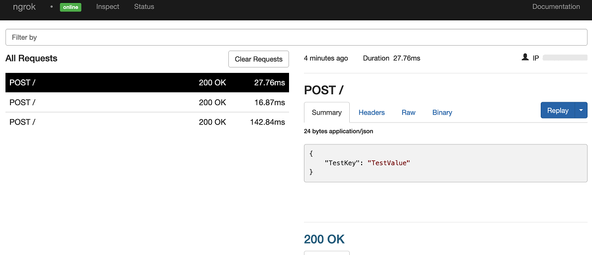

# Plivo Webhooks

---

:::tip TL;DR

To integrate Plivo webhooks with ngrok:

1. [Launch your local webhook.](#start-your-app) `npm start`
1. [Launch ngrok.](#start-ngrok) `ngrok http 3000`
1. [Configure Plivo webhooks with your ngrok URL.](#setup-webhook)
1. **Bonus!** [Use ngrok like a PRO.](#security)

:::

This guide covers how to use ngrok to integrate your localhost app with Plivo by using Webhooks.
Plivo webhooks can be used to notify an external application whenever SMS and MMS messages are sent to your Plivo numbers.

By integrating ngrok with Plivo, you can:

- **Develop and test Plivo webhooks locally**, eliminating the time in deploying your development code to a public environment and setting it up in HTTPS.
- **Inspect and troubleshoot requests from Plivo** in real time via the inspection UI and API.
- **Modify and Replay Plivo Webhook requests** with a single click and without spending time reproducing events manually in your Plivo account.
- **Secure your app with Plivo validation provided by ngrok**. Invalid requests are blocked by ngrok before reaching your app.

## **Step 1**: Start your app {#start-your-app}

For this tutorial, we'll use the [sample NodeJS app available on GitHub](https://github.com/ngrok/ngrok-webhook-nodejs-sample).

To install this sample, run the following commands in a terminal:

```bash
git clone https://github.com/ngrok/ngrok-webhook-nodejs-sample.git
cd ngrok-webhook-nodejs-sample
npm install
```

This will get the project installed locally.

Now you can launch the app by running the following command:

```bash
npm start
```

The app runs by default on port 3000.

You can validate that the app is up and running by visiting http://localhost:3000. The application logs request headers and body in the terminal and responds with a message in the browser.

## **Step 2**: Launch ngrok {#start-ngrok}

Once your app is running successfully on localhost, let's get it on the internet securely using ngrok!

1. If you're not an ngrok user yet, just [sign up for ngrok for free](https://ngrok.com/signup).

1. [Download the ngrok agent](https://ngrok.com/download).

1. Go to the [ngrok dashboard](https://dashboard.ngrok.com) and copy your Authtoken. <br />
   **Tip:** The ngrok agent uses the auth token to log into your account when you start a tunnel.
1. Start ngrok by running the following command:

   ```bash
   ngrok http 3000
   ```

1. ngrok will display a URL where your localhost application is exposed to the internet (copy this URL for use with Plivo).
   

## **Step 3**: Integrate Plivo {#setup-webhook}

To register a webhook on your Plivo account follow the instructions below:

1. Access the [Plivo Console](https://console.plivo.com/) and sign in using your Plivo account.

1. On the **Overview** page, click **Messaging** at the left menu, and then click **PHLO** under **Applications**.

1. On the **Your PHLOs** page, click **Create New PHLO** and then click **Build My Own** on the **Choose your use case** popup.

1. On the PHLO page, click the **pencil icon** next to the `untitled PHLO` message at the top left, replace the text with `Webhook PHLO`, and then click **Save**.

1. Drag the function **HTTP Request** from the left panel to the center of the screen and then click the **HTTP Request** component.

1. On the right panel, select **POST** instead of **GET** in the **HTTP Method**, and enter the URL provided by the ngrok agent to expose your application to the internet in the field next to **POST** (i.e. `https://1a2b-3c4d-5e6f-7g8h-9i0j.sa.ngrok.io`).
   

1. Click **FETCH RESPONSE** in the right panel, verify that your webook responds to the call with a message in the **Response** field, and then click **VALIDATE**.

1. On the PHLO page, drag a line from the **Incoming Message** of the **Start** component to the triangle on the top of the **HTTP Request** component you created, and then click **Save**.

1. On the left menu, click **Phone Numbers** and then click one of your numbers.
   **Note**: If you don't have numbers click **Buy Number** and follow the instructions on the screen.

1. On the phone number page, select **PHLO** in the **Application Type** field, select **Webhook PHLO** in the **PHLO Name** field, and then click **Update Number**.

### Run Webhooks with Plivo and ngrok

Plivo sends different request body contents depending on the event that is being triggered.
You can trigger new calls from Plivo to your application by following the instructions below.

1. Send an SMS message to your Plivo phone number.

   Confirm your localhost app receives a notification and logs both headers and body in the terminal.

Alternatively, you can verify the log of the webhook call in Plivo:

1. On the left menu of the [Plivo Console](https://console.plivo.com/), click **Messaging** and then click **SMS/MMS** under **Logs** in the left panel.

1. Click one of the logs and then scroll down to the \***\*Status Callbacks** section.
   

### Inspecting requests

When you launch the ngrok agent on your local machine, you can see two links:

- The URL to your app (it ends with `ngrok-free.app` for free accounts or `ngrok.app` for paid accounts when not using custom domains)
- A local URL for the Web Interface (a.k.a **Request Inspector**).

The Request Inspector shows all the requests made through your ngrok tunnel to your localhost app. When you click on a request, you can see details of both the request and the response.

Seeing requests is an excellent way of validating the data sent to and retrieved by your app via the ngrok tunnel. That alone can save you some time dissecting and logging HTTP request and response headers, methods, bodies, and response codes within your app just to confirm you are getting what you expect.

To inspect Plivo's webhooks call, launch the ngrok web interface (i.e. `http://127.0.0.1:4040`), and then click one of the requests sent by Plivo.

From the results, review the response body, header, and other details:



### Replaying requests

The ngrok Request Inspector provides a replay function that you can use to test your code without the need to trigger new events from Plivo. To replay a request:

1. In the ngrok inspection interface (i.e. `http://localhost:4040`), select a request from Plivo.

1. Click **Replay** to execute the same request to your application or select **Replay with modifications** to modify the content of the original request before sending the request.

1. If you choose to **Replay with modifications**, you can modify any content from the original request. For example, you can modify the **id** field inside the body of the request.

1. Click **Replay**.

Verify that your local application receives the request and logs the corresponding information to the terminal.

## **Bonus**: Secure webhook requests {#security}

The ngrok webhook verification feature allows ngrok to assert that requests from your Plivo webhook are the only traffic allowed to make calls to your localhost app.

**Note:** This ngrok feature is limited to 500 validations per month on free ngrok accounts. For unlimited, upgrade to Pro or Enterprise.

This is a quick step to add extra protection to your application.

1. Access the [Plivo Console](https://console.plivo.com/) and sign in using your Plivo account.

1. On the **Overview** page, click the eye icon next to **Auth Token** and then copy the value that appears.

1. Restart your ngrok agent by running the command, replacing `{your auth token}` with the value you copied before:

   ```bash
   ngrok http 3000 --verify-webhook plivo --verify-webhook-secret {your auth token}
   ```

1. Send a new SMS to your Plivo phone number.

Verify that your local application receives the request and logs information to the terminal.
