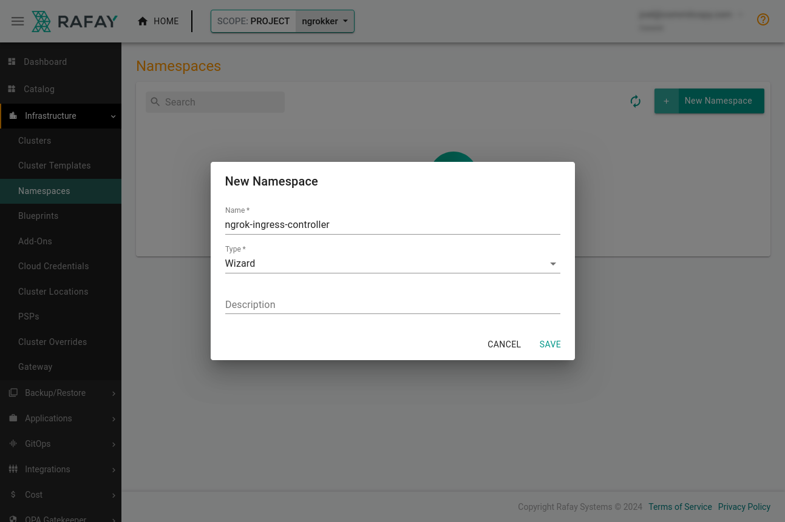
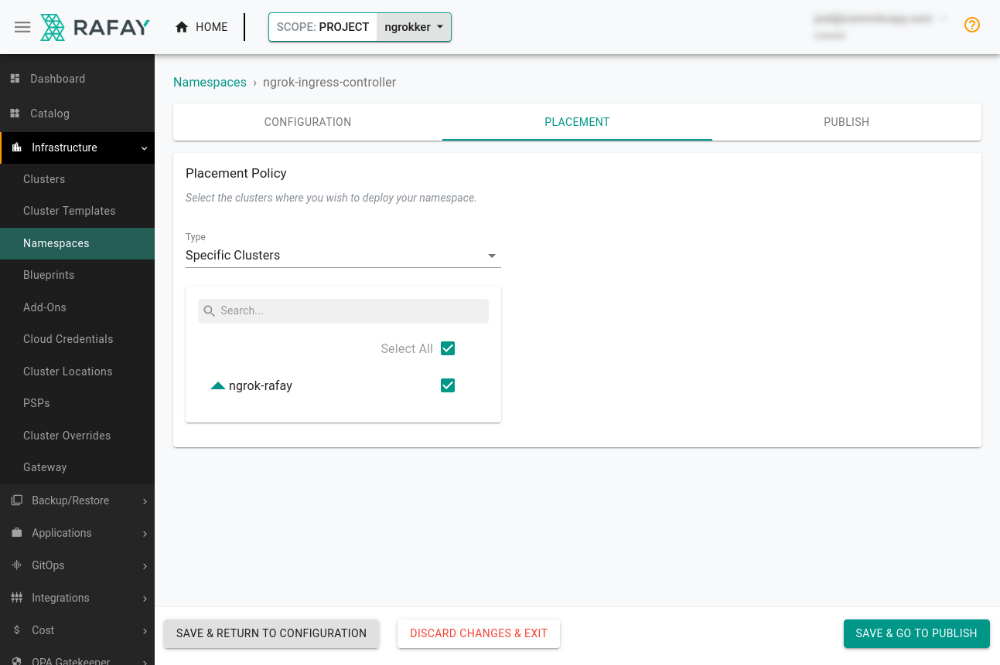
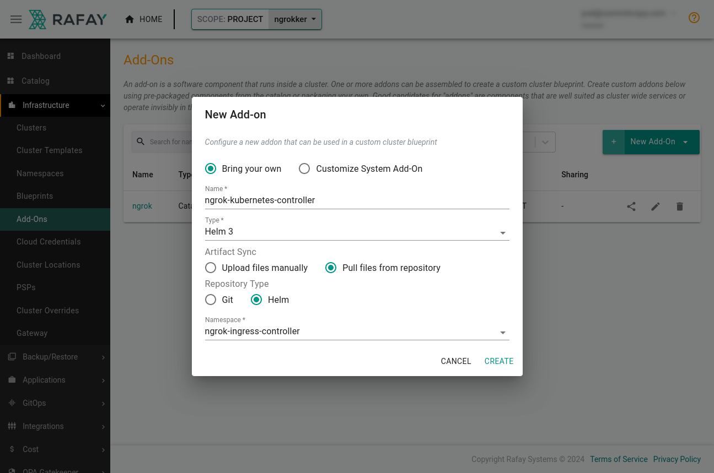
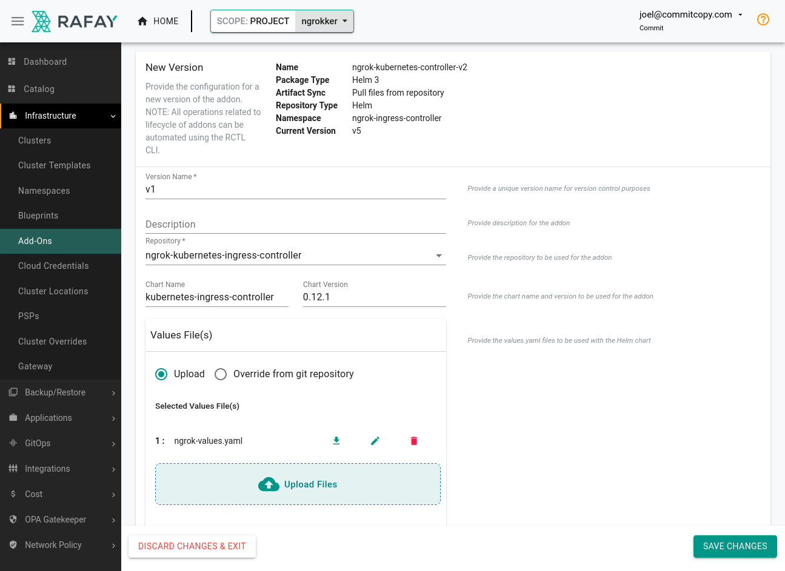
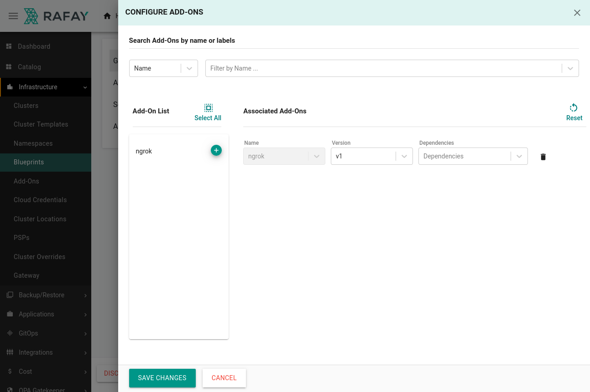
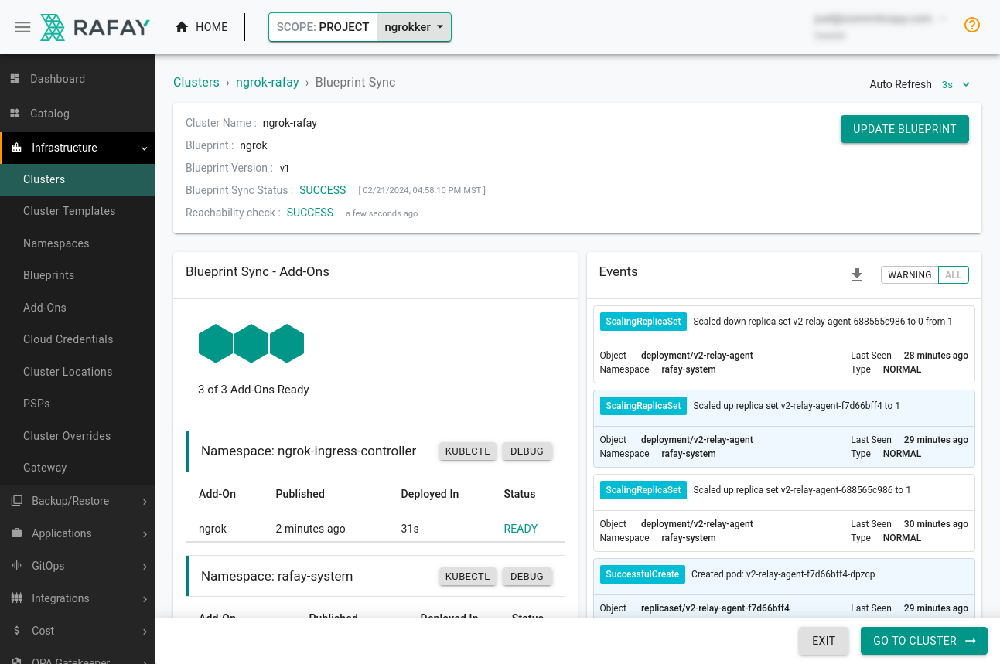
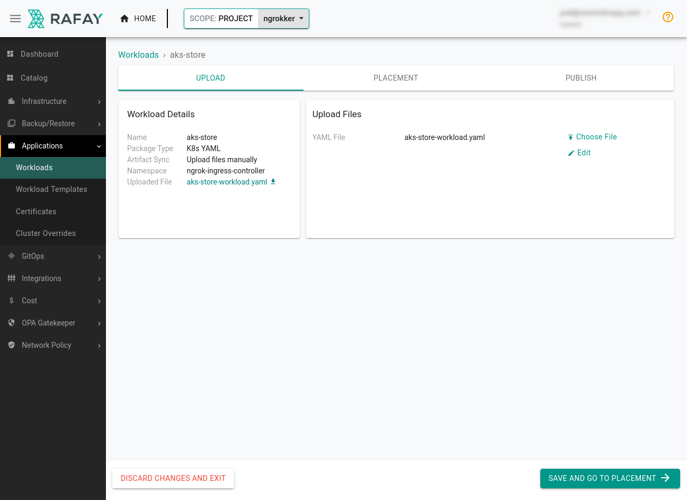
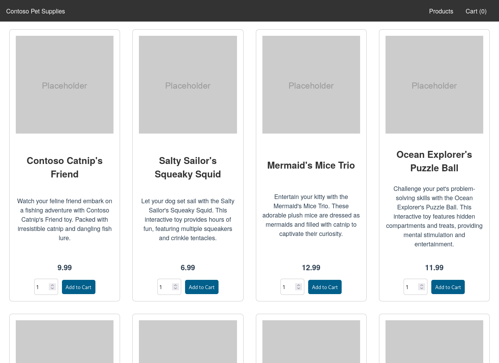

# Ingress to Kubernetes apps managed by Rafay

:::tip TL;DR

To use the ngrok Kubernetes Ingress Controller with Rafay:

1. [Create a new cluster with Rafay](#create-cluster-rafay)
2. [Prepare your cluster for the ngrok Kubernetes Ingress Controller](#prepare-cluster-ngrok)
3. [Create a blueprint for the ngrok Kubernetes Ingress Controller](#create-apply-blueprint)
4. [Deploy an app with Rafay](#deploy-add-rafay)

:::

In this guide, you'll launch a new cluster with [Rafay](https://rafay.co/) and provision the ngrok Kubernetes Ingress Controller to route public traffic directly to a demo app through a secure tunnel.

In the end, you'll have learned enough to deploy your next production-ready Kubernetes app with Rafay, with the ngrok Kubernetes Ingress Controller giving you access to additional features, like observability and resiliency, with no extra configuration complexity.

Here is what you'll be building with:

- **The [ngrok Kubernetes Ingress Controller](https://ngrok.com/blog-post/ngrok-k8s)**: ngrok's official controller for adding secure public ingress and middleware execution to your Kubernetes apps with ngrok's Cloud Edge. With ngrok, you can manage and secure app traffic at every stage of the development lifecycle while benefiting from simpler configurations, security, and edge acceleration.
- **Rafay**: A SaaS-based cloud controller that helps platform and DevOps teams manage their Kubernetes clusters and cloud environments. By plugging into existing Internal Developer Programs and CI/CD pipelines, Rafay helps enable more automation, consistency, and governance while also letting internal developers provision and deploy with ease.

:::caution This how-to guide requires:

1. An [ngrok account](https://ngrok.com/signup) at any tier.
2. An account with [Rafay](https://rafay.co/).
3. An account with the necessary privileges to create a cluster on one of the following managed Kubernetes services:
   - [Amazon Elastic Kubernetes Service](https://aws.amazon.com/eks/) (EKS)
   - [Azure Kubernetes Service](https://azure.microsoft.com/en-us/products/kubernetes-service) (AKS)
   - [Google Kubernetes Engine](https://cloud.google.com/kubernetes-engine) (GKE)
   - _or_ a data center/edge or private cloud where you can deploy an upstream Kubernetes cluster.
4. (optional) Rafay's [RCTL utility](https://docs.rafay.co/cli/config/) installed and initialized on your local workstation.

:::

## **Step 1**: Create a new cluster with Rafay {#create-cluster-rafay}

We won't detail the steps to deploying a cluster with Rafay. For more information, find the [getting started](https://docs.rafay.co/learn/kops/) guide for your Kubernetes service, then click **Cluster Lifecycle Management**, which points you to the steps required to create and manage a new cluster with Rafay.

To prepare your cluster for the ngrok Kubernetes Ingress Controller and an app you'd like to make publicly accessible via a secure tunnel, you only need to finish the **Provision** part of Rafay's provider-specific getting started docs.

## **Step 2**: Prepare your cluster for the ngrok Kubernetes Ingress Controller {#prepare-cluster-ngrok}

Before you create a Rafay blueprint for ingress managed by ngrok, you need to prepare your infrastructure in a way that works with Rafay's blueprints.

1. In Rafay, create a namespace by clicking **Infrastructure&rarr;Namespaces**, then **New Namespace**. Enter **ngrok-ingress-controller** and under **Type**, select **Wizard**. Finally, click **Save**.

   

   Place the new namespace on your cluster. Click the **Placement** tab, select the cluster, and click **Save & Go To Publish&rarr;Publish**.

   

1. Add a repository for the ngrok Kubernetes Ingress Controller to Rafay by clicking **Integrations&rarr;Repositories**. Give the repository a name like `ngrok-kubernetes-ingress-controller`.

   In the **Endpoints** field, add the Helm repository, `https://charts.ngrok.com`, then click **Save**.

1. Log in to the [ngrok dashboard](https://dashboard.ngrok.com/) to get your [ngrok Authtoken](https://dashboard.ngrok.com/get-started/your-authtoken) and create an [API key](https://dashboard.ngrok.com/api).

1. Create a file on your local workstation named `ngrok-values.yaml` with the values below, replacing the defaults with your Authtoken and new API key.

   ```yaml
   credentials:
     apiKey: <API_KEY>
     authtoken: <AUTHTOKEN>
   ```

1. While you're in the ngrok dashboard, create an ngrok static subdomain for ingress. Navigate to the [**Domains**
   section](https://dashboard.ngrok.com/cloud-edge/domains) of the ngrok dashboard and click **Create Domain** or **New
   Domain**. This static subdomain, which will look like `example.ngrok.app`, will be your `NGROK_DOMAIN` for the remainder of this guide.

## **Step 3**: Create and apply a blueprint for the ngrok Kubernetes Ingress Controller {#create-apply-blueprint}

Rafay uses [blueprints](https://docs.rafay.co/learn/quickstart/blueprint/blueprintlifecycle/overview/) to streamline cluster deployments and configuration of common services. They help your organization standardize an approach to security and reliability, with the option of [customization](https://docs.rafay.co/blueprints/custom_blueprint/) based on your specific needs.

You'll create a custom blueprint for the ngrok Kubernetes Ingress Controller that you or others could then quickly apply to any number of clusters managed by Rafay.

1. Create a new Add-On by clicking **Infrastructure&rarr;Add-Ons**. Give it a name like `ngrok-k8s`, then choose **Helm 3** as the type. Choose to **Pull files from repository**, and **Helm** as the type.

   

   Click **New Version**, name it `v1`, and choose the repository you created in the previous step. The **Chart Name** should be `kubernetes-ingress-controller` and the **Chart Version** `0.12.1` (or a more recent version).

   Under the **Values File(s)** section, upload the `ngrok-values.yaml` file with your credentials.

   

1. Head over to the **Blueprints** section of the Rafay dashboard and click **New Blueprint**. Name it `ngrok`, and click **Save**.

1. Give this blueprint a `v1` version name, then choose the `minimal` option from the **Base Blueprint** dropdown. Scroll down to the **Add-Ons**, section, where you can add the `ngrok` Add-On you just created.

   

   Save your changes.

1. Click **Infrastructure&rarr;Clusters**, then the **⚙** icon associated with your cluster. Select **Update Blueprint**, and choose `v1` of the **ngrok** blueprint.

   Rafay will then apply the blueprint to your existing cluster, deploying new resources, like the ngrok Kubernetes Ingress Controller, as necessary.

   

## **Step 4**: Deploy an app with Rafay {#deploy-add-rafay}

In Rafay, workloads operate like infrastructure blueprints, but for app deployments. By defining a workload, you or your peers can deploy standardized clusters _and_ apps in multiple clouds and/or clusters.

You can deploy workloads directly from Rafay's catalog, but in this example, you'll create a custom workload using the [AKS Store Demo](https://github.com/Azure-Samples/aks-store-demo/tree/main), followed by an ingress configuration. Another option for creating workloads is Rafay's [RCTL](https://docs.rafay.co/learn/quickstart/applications/workloads/yaml/#__tabbed_1_2) CLI tool.

1. Download the Kubernetes manifest for the AKS Store onto your local workstation.

   ```bash
   curl https://raw.githubusercontent.com/Azure-Samples/aks-store-demo/main/aks-store-quickstart.yaml -o aks-store-workload.yaml
   ```

1. Add the following ingress configuration to the bottom of your `aks-store-workload.yaml` file. This configuration defines how the ngrok Kubernetes Ingress Controller will route traffic arriving on `NGROK_DOMAIN` to the `store-front` service on port `80` as defined in the manifest.

   :::tip

   Make sure you edit line `10` of the YAML below, which contains the `<NGROK_DOMAIN>` variable, with the ngrok subdomain you created in the previous step.

   :::

   ```yaml showLineNumbers
   ---
   apiVersion: networking.k8s.io/v1
   kind: Ingress
   metadata:
     name: store-ingress
     namespace: ngrok-ingress-controller
   spec:
     ingressClassName: ngrok
     rules:
       # highlight-start
       - host: <NGROK_DOMAIN>
         # highlight-end
         http:
           paths:
             - path: /
               pathType: Prefix
               backend:
                 service:
                   name: store-front
                   port:
                     number: 80
   ```

1. Create a new workload from **Applications&rarr;Workloads**. Call your new workload `aks-store` and choose **K8s YAML** as the package type, ensuring you specify `ngrok-ingress-controller` as the namespace.

1. In the **Upload Files** area, upload the `aks-store-workload.yaml` file you created. Under **Placement**, pick your cluster and move ahead to publishing the workload. Give your cluster a few minutes to provision the new AKS Store resources and configure the ngrok Kubernetes Ingress Controller.

   

1. Navigate to your ngrok subdomain, e.g. `https://NGROK_DOMAIN`, in your browser to see your example app as managed, deployed, and publicly networked via Rafay, Kubernetes, and ngrok!

   

   Behind the scenes, ngrok's Cloud Edge routes requests into the ngrok Kubernetes Ingress Controller, which then passes it to the `store-front` service.

## What's next?

You've now used the open source ngrok Kubernetes Ingress Controller to add public ingress to a demo app on a cluster managed by Rafay. Because ngrok abstracts ingress and middleware execution to its Cloud Edge, and you have saved your configuration to Rafay as a blueprint and workload, you can deploy and manage additional versions of this app in a few clicks.

As you extend your internal catalog of blueprints and networks, you can enable self-service for developers who want to deploy apps without sacrificing on control or efficiency.

One appealing option for platform or DevOps teams using Rafay to create a better experience for their internal development teams would be a [name-based virtual hosting](https://github.com/ngrok/kubernetes-ingress-controller/blob/main/docs/user-guide/ingress-to-edge-relationship.md#name-based-virtual-hosting), which lets you create unique names on the ngrok Cloud Edge, like `foo1.bar.com` and `foo2.bar.com`, to direct traffic to different apps.

Learn more about the ngrok Ingress Controller, or contribute to its ongoing development, by checking out the [GitHub repository](https://github.com/ngrok/kubernetes-ingress-controller) and the [project-specific documentation](https://github.com/ngrok/kubernetes-ingress-controller/tree/main/docs).
