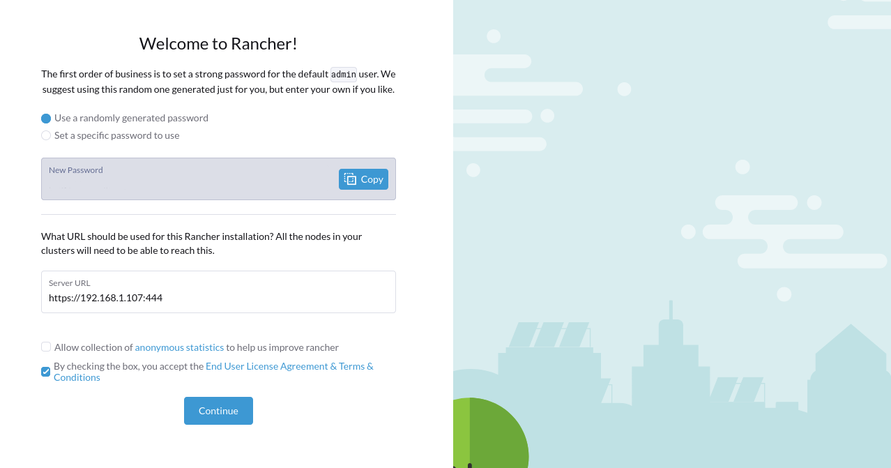
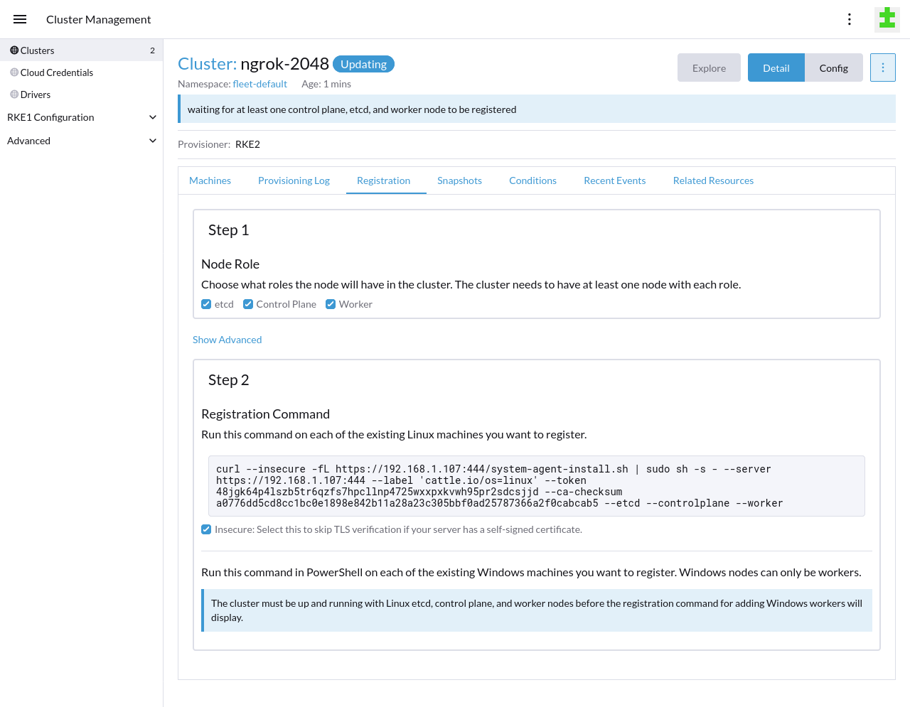

# Ingress to applications managed by Rancher in Kubernetes

:::tip TL;DR

To use the ngrok Kubernetes Operator with Rancher in a local cluster:

1. [Install Rancher via Docker](#install-rancher-via-docker)
2. [Install the ngrok Kubernetes Operator](#install-the-ngrok-ingress-controller)
3. [Install a sample application](#install-a-sample-application)

:::

The ngrok [Operator for Kubernetes](https://ngrok.com/blog-post/ngrok-k8s) is the official controller for
adding secure public ingress and middleware execution to your Kubernetes applications with ngrok's Cloud Edge. With
ngrok, you can manage and secure traffic to your applications at every stage of the development lifecycle while also
benefitting from simpler configurations, security, and edge acceleration.

[Rancher](https://github.com/rancher/rancher) is an open source multi-cluster orchestration management platform
developed by [SUSE](https://www.suse.com). DevOps teams use Rancher to make their multi-cluster and -cloud environments
more efficient, secure, and resilient, which in turn provides a better developer experience for developers building and
deploying cloud native applications.

The ngrok Kubernetes Operator and Rancher integrate to [overcome Kubernetes complexity and improve
collaboration](https://www.suse.com/c/overcoming-kubernetes-complexity-and-improving-collaboration/) through the
creation of an internal developer platform (IDP) or enabling developers to focus on building, not configuring, their
applications.

With this guide, you'll launch Rancher's management platform, create a new RKE2 cluster, connect your cluster's ingress
to ngrok using Rancher's Chart repository, and deploy a demo application, which will then be reachable to public traffic.

:::caution This tutorial requires:

1. An [ngrok account](https://ngrok.com/signup).
2. One or more Linux hosts that meet Rancher's
   [requirements](https://ranchermanager.docs.rancher.com/v2.5/pages-for-subheaders/installation-requirements) for
   operating as Kubernetes nodes. Your hosts can be local/on-prem virtual machines, cloud-based virtual machines, or bare
   metal servers.
3. [Docker](https://docs.docker.com/engine/install/) installed locally.
4. [kubectl](https://kubernetes.io/docs/tasks/tools/install-kubectl/) installed locally.

:::

## **Step 1**: Install Rancher via Docker {#install-rancher-via-docker}

To follow along with this guide, you need Rancher installed on a local or remote Kubernetes cluster. If you already have
an existing cluster running Rancher, you can skip this step and proceed to [Step 2: Install the ngrok Ingress
Controller](#install-the-ngrok-ingress-controller).

In the following steps, you'll run Rancher, and create the Kubernetes cluster it runs on, within a Docker container.
This simple, local-only installation option should be used only for [test and demonstration
purposes](https://ranchermanager.docs.rancher.com/pages-for-subheaders/installation-and-upgrade#docker-install). You
can, however, use the Rancher backup operator to
[migrate](https://ranchermanager.docs.rancher.com/how-to-guides/new-user-guides/backup-restore-and-disaster-recovery/migrate-rancher-to-new-cluster)
this Docker container-based installation to a production-ready, high-availability Kubernetes cluster.

The following steps also assume you have already provisioned one or more Linux hosts that will operate as nodes for the
new Kubernetes cluster managed by Rancher.

:::note
Another viable option is to launch a single Linux virtual machine on your local workstation or with a cloud provider to host a K3s cluster for [installing Rancher with Helm](https://ranchermanager.docs.rancher.com/getting-started/quick-start-guides/deploy-rancher-manager/helm-cli). If you choose that option, you can skip ahead to [Step 2: Install the ngrok Ingress
Controller](#install-the-ngrok-ingress-controller) once you’ve finalized your K3s cluster.
:::

1. Launch the Rancher server in a detached, privileged Docker container. With this configuration, you'll access Rancher on `localhost` using a specific port.

```bash
docker run --privileged --restart=unless-stopped -d -p 81:80 -p 444:443 rancher/rancher:latest
```

1. Once Docker finishes running, check to ensure your Rancher container is running properly.

```bash
docker ps
CONTAINER ID   IMAGE                    COMMAND           CREATED        STATUS             PORTS                                                                      NAMES
d43eceb2e5b2   rancher/rancher:latest   "entrypoint.sh"   About a minute ago   Up About a minute   0.0.0.0:81->80/tcp, :::81->80/tcp, 0.0.0.0:444->443/tcp, :::444->443/tcp   vigilant_clarke
```

1. Navigate to `https://localhost:444` in your browser, which will warn you about self-signed SSL certificates. Pass
   through that warning, which will show you a prompt from Rancher asking for your **bootstrap password**, which you
   need to initialize Rancher. Copy and paste that command into your terminal, replacing `[DOCKER_NAME]` with the name
   output using `docker ps`.

```bash
docker logs [DOCKER_NAME] 2>&1 | grep "Bootstrap Password:"
```

1. Copy the terminal output into the password input and click **Log in with Local User**. Next, choose between a
   randomly-generated password or one of your choosing to initialize the **admin** user.

1. The **Server URL** field will default to `https://localhost:444`, but your worker nodes won't be able to connect to
   Rancher in this configuration. Find your local IP address—try `hostname -I` for Linux or `ipconfig getifaddr en0` on macOs—which will look similar to `192.168.1.123`, and
   replace `localhost` with it, similar to the following: `https://192.168.1.107:444`.

   

   When the Rancher dashboard loads, Rancher should have already deployed a single K3s-based cluster named `local`—click on the cluster's name to explore. Rancher recommends that its server management and your workloads run on separate clusters, which is what you'll do next.

1. Create a new [RKE2](https://docs.rke2.io/) cluster by clicking **Create** in your Rancher dashboard home, then
   **Custom** to deploy a custom cluster. Give your cluster a name, and under the **System Services** heading, uncheck
   **NGINX Ingress**, as you'll add ngrok-based ingress in the next step. Click **Create** to initialize the cluster.

   

1. Register your Linux node(s) with your RKE2 cluster. Leave the **Node Role** options at their defaults, and under the
   **Registration Command** heading and command example, click the **Insecure** checkbox.

   

   Once you copy-paste the command into your Linux node and execute it, your new cluster will begin bootstrapping the
   node. When Rancher finishes bootstrapping your node(s), you can navigate to the **Cluster Dashboard** for your RKE2
   cluster, explore deployed resources, and see basic usage metrics.

1. Set up `kubectl` to manage your RKE2 cluster. At the top of the Cluster Dashboard, click the **Copy KubeConfig to
   Clipboard** option.

   

   Paste the content of your clipboard into your `~/.kube/config` file.

1. Ensure your new RKE2 cluster is active by getting the namespaces for your instance. Your list of namespaces should
   look like the following:

   ```bash
   kubectl get namespaces

   NAME                          STATUS   AGE
   calico-system                 Active   4m
   cattle-impersonation-system   Active   29s
   cattle-system                 Active   5m
   default                       Active   5m4s
   kube-node-lease               Active   5m6s
   kube-public                   Active   5m6s
   kube-system                   Active   5m6s
   local                         Active   23s
   tigera-operator               Active   4m10s
   ```

You have now installed Rancher in a Docker container, created a new Kubernetes cluster for your applications, and
connected one or more Linux nodes to Rancher for handling future workloads.

## **Step 2**: Install the ngrok Kubernetes Operator using Rancher {#install-the-ngrok-ingress-controller}

Next, install the [ngrok Kubernetes Operator](https://github.com/ngrok/ngrok-operator), which
will then automatically handle public ingress to any properly configured application you add to your cluster. Because
this guide focuses on integrating Rancher's management tool with Kubernetes ingress, the following steps will show how
to add the ngrok Kubernetes Operator via the Rancher dashboard.

:::note
You can also install the ngrok Kubernetes Operator with Helm instead of via Rancher's management platform. See our [Using ngrok with Kubernetes](/docs/using-ngrok-with/k8s/#step-2-setup-your-kubernetes-cluster-and-install-the-ngrok-ingress-controller) guide for details.
:::

1. Create an `ngrok-ingress-controller` namespace.

   ```bash
   kubectl create namespace ngrok-ingress-controller
   ```

1. Get your ngrok `AUTHTOKEN` and `API_KEY` credentials.

   Find your `AUTHTOKEN` under [**Your Authtoken**](https://dashboard.ngrok.com/get-started/your-authtoken) in
   the ngrok dashboard.

   To create a new API key, navigate to the [**API** section](https://dashboard.ngrok.com/api) of the ngrok dashboard,
   click the **New API Key** button, change the description or owner, and click the **Add API Key** button. Don't close
   the modal window yet, as you'll need this API key for the next step.

1. Create a Kubernetes Secret named `ngrok-ingress-controller-credentials`, replacing `[YOUR-AUTHTOKEN]` and
   `[YOUR_API_KEY]` in the command below with your ngrok credentials. Rancher will use this secret to authenticate the
   ngrok Kubernetes Operator with your account.

   ```bash
   kubectl create secret generic --namespace ngrok-ingress-controller ngrok-ingress-controller-credentials \
    --from-literal=AUTHTOKEN=[YOUR-AUTHTOKEN] \
    --from-literal=API_KEY=[YOUR-API-KEY]
   ```

1. Add the Helm Chart for the ngrok Kubernetes Operator via Rancher. From the **Cluster Dashboard** for your RKE2
   cluster, click on **Apps** in the sidebar, then **Charts**. Search for `ngrok Kubernetes Operator` and click through
   to the README. Click **Install** to begin configuration.

   

   In the **Metadata** step, choose `ngrok-ingress-controller` as the namespace, then click **Next**.

   

   In the **Values** step, update the `credentials` portion of the default YAML to include the
   `ngrok-ingress-controller-credentials` secret you created previously.

   ```yaml
   credentials:
     apiKey: ""
     authtoken: ""
     secret:
       name: "ngrok-ingress-controller-credentials"
   ```

   Click **Install**. Rancher will take a few moments to initialize the necessary resources, then show that the ngrok
   Operator deployed successfully.

   

## **Step 3**: Install a sample application {#install-a-sample-application}

Now that you have the ngrok Kubernetes Operator running and authenticated with your credentials, you're ready to add a
sample application to your cluster. The ngrok Kubernetes Operator will connect this application to the ngrok cloud edge,
simplifying how you route external traffic through your Rancher-managed cluster.

1. Create a ngrok static subdomain for ingress if you don't have one already. Navigate to the [**Domains**
   section](https://dashboard.ngrok.com/cloud-edge/domains) of the ngrok dashboard and click **Create Domain** or **New
   Domain**. This static subdomain will be your `NGROK_DOMAIN` for the remainder of this guide.

   Creating a subdomain on the ngrok network provides a public route to accept HTTP, HTTPS, and TLS traffic.

1. Create a new Kubernetes manifest (`2048.yaml`) with the below contents. This manifest defines the 2048 application
   service and deployment, then configures the ngrok Kubernetes Operator to connect the `game-2048` service to the ngrok
   edge via your `NGROK_DOMAIN`.

   :::tip
   Make sure you edit line 45 of the manifest below, which contains the `NGROK_DOMAIN` variable, with the ngrok subdomain you just created. It should look something like `one-two-three.ngrok.app`.
   :::

   ```yaml showLineNumbers
   apiVersion: v1
   kind: Service
   metadata:
     name: game-2048
     namespace: ngrok-ingress-controller
   spec:
     ports:
       - name: http
         port: 80
         targetPort: 80
     selector:
       app: game-2048
   ---
   apiVersion: apps/v1
   kind: Deployment
   metadata:
     name: game-2048
     namespace: ngrok-ingress-controller
   spec:
     replicas: 1
     selector:
       matchLabels:
         app: game-2048
     template:
       metadata:
         labels:
           app: game-2048
       spec:
         containers:
           - name: backend
             image: alexwhen/docker-2048
             ports:
               - name: http
                 containerPort: 80
   ---
   # ngrok Kubernetes  Operator configuration
   apiVersion: networking.k8s.io/v1
   kind: Ingress
   metadata:
     name: game-2048-ingress
     namespace: ngrok-ingress-controller
   spec:
     ingressClassName: ngrok
     rules:
       # highlight-start
       - host: NGROK_DOMAIN
         # highlight-end
         http:
           paths:
             - path: /
               pathType: Prefix
               backend:
                 service:
                   name: game-2048
                   port:
                     number: 80
   ```

1. Apply the `2048.yaml` manifest to your RKE2 cluster.

   ```bash
   kubectl apply -f 2048.yaml
   ```

   :::tip
   **Note:** If you get an error when applying the manifest, double check that you've updated the `NGROK_DOMAIN` value
   and try again.
   :::

1. Access your 2048 demo app by navigating to your ngrok subdomain, e.g. `https://one-two-three.ngrok.app`.
   ngrok's edge and your Operator will route traffic to your app from any device or external network as long
   as your Rancher server and application cluster remain operational.

## What's next?

You've now used the open source ngrok Kubernetes Operator to add public ingress to your Rancher-managed
cluster and sample application without worrying about IPs, network interfaces, or VPC routing. Because ngrok offloads
ingress and middleware execution to its global edge, you can follow a similar procedure for Rancher-managed clusters in
any on-prem or cloud Kubernetes environment, like EKS, GKE, and more.

After deploying this proof-of-concept environment, you can take your integration between Rancher and the ngrok Ingress
Controller in several directions.

### Backup and/or migrate to a high-availability Rancher installation

Backups are always a good idea to prevent data loss, and are also the best way to convert your Docker-based installation
of Rancher into a production-grade environment that leverages the ngrok cloud edge to handle ingress with no additional
configuration.

1. [Back up your Rancher installation](https://ranchermanager.docs.rancher.com/how-to-guides/new-user-guides/backup-restore-and-disaster-recovery/back-up-docker-installed-rancher)
   using a sequence of `docker ...` commands to create a data container and a backup tarball.
2. [Migrate your installation](https://ranchermanager.docs.rancher.com/how-to-guides/new-user-guides/backup-restore-and-disaster-recovery/migrate-rancher-to-new-cluster)
   to a new cluster using the backup tarball as the data source.

### Clean up

Because you installed Rancher and deployed your application cluster via Docker, you can clean up by stopping the Rancher
container and removing its contents from your local workstation, replacing `[DOCKER_NAME]` with the name of your Rancher
container.

```bash
docker stop [DOCKER_NAME] && docker rm [DOCKER_NAME]
```

You can also now clean up your Linux host, either by following the [Rancher node cleanup
doc](https://ranchermanager.docs.rancher.com/how-to-guides/new-user-guides/manage-clusters/clean-cluster-nodes#cleaning-up-nodes)
or, in the case of a disposable VM, deleting it entirely.

### Extend your Rancher and ngrok Kubernetes Operator integration

This combination of cluster management and secure, cloud-based public ingress can become a robust development
environment for those still onboarding into the cloud native ecosystem or scale up to a multi-cluster production
system&mdash;all with simpler and more secure ingress from ngrok.

[Name-based virtual
hosting](https://github.com/ngrok/ngrok-operator/blob/main/docs/user-guide/ingress-to-edge-relationship.md#name-based-virtual-hosting),
for example, allows you to deploy and manage any number of Kubernetes clusters and applications with Rancher and create
unique ngrok edge domains, like `foo1.bar.com` and `foo2.bar.com`, pointing to their respective services.

You can also configure the ngrok Kubernetes Operator with [route
modules](https://github.com/ngrok/ngrok-operator/blob/main/docs/user-guide/route-modules.md), [custom
domains](https://github.com/ngrok/ngrok-operator/blob/main/docs/user-guide/custom-domain.md), or [add
edge security with OAuth](/docs/using-ngrok-with/k8s/#step-3-add-edge-security-to-your-app), and more.

Learn more about the ngrok Kubernetes Operator, or contribute, by checking out the [GitHub
repository](https://github.com/ngrok/ngrok-operator) and the [project-specific
documentation](https://github.com/ngrok/ngrok-operator/tree/main/docs).
