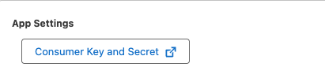

# Configuring ngrok Dashboard Salesforce Single Sign-On (SSO) with OIDC using Salesforce

_Please note that the OIDC flow will be initiated from your Applications login page.(OIDC Service Provider flow is not supported)._

This guide will walk you through enabling Salesforce as an Identity Provider to allow single sign-on into your ngrok dashboard. This should not be confused with securing your ngrok edge to allow your application users to log in using Salesforce.

The requirements for completing this guide are:

- Administrative access to create new applications in Salesforce
- Admin access to edit your ngrok account settings
- An ngrok Enterprise account or an SSO/Account Governance license

Other Resources:
[Configure an Authentication Provider Using OpenID Connect](https://help.salesforce.com/s/articleView?id=xcloud.sso_provider_openid_connect.htm&type=5)

## Configuration Steps

### Step 1: Configure Salesforce

1. Create a new External Client App

   

2. Configure the new External Client App

   1. **Policies Tab**
      1. App Policies
         1. Set Start Page to Custom
         2. Set Custom Start URL to `https://dashboard.ngrok.com/login/sso`
   2. **Settings Tab**
      1. Basic Information
         1. Set the External Client App Name
      2. OAuth Settings
         1. App Settings
            1. Set the OAuth Scopes
               1. Access the Identity URL Service (id, profile, email, address, phone)
               2. Access unique identifiers (openid)
               3. Access custom permissions (custom_permissions)
            2. Set Configure ID Token
               1. Set ID Token Audience to: `https://idp.ngrok.com`
               2. Set Include Standard Claims
               3. Set Custom Attributes
            3. Flow Enablement
               1. Set Enable Authorization Code and Credentials Flow
            4. Security
               1. Set Require Secret for Web Server Flow
               2. Set Require Secret for Refresh Token Flow

3. Obtain the Salesforce Client ID and Client Secret from directly under OAuth Settings

   

### Step 2: Configure ngrok

**Configure Single Sign-On (SSO) for your ngrok account**

1. Log into your ngrok dashboard and navigate to the "Settings > Account" section in the left navigation menu.
2. Select "+ New Identity Provider" button to add a new identity provider.
   
3. Add a helpful description and add the following

   1. Set the Issuer URL
      1. Format: `[yourdomain]-dev-ed.develop.lightning.force.com`
   2. Set the ClientID (from Salesforce)
   3. Set the Client Secret (from Salesforce)

   

Congratulations, you should now be configured properly to log into your ngrok account using Salesforce!

By default, your ngrok account will still allow users to log in with their existing credentials as well as through Salesforce ("Mixed Mode"). Once you verify that everything is working properly with your integration, you can enable "SSO Enforced" in the ngrok Dashboard which will require all new users to log in through Salesforce for their ngrok account.
