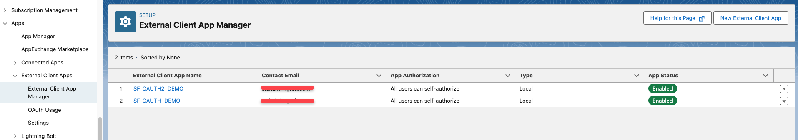
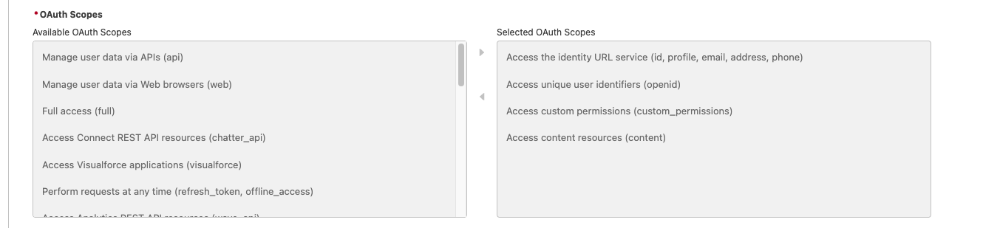
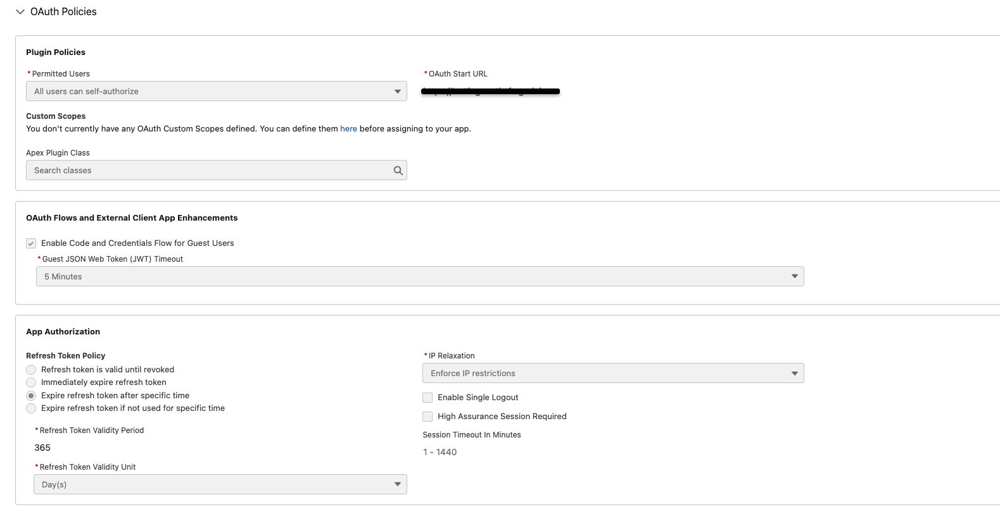
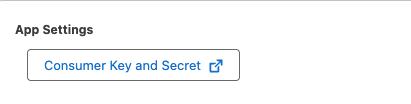

In this guide shows you how to use Salesforce as:

- An OAuth provider along with the ngrok OIDC traffic policy action to secure your ngrok resources.
- The primary IdP for your endpoints. The OIDC traffic policy action will supplement an ID token that will be used to identify users that log in to your endpoint.

Since Salesforce is currently not a supported OAuth provider by ngrok, this allows you to leverage its OAuth capabilities and add an extra layer of authorization to your endpoints.

## Why use OIDC to secure your endpoints

The OIDC traffic policy action allows you to control access to your upstream services and also configure routing based on the information that ngrok stores about user’s authentication/authorization status.

## Why use Salesforce as an IdP

Using salesforce OAuth enables you to give users of your application, API, Database, SSO without needed separate credentials. Ngrok also handles that authentication transparently. Your organization’s personnel in charge of security and administration can also manage all external application integrations from one place.

## What you'll need

- a Salesforce developer account with administrative rights to create apps
- An ngrok Enterprise Account with an authtoken or admin access to configure an endpoint with Traffic Policy and OpenID Connect.

## 1. Create a Salesforce External Client App

1. Navigate to the **App Manager** in Salesforce.
2. Click on **New External Client App**.



## 2. Configure the External Client App

1. Go to the **Policies** tab in your Salesforce dashboard
2. Go to **App Policies**
3. Set the start page to OAuth

## 3. Configure OAuth Settings

1. In the Basic Information Section
   - Set the external client app name to `ngrok` or whatever you would like
2. Go to the OAuth Settings section
   - Under App Settings--> OAuth Policies
     - Set the Callback URL to `https://idp.ngrok.com/oauth2/callback`
     - Make sure "All Users can self authorize" is checked
     - Make sure the following scopes are selected
       
     - Use the cloud endpoint URL you create in the next step as your **OAuth Start URL**
     - Under Permitted Users, make sure all users can self authorize
   - Under Flow Enablement
     - Enable Authorization Code and credentials flow
   - Under Security
     - Check require secret for Web Server flow
     - Require secret for Refresh Token Flow
     - Make sure Require Proof Key for Code Exchange (PKCE) is not enabled, as this will throw an error when you log in to your endpoint

## 4. Verify your Salesforce External Client Application Configuration



## 5. Obtain the Client ID and Client Secret

1. After saving your external client app, go to **Settings** and then under **OAuth Settings** click on the following button to see your Client ID and Client Secret:



## 6. Create a Cloud Endpoint and Configure OIDC Traffic Policy Action

1. Log in to your ngrok dashboard and navigate to the **Endpoints** section.
2. Click on **Create Endpoint**.
3. Select **Cloud Endpoint**
4. Follow the steps found here:
   [Create a Cloud Endpoint](https://ngrok.com/docs/getting-started/cloud-endpoints-quickstart/#dashboard) to create your cloud endpoint.
5. Add the following traffic policy to your endpoint:

```yaml
traffic_policy:
  actions:
    - type: oidc
      issuer_url: <your-salesforce-issuer-url>
      client_id: <your-salesforce-client-id>
      client_secret: <your-salesforce-client-secret>
      scopes:
        - openid
        - profile
        - email
```

6. Replace `<your-salesforce-issuer-url>`, `<your-salesforce-client-id>`, and `<your-salesforce-client-secret>` with the values you obtained from Salesforce in the previous steps. The issuer URL will follow the format: `https://[yourdomain]-dev-ed.develop.my.salesforce.com`
7. Click save.

You have now successfully created a cloud endpoint with OIDC traffic policy action using Salesforce as an IdP.

## (Optional) Configure an Agent Endpoint with Salesforce OAuth from the CLI

You can also use the following command to start an agent endpoint with the same credentials you used in your traffic policy. To learn more about when
to use Agent vs Cloud endpoints, check out our [documentation on endpoints](https://ngrok.com/docs/universal-gateway/endpoints/).

```bash
ngrok http 3000 --oidc <salesforce_url> \
--oidc-client-id <salesforce_client_id> \
--oidc-client-secret <salesforce_client_secret> \
--url <domain>
```
