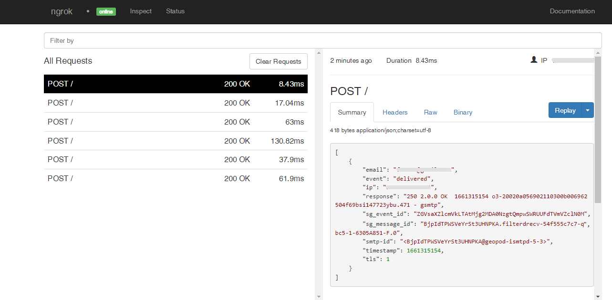

# SendGrid Webhooks

---

:::tip TL;DR

To integrate SendGrid webhooks with ngrok:

1. [Launch your local webhook.](#start-your-app) `npm start`
1. [Launch ngrok.](#start-ngrok) `ngrok http 3000`
1. [Configure SendGrid webhooks with your ngrok URL.](#setup-webhook)
1. [Secure your webhook requests with verification.](#security)

:::

This guide covers how to use ngrok to integrate your localhost app with SendGrid by using Webhooks.
SendGrid webhooks can be used to notify an external application with information about events that occur as SendGrid processes your email.

By integrating ngrok with SendGrid, you can:

- **Develop and test SendGrid webhooks locally**, eliminating the time in deploying your development code to a public environment and setting it up in HTTPS.
- **Inspect and troubleshoot requests from SendGrid** in real-time via the inspection UI and API.
- **Modify and Replay SendGrid Webhook requests** with a single click and without spending time reproducing events manually in your SendGrid account.
- **Secure your app with SendGrid validation provided by ngrok**. Invalid requests are blocked by ngrok before reaching your app.

## **Step 1**: Start your app {#start-your-app}

For this tutorial, we'll use the [sample NodeJS app available on GitHub](https://github.com/ngrok/ngrok-webhook-nodejs-sample).

To install this sample, run the following commands in a terminal:

```bash
git clone https://github.com/ngrok/ngrok-webhook-nodejs-sample.git
cd ngrok-webhook-nodejs-sample
npm install
```

This will get the project installed locally.

Now you can launch the app by running the following command:

```bash
npm start
```

The app runs by default on port 3000.

You can validate that the app is up and running by visiting http://localhost:3000. The application logs request headers and body in the terminal and responds with a message in the browser.

## **Step 2**: Launch ngrok {#start-ngrok}

Once your app is running successfully on localhost, let's get it on the internet securely using ngrok!

1. If you're not an ngrok user yet, just [sign up for ngrok for free](https://ngrok.com/signup).

1. [Download the ngrok agent](https://ngrok.com/download).

1. Go to the [ngrok dashboard](https://dashboard.ngrok.com) and copy your Authtoken. <br />
   **Tip:** The ngrok agent uses the auth token to log into your account when you start a tunnel.
1. Start ngrok by running the following command:

   ```bash
   ngrok http 3000
   ```

1. ngrok will display a URL where your localhost application is exposed to the internet (copy this URL for use with SendGrid).
   

## **Step 3**: Integrate SendGrid {#setup-webhook}

To register an event webhook to your SendGrid account follow the instructions below:

1. Access the [SendGrid Dashboard](https://app.sendgrid.com/), and then sign in using your SendGrid credentials.

1. On the left menu, click **Settings** and then click **Mail Settings**.

1. In the **Mail Settings** page, click **Event Webhook**.

1. In the **Event Webhook** popup, select `None` as the **Authorization Method** and in the **HTTP Post URL** field enter the URL provided by the ngrok agent to expose your application to the internet (i.e. `https://1a2b-3c4d-5e6f-7g8h-9i0j.sa.ngrok.io`).
   

1. Click **Test Your Integration** and confirm your localhost app receives information about this test.

1. Under **DELIVERABILITY DATA**, select the **Select All** option.

1. Under **Event Webhook Status**, click **ENABLED** and then click **Save**.

### Run Webhooks with SendGrid and ngrok

To activate the webhook you need to send an email through SendGrid. SendGrid processes your email and upon successful or failed delivery notifies your localhost application accordingly.

To send an email you can either use SendGrid Web API or SMTP.

1. In the SendGrid UI, click **Email API** on the left menu, and then click **Integration Guide**.

1. In the **Integrate using our Web API or SMTP Relay** page, click **Choose** in the **Web API** tile, and then click **Choose** in the **cURL** tile.

1. In the **My First API Key Name** field, type `myappkey`, and then click **Create Key**.

1. Open a terminal on your desktop, run the command to export the SendGrid API Key, and then run the curl command.
   **Note**: Replace the `email from` field with the email you have registered in SendGrid as sender identity.
   **Note**: Replace the `email to` field with a real email in which you can confirm the email receipt.

Confirm your localhost app receives notifications about the email being both processed and delivered.

**Tip:** SendGrid sends different request body contents depending on the event you select during the webhook registration.

1. Optionally, in the SendGrid UI, click **Activity**, and then click **Search**.

Confirm the delivery of the email you have sent using the SendGrid Web API.

### Inspecting requests

When you launch the ngrok agent on your local machine, you can see two links:

- The URL to your app (it ends with `ngrok-free.app` for free accounts or `ngrok.app` for paid accounts when not using custom domains)
- A local URL for the Web Interface (a.k.a **Request Inspector**).

The Request Inspector shows all the requests made through your ngrok tunnel to your localhost app. When you click on a request, you can see details of both the request and the response.

Seeing requests is an excellent way of validating the data sent to and retrieved by your app via the ngrok tunnel. That alone can save you some time dissecting and logging HTTP request and response headers, methods, bodies, and response codes within your app just to confirm you are getting what you expect.

To inspect SendGrid's webhooks call, launch the ngrok web interface (i.e. `http://127.0.0.1:4040`), and then click one of the requests sent by SendGrid.

From the results, review the response body, header, and other details:



### Replaying requests

The ngrok Request Inspector provides a replay function that you can use to test your code without the need to trigger new events from SendGrid. To replay a request:

1. In the ngrok inspection interface (i.e. `http://localhost:4040`), select a request from SendGrid.

1. Click **Replay** to execute the same request to your application or select **Replay with modifications** to modify the content of the original request before sending the request.

1. If you choose to **Replay with modifications**, you can modify any content from the original request. For example, you can modify the **email** of the body of the request.

1. Click **Replay**.

Verify that your local application receives the request and logs the corresponding information to the terminal.

## Secure webhook requests {#security}

The ngrok signature webhook verification feature allows ngrok to assert that requests from your SendGrid webhook are the only traffic allowed to make calls to your localhost app.

**Note:** This ngrok feature is limited to 500 validations per month on free ngrok accounts. For unlimited, upgrade to Pro or Enterprise.

This is a quick step to add extra protection to your application.

1. Access the [SendGrid Dashboard](https://app.sendgrid.com/), and then sign in using your SendGrid credentials.

1. On the left menu, click **Settings** and then click **Mail Settings**.

1. In the **Mail Settings** page, click **Signed Event Webhook Requests**.

1. In the **Signed Event Webhook Requests** popup window, click **Generate Verification Key**, copy the value of the key that appears in the page, and then click **Close**.
   **Tip**: Make sure the **Signed Event Webhook Request Status** is **ENABLED**.

1. Restart your ngrok agent by running the command, replacing `{your verification key}` with the value you copied before:

   ```bash
   ngrok http 3000 --verify-webhook sendgrid --verify-webhook-secret {your verification key}
   ```

1. Reproduce the steps to send an email through your SendGrid account.

Verify that your local application receives the request and logs information to the terminal.
