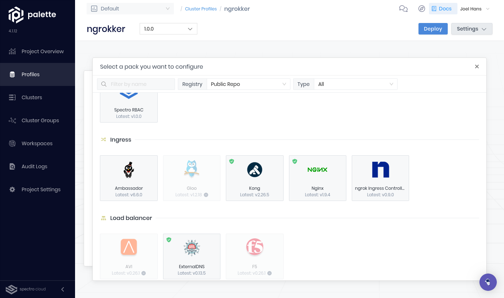

import TwentyFourtyEight from "../../../examples/k8s/apps/2048/example.mdx";

# Ingress to Kubernetes apps deployed on Spectro Cloud Palette

:::tip TL;DR

To use the ngrok Kubernetes Operator with Spectro Cloud Palette:

1. [Create an add-on cluster profile for the ngrok Kubernetes Operator](#create-a-cluster-profile-in-palette)
2. [Create your cluster with Palette](#create-your-cluster-with-palette)
3. [Create an add-on cluster profile for an example app and ngrok Kubernetes Operator](#create-add-on-cluster-profile-ngrok)
4. [Create your cluster with Palette](#create-your-cluster-with-palette)

:::

The [ngrok Kubernetes Operator](https://ngrok.com/blog-post/ngrok-k8s) is the official controller for adding public and secure ingress traffic to your k8s services. This open source Operator works with any cloud, locally-hosted, or on-premises Kubernetes cluster to provide ingress to your applications, APIs, or other services while also offloading network ingress and middleware execution to ngrok's platform.

Palette, from [Spectro Cloud](https://www.spectrocloud.com/), is a profile-based Kubernetes management platform. It gives IT teams the control and visibility to create Kubernetes stacks for their developers with all the granular governance and security they need.

Together, the ngrok Kubernetes Operator and Palette integrate to provide secure public ingress for apps running on Kubernetes clusters managed on their platform. You get all the [benefits](https://www.spectrocloud.com/why-palette) of declarative management and lifecycle controls in Palette while simplifying and securing how you move public traffic into your Kubernetes cluster.

With this guide, you'll define cluster and add-on profiles in Palette, create a cluster with your cloud provider, and integrate the ngrok Kubernetes Operator with either an example app or a custom app you're ready to make public via ngrok's cloud service.

:::caution This tutorial requires:

1. An [ngrok account](https://ngrok.com/signup) at any tier.
2. A [Palette](https://console.spectrocloud.com/) account with Spectro Cloud.
3. An account with the necessary privileges to create a cluster on one of the following managed Kubernetes services:
   - [Amazon Elastic Kubernetes Service](https://aws.amazon.com/eks/) (EKS)
   - [Azure Kubernetes Service](https://azure.microsoft.com/en-us/products/kubernetes-service) (AKS)
   - [Google Kubernetes Engine](https://cloud.google.com/kubernetes-engine) (GKE)
   - [Tencent Kubernetes Engine](https://www.tencentcloud.com/products/tke) (TKE)
   - Palette also supports [data centers](https://docs.spectrocloud.com/clusters/data-center/) and other deployment strategies, but those are beyond the scope of this guide.

:::

## **Step 1**: Create a cluster profile in Palette {#create-a-cluster-profile-in-palette}

Palette uses infrastructure-level [cluster profiles](https://docs.spectrocloud.com/profiles/cluster-profiles/) to help you create and deploy a Kubernetes cluster with your service of choice. Profiles are layers of Helm charts, manifests, and [packs](https://docs.spectrocloud.com/integrations/) provided by Palette to repeatedly deploy clusters to multiple providers and manage them in Palette.

If you already have a cluster profile, skip to [Step 4: Create your cluster with Palette](#create-your-cluster-with-palette). If you already have a functioning cluster in Palette, skip to [Step 3: Create an add-on cluster profile for an example app and ngrok Kubernetes Operator](#create-add-on-cluster-profile-ngrok).

1. [Log in](ttps://console.spectrocloud.com/) to your Palette account.

1. Click **Profiles** in the navigation, then **Add Cluster Profile**. In the **Basic Information** tab, give your profile a name, like `ngrokker`, and a version. For this guide, leave the **Type** as the default **Full**, then click **Next**.

   

1. In the **Cloud Type** tab, choose your provider.

   

1. In the **Profile Layers** tab, click on your base OS pack—in most cases, there will be a single option, like `Container-Optimized OS` or `Linux`. This is where you would add customizations or additional manifests, but you can leave the settings at their default and click **Next layer**.

   

   Repeat the process for the base Kubernetes, Network, and Storage packs. At the final step, click **Confirm**.

1. Palette now shows you the layers of this new cluster profile. You can also add new Packs, manifests, or Helm charts, but to save your progress for now, click **Next**, then **Finish Configuration**.

   

## **Step 2**: Create an add-on cluster profile for the ngrok Kubernetes Operator {#create-add-on-cluster-profile-ngrok}

You've defined the core layers of your cluster and created it, but you don't currently have a method of handling traffic ingress.

For the former, Palette has a [ready-to-apply pack](https://docs.spectrocloud.com/integrations/ngrok/) for the ngrok Kubernetes Operator. For the latter, you can either add an example app as detailed in the following steps or connect to an existing app.

1. Head back to the **Profiles** section in Palette. Click on **Add Cluster Profile**. Give this profile a name. Under **Type**, click the **Add-on** option, then **Next**.

1. Click **Add New Pack**, then either search `ngrok`, or scroll down to the **Ingress** section, and click on the **ngrok Kubernetes Operator** icon.

   

1. Scroll down in the default YAML supplied by the pack to the following configuration.

   ```yaml
   ## @param credentials.secret.name The name of the secret the credentials are in. If not provided, one will be generated using the helm release name.
   ## @param credentials.apiKey Your ngrok API key. If provided, it will be will be written to the secret and the authtoken must be provided as well.
   ## @param credentials.authtoken Your ngrok authtoken. If provided, it will be will be written to the secret and the apiKey must be provided as well.
   credentials:
     secret:
       name: ""
     apiKey: ""
     authtoken: ""
   ```

   You must specify the `apiKey` and `authtoken` parameters with those of your ngrok account.

   To create a new API key, navigate to the [**API** section](https://dashboard.ngrok.com/api) of the ngrok dashboard, click the **New API Key** button, change the description or owner, and click the **Add API Key** button. Copy your new API key into the `apiKey` parameter.

   Find your `AUTHTOKEN` under [**Your Authtoken**](https://dashboard.ngrok.com/get-started/your-authtoken) in the ngrok dashboard, and copy that into the `authtoken` parameter.

   Palette will automatically hide the values you enter.

   

   :::tip

   If you have a free ngrok account, you can only have one ngrok agent active at a time. To ensure the ngrok Kubernetes Operator functions properly in production, set the `replicaCount` parameter to `1`.

   :::

1. Click **Confirm & Create** to add the layer to your profile and then finish the configuration.

## **Step 3**: Create an add-on cluster profile for an example app {#create-add-on-cluster-profile-app}

1. Create an ngrok static subdomain for ingress, if you don't have one already. Navigate to the [**Domains** section](https://dashboard.ngrok.com/domains) of the ngrok dashboard and click **Create Domain** or **New Domain**. This static subdomain will be your `NGROK_DOMAIN` for the remainder of this guide.

1. Create a new cluster profile, name it `game-2048`, and click the **Add-on** profile type.

1. Click **Add Manifest** to create a new layer using Kubernetes manifests in YAML.

   Name the layer `2048`, then click **New manifest** and name it `deployment`. Copy the following YAML content to create a Kubernetes deployment named `game-2048`.

   <TwentyFourtyEight title="2048-deployment.yaml" deployment={true} />

   Create a second manifest named `service` copy in the following YAML:

    <TwentyFourtyEight title="2048-service.yaml" service={true} />

   Click **Confirm & Create** to save the deployment.

1. Add another manifest to create a Kubernetes ingress service, which will inform the ngrok Kubernetes Operator to create a new Edge for your app. Name it `2048-ingress` and create an `ingress` manifest with the following YAML content, replacing the `<NGROK_DOMAIN>` variable with the subdomain you created, which should look like `one-two-three.ngrok.app`.

   <TwentyFourtyEight title="2048-ingress.yaml" ingress={true} />

   Click **Confirm & Create** once again to add this layer before finishing the configuration.

   

## **Step 4**: Create your cluster with Palette {#create-your-cluster-with-palette}

You can now create your core cluster using Palette and your cloud provider. Once the cluster deploys, you'll add additional layers for an example app and the ngrok Kubernetes Operator.

1. Navigate to **Project Settings** in the Palette dashboard to add a cloud account.

   Before connecting your cloud account to Palette, ensure you have user/service account privileges. Doing so is beyond the scope of this guide, but the Palette docs have detailed requirements for [GCP](https://docs.spectrocloud.com/clusters/public-cloud/gcp/add-gcp-accounts/), [AWS](https://docs.spectrocloud.com/clusters/public-cloud/aws/add-aws-accounts), [Azure](https://docs.spectrocloud.com/clusters/public-cloud/azure/azure-cloud), and [others](https://docs.spectrocloud.com/clusters/).

   For example, GCP requires a service account with the following credentials:
   - [Kubernetes Engine Admin](https://cloud.google.com/iam/docs/understanding-roles#kubernetes-engine-roles)
   - [Compute Admin](https://cloud.google.com/iam/docs/understanding-roles#compute.admin)
   - [Service Account User](https://cloud.google.com/iam/docs/understanding-roles#iam.serviceAccountUser)
     - [Compute Admin](https://cloud.google.com/iam/docs/understanding-roles#compute.admin)
     - [Storage Object Viewer](https://cloud.google.com/iam/docs/understanding-roles#storage.objectViewer)
     - [Service Account Token Creator](https://cloud.google.com/iam/docs/understanding-roles#iam.serviceAccountTokenCreator)

1. Click **Add ... Account** to open a modal containing the credentials required to connect your account. For GCP, you only need to upload the [JSON credentials](https://developers.google.com/workspace/guides/create-credentials) for your service account.

1. Click **Validate**. If there are any errors, Palette will attempt to explain what privileges are missing, or settings not yet enabled in your cloud account, and provide links to relevant docs.

1. Start the cluster setup process by clicking **Clusters** in the left-hand navigation, then **Add New Cluster**, and **Deploy New Cluster**.

1. Choose your cloud provider and start the configuration. Give your cluster a name, then choose the cloud account you connected to Palette.

1. Find the cluster profile you created in Step 1 and click **Next**.

   

1. Add your additional profiles by clicking on the **+** next to **Addon layers**. Choose the ngrok Kubernetes Operator profile, then repeat for the 2048 game profile.

   You have one more opportunity to customize the configurations, but you can click **Next** to continue.

1. Choose the **Project** you'd like to create your new cluster within and pick a region.

   :::tip

   A common error at this stage is you still need to activate certain APIs for your project. For example, a project in GCP requires the Compute Engine API, which in turn requires an enabled billing account. Once you fix these errors, give the settings a few minutes to propagate to Palette, before moving forward.

   :::

1. Next, create your node pool. Here, you can change the number of nodes in the pool and specify the instance type you'd like to use.

   

1. Click **Finish Configuration** to create your cluster.

   

   The deployment process may take up to 15 minutes, depending on your cluster profile, node pool configuration, and the general load on that region. You can track the provisioning process on the cluster's **Overview**.

   If you see additional errors during deployment, view the **Events** tab to read logs and check whether you need to enable additional APIs or privileges on your project or service account.

1. Once Palette reports your cluster as `Running`, you can open your browser and navigate to your `NGROK_DOMAIN` to see your example app as managed, deployed, and publicly networked via, respectively, Palette, Kubernetes, and ngrok!

   

## What's next?

You have now used Spectro Cloud's Palette to create modular, declarative configurations for your cluster, then deployed an example Wordpress app integrated with the ngrok Kubernetes Operators. With ngrok operating as your middleware, handling ingress to your Palette-managed Kubernetes cluster, you can deploy any number of apps while maintaining control and customization.

From here, you have a few options:

### Clean up

Delete your Palette-managed cluster by heading to the **Overview** for your cluster, then clicking **Settings** &rarr; **Delete Cluster**. Palette will send the necessary requests to your provider to delete your cluster resources.

ngrok will automatically delete your Edge upon the deletion of your cluster.

### Extend your ngrok Kubernetes Operator and Palette integration

Read our [Kubernetes Operator docs](/docs/k8s/) for more details, including [how it works](/docs/k8s/how-it-works/) and details on how to [apply an `NgrokTrafficPolicy` resource](/docs/k8s/guides/using-ingresses/#using-ngroktrafficpolicy-with-ingress) to your `Ingress` to start using our [Traffic Policy system](/docs/traffic-policy).
