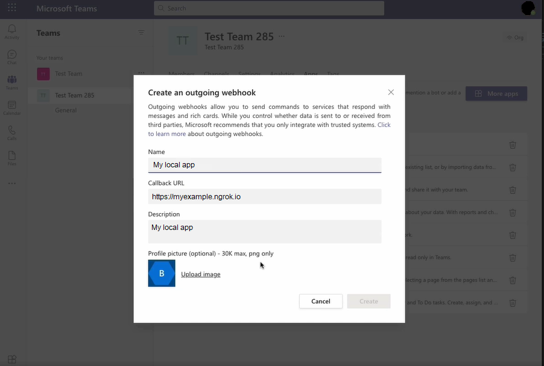
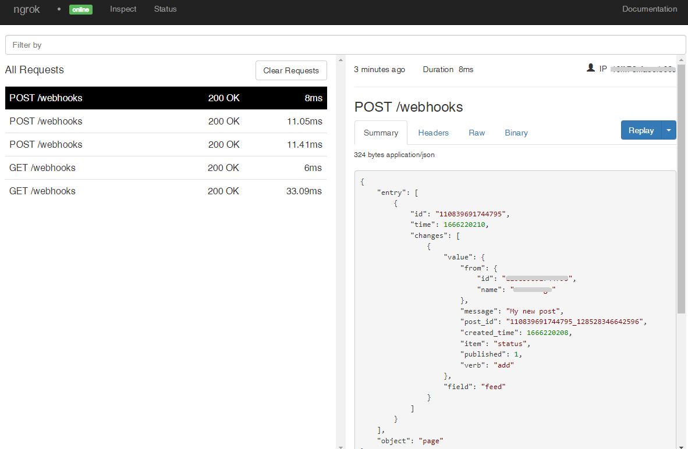

# Microsoft Teams Webhooks
------------

:::tip TL;DR

To integrate Microsoft Teams webhooks with ngrok:
1. [Launch your local webhook.](#start-your-app) `npm start`
1. [Launch ngrok.](#start-ngrok) `ngrok http 3000 --region us --domain myexample.ngrok.io`
1. [Configure Microsoft Teams webhooks with your ngrok URL.](#setup-webhook)
1. [Secure your webhook requests with verification.](#security)

:::


This guide covers how to use ngrok to integrate your localhost app with Microsoft Teams by using Webhooks.
Microsoft Teams webhooks can be used to notify an external application whenever page or account events occur in your Microsoft Teams account.

By integrating ngrok with Microsoft Teams, you can:

- **Develop and test Microsoft Teams webhooks locally**, eliminating the time in deploying your development code to a public environment and setting it up in HTTPS.
- **Inspect and troubleshoot requests from Microsoft Teams** in real-time via the inspection UI and API.
- **Modify and Replay Microsoft Teams Webhook requests** with a single click and without spending time reproducing events manually in your Microsoft Teams account.
- **Secure your app with Microsoft Teams validation provided by ngrok**. Invalid requests are blocked by ngrok before reaching your app.


## **Step 1**: Start your app {#start-your-app}

For this tutorial, we'll use the [sample NodeJS app available on GitHub](https://github.com/ngrok/ngrok-webhook-nodejs-sample). 

To install this sample, run the following commands in a terminal:

```bash
git clone https://github.com/ngrok/ngrok-webhook-nodejs-sample.git
cd ngrok-webhook-nodejs-sample
npm install
```

This will get the project installed locally.

Now you can launch the app by running the following command: 

```bash
npm start
```

The app runs by default on port 3000. 

You can validate that the app is up and running by visiting http://localhost:3000. The application logs request headers and body in the terminal and responds with a message in the browser.


## **Step 2**: Launch ngrok {#start-ngrok}

Once your app is running successfully on localhost, let's get it on the internet securely using ngrok!

**Note:** This integration requires an ngrok Pro or Enterprise license because Microsoft Teams validates your ngrok domain and certificate.

1. If you're not an ngrok user yet, just [sign up for ngrok for free](https://ngrok.com/signup).

1. [Download the ngrok agent](https://ngrok.com/download).

1. Go to the [ngrok dashboard](https://dashboard.ngrok.com), click **Your Authtoken**, and copy your Authtoken. <br />
    **Tip:** The ngrok agent uses the auth token to log into your account when you start a tunnel.

1. On the left menu, expand **Cloud Edge** and then click **Domains**.
    **Tip:** If you don't have an ngrok Pro or Enterprise license, sign up for one by clicking **Update Subscription** and following the subscribe procedure.

1. On the **Domains** page, click **+ Create Domain** or **+ New Domain**.

1. In the **Domain** pane, select a **Region** for your domain (i.e. `United States`), provide a value for the **Domain** field (i.e. `myexample.ngrok.io`), and then click **Continue**.
    
    **Tip**: Make sure your domain is available.

1. Close the **Start a Tunnel** pane and then close the **Domain** pane.

1. Start ngrok by running the following command in a terminal on your local desktop:
    ```bash
    ngrok http 3000 --region us --domain myexample.ngrok.io
    ```

1. ngrok will display a URL where your localhost application is exposed to the internet (copy this URL for use with Microsoft Teams).
    


## **Step 3**: Integrate Microsoft Teams {#setup-webhook}

To register a webhook on your Microsoft Teams account follow the instructions below:

**Requirements**: You'll need a Microsoft Teams page and a Microsoft Teams app associated with your Microsoft Teams page. Create one before following the rest of these steps. 

1. Access the [Microsoft Teams web interface](https://teams.microsoft.com/) and sign in using your Microsoft account.
    **Tip**: You can use the Microsoft Teams app instead.

1. On the **Microsoft Teams** page, click **Teams** on the left menu, select one of your channels and then click the plus sign (**+**) on the top of your team page.
   
1. On the **Add a tab** popup, click **Manage apps** and then click **Create an outgoing webhook** at the bottom of the page.

1. On the **Create an outgoing webhook** popup, enter `My local app` in the **Name** field, enter  `My local app` in the **Description** field, and enter the URL provided by the ngrok agent to expose your application to the internet in the **Callback URL** field (i.e. `https://myexample.ngrok.io`).
    

1. Click **Create**.

1. On the **Congratulations** popup, make note of the **Security token** value and then click **Close**.


### Run Webhooks with Microsoft Teams and ngrok

Microsoft teams Outgoing Webhook acts as a bot sending any text you type using `@mention`. It sends notifications to your local application through ngrok.

To send notifications to your application follow the instructions below:

1. Access your Microsoft Teams account, select a channel, and then enter `@My local app` and hit enter.

1. The JSON message `{ message: "Thank you for the message" }` appears as a response to your message.

Confirm your localhost app receives a notification call and logs both headers and body in the terminal.


### Inspecting requests

When you launch the ngrok agent on your local machine, you can see two links: 

* The URL to your app (it ends with `ngrok-free.app` for free accounts or `ngrok.app` for paid accounts when not using custom domains)
* A local URL for the Web Interface (a.k.a **Request Inspector**).

The Request Inspector shows all the requests made through your ngrok tunnel to your localhost app. When you click on a request, you can see details of both the request and the response.

Seeing requests is an excellent way of validating the data sent to and retrieved by your app via the ngrok tunnel. That alone can save you some time dissecting and logging HTTP request and response headers, methods, bodies, and response codes within your app just to confirm you are getting what you expect.

To inspect Microsoft Teams' webhooks call, launch the ngrok web interface (i.e. `http://127.0.0.1:4040`) and then click one of the requests sent by Microsoft Teams.

From the results, review the response body, header, and other details:




### Replaying requests

The ngrok Request Inspector provides a replay function that you can use to test your code without the need to trigger new events from Microsoft Teams. To replay a request:

1. In the ngrok inspection interface (i.e. `http://localhost:4040`), select a request from Microsoft Teams.

1. Click **Replay** to execute the same request to your application or select **Replay with modifications** to modify the content of the original request before sending the request.

1. If you choose to **Replay with modifications**, you can modify any content from the original request. For example, you can modify the **email** field inside the body of the request.

1. Click **Replay**.

Verify that your local application receives the request and logs the corresponding information to the terminal.


## Secure webhook requests {#security}

The ngrok signature webhook verification feature allows ngrok to assert that requests from your Microsoft Teams webhook are the only traffic allowed to make calls to your localhost app.

**Note:** This ngrok feature is limited to 500 per month on free ngrok accounts. For unlimited, upgrade to Pro or Enterprise.

This is a quick step to add extra protection to your application.

1. Restart your ngrok agent by running the command, replacing `{your app secret}` with the **Security token** value you copied before (See [Integrate Microsoft Teams](#setup-webhook)):
    ```bash
    ngrok http 3000 --region us --domain myexample.ngrok.io --verify-webhook microsoft_teams --verify-webhook-secret {your app secret}
    ```

1. Access the Microsoft Teams page you have assigned to your webhook and send a message to another Microsoft Teams user.

    Verify that your local application receives the request and logs information to the terminal.
