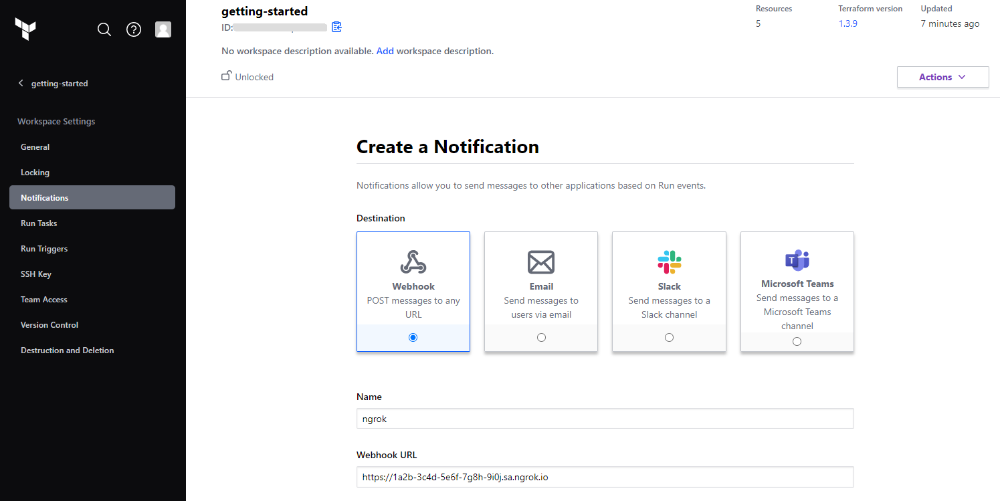
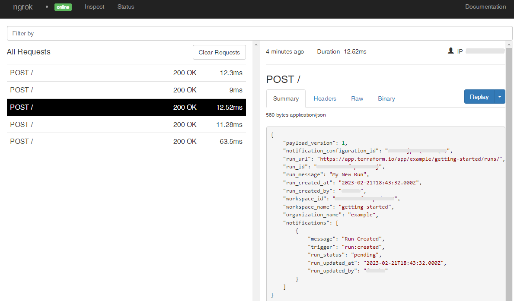

# Terraform Cloud Webhooks

---

:::tip TL;DR

To integrate Terraform Cloud webhooks with ngrok:

1. [Launch your local webhook.](#start-your-app) `npm start`
1. [Launch ngrok.](#start-ngrok) `ngrok http 3000`
1. [Configure Terraform Cloud webhooks with your ngrok URL.](#setup-webhook)
1. [Secure your webhook requests with verification.](#security)

:::

This guide covers how to use ngrok to integrate your localhost app with Terraform Cloud by using Webhooks.
Terraform Cloud webhooks can be used to notify an external application whenever specific events occur in your Terraform Cloud account.

By integrating ngrok with Terraform Cloud, you can:

- **Develop and test Terraform Cloud webhooks locally**, eliminating the time in deploying your development code to a public environment and setting it up in HTTPS.
- **Inspect and troubleshoot requests from Terraform Cloud** in real-time via the inspection UI and API.
- **Modify and Replay Terraform Cloud Webhook requests** with a single click and without spending time reproducing events manually in your Terraform Cloud account.
- **Secure your app with Terraform Cloud validation provided by ngrok**. Invalid requests are blocked by ngrok before reaching your app.

## **Step 1**: Start your app {#start-your-app}

For this tutorial, we'll use the [sample NodeJS app available on GitHub](https://github.com/ngrok/ngrok-webhook-nodejs-sample).

To install this sample, run the following commands in a terminal:

```bash
git clone https://github.com/ngrok/ngrok-webhook-nodejs-sample.git
cd ngrok-webhook-nodejs-sample
npm install
```

This will get the project installed locally.

Now you can launch the app by running the following command:

```bash
npm start
```

The app runs by default on port 3000.

You can validate that the app is up and running by visiting http://localhost:3000. The application logs request headers and body in the terminal and responds with a message in the browser.

## **Step 2**: Launch ngrok {#start-ngrok}

Once your app is running successfully on localhost, let's get it on the internet securely using ngrok!

1. If you're not an ngrok user yet, just [sign up for ngrok for free](https://ngrok.com/signup).

1. [Download the ngrok agent](https://ngrok.com/download).

1. Go to the [ngrok dashboard](https://dashboard.ngrok.com) and copy your Authtoken. <br />
   **Tip:** The ngrok agent uses the auth token to log into your account when you start a tunnel.
1. Start ngrok by running the following command:

   ```bash
   ngrok http 3000
   ```

1. ngrok will display a URL where your localhost application is exposed to the internet (copy this URL for use with Terraform Cloud).
   

## **Step 3**: Integrate Terraform Cloud {#setup-webhook}

To register a webhook on your Terraform Cloud account follow the instructions below:

1. Access [Terraform Cloud](https://app.terraform.io/), sign in using your Terraform account, and then click on your workspace.

1. On the workspace page, click **Settings** and then click **Notifications** both on the left menu.

1. On the **Notifications** page, click **Create Notification**.

1. On the **Create a Notification** page, click the **Webhook** tile, enter `ngrok` in the **Name** field, and enter the URL provided by the ngrok agent to expose your application to the internet in the **Webhook URL** field (i.e. `https://1a2b-3c4d-5e6f-7g8h-9i0j.sa.ngrok.io`).
   

1. On the same page, click **All events** in the **Triggers** section.

   Confirm your localhost app receives verification notification and logs both headers and body in the terminal.

Alternatively, click **Send a test** on the **ngrok** notification details page and confirm your localhost app receives a new notification.

### Run Webhooks with Terraform Cloud and ngrok

Terraform Cloud sends different request body contents depending on the event that is being triggered.
You can trigger new calls from Terraform Cloud to your application by following the instructions below.

1. On the top of the page, click **Actions** and then click **Start new run**.

1. Enter `My New Run` in the **Reason for starting run**, select **Plan and apply** in the **Choose run type** field, and then click **Start run**.

   Confirm your localhost app receives event notifications and logs both headers and body in the terminal.

### Inspecting requests

When you launch the ngrok agent on your local machine, you can see two links:

- The URL to your app (it ends with `ngrok-free.app` for free accounts or `ngrok.app` for paid accounts when not using custom domains)
- A local URL for the Web Interface (a.k.a **Request Inspector**).

The Request Inspector shows all the requests made through your ngrok tunnel to your localhost app. When you click on a request, you can see details of both the request and the response.

Seeing requests is an excellent way of validating the data sent to and retrieved by your app via the ngrok tunnel. That alone can save you some time dissecting and logging HTTP request and response headers, methods, bodies, and response codes within your app just to confirm you are getting what you expect.

To inspect Terraform Cloud's webhooks call, launch the ngrok web interface (i.e. `http://127.0.0.1:4040`), and then click one of the requests sent by Terraform Cloud.

From the results, review the response body, header, and other details:



### Replaying requests

The ngrok Request Inspector provides a replay function that you can use to test your code without the need to trigger new events from Terraform Cloud. To replay a request:

1. In the ngrok inspection interface (i.e. `http://localhost:4040`), select a request from Terraform Cloud.

1. Click **Replay** to execute the same request to your application or select **Replay with modifications** to modify the content of the original request before sending the request.

1. If you choose to **Replay with modifications**, you can modify any content from the original request. For example, you can modify the **id** field inside the body of the request.

1. Click **Replay**.

Verify that your local application receives the request and logs the corresponding information to the terminal.

## Secure webhook requests {#security}

The ngrok signature webhook verification feature allows ngrok to assert that requests from your Terraform Cloud webhook are the only traffic allowed to make calls to your localhost app.

**Note:** This ngrok feature is limited to 500 validations per month on free ngrok accounts. For unlimited, upgrade to Pro or Enterprise.

This is a quick step to add extra protection to your application.

1. Access [Terraform Cloud](https://app.terraform.io/), sign in using your Terraform account, and then click on your workspace.

1. On the workspace page, click **Settings** on the left menu, click **Notifications**, click the **ngrok** notification you created previously, and then click **Edit Notification**.

1. On the **ngrok** notification page, enter `'12345` in the **Token** field and then click **Update notification**.

1. Restart your ngrok agent by running the command, replacing `{your webhook token}` with the value you have copied before (See [Integrate ngrok and Terraform Cloud.](#setup-webhook)):

   ```bash
   ngrok http 3000 --verify-webhook terraform --verify-webhook-secret {your webhook token}
   ```

1. On the top of the page, click **Actions** and then click **Start new run**.

1. Enter `My New Run` in the **Reason for starting run**, select **Plan and apply** in the **Choose run type** field, and then click **Start run**.

   Confirm your localhost app receives event notifications and logs both headers and body in the terminal.
