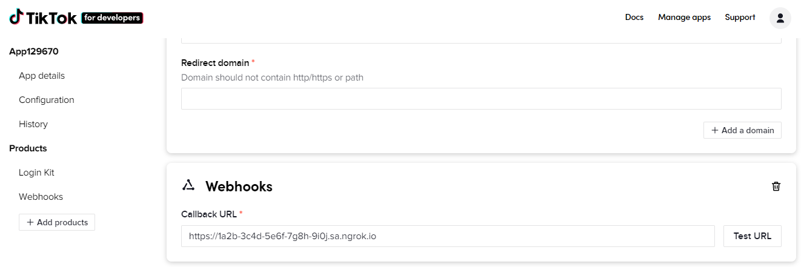
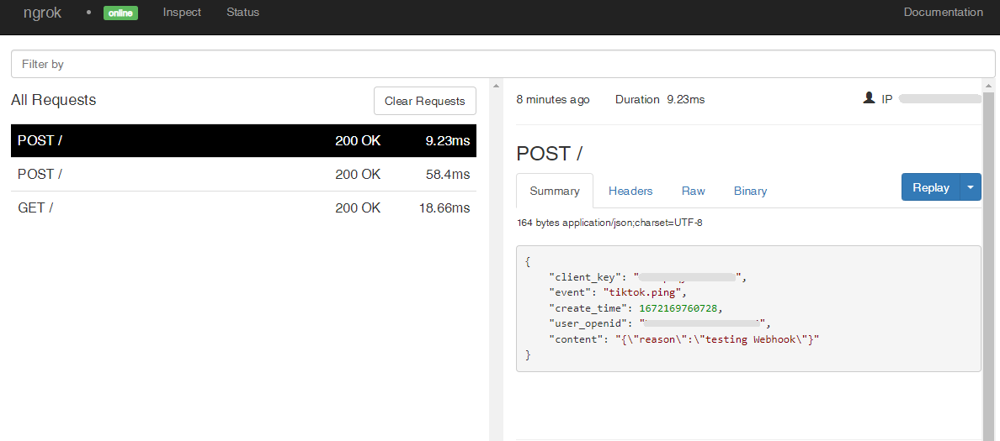

# TikTok Webhooks

---

:::tip TL;DR

To integrate TikTok webhooks with ngrok:

1. [Launch your local webhook.](#start-your-app) `npm start`
1. [Launch ngrok.](#start-ngrok) `ngrok http 3000`
1. [Configure TikTok webhooks with your ngrok URL.](#setup-webhook)
1. [Secure your webhook requests with verification.](#security)

:::

This guide covers how to use ngrok to integrate your localhost app with TikTok by using Webhooks.
TikTok webhooks can be used to notify an external application whenever specific events occur in your TikTok app.

By integrating ngrok with TikTok, you can:

- **Develop and test TikTok webhooks locally**, eliminating the time in deploying your development code to a public environment and setting it up in HTTPS.
- **Inspect and troubleshoot requests from TikTok** in real-time via the inspection UI and API.
- **Modify and Replay TikTok Webhook requests** with a single click and without spending time reproducing events manually in your TikTok account.
- **Secure your app with TikTok validation provided by ngrok**. Invalid requests are blocked by ngrok before reaching your app.

## **Step 1**: Start your app {#start-your-app}

For this tutorial, we'll use the [sample NodeJS app available on GitHub](https://github.com/ngrok/ngrok-webhook-nodejs-sample).

To install this sample, run the following commands in a terminal:

```bash
git clone https://github.com/ngrok/ngrok-webhook-nodejs-sample.git
cd ngrok-webhook-nodejs-sample
npm install
```

This will get the project installed locally.

Now you can launch the app by running the following command:

```bash
npm start
```

The app runs by default on port 3000.

You can validate that the app is up and running by visiting http://localhost:3000. The application logs request headers and body in the terminal and responds with a message in the browser.

## **Step 2**: Launch ngrok {#start-ngrok}

Once your app is running successfully on localhost, let's get it on the internet securely using ngrok!

1. If you're not an ngrok user yet, just [sign up for ngrok for free](https://ngrok.com/signup).

1. [Download the ngrok agent](https://ngrok.com/download).

1. Go to the [ngrok dashboard](https://dashboard.ngrok.com) and copy your Authtoken. <br />
   **Tip:** The ngrok agent uses the auth token to log into your account when you start a tunnel.
1. Start ngrok by running the following command:

   ```bash
   ngrok http 3000
   ```

1. ngrok will display a URL where your localhost application is exposed to the internet (copy this URL for use with TikTok).
   

## **Step 3**: Integrate TikTok {#setup-webhook}

To register a webhook on your TikTok app follow the instructions below:

1. Access the [TikTok Developer Portal](https://developers.tiktok.com/) and sign in using your TikTok account.

1. On the **Welcome** page, click **Manage apps** on the top menu.

1. On the **Manage apps** page, click **Connect an app**, upload an **App icon**, select **Others** in the **Category** field, enter a description in the **Description** field, click the slider icon for **Configure for Web**, enter a URL in the **Website URL** field, and click **Save changes**.

1. On the app page, click **Add products** on the left menu and click **Add** in the **Webhooks** tile.<br />
   **Note**: You may need to add the **Login Kit** before adding **Webhooks**.

1. On the left menu, click **Webhooks** and then enter the URL provided by the ngrok agent to expose your application to the internet in the **Callback URL** field (i.e. `https://1a2b-3c4d-5e6f-7g8h-9i0j.sa.ngrok.io`).
   

1. Click **Test URL** and then click **Send**.

   Confirm your localhost app receives a notification and logs both headers and body in the terminal.

1. On the **Test event sent** popup, confirm the message **200 OK** appears and then click **Done**.

1. Click **Save changes**.
   **Note**: You may need to enter values for the **Terms of Service URL**, **Privacy Policy URL**, and **Redirect domain** fields in the **Login Kit** section.

1. If your application isn't published yet, click **Submit for review**.

### Run Webhooks with TikTok and ngrok {#run-webhook}

By default, you are subscribed to all events that happen in your TikTok app.
TikTok sends different request body contents depending on the event that is being triggered.

After your app is approved, associate a user with your app.

The TikTok app will send a notification to your localhost application when a user's account is deauthorized from your application, a user video fails to upload in TikTok, or a user video has been published in TikTok.

    Confirm your localhost app receives one of these event notifications and logs both headers and body in the terminal.

### Inspecting requests

When you launch the ngrok agent on your local machine, you can see two links:

- The URL to your app (it ends with `ngrok-free.app` for free accounts or `ngrok.app` for paid accounts when not using custom domains)
- A local URL for the Web Interface (a.k.a **Request Inspector**).

The Request Inspector shows all the requests made through your ngrok tunnel to your localhost app. When you click on a request, you can see details of both the request and the response.

Seeing requests is an excellent way of validating the data sent to and retrieved by your app via the ngrok tunnel. That alone can save you some time dissecting and logging HTTP request and response headers, methods, bodies, and response codes within your app just to confirm you are getting what you expect.

To inspect TikTok's webhooks call, launch the ngrok web interface (i.e. `http://127.0.0.1:4040`), and then click one of the requests sent by TikTok.

From the results, review the response body, header, and other details:



### Replaying requests

The ngrok Request Inspector provides a replay function that you can use to test your code without the need to trigger new events from TikTok. To replay a request:

1. In the ngrok inspection interface (i.e. `http://localhost:4040`), select a request from TikTok.

1. Click **Replay** to execute the same request to your application or select **Replay with modifications** to modify the content of the original request before sending the request.

1. If you choose to **Replay with modifications**, you can modify any content from the original request. For example, you can modify the **content** field inside the body of the request.

1. Click **Replay**.

Verify that your local application receives the request and logs the corresponding information to the terminal.

## Secure webhook requests {#security}

The ngrok signature webhook verification feature allows ngrok to assert that requests from your TikTok webhook are the only traffic allowed to make calls to your localhost app.

**Note:** This ngrok feature is limited to 500 validations per month on free ngrok accounts. For unlimited, upgrade to Pro or Enterprise.

This is a quick step to add extra protection to your application.

1. Access the [TikTok Developer Portal](https://developers.tiktok.com/) and sign in using your TikTok account.

1. On the **Manage apps** page, click your app tile, click the eye icon to reveal the **Client secret** value, and then copy this value.

1. Restart your ngrok agent by running the command, replacing `{your webhook secret}` with the value you copied before:

   ```bash
   ngrok http 3000 --verify-webhook tiktok --verify-webhook-secret {your webhook secret}
   ```

1. Access your [TikTok](https://www.tiktok.com/) account and use the app. See [Run Webhooks with TikTok and ngrok](#run-webhook).

Verify that your local application receives the request and logs information to the terminal.
