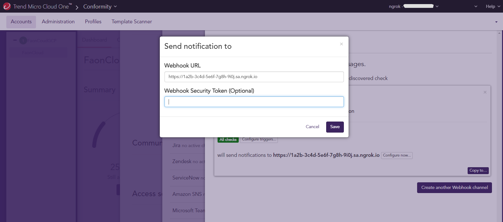
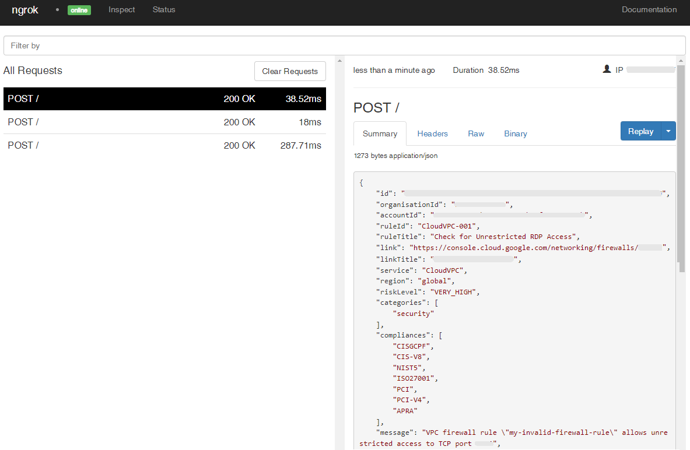

# Trend Micro Webhooks
------------

:::tip TL;DR

To integrate Trend Micro webhooks with ngrok:
1. [Launch your local webhook.](#start-your-app) `npm start`
1. [Launch ngrok.](#start-ngrok) `ngrok http 3000`
1. [Configure Trend Micro webhooks with your ngrok URL.](#setup-webhook)
1. [Secure your webhook requests with verification.](#security)

:::


This guide covers how to use ngrok to integrate your localhost app with Trend Micro by using Webhooks.
Trend Micro webhooks can be used to notify an external application whenever specific events occur in your Trend Micro account. 

By integrating ngrok with Trend Micro, you can:

- **Develop and test Trend Micro webhooks locally**, eliminating the time in deploying your development code to a public environment and setting it up in HTTPS.
- **Inspect and troubleshoot requests from Trend Micro** in real-time via the inspection UI and API.
- **Modify and Replay Trend Micro Webhook requests** with a single click and without spending time reproducing events manually in your Trend Micro account.
- **Secure your app with Trend Micro validation provided by ngrok**. Invalid requests are blocked by ngrok before reaching your app.


## **Step 1**: Start your app {#start-your-app}

For this tutorial, we'll use the [sample NodeJS app available on GitHub](https://github.com/ngrok/ngrok-webhook-nodejs-sample). 

To install this sample, run the following commands in a terminal:

```bash
git clone https://github.com/ngrok/ngrok-webhook-nodejs-sample.git
cd ngrok-webhook-nodejs-sample
npm install
```

This will get the project installed locally.

Now you can launch the app by running the following command: 

```bash
npm start
```

The app runs by default on port 3000. 

You can validate that the app is up and running by visiting http://localhost:3000. The application logs request headers and body in the terminal and responds with a message in the browser.


## **Step 2**: Launch ngrok {#start-ngrok}

Once your app is running successfully on localhost, let's get it on the internet securely using ngrok! 

1. If you're not an ngrok user yet, just [sign up for ngrok for free](https://ngrok.com/signup).

1. [Download the ngrok agent](https://ngrok.com/download).

1. Go to the [ngrok dashboard](https://dashboard.ngrok.com) and copy your Authtoken. <br />
    **Tip:** The ngrok agent uses the auth token to log into your account when you start a tunnel.
    
1. Start ngrok by running the following command:
    ```bash
    ngrok http 3000
    ```

1. ngrok will display a URL where your localhost application is exposed to the internet (copy this URL for use with Trend Micro).
    


## **Step 3**: Integrate Trend Micro {#setup-webhook}

To register a webhook on your Trend Micro account follow the instructions below:

1. Access [Trend Micro Cloud One](https://cloudone.trendmicro.com/) and sign in using your Trend Micro account.

1. On the home page, click the **Conformity** tile.

1. On the **Accounts** page, click **Settings**, click **Update communication settings** in the **Communication settings** section, and then click **Configure** in the **Webhooks** section. 
    **Note**: If you don't have a cloud provider associated with your Trend Micro Conformity service, click your preferred cloud provider and associate a service account.

1. On the **Webhooks** page, click **Create a Webhook channel**, click **Configure webhook**, and enter the URL provided by the ngrok agent to expose your application to the internet in the **Webhook URL** field (i.e. `https://1a2b-3c4d-5e6f-7g8h-9i0j.sa.ngrok.io`).
    

1. Click **Save**.

1. Click the On/Off switch to turn **Automatic notifications** on.


### Run Webhooks with Trend Micro and ngrok

Trend Micro Cloud One Conformity notifies your webhook after the bot revises your cloud provider account for compliance issues.
You can trigger new calls from Trend Micro Cloud One to your application by creating a non-compliant configuration on your cloud provider account and then running the bot as per the following:

1. On the [Trend Micro Cloud One home](https://cloudone.trendmicro.com/home) page, click the **Conformity** tile.

1. On the **Accounts** page, click **Run Conformity Bot**.

    After the bot finishes running, confirm your localhost app receives a notification and logs both headers and body in the terminal.


### Inspecting requests

When you launch the ngrok agent on your local machine, you can see two links: 

* The URL to your app (it ends with `ngrok-free.app` for free accounts or `ngrok.app` for paid accounts when not using custom domains)
* A local URL for the Web Interface (a.k.a **Request Inspector**).

The Request Inspector shows all the requests made through your ngrok tunnel to your localhost app. When you click on a request, you can see details of both the request and the response.

Seeing requests is an excellent way of validating the data sent to and retrieved by your app via the ngrok tunnel. That alone can save you some time dissecting and logging HTTP request and response headers, methods, bodies, and response codes within your app just to confirm you are getting what you expect.

To inspect Trend Micro's webhooks call, launch the ngrok web interface (i.e. `http://127.0.0.1:4040`), and then click one of the requests sent by Trend Micro.

From the results, review the response body, header, and other details:




### Replaying requests

The ngrok Request Inspector provides a replay function that you can use to test your code without the need to trigger new events from Trend Micro. To replay a request:

1. In the ngrok inspection interface (i.e. `http://localhost:4040`), select a request from Trend Micro.

1. Click **Replay** to execute the same request to your application or select **Replay with modifications** to modify the content of the original request before sending the request.

1. If you choose to **Replay with modifications**, you can modify any content from the original request. For example, you can modify the **message** field inside the body of the request.

1. Click **Replay**.

Verify that your local application receives the request and logs the corresponding information to the terminal.


## Secure webhook requests {#security}

The ngrok signature webhook verification feature allows ngrok to assert that requests from your Trend Micro webhook are the only traffic allowed to make calls to your localhost app.

**Note:** This ngrok feature is limited to 500 validations per month on free ngrok accounts. For unlimited, upgrade to Pro or Enterprise.

This is a quick step to add extra protection to your application.

1. Access [Trend Micro Cloud One](https://cloudone.trendmicro.com/) and sign in using your Trend Micro account.

1. On the home page, click the **Conformity** tile.

1. On the **Accounts** page, click **Settings**, click **Update communication settings** in the **Communication settings** section, click **Configure** in the **Webhooks** section, and then click **Configure now** in the webhook section.

1. On the **Send notification to** popup, enter `12345` in the **Webhook Security Token** field and then click **Save**.

1. Restart your ngrok agent by running the command, replacing `{your webhook token}` with the value of the **Webhook Security Token** field:
    ```bash
    ngrok http 3000 --verify-webhook trendmicro_conformity --verify-webhook-secret {your webhook token}
    ```

1. Access the [Trend Micro Cloud One home](https://cloudone.trendmicro.com/home) page, click the **Conformity** tile, and then run the Conformity bot again.

    After the bot finishes running, confirm your localhost app receives a notification and logs both headers and body in the terminal.
