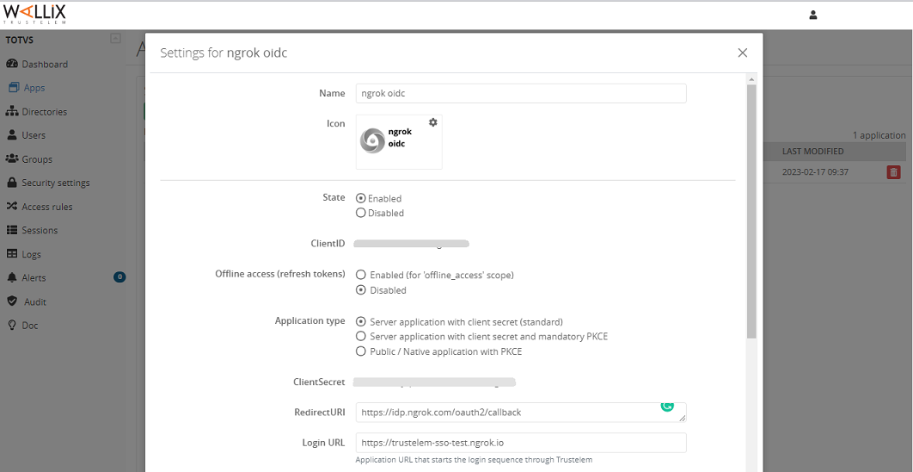
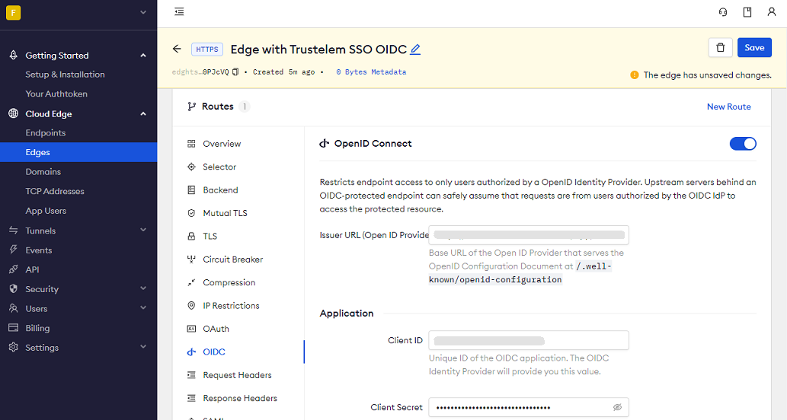

# Wallix Trustelem SSO (OpenID Connect)

:::tip TL;DR

To secure access to ngrok with Wallix Trustelem Single Sign-On using OpenID Connect:

1. [Configure Wallix Trustelem SSO](#configure-wallix)
1. [Configure ngrok](#configure-ngrok)
1. [Test access to ngrok with Wallix Trustelem SSO](#test-sso)

:::

This article details how to configure Wallix Trustelem as the primary Identity Provider for ngrok tunnels.
By integrating Wallix Trustelem SSO with ngrok, you can:

- **Restrict access to ngrok tunnels** only to users authenticated via Wallix Trustelem.
- **Use Wallix Trustelem security policies and MFA authenticators**.
- **Use Wallix Trustelem's Dashboard to facilitate access to ngrok apps**.

## Supported Features

The ngrok integration with Wallix Trustelem supports:

- **SP-Initiated SSO**: In this mode, users access ngrok edges and tunnels and are redirected to Wallix Trustelem for authentication.

## Requirements

To configure ngrok tunnels with Wallix Trustelem, you must have:

- a Wallix Trustelem account with administrative rights to create apps.
- an [ngrok Enterprise Account](https://ngrok.com/pricing) with an authtoken or admin access to configure edges with OpenID Connect.

## Configuration Steps

To integrate ngrok with Wallix Trustelem SSO, you will need to:

1. Configure Wallix Trustelem with the ngrok app.
1. Configure ngrok with the SSO settings provided by Wallix Trustelem.

### **Step 1**: Configure Wallix Trustelem {#configure-wallix}

1. Access the [WALLIX Trustelem administration console](https://admin.trustelem.com/login), and sign in using your Trustelem account.

1. On the **Dashboard** page, click **Apps** on the left menu, click **Add an application**, click the **OpenID Connect application** tile in the **Generic models** section.

1. On the **Settings** popup, enter `ngrok oidc` in the **Name** field, enter `https://idp.ngrok.com/oauth2/callback` in the **RedirectURI** field, and enter `https://trustelem-sso-test.ngrok.io` in the **Login URL** field.
   

1. On the **Settings** popup, make note of the value of both the **ClientID** and the **ClientSecret** fields, and then click **Save**.

1. Make note of the value of the URL of the **Issuer** fields and then click **Close**.

### **Step 2**: Configure ngrok {#configure-ngrok}

ngrok can leverage Wallix Trustelem SSO in two ways:

- From the ngrok CLI (using the `--oidc` parameter)
- From the ngrok dashboard

### **Option 1**: ngrok CLI

> **Note:** For this tutorial, we assume you have an app running locally (i.e., on localhost:3000) with the ngrok client installed.

1. Launch a terminal

1. Enter the following command to launch an ngrok tunnel with Wallix Trustelem SSO:

   ```bash
   ngrok http 3000 --oidc=Wallix Trustelem_OAUTH_URL \
   --oidc-client-id=Wallix Trustelem_CLIENT_ID \
   --oidc-client-secret=Wallix Trustelem_CLIENT_SECRET \
   ```

   **Note**: Replace the following with values:

   - Trustelem_OAUTH_URL: The issuer URL you copied from the Trustelem console.
   - Trustelem_CLIENT_ID: The client id you copied from the Trustelem console.
   - Trustelem_CLIENT_SECRET: The client secret you copied from the Trustelem console.

   Alternatively, add the `--url YOUR_DOMAIN` argument to get your a custom URL, replacing `YOUR_DOMAIN` with your URL of preference.

1. Copy the URL available next to **Forwarding** (for example, `https://trustelem-sso-test.ngrok.io`).

1. Skip to **Step 3**

### **Option 2**: ngrok Edge

To configure an edge with Wallix Trustelem:

1. Access the [ngrok Dashboard](https://dashboard.ngrok.com/) and sign in using your ngrok account.

1. On the left menu, click **Cloud Edge** and then click **Edges**.

1. If you don't have an edge already set to add Wallix Trustelem SSO, create a test edge:

   - Click **+ New Edge**.
   - Click **Create HTTPS Edge**.
   - Click the **pencil icon** next to "no description", enter `Edge with Trustelem SSO OIDC` as the edge name, and click **Save**.

1. On the edge settings menu, click **OIDC**.

1. Click **Begin setup** and enter the following values into the fields:
   

   - **Issuer URL**: The issuer URL you copied from the Trustelem console.
   - **Client ID**: The client id you copied from the Trustelem console.
   - **Client Secret**: The client secret you copied from the Trustelem console.

1. Click **Save** at the top.

1. Launch a tunnel connected to your Wallix Trustelem edge:

:::tip Note
For this step, we assume you have an app running locally (i.e. on localhost:3000) with the ngrok client installed.
:::

1.  Click **Start a tunnel**.

1.  Click the **copy icon** next to the tunnel command.
    

1.  Launch a tunnel:

    - Launch a terminal.
    - Paste the command but replace `http://localhost:80` with your localhost app address (i.e., `http://localhost:3000`).
    - Click **Enter** and an ngrok tunnel associated with your edge configuration will launch.

1.  To confirm that the tunnel is connected to your edge:

    - Return to the ngrok dashboard
    - Close the **Start a tunnel** and the **Tunnel group** tabs
    - Refresh the test edge page. Under traffic, You will see the message _You have 1 tunnel online. Start additional tunnels to begin load balancing._
      

1.  In the test edge, copy the **endpoint URL**. (You use this URL to test the Wallix Trustelem Authentication)
    

## Grant access to Wallix Trustelem users

Wallix Trustelem allows its users to access OIDC-integrated apps.
To create a user follow the instructions below:

1. On the left menu of the [WALLIX Trustelem administration console](https://admin.trustelem.com/login), click **Users** and then click **Create User**.

1. Enter values for **First Name**, **Last Name**, and **Primary Email** fields, and then click **Save**.

## Test the integration {#test-sso}

1. In your browser, launch an incognito window.

1. Access your ngrok tunnel (i.e., `https://trustelem-sso-test.ngrok.io` or using the copied endpoint URL).

1. You should be prompted to log in with your Wallix Trustelem credentials.

1. After logging in, you should be able to see your web app.
