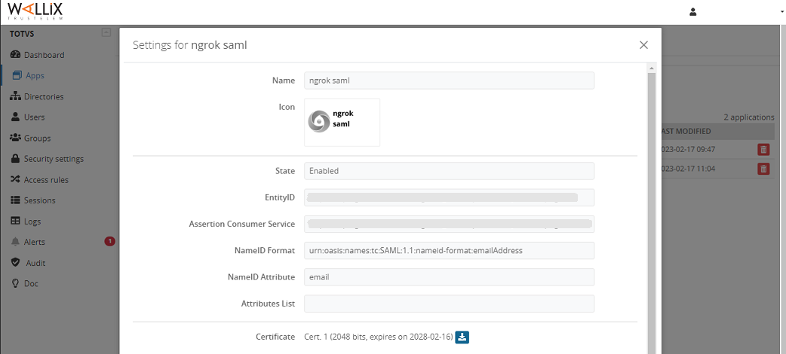

# Wallix Trustelem SSO (SAML)
------------

:::tip TL;DR

To secure access to ngrok with Wallix Trustelem Single Sign-On using SAML:
1. [Configure Wallix Trustelem SSO](#configure-wallix)
1. [Configure ngrok](#configure-ngrok)
1. [Test access to ngrok with Wallix Trustelem SSO](#test-sso)

:::

This article details how to configure Wallix Trustelem as the primary Identity Provider for ngrok tunnels.
By integrating Wallix Trustelem SSO with ngrok, you can:

- **Restrict access to ngrok tunnels** only to users authenticated via Wallix Trustelem.
- **Use Wallix Trustelem security policies and MFA authenticators**.
- **Use Wallix Trustelem's Dashboard to facilitate access to ngrok apps**.

## Requirements

To configure ngrok tunnels with Wallix Trustelem, you must have:

- a Wallix Trustelem account with administrative rights to create apps.
- an ngrok enterprise account with an access token or admin access to configure edges with SAML.

## Configuration Steps

To integrate ngrok with Wallix Trustelem SSO, you will need to:

1. Configure Wallix Trustelem with the ngrok app.
1. Configure ngrok with the SSO settings provided by Wallix Trustelem.

### **Step 1**: Configure Wallix Trustelem {#configure-wallix}

1. Access the [WALLIX Trustelem administration console](https://admin.trustelem.com/login), and sign in using your Trustelem account.

1. On the **Dashboard** page, click **Apps** on the left menu, click **Add an application** and click the **SAML 2 application** tile in the **Generic models** section.

1. On the **Settings** popup, enter `ngrok saml` in the **Name** field, click **Save**, click **Download metadata files**, save the XML file on your desktop, and then click **Close**.

### **Step 2**: Configure ngrok {#configure-ngrok}

To configure an edge with Wallix Trustelem:

1. Access the [ngrok Dashboard](https://dashboard.ngrok.com/) and sign in using your ngrok account.

1. On the left menu, click **Cloud Edge** and then click **Edges**.

1. If you don't have an edge already set to add Wallix Trustelem SSO, create a test edge:
    * Click **+ New Edge**.
    * Click **Create HTTPS Edge**.
    * Click the **pencil icon** next to "no description", enter `Edge with Trustelem SSO SAML` as the edge name, and click **Save**.

1. On the edge settings menu, click **SAML**.

1. On the **SAML** page, click **Begin setup**, click **Upload XML**, and then open the XML metadata file you downloaded from Wallix Trustelem (See [Download the IdP metadata](#idp-metadata)).
    

1. Click **Save** at the top.

1. On the **SAML** page of your [ngrok edge](https://dashboard.ngrok.com/cloud-edge/edges), make note of the URL of both the **Entity ID** and **ACS URL** fields.

### **Step 3**: Link Wallix Trustelem with ngrok {#sp-metadata}

1. On the [WALLIX Trustelem administration console](https://admin.trustelem.com/login), click **Apps** on the left menu, and then click your application.

1. On the **Settings** popup, click **Edit**, paste the **Entity ID** URL in the **EntityID** field and the **ACS URL** URL in the **Assertion Consumer Service** field.
    **Tip**: You copied both URLs from the previous step.
    

1. Click **Save**.

### **Step 4**: Start a Tunnel {#start-tunnel}

1. Access the [ngrok edges page](https://dashboard.ngrok.com/cloud-edge/edges), click your edge, and then click **Start a tunnel**.

    :::tip Note 
    For this step, we assume you have an app running locally (i.e. on localhost:3000) with the ngrok client installed.
    :::

1. Click the **copy icon** next to the tunnel command.
    

1. Launch a tunnel:
    * Launch a terminal.
    * Paste the command but replace `http://localhost:80` with your localhost app address (i.e., `http://localhost:3000`).
    * Click **Enter** and an ngrok tunnel associated with your edge configuration will launch.

1. To confirm that the tunnel is connected to your edge:
    * Return to the ngrok dashboard
    * Close the **Start a tunnel** and the **Tunnel group** tabs
    * Refresh the test edge page. Under traffic, You will see the message _You have 1 tunnel online. Start additional tunnels to begin load balancing._
    

1. In the test edge, copy the **endpoint URL**. (You use this URL to test the Wallix Trustelem Authentication)
    

## Grant access to Wallix Trustelem users {#users}

Wallix Trustelem allows their users to access SAML-integrated apps.
To create a user follow the instructions below:

1. On the left menu the [WALLIX Trustelem administration console](https://admin.trustelem.com/login), click **Users**  and then click **Create User**.

1. Enter values for **First Name**, **Last Name**, and **Primary Email** fields, and then click **Save**.

## Test the integration {#test-sso}

1. In your browser, launch an incognito window.

1. Access your ngrok tunnel (i.e., `https://trustelem-sso-test.ngrok.io` or using the copied endpoint URL).

1. You should be prompted to log in with your Wallix Trustelem credentials.

1. After logging in, you should be able to see your web app.

