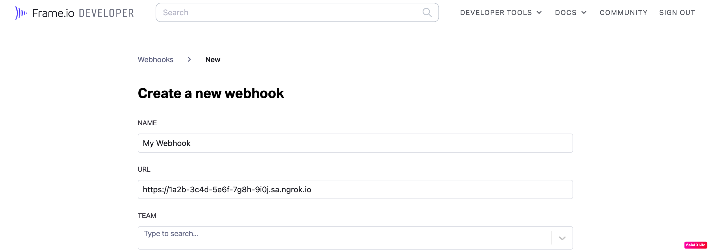

# Twitter Webhooks

---

:::tip TL;DR

To integrate Twitter webhooks with ngrok:

1. [Launch your local webhook.](#start-your-app) `npm start`
1. [Launch ngrok.](#start-ngrok) `ngrok http 3000`
1. [Configure Twitter webhooks with your ngrok URL.](#setup-webhook)
1. [Secure your webhook requests with verification.](#security)

:::

This guide covers how to use ngrok to integrate your localhost app with Twitter by using Webhooks.
Twitter webhooks can be used to notify an external application whenever specific events occur in your Twitter account.

By integrating ngrok with Twitter, you can:

- **Develop and test Twitter webhooks locally**, eliminating the time in deploying your development code to a public environment and setting it up in HTTPS.
- **Inspect and troubleshoot requests from Twitter** in real-time via the inspection UI and API.
- **Modify and Replay Twitter Webhook requests** with a single click and without spending time reproducing events manually in your Twitter account.
- **Secure your app with Twitter validation provided by ngrok**. Invalid requests are blocked by ngrok before reaching your app.

## **Step 1**: Start your app {#start-your-app}

For this tutorial, we'll use the [sample NodeJS app available on GitHub](https://github.com/ngrok/ngrok-webhook-nodejs-sample).

To install this sample, run the following commands in a terminal:

```bash
git clone https://github.com/ngrok/ngrok-webhook-nodejs-sample.git
cd ngrok-webhook-nodejs-sample
npm install
```

This will get the project installed locally.

Now you can launch the app by running the following command:

```bash
npm start
```

The app runs by default on port 3000.

You can validate that the app is up and running by visiting http://localhost:3000. The application logs request headers and body in the terminal and responds with a message in the browser.

## **Step 2**: Launch ngrok {#start-ngrok}

Once your app is running successfully on localhost, let's get it on the internet securely using ngrok!

1. If you're not an ngrok user yet, just [sign up for ngrok for free](https://ngrok.com/signup).

1. [Download the ngrok agent](https://ngrok.com/download).

1. Go to the [ngrok dashboard](https://dashboard.ngrok.com) and copy your Authtoken. <br />
   **Tip:** The ngrok agent uses the auth token to log into your account when you start a tunnel.
1. Start ngrok by running the following command:

   ```bash
   ngrok http 3000
   ```

1. ngrok will display a URL where your localhost application is exposed to the internet (copy this URL for use with Twitter).
   

## **Step 3**: Integrate Twitter {#setup-webhook}

To register a webhook on your Twitter account follow the instructions below:

1. Access the [Twitter Developer Portal](https://developer.twitter.com/), sign in using your Twitter account, and then click **Developer Portal**.<br/>
   **Tip**: In order to continue, you need to have an approved developer account in the Twitter developer portal.

1. On the **Dashboard** page, click **Create Project**, enter `ngrok` in the **Project name** field, and then click **Next**.

1. In the **Use case** tab, select your role as **Student** and then click **Next**.

1. Enter `ngrok webhook docs` in the **Project description** field and click **Next**.

1. On the **Choose an App environment** page, select **Development** as the **App environment**, enter a name for your app in the **App name** field and then click **Next**.

1. On the **Here are your keys & tokens** page, make note of the value of the **API Key**, **API Key Secret**, and **Bearer Token** fields.

1. On the left menu, click **Projects & Apps**, click **ngrok**, and then click your app.

1. On the app page, click the **Keys and tokens** tab, click **Generate** in the **Access Token and Secret** section, and then copy the value of the **Access Token** and **Access Token Secret** fields.

1. On the left menu, click **Products**, click **Premium**, and then click **Dev environments**.

1. On the **Dev environments** page, click **Set up dev environment** in the **Account Activity API** section, enter a name for environment and then select you app in the **App** combobox.

1. In a terminal window, run the following command to register the webhook:

   ```bash
   curl --request POST --url https://api.twitter.com/1.1/account_activity/webhooks.json?url=ENCODED_URL \
   --header 'authorization: OAuth oauth_consumer_key="CONSUMER_KEY", oauth_nonce="GENERATED", oauth_signature="GENERATED", oauth_signature_method="HMAC-SHA1", oauth_timestamp="GENERATED", oauth_token="ACCESS_TOKEN", oauth_version="1.0"'
   ```

   **Note**: Replace the following with values copied on previous steps:

   - APP_NAME: Your app name.
   - ENCODED_URL: the URL provided by the ngrok agent to expose your application to the internet encoded (i.e. `https%3A%2F%2F1a2b-3c4d-5e6f-7g8h-9i0j.sa.ngrok.io`).
   - CONSUMER_KEY: the app API Key.
   - ACCESS_TOKEN: The bearer token you copied before.

   

1. Copy the ID of the webhook you created.

1. In a terminal window, run the following command to subscribe a user to this webhook:
   ```bash
    curl --request POST --url https://api.twitter.com/1.1/account_activity/all/APP_NAME/subscriptions.json \
    --header 'authorization: OAuth oauth_consumer_key="CONSUMER_KEY", oauth_nonce="GENERATED", oauth_signature="GENERATED", oauth_signature_method="HMAC-SHA1", oauth_timestamp="GENERATED", oauth_token="SUBSCRIBING_USER_ACCESS_TOKEN", oauth_version="1.0"'
   ```
   **Note**: Replace the following with values copied on previous steps:
   - APP_NAME: Your app name.
   - CONSUMER_KEY: the app API Key.
   - SUBSCRIBING_USER_ACCESS_TOKEN: The access token from a Twitter user.

### Run Webhooks with Twitter and ngrok

Twitter sends different request body contents depending on the event that is being triggered.
You can trigger new calls from Twitter to your application by following the instructions below.

1. Acces [Twitter](https://www.twitter.com/), sign in and post a tweet.

   Confirm your localhost app receives a notification and logs both headers and body in the terminal.

### Inspecting requests

When you launch the ngrok agent on your local machine, you can see two links:

- The URL to your app (it ends with `ngrok-free.app` for free accounts or `ngrok.app` for paid accounts when not using custom domains)
- A local URL for the Web Interface (a.k.a **Request Inspector**).

The Request Inspector shows all the requests made through your ngrok tunnel to your localhost app. When you click on a request, you can see details of both the request and the response.

Seeing requests is an excellent way of validating the data sent to and retrieved by your app via the ngrok tunnel. That alone can save you some time dissecting and logging HTTP request and response headers, methods, bodies, and response codes within your app just to confirm you are getting what you expect.

To inspect Twitter's webhooks call, launch the ngrok web interface (i.e. `http://127.0.0.1:4040`), and then click one of the requests sent by Twitter.

From the results, review the response body, header, and other details:


### Replaying requests

The ngrok Request Inspector provides a replay function that you can use to test your code without the need to trigger new events from Twitter. To replay a request:

1. In the ngrok inspection interface (i.e. `http://localhost:4040`), select a request from Twitter.

1. Click **Replay** to execute the same request to your application or select **Replay with modifications** to modify the content of the original request before sending the request.

1. If you choose to **Replay with modifications**, you can modify any content from the original request. For example, you can modify the **id** field inside the body of the request.

1. Click **Replay**.

Verify that your local application receives the request and logs the corresponding information to the terminal.

## Secure webhook requests {#security}

The ngrok signature webhook verification feature allows ngrok to assert that requests from your Twitter webhook are the only traffic allowed to make calls to your localhost app.

**Note:** This ngrok feature is limited to 500 validations per month on free ngrok accounts. For unlimited, upgrade to Pro or Enterprise.

This is a quick step to add extra protection to your application.

1. During the webhook registration you provide a
1. On the top menu of the developer site, click **DEVELOPER TOOLS** and then click **Webhooks**.

1. On the **Webhooks** page, click **Copy** to copy the **Secret** value.

1. Restart your ngrok agent by running the command, replacing `{your webhook secret}` with the value you copied before:

   ```bash
   ngrok http 3000 --verify-webhook twitter --verify-webhook-secret {your webhook secret}
   ```

1. Access [Twitter](https://www.twitter.com/) and post a new tweet.

Verify that your local application receives the request and logs information to the terminal.
