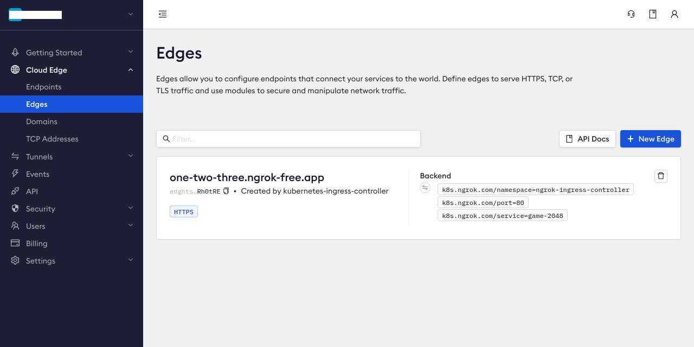
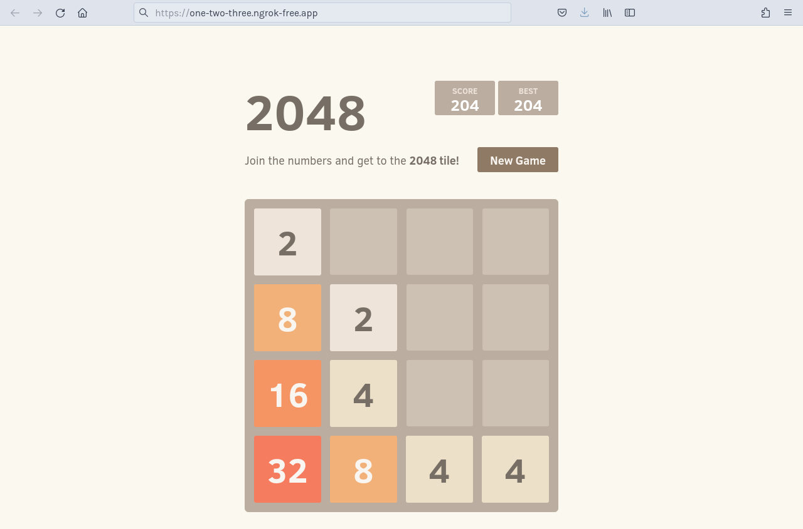
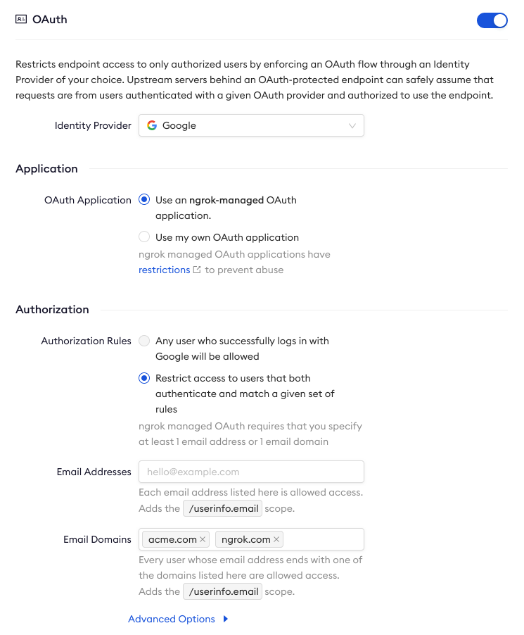

# Ingress to services in a vcluster on Kubernetes

:::tip TL;DR

To use the ngrok Ingress Controller for Kubernetes with vcluster in a local cluster:

1. [Set up a local virtual cluster](#set-up-a-consul-service-mesh-on-kubernetes)
2. [Install the ngrok Ingress Controller](#install-the-ngrok-ingress-controller)
3. [Install a sample application](#install-a-sample-application)
4. [Add OAuth protection to your demo app](#add-oauth-protection)

:::

The ngrok [Ingress Controller for Kubernetes](https://ngrok.com/blog-post/ngrok-k8s) is the official controller for
adding public and secure ingress traffic to your k8s services. This open source Ingress Controller works with any cloud,
locally-hosted, or on-premises Kubernetes cluster to provide ingress to your applications, APIs, or other services while
also offloading network ingress and middleware execution to ngrok's platform.

[vcluster](https://www.vcluster.com/) is an open source project for creating virtual clusters that run inside regular
namespaces, which provides strong isolation and easy access for multiple tenants with low cost and overhead. The pods
you deploy on a vcluster are scheduled inside of the underlying cluster, while other resources, like deployments and
CRDs, exist only inside the virtual cluster.

Together, the ngrok Ingress Controller and vcluster work to provide secure and load-balanced ingress for services
running on a virtual cluster, which lets you isolate development environments, create an internal developer platform
(IDP) in cloud native environments, and run experiments or simulations virtually while properly routing external
traffic.

With this guide, you'll use an existing Kubernetes cluster, or set up a local development cluster with minikube, to
launch a virtual cluster, and deploy a demo application. You'll then deploy the ngrok Ingress Controller to connect your
demo application to the ngrok platform to route traffic to your vcluster.

:::caution This tutorial requires:

1. An [ngrok account](https://ngrok.com/signup).
2. The [vcluster CLI](https://www.vcluster.com/docs/get-started/#deploy-vcluster) installed locally.
3. [kubectl](https://kubernetes.io/docs/tasks/tools/install-kubectl/) installed locally.
4. [Helm 3.0.0+](https://helm.sh/docs/intro/install/) installed locally.
5. An existing remote or local Kubernetes cluster _OR_ [minikube](https://minikube.sigs.k8s.io/docs/start/) to create a
   new demo cluster locally.

:::

## **Step 1**: Set up a local virtual cluster with vcluster {#set-up-a-consul-service-mesh-on-kubernetes}

To follow along with this guide, you need a remote or local Kubernetes cluster with vcluster installed. If you have an
existing cluster with vcluster set up, you can skip this step and proceed to [Step 2: Install the ngrok Ingress
Controller](#install-the-ngrok-ingress-controller).

If you don't have a cluster already, create one locally with minikube and install vcluster.

1. Create a local Kubernetes cluster with minikube.

   ```bash
   minikube start --profile dc1 --memory 4096
   ```

1. Use the `minikube` CLI to ensure your new local cluster is running properly.

   ```bash
   kubectl get namespaces

   NAME              STATUS   AGE
   default           Active   5m55s
   kube-node-lease   Active   5m55s
   kube-public       Active   5m55s
   kube-system       Active   5m55s
   ```

1. Create a new vcluster with the name `my-vcluster`, which creates a new namespace called `vcluster-my-cluster` and automatically switches the active kube context to use your new vcluster.

   ```bash
   vcluster create my-vcluster --expose-local
   ```

1. To ensure your new local cluster is running properly get the namespaces for your instance. Your list of namespaces in the `my-vcluster` context should look something like this.

   ```bash
   kubectl get namespaces

   NAME              STATUS   AGE
   default           Active   19s
   kube-system       Active   19s
   kube-public       Active   19s
   kube-node-lease   Active   19s
   ```

   If you are not connected to your new vcluster and its kube context, you can run `vcluster connect my-vcluster` to try
   again.

   You know have a vcluster installed on your local minikube cluster.

   :::note

   These steps are partially based the guide [Using the ngrok Ingress Controller to create Preview Environments with vcluster](https://loft.sh/blog/using-the-ngrok-ingress-controller-to-create-preview-environments-with-vcluster/) from [Loft](https://loft.sh/), the maintainers of vcluster.

   :::

## **Step 2**: Install the ngrok Ingress Controller {#install-the-ngrok-ingress-controller}

Now that you have a Kubernetes cluster integrated with vcluster, you can install the [ngrok Kubernetes Ingress
Controller](https://github.com/ngrok/kubernetes-ingress-controller) to provide ingress to any services you want to run
on your virtual cluster.

1. Add the ngrok Helm repository if you haven't already.

   ```bash
   helm repo add ngrok https://charts.ngrok.com
   ```

1. Set up the `AUTHTOKEN` and `API_KEY` exports, which allows Helm to install the Ingress Controller using your ngrok credentials. Find your `AUTHTOKEN` under [**Your Authtoken**](https://dashboard.ngrok.com/get-started/your-authtoken) in the ngrok dashboard.

   To create a new API key, navigate to the [**API** section](https://dashboard.ngrok.com/api) of the ngrok dashboard, click the **New API Key** button, change the description or owner, and click the **Add API Key** button. Copy the API key token shown in the modal window before closing it, as the ngrok dashboard will not show you the token again.

   ```bash
   export NGROK_AUTHTOKEN=[YOUR-AUTHTOKEN]
   export NGROK_API_KEY=[YOUR-API-KEY]
   ```

1. Install the ngrok Ingress Controller with Helm under a new `ngrok-ingress-controller` namespace.

   ```bash
   helm install ngrok-ingress-controller ngrok/kubernetes-ingress-controller \
     --namespace ngrok-ingress-controller \
     --create-namespace \
     --set credentials.apiKey=$NGROK_API_KEY \
     --set credentials.authtoken=$NGROK_AUTHTOKEN
   ```

1. Verify you have installed the ngrok Ingress Controller successfully and that pods are healthy.

   ```bash
   kubectl get pods -l 'app.kubernetes.io/name=kubernetes-ingress-controller' --namespace ngrok-ingress-controller

   NAME                                                              READY   STATUS    RESTARTS   AGE
   ngrok-ingress-controller-kubernetes-ingress-controller-man2fg5p   1/1     Running   0          2m23s
   ```

## **Step 3**: Install a sample application {#install-a-sample-application}

At this point, you have a functional vcluster with the ngrok Ingress Controller running and authenticated with your
ngrok credentials. To demonstrate how the Ingress Controller simplifies routing external traffic to your primary
cluster, virtual cluster, and ultimately an exposed service or endpoint, you can install a sample application.

1. Create a ngrok static subdomain for ingress if you don't have one already. Navigate to the [**Domains**
   section](https://dashboard.ngrok.com/cloud-edge/domains) of the ngrok dashboard and click **Create Domain** or **New
   Domain**. This static subdomain will be your `NGROK_DOMAIN` for the remainder of this guide.

   By creating a subdomain on the ngrok network, you provide a public route to accept HTTP, HTTPS, and TLS traffic.

1. Create a new Kubernetes manifest (`2048.yaml`) with the below contents. This manifest defines the 2048 application
   service and deployment, then configures the ngrok Ingress Controller to connect the `game-2048` service to the ngrok
   edge via your `NGROK_DOMAIN`.

   :::tip

   Make sure you edit line 45 of the manifest below, which contains the `NGROK_DOMAIN` variable, with the ngrok subdomain you created in the previous step. It should look something like `one-two-three.ngrok.app`.

   :::

   ```yaml showLineNumbers
   apiVersion: v1
   kind: Service
   metadata:
     name: game-2048
     namespace: ngrok-ingress-controller
   spec:
     ports:
       - name: http
         port: 80
         targetPort: 80
     selector:
       app: game-2048
   ---
   apiVersion: apps/v1
   kind: Deployment
   metadata:
     name: game-2048
     namespace: ngrok-ingress-controller
   spec:
     replicas: 1
     selector:
       matchLabels:
         app: game-2048
     template:
       metadata:
         labels:
           app: game-2048
       spec:
         containers:
           - name: backend
             image: alexwhen/docker-2048
             ports:
               - name: http
                 containerPort: 80
   ---
   # ngrok Ingress Controller Configuration
   apiVersion: networking.k8s.io/v1
   kind: Ingress
   metadata:
     name: game-2048-ingress
     namespace: ngrok-ingress-controller
   spec:
     ingressClassName: ngrok
     rules:
       # highlight-start
       - host: NGROK_DOMAIN
         # highlight-end
         http:
           paths:
             - path: /
               pathType: Prefix
               backend:
                 service:
                   name: game-2048
                   port:
                     number: 80
   ```

1. Apply the `2048.yaml` manifest to your vcluster.

   ```bash
   kubectl apply -f 2048.yaml
   ```

   :::tip

   **Note:** If you get an error when applying the manifest, double check that you've updated the `NGROK_DOMAIN` value
   and try again.

   :::

1. Confirm your vcluster successfully deployed your 2048 application by navigating to the [**Edges**
   section](https://dashboard.ngrok.com/cloud-edge/edges) in the ngrok dashboard.

   An edge connects your 2048 application, running in your vcluster, to the rest of the world through the ngrok Ingress
   Controller. You should see a new edge configuration created by `kubernetes-ingress-controller` that matches the domain
   name you entered on L45 of your `2048.yaml` manifest.

   Under the **Backend** section of your edge configuration, you can also see cluster details as annotations, like the
   namespace and connected service, to validate that your demo application is accessible to external traffic via the
   Ingress Controller.

   

   Click on your edge configuration to see additional details and options for advanced ingress needs, like creating
   multiple tunnels for load balancing, enabling the [Mutual TLS module](/http/mutual-tls/), adding
   compression, and more. We'll use one of these options, OAuth, in the next step.

1. Access your 2048 demo app by navigating to the your domain, e.g. `https://one-two-three.ngrok.app`. ngrok's edge
   and your Ingress Controller will route traffic to your app from any device or external network as long as your
   vcluster remains operational.

   

## **Step 4**: Add OAuth protection to your demo app {#add-oauth-protection}

Let's take your ingress needs a little further by assuming you want to add edge security, in the form of Google OAuth,
to the endpoint where your 2048 application is humming along.

By default, ngrok manages OAuth protection entirely at the cloud edge, which means you don't need to add any additional
services to your cluster, or alter routes, to ensure ngrok's edge authenticates and authorizes all requests before
allowing ingress and access to your endpoint.

1. Edit your existing `2048.yaml` manifest with the following configuration.

   :::tip

   - See L42-43 for the additional annotation that this OAuth setup requires.
   - See L58-69 for the newly added configuration for ngrok's OAuth module, replacing `acme.com` or `ngrok.com` with the domain name for your email address. You can also [configure the OAuth module](https://github.com/ngrok/kubernetes-ingress-controller/blob/main/docs/user-guide/route-modules.md#ngrok-managed-oauth-application) to authenticate individual email addresses.

   :::

   ```yaml showLineNumbers
   apiVersion: v1
   kind: Service
   metadata:
     name: game-2048
     namespace: ngrok-ingress-controller
   spec:
     ports:
       - name: http
         port: 80
         targetPort: 80
     selector:
       app: game-2048
   ---
   # Configuration for the 2048 application, service, and deployment
   apiVersion: apps/v1
   kind: Deployment
   metadata:
     name: game-2048
     namespace: ngrok-ingress-controller
   spec:
     replicas: 1
     selector:
       matchLabels:
         app: game-2048
     template:
       metadata:
         labels:
           app: game-2048
       spec:
         containers:
           - name: backend
             image: alexwhen/docker-2048
             ports:
               - name: http
                 containerPort: 80
   ---
   # Configuration for ngrok's Kubernetes Ingress Controller
   apiVersion: networking.k8s.io/v1
   kind: Ingress
   metadata:
     name: game-2048-ingress
     namespace: ngrok-ingress-controller
     # highlight-start
     annotations:
       k8s.ngrok.com/modules: oauth
     # highlight-end
   spec:
     ingressClassName: ngrok
     rules:
       - host: NGROK_DOMAIN
         http:
           paths:
             - path: /
               pathType: Prefix
               backend:
                 service:
                   name: game-2048
                   port:
                     number: 80
   ---
   # highlight-start
   # Configuration for ngrok's OAuth authentication module
   kind: NgrokModuleSet
   apiVersion: ingress.k8s.ngrok.com/v1alpha1
   metadata:
     name: oauth
     namespace: ngrok-ingress-controller
   modules:
     oauth:
       google:
         emailDomains:
           - acme.com
           - ngrok.com
   #highlight-end
   ```

1. Re-apply your `2048.yaml` configuration.

   ```bash
   kubectl apply -f 2048.yaml
   ```

1. Visit the [**Edges** section](https://dashboard.ngrok.com/cloud-edge/edges/) of the ngrok dashboard, click on the
   edge for your deployment, then click **OAuth** to confirm the module is using the configuration you added to your
   `2048.yaml` manifest.

   

1. Access your 2048 app at your domain (e.g. `https://one-two-three.ngrok.app`) to verify that it requests
   authentication via Google OAuth before allowing you to access the 2048 app.

## What's next?

You've now used the open source ngrok Ingress Controller for Kubernetes to add secure access to your endpoint without
worrying about IPs, network interfaces, or VPC routing. Because ngrok offloads ingress and middleware execution to its
global edge, you can follow the same procedure listed above for any Kubernetes environment, like EKS, GKE, and
OpenShift, with similar results.

If you want to clean up the work you did for this demo application, the easiest way (and the advantage of virtual
clusters in the first place) is to disconnect from your vcluster and then delete it with the `vcluster` CLI. That will remove the namespace and all its resources, returning your primary cluster to its initial state.

```bash
vcluster disconnect
vcluster delete my-vcluster
```

You can also extend your new vcluster and ngrok Ingress Controller with [additional
modules](https://github.com/ngrok/kubernetes-ingress-controller/blob/main/docs/user-guide/route-modules.md), a [fanout
configuration](https://github.com/ngrok/kubernetes-ingress-controller/blob/main/docs/user-guide/ingress-to-edge-relationship.md#simple-fanout)
to route traffic to multiple services from a single domain or IP address, or even [multiple Ingress
Controller](https://github.com/ngrok/kubernetes-ingress-controller/blob/main/docs/deployment-guide/multiple-installations.md)
installations running alongside one another.

Learn more about the ngrok Ingress Controller, or contribute, by checking out the [GitHub
repository](https://github.com/ngrok/kubernetes-ingress-controller) and the [project-specific
documentation](https://github.com/ngrok/kubernetes-ingress-controller/tree/main/docs).
