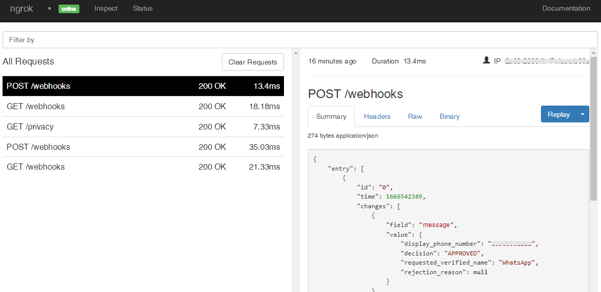

# WhatsApp Webhooks

:::tip TL;DR

To integrate WhatsApp webhooks with ngrok:

1. [Launch your local webhook.](#start-your-app) `npm run startFacebook`
1. [Launch ngrok.](#start-ngrok) `ngrok http 3000 --url myexample.ngrok.dev`
1. [Configure WhatsApp webhooks with your ngrok URL.](#setup-webhook)
1. [Secure your webhook requests with verification.](#security)

:::

This guide covers how to use ngrok to integrate your localhost app with WhatsApp by using Webhooks.
WhatsApp webhooks can be used to notify an external application whenever specific events occur in your WhatsApp account.

By integrating ngrok with WhatsApp, you can:

- **Develop and test WhatsApp webhooks locally**, eliminating the time in deploying your development code to a public environment and setting it up in HTTPS.
- **Inspect and troubleshoot requests from WhatsApp** in real-time via the inspection UI and API.
- **Modify and Replay WhatsApp Webhook requests** with a single click and without spending time reproducing events manually in your WhatsApp account.
- **Secure your app with WhatsApp validation provided by ngrok**. Invalid requests are blocked by ngrok before reaching your app.

## **Step 1**: Start your app {#start-your-app}

For this tutorial, we'll use the [sample NodeJS app available on GitHub](https://github.com/ngrok/ngrok-webhook-nodejs-sample).

To install this sample, run the following commands in a terminal:

```bash
git clone https://github.com/ngrok/ngrok-webhook-nodejs-sample.git
cd ngrok-webhook-nodejs-sample
npm install
```

This will get the project installed locally.

Now you can launch the app by running the following command:

```bash
npm run startFacebook
```

The app runs by default on port 3000.

You can validate that the app is up and running by visiting http://localhost:3000. The application logs request headers and body in the terminal and responds with a message in the browser.

## **Step 2**: Launch ngrok {#start-ngrok}

Once your app is running successfully on localhost, let's get it on the internet securely using ngrok!

**Note:** This integration requires an ngrok Pro or Enterprise license because Facebook validates your ngrok domain and certificate.

1. If you're not an ngrok user yet, just [sign up for ngrok for free](https://ngrok.com/signup).

1. [Download the ngrok agent](https://ngrok.com/download).

1. Go to the [ngrok dashboard](https://dashboard.ngrok.com), click **Your Authtoken**, and copy your Authtoken. <br />
   **Tip:** The ngrok agent uses the auth token to log into your account when you start a tunnel.

1. On the left menu, expand **Cloud Edge** and then click **Domains**.
   **Tip:** If you don't have an ngrok Pro or Enterprise license, sign up for one by clicking **Update Subscription** and follow the subscribe procedure.

1. On the **Domains** page, click **+ Create Domain** or **+ New Domain**.

1. In the **Domain** pane, provide a value for the **Domain** field (i.e. `myexample.ngrok.dev`), and then click **Continue**.
   
   **Tip**: Make sure your domain is available.

1. Close the **Start a Tunnel** pane and then close the **Domain** pane.

1. Start ngrok by running the following command in a terminal on your local desktop:

   ```bash
   ngrok http 3000 --url myexample.ngrok.dev
   ```

1. ngrok will display a URL where your localhost application is exposed to the internet (copy this URL for use with Facebook).
   

## **Step 3**: Integrate WhatsApp {#setup-webhook}

To register a webhook on your WhatsApp account follow the instructions below:

**Requirements**: You'll need a Facebook app and a business phone number associated with your Facebook app. Create one before following the rest of these steps.

Connect your Facebook page with your WhatsApp account by following the instructions below:

1. Access the [Meta for Developers](https://developers.facebook.com/) page, and Log in using your Facebook account.

1. On the Developers page, click **My Apps** and then click your app.
1. On the app dashboard, click **Add Product** on the left menu, and then click **Set up** inside the **WhatsApp** tile.

1. On the left menu, click **Configuration** under **WhatsApp** and then click **Edit**.

1. In the **Edit webhook's callback URL** popup, enter the URL provided by the ngrok agent to expose your application to the internet in the **Callback URL** field, with `/webhooks` at the end (i.e. `https://myexample.ngrok.dev/webhooks`).
   

1. Enter `12345` in the **Verify token** field and then click **Verify and save**.

1. After you add a webhook to WhatsApp, WhatsApp will submit a validation post request to your application through ngrok. Confirm your localhost app receives the validation get request and logs `WEBHOOK_VERIFIED` in the terminal.

1. Back to the **Configuration** page, click **Manage**.

1. On the **Webhook fields** popup, click **Subscribe** to the **messages** field.
   **Tip**: You can subscribe to multiple fields.

1. Click **Test** for the **messages** field and confirm your localhost app receives a post request.

1. On the **Webhook fields** popup, click **Done**.

1. Back to the **Configuration** page, make sure you have a production number associated with your app. If not, click **Manage phone numbers** and make note of the **Test Number** WhatsApp provides to you.

1. Back to the **Configuration** page, on the top of your app's page, make sure **App Mode** is **Live**.

### Run Webhooks with WhatsApp and ngrok

Use the phone number associated to your WhatsApp product or use the test number you copied before.

1. Add this number to your WhatsApp app contacts and then send a message to this number.

Confirm your localhost app receives a message and logs both headers and body in the terminal.

### Inspecting requests

When you launch the ngrok agent on your local machine, you can see two links:

- The URL to your app (it ends with `ngrok-free.app` for free accounts or `ngrok.app` for paid accounts when not using custom domains)
- A local URL for the Web Interface (a.k.a **Request Inspector**).

The Request Inspector shows all the requests made through your ngrok tunnel to your localhost app. When you click on a request, you can see details of both the request and the response.

Seeing requests is an excellent way of validating the data sent to and retrieved by your app via the ngrok tunnel. That alone can save you some time dissecting and logging HTTP request and response headers, methods, bodies, and response codes within your app just to confirm you are getting what you expect.

To inspect WhatsApp's webhooks call, launch the ngrok web interface (i.e. `http://127.0.0.1:4040`) and then click one of the requests sent by WhatsApp.

From the results, review the response body, header, and other details:



### Replaying requests

The ngrok Request Inspector provides a replay function that you can use to test your code without the need to trigger new events from WhatsApp. To replay a request:

1. In the ngrok inspection interface (i.e. `http://localhost:4040`), select a request from WhatsApp.

1. Click **Replay** to execute the same request to your application or select **Replay with modifications** to modify the content of the original request before sending the request.

1. If you choose to **Replay with modifications**, you can modify any content from the original request. For example, you can modify the **email** field inside the body of the request.

1. Click **Replay**.

Verify that your local application receives the request and logs the corresponding information to the terminal.

## Secure webhook requests {#security}

The ngrok signature webhook verification feature allows ngrok to assert that requests from your WhatsApp webhook are the only traffic allowed to make calls to your localhost app.

**Note:** This ngrok feature is limited to 500 validations per month on free ngrok accounts. For unlimited, upgrade to Pro or Enterprise.

This is a quick step to add extra protection to your application.

1. Access the [Meta for Developers](https://developers.facebook.com/) page, log in using your WhatsApp account, and then click **My Apps** in the top right corner.

1. On the Developers page, expand **Settings** on the left menu and then click **Basic**.

1. In the **Basic Settings** page, click **Show** to reveal the **App secret** value and copy this value.

1. Restart your ngrok agent by running the command, replacing `{your app secret}` with the value you have copied before:

   ```bash
   ngrok http 3000 --url myexample.ngrok.dev --verify-webhook FACEBOOK_GRAPH_API --verify-webhook-secret {your app secret}
   ```

1. Access the WhatsApp page you have assigned to your webhook and send a message to another WhatsApp user.

Verify that your local application receives the request and logs information to the terminal.
