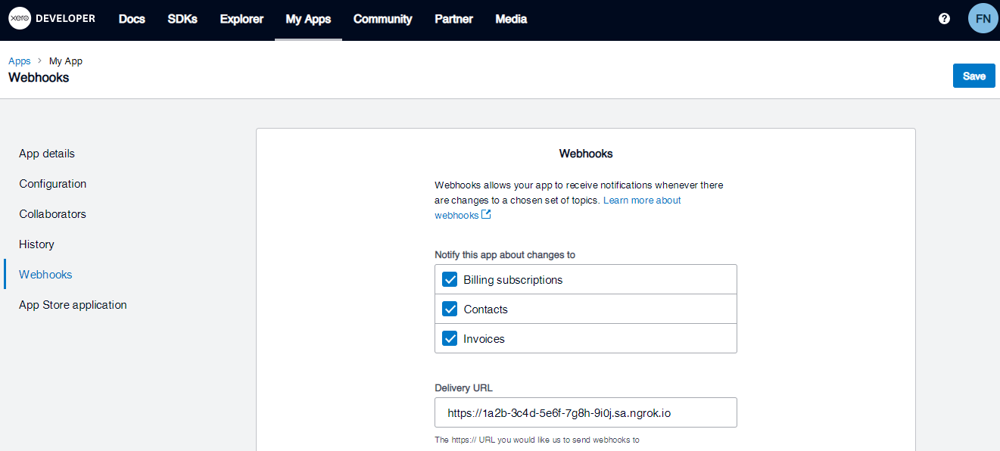
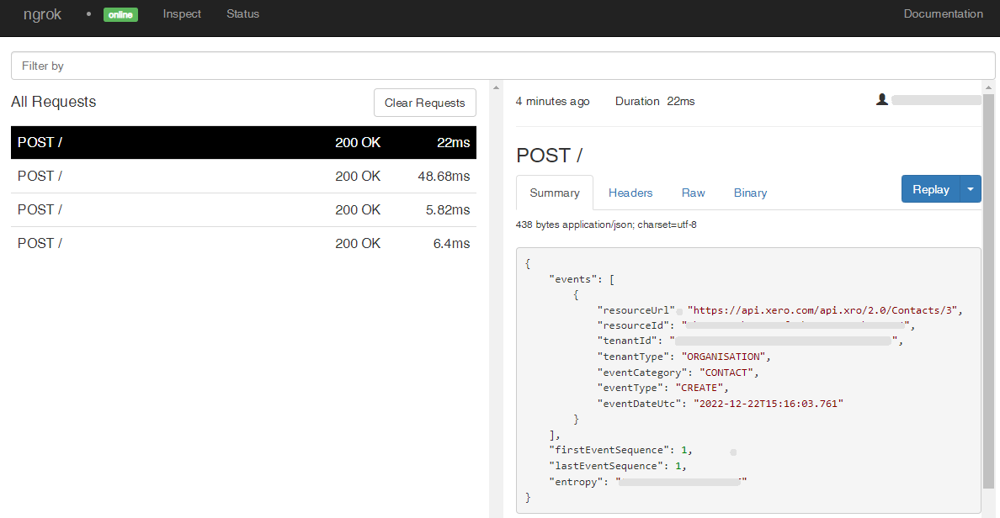

# Xero Webhooks

---

:::tip TL;DR

To integrate Xero webhooks with ngrok:

1. [Launch your local webhook.](#start-your-app) `npm start`
1. [Launch ngrok.](#start-ngrok) `ngrok http 3000`
1. [Configure Xero webhooks with your ngrok URL.](#setup-webhook)
1. [Secure your webhook requests with verification.](#security)

:::

This guide covers how to use ngrok to integrate your localhost app with Xero by using Webhooks.
Xero webhooks can be used to notify an external application whenever specific events occur in your Xero account.

By integrating ngrok with Xero, you can:

- **Develop and test Xero webhooks locally**, eliminating the time in deploying your development code to a public environment and setting it up in HTTPS.
- **Inspect and troubleshoot requests from Xero** in real-time via the inspection UI and API.
- **Modify and Replay Xero Webhook requests** with a single click and without spending time reproducing events manually in your Xero account.
- **Secure your app with Xero validation provided by ngrok**. Invalid requests are blocked by ngrok before reaching your app.

## **Step 1**: Start your app {#start-your-app}

For this tutorial, we'll use the [sample NodeJS app available on GitHub](https://github.com/ngrok/ngrok-webhook-nodejs-sample).

To install this sample, run the following commands in a terminal:

```bash
git clone https://github.com/ngrok/ngrok-webhook-nodejs-sample.git
cd ngrok-webhook-nodejs-sample
npm install
```

This will get the project installed locally.

Now you can launch the app by running the following command:

```bash
npm start
```

The app runs by default on port 3000.

You can validate that the app is up and running by visiting http://localhost:3000. The application logs request headers and body in the terminal and responds with a message in the browser.

## **Step 2**: Launch ngrok {#start-ngrok}

Once your app is running successfully on localhost, let's get it on the internet securely using ngrok!

1. If you're not an ngrok user yet, just [sign up for ngrok for free](https://ngrok.com/signup).

1. [Download the ngrok agent](https://ngrok.com/download).

1. Go to the [ngrok dashboard](https://dashboard.ngrok.com) and copy your Authtoken. <br />
   **Tip:** The ngrok agent uses the auth token to log into your account when you start a tunnel.
1. Start ngrok by running the following command:

   ```bash
   ngrok http 3000
   ```

1. ngrok will display a URL where your localhost application is exposed to the internet (copy this URL for use with Xero).
   

## **Step 3**: Integrate Xero {#setup-webhook}

To register a webhook on your Xero account follow the instructions below:

1. Access the [Xero Developer](https://developer.xero.com/app/manage/) site and sign in using your Xero account.

1. Click one of the apps listed on the **Apps** page. If you don't have an app, create one by clicking **New app**.

1. On the app page, click **Webhooks** on the left menu.

1. On the **Webhooks** page, click the checkbox for **Billing subscriptions**, **Contacts** and **Invoices**, and then enter the URL provided by the ngrok agent to expose your application to the internet in the **Delivery URL** field (i.e. `https://1a2b-3c4d-5e6f-7g8h-9i0j.sa.ngrok.io`).
   

1. Click **Send 'Intent to Receive'**.

   Confirm your localhost app receives notification and logs both headers and body in the terminal.

1. Click **Save**.

1. Access the [Xero dashboard](https://go.xero.com/) site, sign in using your Xero account, and then select your organization in the drop-down menu.

1. Click your organization **Dashboard** page, click **Settings**, click **Connected Apps**, and then confirm your app appears in the list of **Connected apps**.

If your app isn't connected to your organization execute the following steps:

1. In a new browser tab, open the following URL:

   ```
   https://login.xero.com/identity/connect/authorize?response_type=code&client_id=APP_CLIENT_ID&redirect_uri=APP_REDIRECT_URI&scope=offline_access accounting.transactions openid profile email accounting.contacts accounting.settings&state=123
   ```

   **Note**: Replace the following with values copied from the **Configuration** page of your app on the [Xero Developer](https://developer.xero.com/app/manage/) site:

   - APP_CLIENT_ID: Your app **Client id**.
   - APP_REDIRECT_URI: Your app **Redirect URIs**.

1. On the **User Consent** page, select your organization and then click **Allow access**.

### Run Webhooks with Xero and ngrok

Xero sends different request body contents depending on the event that is being triggered.
You can trigger new calls from Xero to your application by following the instructions below.

1. Access the [Xero dashboard](https://go.xero.com/) site, sign in using your Xero account, and then select your organization in the drop down menu.

1. On the organization **Dashboard** page, click **Contacts** at the top menu and then click **New Contact**.

1. On the **Add Contact** page, fill up the **Contact name**, **Account number**, **First Name**, and **Last Name** fields, and then click **Save & Close**.

   Confirm your localhost app receives an event notification and logs both headers and body in the terminal.

### Inspecting requests

When you launch the ngrok agent on your local machine, you can see two links:

- The URL to your app (it ends with `ngrok-free.app` for free accounts or `ngrok.app` for paid accounts when not using custom domains)
- A local URL for the Web Interface (a.k.a **Request Inspector**).

The Request Inspector shows all the requests made through your ngrok tunnel to your localhost app. When you click on a request, you can see details of both the request and the response.

Seeing requests is an excellent way of validating the data sent to and retrieved by your app via the ngrok tunnel. That alone can save you some time dissecting and logging HTTP request and response headers, methods, bodies, and response codes within your app just to confirm you are getting what you expect.

To inspect Xero's webhooks call, launch the ngrok web interface (i.e. `http://127.0.0.1:4040`), and then click one of the requests sent by Xero.

From the results, review the response body, header, and other details:



### Replaying requests

The ngrok Request Inspector provides a replay function that you can use to test your code without the need to trigger new events from Xero. To replay a request:

1. In the ngrok inspection interface (i.e. `http://localhost:4040`), select a request from Xero.

1. Click **Replay** to execute the same request to your application or select **Replay with modifications** to modify the content of the original request before sending the request.

1. If you choose to **Replay with modifications**, you can modify any content from the original request. For example, you can modify the **eventType** field inside the body of the request.

1. Click **Replay**.

Verify that your local application receives the request and logs the corresponding information to the terminal.

## Secure webhook requests {#security}

The ngrok signature webhook verification feature allows ngrok to assert that requests from your Xero webhook are the only traffic allowed to make calls to your localhost app.

**Note:** This ngrok feature is limited to 500 validations per month on free ngrok accounts. For unlimited, upgrade to Pro or Enterprise.

This is a quick step to add extra protection to your application.

1. Access [Xero Developer](https://developer.xero.com/myapps/webhooks/) page and sign in using your Xero account.

1. Click your app tile and then click **Webhooks** on the left menu.

1. Copy the value of the **Webhooks key**.

1. Restart your ngrok agent by running the command, replacing `{your webhook key}` with the value you have copied before:

   ```bash
   ngrok http 3000 --verify-webhook xero --verify-webhook-secret {your webhook key}
   ```

1. Access the [Xero dashboard](https://go.xero.com/) and create a new contact.

Verify that your local application receives the request and logs information to the terminal.
