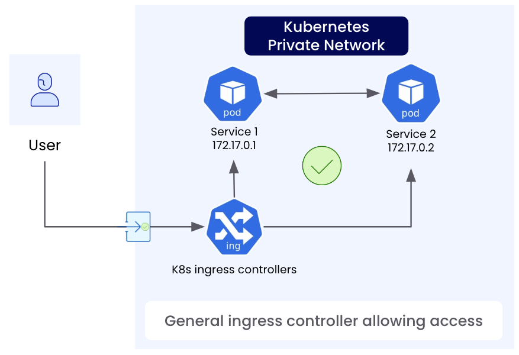

# How the ngrok Kubernetes Operator Works

A Kubernetes cluster has its own private network internally that pods get IP addresses from. This network is not accessible to the outside world, similar to how your home network is usually not accessible by anyone on the internet.

By default, Kubernetes offers similar types of approaches to exposing traffic as you'd expect at home:

- You can port forward: In Kubernetes, this is a temporary solution using `kubectl`. At home, you can configure your router. Both may be disrupted if your public IP address changes.
- You can use an external load balancer of some sort that still needs access to the internal network somehow.

In this case below, the user cannot access the pod directly in the k8s private network without some sort of entry point.

In Kubernetes, operators implement the specs (Ingress or Gateway API) that provides a standard way of getting traffic into the cluster and routing it to your service. This follows the declarative nature of Kubernetes since the developer describes what they need and the cluster figures out how to provide it.

With ngrok, the operator establishes a secure outbound connection to the ngrok service which creates a public endpoint for your Kubernetes service. When someone hits the public endpoint, that traffic is sent down to the ngrok Operator and is forwarded to the services in the cluster.

Once installed, an operations team can manage the shared ngrok operator while other developers or teams can self-service endpoints to their services by defining the appropriate Kubernetes objects.

