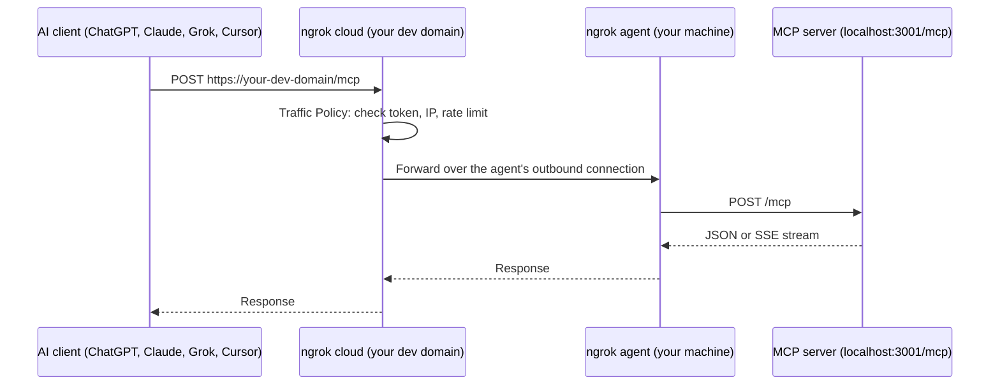

AI apps like ChatGPT, Claude.ai, and Grok call MCP servers from their own cloud.
They can't reach a server running on `localhost` on your laptop, VM, or container.

This guide shows you how to give a local MCP server a public HTTPS URL with ngrok, lock it down so only your AI client can call it, and connect it to each major MCP client.
The URL is stable on every ngrok plan, including free, so you configure each client once.

## Example scenario

You're building an MCP server that wraps your team's internal ticketing API.
It runs on your laptop on port `3001` and serves MCP at `/mcp`.
Before you deploy it anywhere, you want to try it from ChatGPT, Claude, Grok, and Cursor, and you don't want anyone else on the internet calling its tools.

You need three things:

1. A public HTTPS URL that forwards to `localhost:3001`.
2. Authentication in front of that URL, so only your AI client gets through.
3. A way to see exactly what each client sends when something doesn't work.

## Architectural reference



The ngrok agent opens an outbound connection from your machine to ngrok's cloud.
You don't open any inbound ports, change your firewall, or deploy anything.
Traffic Policy runs in ngrok's cloud, so requests that fail your rules never reach your machine.

### Which MCP transports work?

| Transport | How the client connects | Works with remote AI apps through ngrok? |
|---|---|---|
| **stdio** | The client starts the server as a local process | No. Remote clients can't start a process on your machine. Run the server in HTTP mode or wrap it with a stdio-to-HTTP bridge. |
| **HTTP + SSE** (older) | The client holds a long-lived Server-Sent Events stream | Yes |
| **Streamable HTTP** (current) | The client POSTs JSON-RPC to one URL; the server replies with JSON or an SSE stream | Yes (recommended) |

## Tutorial

### What you'll need

- An ngrok account. If you don't have one, [sign up](https://dashboard.ngrok.com/signup).
- The [ngrok agent](https://ngrok.com/download) installed on the machine that runs your MCP server.
- An MCP server that serves Streamable HTTP or HTTP + SSE. This guide uses port `3001` and the path `/mcp`.

### 1. Check that your MCP server responds

Send an MCP `initialize` request to your server:

```bash
curl -s -X POST http://localhost:3001/mcp \
  -H 'Content-Type: application/json' \
  -H 'Accept: application/json, text/event-stream' \
  -d '{"jsonrpc":"2.0","id":1,"method":"initialize","params":{"protocolVersion":"2025-06-18","capabilities":{},"clientInfo":{"name":"curl","version":"0"}}}'
```

A JSON-RPC response means the server is up.
Many MCP servers return `404` or `405` for a plain `GET /`, so don't test in a browser.

### 2. Create a Traffic Policy that requires a token

Anyone with your URL can call your server, and MCP tools can act on your machine.
Protect it before it goes online.

Generate a long random token:

```bash
openssl rand -hex 32
```

Save this as `policy.yml`, replacing `YOUR_TOKEN` with the value you generated:

```yaml
on_http_request:
  - expressions:
      - "!hasReqHeader('Authorization') || getReqHeader('Authorization')[0] != 'Bearer YOUR_TOKEN'"
    actions:
      - type: deny
        config:
          status_code: 401
  - actions:
      - type: rate-limit
        config:
          name: mcp
          algorithm: sliding_window
          capacity: 60
          rate: 60s
          bucket_key:
            - conn.client_ip
```

The first rule rejects any request without the right bearer token.
The second limits each client IP to 60 requests per minute.

If your AI client can't send a custom header, see [Secure clients that only take a URL](#secure-clients-that-only-take-a-url).

### 3. Put your MCP server online

```bash
ngrok config add-authtoken <YOUR_AUTHTOKEN>
ngrok http 3001 --traffic-policy-file policy.yml
```

ngrok prints your public URL, such as `https://your-assigned-name.ngrok-free.app`.
This is your account's [dev domain](/pricing-limits/free-plan-limits/).
It stays the same every time you restart `ngrok http`, so your client configs keep working.

Your MCP URL is the public URL plus your server's path:

```text
https://your-assigned-name.ngrok-free.app/mcp
```

Confirm the policy works from another terminal:

```bash
# Without the token: 401
curl -s -o /dev/null -w '%{http_code}\n' -X POST https://your-assigned-name.ngrok-free.app/mcp

# With the token: your server's response
curl -s -X POST https://your-assigned-name.ngrok-free.app/mcp \
  -H 'Authorization: Bearer YOUR_TOKEN' \
  -H 'Content-Type: application/json' \
  -H 'Accept: application/json, text/event-stream' \
  -d '{"jsonrpc":"2.0","id":1,"method":"initialize","params":{"protocolVersion":"2025-06-18","capabilities":{},"clientInfo":{"name":"curl","version":"0"}}}'
```

### 4. Connect your AI client

<Tabs>
  <Tab title="Claude Code">
    ```bash
    claude mcp add --transport http tickets https://your-assigned-name.ngrok-free.app/mcp \
      --header "Authorization: Bearer YOUR_TOKEN"
    ```
  </Tab>
  <Tab title="Cursor">
    Add the server to `~/.cursor/mcp.json` for all projects, or `.cursor/mcp.json` for one project:

    ```json
    {
      "mcpServers": {
        "tickets": {
          "url": "https://your-assigned-name.ngrok-free.app/mcp",
          "headers": { "Authorization": "Bearer YOUR_TOKEN" }
        }
      }
    }
    ```
  </Tab>
  <Tab title="ChatGPT">
    Turn on [developer mode](https://help.openai.com/en/articles/12584461), then create a connector with your MCP URL.
    If the connector settings don't let you add a header, use a [secret path](#secure-clients-that-only-take-a-url) or OAuth instead.
  </Tab>
  <Tab title="Claude.ai">
    Add a custom connector in **Settings** > **Connectors** and paste your MCP URL.
    If the connector settings don't let you add a header, use a [secret path](#secure-clients-that-only-take-a-url) or OAuth instead.
  </Tab>
  <Tab title="Grok">
    Go to [grok.com/connectors](https://grok.com/connectors), click **New Connector**, choose **Custom**, and paste your MCP URL.
    On Grok Business and Enterprise, an admin provisions the connector first.
    If the connector settings don't let you add a header, use a [secret path](#secure-clients-that-only-take-a-url) or OAuth instead.
  </Tab>
</Tabs>

Then ask your client:

<Prompt description="Ask your AI client which tools it can see. The request appears in the ngrok inspector at localhost:4040." actions={["copy", "cursor"]}>
What tools do you have available from the tickets MCP server?
</Prompt>

### 5. Watch the traffic

Open `http://localhost:4040` while your client connects.
The ngrok inspector shows every request your client sends and every response your server returns, including JSON-RPC bodies.
When a client says it can't list tools, start here: you see whether the request arrived, what it contained, and what your server sent back.

## Secure clients that only take a URL

Some connector settings only accept a URL.
Use one of these instead of a bearer token.

### Use a secret path

Put a long random secret in the path, reject requests without it, and strip it before the request reaches your server:

```yaml
on_http_request:
  - expressions:
      - "!req.url.path.startsWith('/s/YOUR_SECRET/')"
    actions:
      - type: deny
        config:
          status_code: 404
  - actions:
      - type: url-rewrite
        config:
          from: "^https://${req.url.authority}/s/YOUR_SECRET/"
          to: "https://${req.url.authority}/"
```

Give the client `https://your-assigned-name.ngrok-free.app/s/YOUR_SECRET/mcp`.
Your server still sees `/mcp`.

<Warning>
A secret path is a shared secret, not an identity.
Rotate it if it leaks, and don't use it for servers that touch production data.
</Warning>

### Allow only the AI provider's network

ngrok maintains [IP categories](/gateway/traffic-policy/variables/ip-intel/) for major services, including Anthropic and OpenAI.
This rule admits only Anthropic's API servers:

```yaml
on_http_request:
  - expressions:
      - "!('com.anthropic.api' in conn.client_ip.categories)"
    actions:
      - type: deny
        config:
          status_code: 403
```

Combine it with a token or secret path.
IP rules alone don't tell you which user is calling.

### Use OAuth for real users and real data

Implement OAuth in your MCP server according to the [MCP authorization spec](https://modelcontextprotocol.io/specification/draft/basic/authorization).
Clients that support it run the sign-in flow when your server asks for it.
ngrok forwards the OAuth discovery and token requests like any other request.
If your identity provider issues JWTs, the [JWT validation](/gateway/traffic-policy/actions/jwt-validation/) action can reject bad tokens at the edge, before they reach your machine.

## Security checklist

Before you connect an MCP server to an AI app, check that you:

- Require a token, secret path, or OAuth on every request.
- Rate limit requests with the [rate-limit](/gateway/traffic-policy/actions/rate-limit/) action.
- Expose only the tools the client needs. An AI app can call any tool your server lists.
- Keep secrets like API keys in your server's environment, never in tool responses.
- Stop the `ngrok` process when you're done testing. The URL goes offline with it.
- Move to an [internal endpoint behind a Cloud Endpoint](#keep-the-server-private) before other people rely on it.

## Why not a Cloudflare quick tunnel?

Quick tunnels (`cloudflared tunnel --url`) don't need an account.
But [Cloudflare's docs](https://developers.cloudflare.com/cloudflare-one/networks/connectors/cloudflare-tunnel/do-more-with-tunnels/trycloudflare/) say quick tunnels don't support Server-Sent Events (SSE), are limited to 200 in-flight requests, and are for testing only.
MCP's Streamable HTTP transport uses SSE when a server streams a response, sends progress, or pushes notifications, so those servers break behind a quick tunnel.
The quick-tunnel URL also changes every run, and it has no authentication in front of it.

For a broader comparison, see [ngrok vs. Cloudflare Tunnel](https://ngrok.com/compare/cloudflare-tunnel).

## Keep the server private

If other people or production systems will rely on the server, don't leave it on a public agent endpoint.
Run it behind an [internal endpoint](/gateway/endpoints/internal-endpoints/) and put an always-on [Cloud Endpoint](/gateway/endpoints/cloud-endpoints/) in front of it.
The Cloud Endpoint holds your Traffic Policy and forwards to the internal endpoint with [forward-internal](/gateway/traffic-policy/actions/forward-internal/).
The same pattern reaches an MCP server in a VPC or a customer's network.

In the agent configuration file on the machine that runs your MCP server:

```yaml
version: 3
agent:
  authtoken: <YOUR_AUTHTOKEN>
endpoints:
  - name: tickets-mcp
    url: https://tickets-mcp.internal
    upstream:
      url: 3001
```

Create a Cloud Endpoint such as `https://mcp.example.com` in the [dashboard](https://dashboard.ngrok.com/endpoints) and attach this Traffic Policy:

```yaml
on_http_request:
  - expressions:
      - "!hasReqHeader('Authorization') || getReqHeader('Authorization')[0] != 'Bearer YOUR_TOKEN'"
    actions:
      - type: deny
        config:
          status_code: 401
  - actions:
      - type: forward-internal
        config:
          url: https://tickets-mcp.internal
```

For a full walkthrough of this pattern, see [Using ngrok as your MCP gateway](/using-ngrok-with/using-mcp/).

## Troubleshooting

| Symptom | Likely cause | Fix |
|---|---|---|
| The client can't connect, and nothing appears at `localhost:4040` | ngrok isn't running, or the URL or path is wrong | Check that the URL ends with your server's path, such as `/mcp`. |
| Every request returns `401` | The client isn't sending the header, or the token doesn't match | Check the header in the inspector at `localhost:4040`. The value must be `Bearer ` followed by the token. |
| The request appears at `localhost:4040` with `ERR_NGROK_8012` | ngrok reached your machine but not your server | Your server stopped, is on a different port, or is bound to `127.0.0.1` inside a container. |
| `GET /` returns `404` or `405` | This is normal for MCP servers | Test with the `initialize` request in step 1. |
| The tools list is empty | The server only speaks stdio | Run the server in HTTP mode or behind a stdio-to-HTTP bridge. |
| Streamed responses or progress updates never arrive | The tunnel doesn't support SSE, such as a Cloudflare quick tunnel | Use an ngrok agent endpoint. |
| The URL changed after a restart | You're using a random-URL tunnel or an old ngrok agent | ngrok dev domains are stable. Run `ngrok update`. |

## Frequently asked questions

<AccordionGroup>
  <Accordion title="How do I expose a local MCP server so ChatGPT or Cursor can reach it?">
    Run your MCP server over HTTP, then run `ngrok http` with its port and a Traffic Policy that requires a token.
    Give the client your ngrok URL plus the server's path, such as `https://your-assigned-name.ngrok-free.app/mcp`.
  </Accordion>
  <Accordion title="Does the ngrok URL change when I restart?">
    No.
    Every ngrok account, including free, gets a dev domain that `ngrok http` reuses on every run.
  </Accordion>
  <Accordion title="Can I expose a stdio MCP server?">
    Not directly.
    Remote AI apps can't start a process on your machine.
    Run the server in HTTP mode, or wrap it with a stdio-to-HTTP bridge and point ngrok at the bridge's port.
  </Accordion>
  <Accordion title="Is it safe to expose an MCP server to the internet?">
    Only with authentication in front of it.
    Require a bearer token, secret path, or OAuth, and rate limit requests.
    ngrok applies these rules in its cloud, so rejected requests never reach your machine.
  </Accordion>
  <Accordion title="Do I need a paid ngrok plan?">
    Not to start.
    The free plan includes the dev domain this guide uses.
    Traffic Policy actions are metered as Traffic Policy Units, so check [pricing](https://ngrok.com/pricing) for what your plan includes, and [free plan limits](/pricing-limits/free-plan-limits/) for request limits.
  </Accordion>
  <Accordion title="Can I reach an MCP server in a VPC or a customer's network?">
    Yes.
    Run the ngrok agent next to the server with an internal endpoint, and put a Cloud Endpoint with your Traffic Policy in front of it.
    See [Keep the server private](#keep-the-server-private).
  </Accordion>
</AccordionGroup>

## What's next

- Learn the [Traffic Policy](/gateway/traffic-policy/) rules you can put in front of your server.
- Reach MCP servers in other networks with [site-to-site connectivity](/gateway/site-to-site-connectivity/).
- Route and observe the model calls your agent makes with the [AI Gateway](/ai-gateway/overview/).
