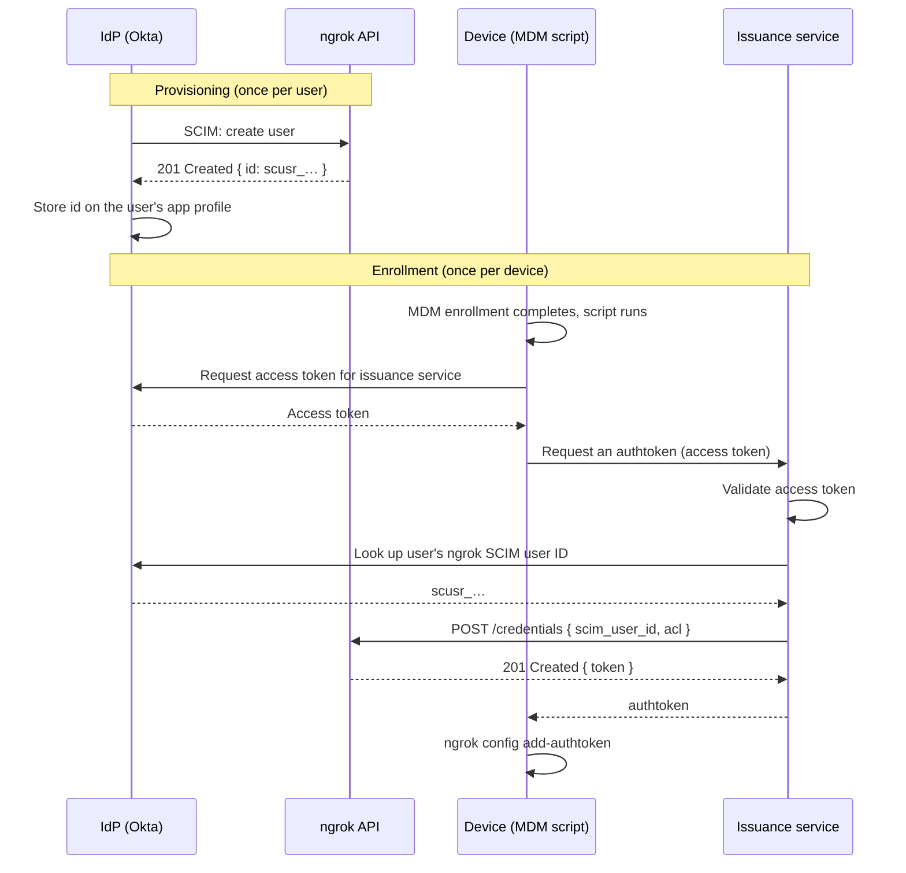

This guide shows you how to give every developer's managed device its own scoped ngrok authtoken without anyone copying a token by hand.
It connects three systems you likely already run: System for Cross-domain Identity Management (SCIM) provisioning, your identity provider (IdP), and your mobile device management (MDM) platform.
When a laptop finishes enrollment, it's already configured to run the ngrok agent as the right user with the right restrictions.

The examples use Okta as the IdP and Jamf as the MDM.
The pattern works with any IdP that supports SCIM and OpenID Connect (OIDC), and any MDM that can run a script after enrollment.

## How it works

Every ngrok credential has an owner.
When your IdP provisions a user into ngrok with SCIM, ngrok returns a SCIM user ID (`scusr_…`) for that person.
You can pass that ID to the [Create Credential API](/api-reference/credentials/create) to issue an authtoken owned by that user.
When the IdP later deactivates or removes the user, ngrok revokes their credentials, so tokens issued this way follow the user's lifecycle automatically.

The flow has two phases.
Provisioning happens once per user, when your IdP pushes them to ngrok.
Enrollment happens once per device, when your MDM sets up the machine.



1. Your IdP provisions the user into ngrok with SCIM and stores the returned SCIM user ID on the user's profile.
2. The device enrolls in your MDM, which runs a post-enrollment script.
3. The script authenticates to your IdP and calls a small issuance service that you host.
4. The issuance service validates the caller, looks up their ngrok SCIM user ID, and calls the ngrok API to create an authtoken owned by that user with an [ACL](/gateway/site-to-site-connectivity/authtoken-acls) attached.
5. The script writes the authtoken into the agent's configuration file.

The issuance service is the only component that holds your ngrok API key.
Devices never see it.

## What you'll need

- An ngrok account with [single sign-on (SSO)](/iam/sso) and [SCIM provisioning](/iam/sso#scim) enabled.
- SSO and SCIM configured for your IdP, for example with the [Okta SCIM guide](/integrations/dashboard-sso/okta-dashboard-sso-scim).
- Admin access to your IdP to edit attribute mappings and register an application.
- An MDM that can run a script after enrollment, such as [Jamf](https://www.jamf.com/).
- Somewhere to host a small HTTPS service that can keep a secret, such as a serverless function or an internal web service.

## 1. Create an API key for the issuance service

The issuance service calls the ngrok API on behalf of your users, so it needs an API key that can create credentials for other people.

- In the ngrok dashboard, go to **API Keys** and create a new key.
- Set the owner to a [Service User](/iam/service-users) rather than a person.
Service User keys keep working after the person who set up the integration leaves your account.
- Store the key in the secret manager your issuance service reads from.

<Warning>
Never package this API key into an MDM profile, configuration script, or machine image.
Anyone with the key can mint authtokens for any user in your account.
</Warning>

## 2. Store the ngrok SCIM user ID in your IdP

ngrok returns an `id` in every SCIM user response.
Map that value onto the user's profile in your IdP so the issuance service can look it up later.

In Okta, open the ngrok application and configure the following.

- On the **Provisioning** tab, enable importing users and profile updates from ngrok so Okta reads attributes back from the SCIM response.
- In **Profile Editor**, add an attribute to the ngrok app user profile with these values:
  - Data type: `string`
  - Display name: `ngrok SCIM User ID`
  - Variable name: `ngrokScimUserId`
  - External name: `id`
  - External namespace: `urn:ietf:params:scim:schemas:core:2.0:User`
  - Attribute type: `Personal`
  - Attribute required: leave unchecked
- Map the attribute so the SCIM `id` flows into `ngrokScimUserId` for the app user.
If you want it available outside the app profile, add a matching attribute on the Okta user profile and map it there too.

Run an import and open a provisioned user.
The attribute should contain a value that starts with `scusr_`.

<Note>
Only users provisioned through SCIM have a SCIM user ID.
Users who were invited by email or provisioned just-in-time don't, and this flow can't issue tokens for them.
</Note>

## 3. Register the issuance service with your IdP

Devices need a way to prove who they are when they ask the issuance service for a token.
Register the service as an OIDC application so your IdP can issue access tokens for it.

In Okta:

- Create a new **OIDC** application for the issuance service and define a custom scope for it, for example `ngrok.provision`.
- Under the application's **General** settings, find **User Consent** and clear **Require consent** so users aren't prompted to approve the app during enrollment.
- Assign the application to the same users or groups that are assigned the ngrok application.

How the device obtains an access token depends on how your MDM signs users in.
If enrollment signs the user in with OIDC, the device already has an IdP session it can use to request a token for the issuance service.
If enrollment uses SAML, you need an additional step to exchange the SAML assertion for an OIDC token before calling the service.

## 4. Build the issuance service

The issuance service is a small HTTPS endpoint with one job: turn a valid IdP access token into an ngrok authtoken for the caller.
Any language or runtime works.
It needs to:

- Validate the access token's signature, issuer, audience, and scope.
- Look up the caller's `ngrokScimUserId` using the IdP's API, or read it from a claim if you add one to the token.
- Call the ngrok API to create a credential owned by that SCIM user.
- Return the new authtoken to the device and never log it.

This is the ngrok API call the service makes:

```bash
curl -X POST https://api.ngrok.com/credentials \
  -H "Authorization: Bearer $NGROK_API_KEY" \
  -H "Content-Type: application/json" \
  -H "Ngrok-Version: 2" \
  -d '{
    "scim_user_id": "scusr_2zkdJ79rgX3ukGKnAusGjCGXC5p",
    "description": "alice@example.com laptop",
    "acl": ["bind:alice.internal"]
  }'
```

The response includes the authtoken in the `token` field.
ngrok only returns it once, so the service must pass it straight back to the device.

Pass exactly one of `scim_user_id`, `owner_id`, or `owner_email`.
Sending more than one returns [ERR_NGROK_631](/errors/err_ngrok_631).

### Restrict what the token can do

Use the `acl` field to limit each authtoken to the endpoints its owner should be able to start.
A common pattern gives each developer a single [internal endpoint](/gateway/endpoints/internal-endpoints) named after them, such as `bind:alice.internal`, and routes to it from a centrally managed Cloud Endpoint using the [front door pattern](/gateway/examples/front-door-pattern).
Developers can only bind their own hostname, and security or platform teams control everything that's publicly reachable.

Derive the ACL from an attribute you trust, such as the email address in the validated access token, rather than from anything the device sends.

<Note>
Accounts have a default limit on the number of authtokens they can hold.
If you're rolling this out to a large fleet, [contact support](mailto:support@ngrok.com) ahead of time to raise it.
</Note>

## 5. Add a script that runs after enrollment

Your MDM should install the ngrok agent and then run a script that fetches the authtoken and writes it to the agent's configuration file.
The following example runs on macOS after Jamf enrollment.

```bash
#!/usr/bin/env bash
set -euo pipefail

ISSUER_URL="https://ngrok-issuer.example.com/authtoken"

# 1. Get an access token for the issuance service from your IdP.
#    How you do this depends on how your MDM signs users in. See step 3.
ACCESS_TOKEN="$(get_idp_access_token --scope ngrok.provision)"

# 2. Ask the issuance service for an authtoken.
AUTHTOKEN="$(curl -fsS -X POST "$ISSUER_URL" \
  -H "Authorization: Bearer $ACCESS_TOKEN" | jq -r '.token')"

# 3. Write it to the agent's configuration file for the logged-in user.
CONSOLE_USER="$(stat -f '%Su' /dev/console)"
sudo -u "$CONSOLE_USER" ngrok config add-authtoken "$AUTHTOKEN"
```

`ngrok config add-authtoken` writes to the [default configuration file location](/gateway/agent/config#default-locations) for the user it runs as.
Run it as the person who will use the laptop, not as root, so the agent finds the token when they start it.

If you want endpoints to come up on boot without the developer doing anything, define them in the configuration file and [install ngrok as a background service](/gateway/site-to-site-connectivity/background-service).

## 6. Test the flow

Enroll a test device as a SCIM-provisioned user, then check the following.

- In the ngrok dashboard, go to **Authtokens**.
You should see a new token owned by the test user with the ACL you expect.
- On the device, run `ngrok config check` to confirm the configuration file is valid, then start an endpoint the ACL allows, for example `ngrok http 8080 --url https://alice.internal`.
- Start an endpoint the ACL doesn't allow.
The agent should refuse to bind it.
- Deactivate the test user in your IdP.
The token should stop working, and the agent should fail to connect.

## Tighten the rest of the account

Automated token issuance is more useful when it's the only way developers get access.

- SCIM-provisioned users get a read/write [Developer role](/iam/rbac#developer) by default, which lets them create their own unrestricted authtokens in the dashboard.
If developers only need to run the agent, set them to read-only after provisioning.
- Turn on [Account Domain Controls](/iam/domain-controls) so people at your company can't sign up for separate personal accounts with their work email.

## Alternative: issue tokens from an IdP workflow

If you'd rather not host an issuance service, you can move the ngrok API call into an automation platform such as Okta Workflows.
When a user is provisioned, the workflow calls the ngrok API with the API key, then delivers the resulting token to the device through your MDM, for example as a per-user configuration profile or extension attribute that a script reads.

This removes the service you need to run, but it means the authtoken exists at rest in your IdP and MDM before the device requests it, and the API key lives inside the workflow platform.
Weigh that against your security requirements.

## What's next?

- Learn about [authtoken ACLs](/gateway/site-to-site-connectivity/authtoken-acls) and the rules they support.
- Set up the [front door pattern](/gateway/examples/front-door-pattern) so developer endpoints stay private behind a Cloud Endpoint you control.
- Read about [Service Users](/iam/service-users) and when to use them.
- Review [ngrok's SCIM support](/iam/sso#scim) and the [Okta SCIM guide](/integrations/dashboard-sso/okta-dashboard-sso-scim).
