This guide explains how to monitor your API gateway and the traffic passing through it with ngrok by viewing traffic reports, using error request replays, and exporting logs and events to an external dashboard.

## What you'll need

- A [Datadog account](https://www.datadoghq.com/) and API key.
- A project with ngrok deployed as an API gateway. If you don't have one, you can use one of the following guides to get started:
  - [Get started with ngrok's API gateway](/guides/api-gateway/get-started/)
  - [Deploy an API gateway with Kubernetes](/guides/api-gateway/kubernetes/)
  - [Deploy a multicloud API gateway](/guides/api-gateway/multicloud/)

## Options for monitoring your API gateway and services

You can monitor API services in two ways in ngrok: with the [Traffic Inspector](/obs/traffic-inspection/) and with [Logs](/obs/events).

<Tabs>
	<Tab title="Traffic Inspector">
	
The Traffic Inspector is a filterable list of your API's requests and responses, like structured logs in a human-readable format, available on the ngrok dashboard.
The Traffic Inspector is useful for viewing error details and for replaying requests to test new policies and bug fixes.

ngrok keeps this request data for three days (or for 90 days as a paid extra).

</Tab>
<Tab title="Logs">

A traffic log is the data that ngrok aggregates about a request, which you can then export to a dedicated monitoring platform.
Traffic logs offer an automated means of monitoring your API. They are also the only way for your team to get automatic error alerts (notifications) instead of manually checking for errors on a dashboard.

At the time of writing, ngrok allows you to export logs to AWS, Azure, and Datadog.
While this guide focuses on exporting to Datadog, we also have quickstarts for [AWS CloudWatch](/integrations/event-destinations/amazon-cloudwatch-event-destination), [AWS Firehose](/integrations/event-destinations/amazon-firehose-event-destination), [AWS Kinesis](/integrations/event-destinations/amazon-kinesis-event-destination), and [Azure Logs](/integrations/event-destinations/azure-logs-event-destination).
Check out the [pricing page](https://ngrok.com/pricing) for information about pricing and availability of log exporting.

</Tab>

</Tabs>

## Observe API traffic with Traffic Inspector

In this section, you'll learn the basics of the Traffic Inspector and work through an example that uses it for rate limiting.

- Browse to the ngrok [Traffic Inspector](https://dashboard.ngrok.com/traffic-inspector) on your ngrok account dashboard.

  The list of recent requests provides you with basic information such as the time, origin, destination, duration, and response code of calls to your API.

  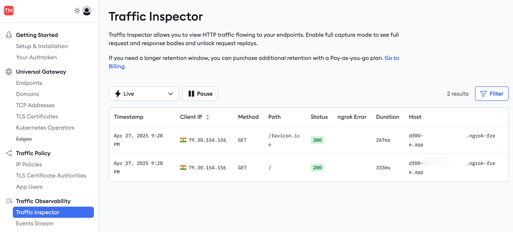

- You can filter requests by these fields—for instance, to show only server error responses and not successes.

To see more details about a request or to replay it, you need to enable full capture, which permits ngrok to store up to 10 KB of your request data.

- Click a request in the Traffic Inspector list, then click **Enable full capture** in the sidebar.

  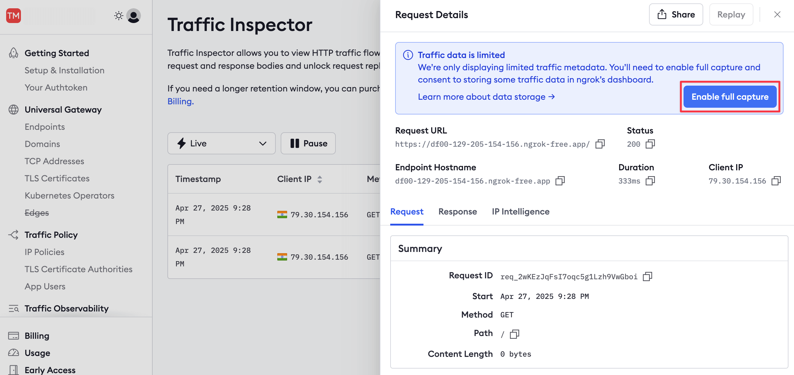

- This button takes you to your account settings, where you can enable full capture under **Observability**.

  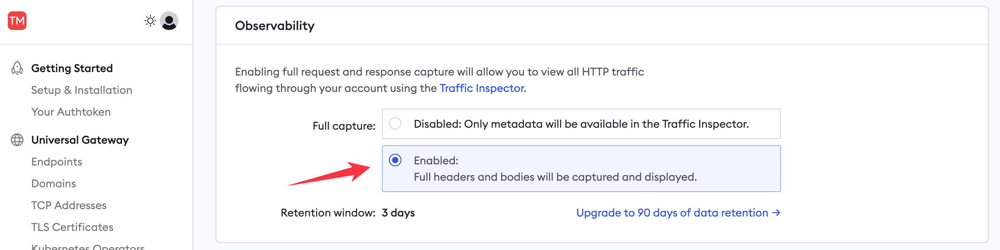

- Then, return to your published API URL and refresh the browser page a few times to send fresh requests through ngrok.
- In the ngrok Traffic Inspector, click the event at the top of the list.

  The event should now show all the request and response details and content.
  If the full capture details don't appear, you may need to restart your ngrok agent in the terminal.

- Click the **Replay** button and notice that the request is replayed from the ngrok host.

  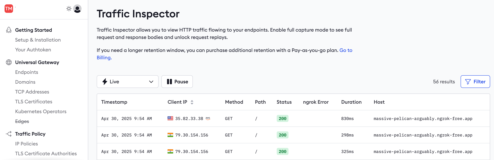

- You can also replay a request with changes to alter any of the headers or POST data.

  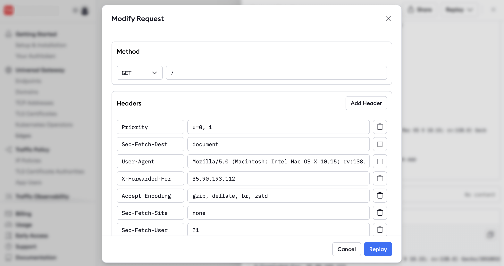

Replaying requests is useful for debugging.
For example, you could find the request that caused an error in your API, deploy a fix for the API, and replay the request to confirm you've fixed the issue.

### Observe and debug Traffic Policy rules with request replay

You can also replay requests to test new [Traffic Policy](/traffic-policy) rules.
ngrok applies the Traffic Policy rules in effect at the current time of replay, which may be different from the rules that were in effect when the original request was received.

This replay function lets you test how new Traffic Policy rules behave against real-world traffic from the past, offering one more way to test or debug them.

Since you came here from a previous API gateway guide, you've already seen how to set up the [`rate-limit` action](/traffic-policy/actions/rate-limit).
Now you can observe what happens to rate-limited requests and also use Traffic Inspector to dial in your threshold.

- Hit your endpoint a few more times with a loop of the `curl` command:

  ```bash mode="cli"
  for i in `seq 1 50`; do curl -X GET -w '%{http_code}' https://$YOUR_DOMAIN/abc ; done`.
  ```

- In Traffic Inspector, note that ngrok returned the error code `429` (rate limit) and that the duration of the request was instant, meaning it created no load on your API.

  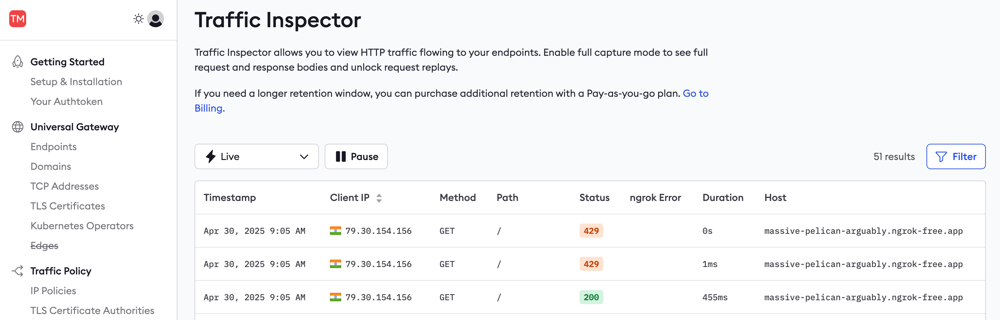

- Edit the `policy.yml` file and change `capacity` to `100` or another threshold you deem appropriate and restart your agent based on your form factor.

- In the Traffic Inspector, click one of the `429` events, then click **Replay**.
  Note that the request now responds without error because you increased the rate limit for the given IP address of that request.

  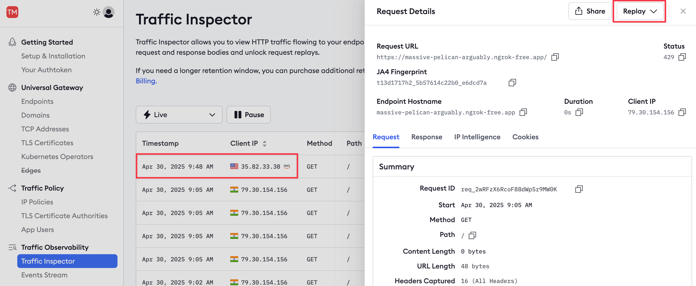

## Monitor your API gateway traffic with Datadog

In this section, you'll learn how to export ngrok events to the Datadog monitoring service.

There are two [types of events](/obs/events/reference): standard traffic events (requests to your API) and audit events (changes to secret keys and URLs).
For this simple example, you'll monitor a traffic event.

- In the ngrok dashboard, browse to [**Log Exporting**](https://dashboard.ngrok.com/log-exporting) and add a new Log Export.

  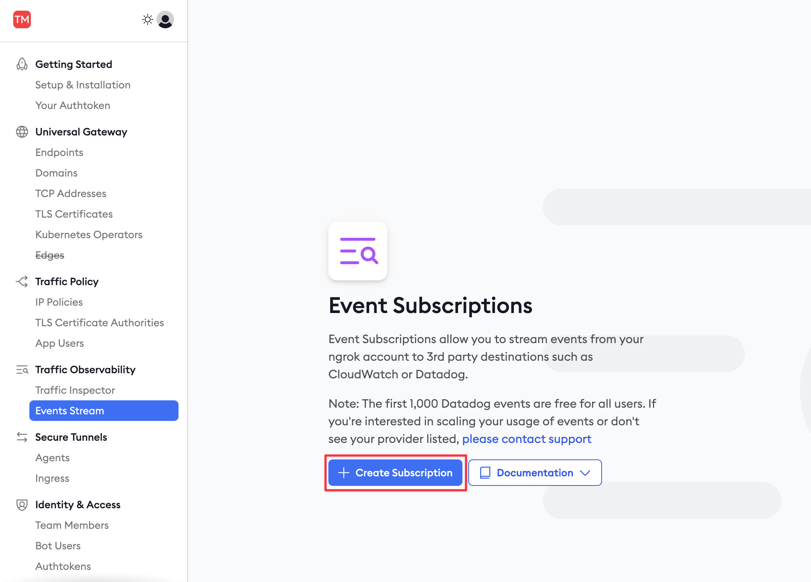

- In the **New Log Export** sidebar, enter `traffic` as the **Description** and then **Add** a new log source.
  Choose `http_request_complete`.

  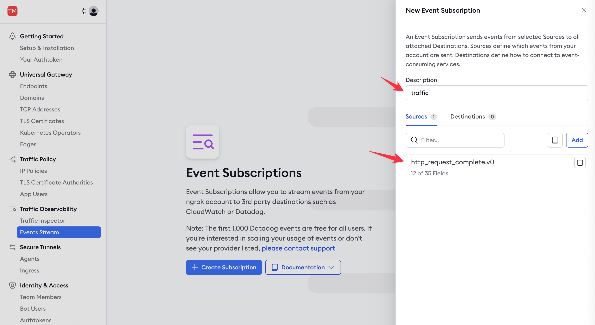

- Add Datadog as a destination, add the Datadog site and API key you noted earlier, and send a test log.

- Open the Datadog site and browse to the **Log Explorer** page from the navigation panel.
  Enable logs.
  You should see that the log from ngrok has appeared.

  

- In ngrok, click **Done** and **Save**.

- Hit your API services a few times so that ngrok has sent new logs over to Datadog.

### Create a dashboard

Now that events are being sent to Datadog, you can set up visualizations and notifications to allow your support team to monitor your API's performance.

- In the Datadog site, browse to the **Dashboards > Dashboard List** page from the navigation panel.
  Click the **ngrok HTTP Events** item to view the default dashboard.

  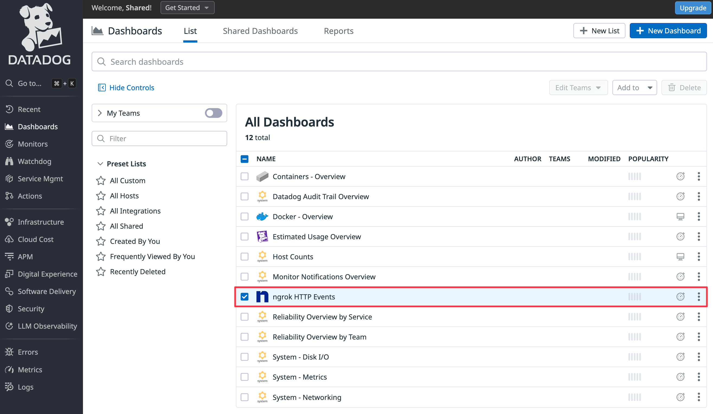

You need to clone the default dashboard to add a new widget to the dashboard.

- Click **Clone** at the top right of the page.

  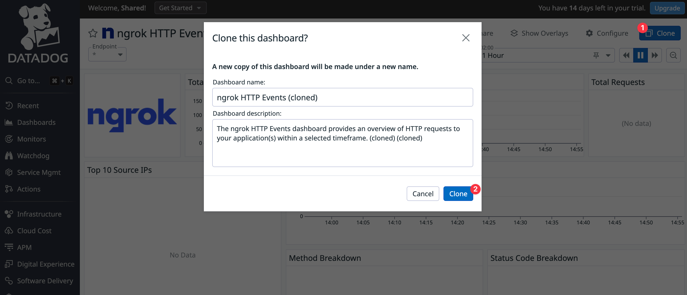

- In the cloned dashboard, click **Add widgets**.

  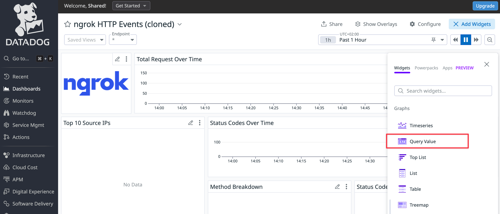

Configure the widget as follows.

- 1. Choose **Query value** as your visualization.
- 2. Change **Metrics** to **Logs** (ngrok does not export metrics) and enter the log filter, `@http.status_code:500`, so that Datadog only counts errors.
- 3. Set the time preference to **Past 1 Hour**.
- 4. Name the widget `Errors in the last hour`.

  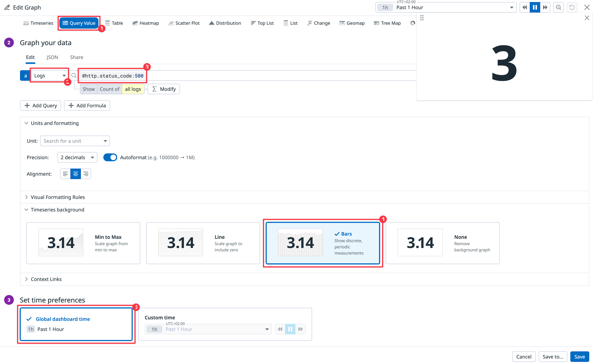

Your new widget will be available in the dashboard, allowing your support staff to see instantly whether any errors have occurred in your API.

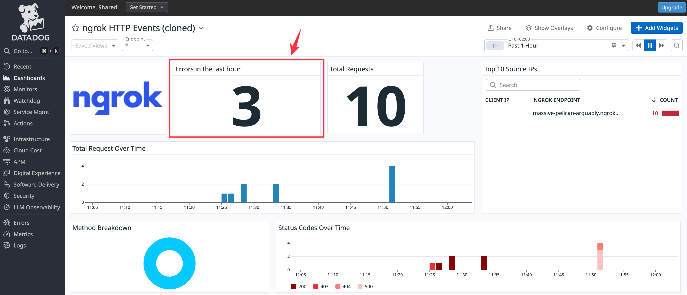

Since the sample API never returns errors, an easy way to test the `Errors in the last hour` widget is to stop the sample API Docker container and then try to browse to the site on the public ngrok endpoint.

If you want to create widgets for other log information, you can see which fields are available by reading the JSON of any event you click in the log inspector.

### Create a notification

To complete your monitoring system, you need to set up an alert pushed to your email or mobile app when an error occurs by adding a webhook integration to Datadog.
This allows your support team to receive error notifications instead of repeatedly checking the dashboard.

You can set up webhooks with the free notification service [ntfy.sh](https://ntfy.sh) as a quick demonstration.
For production workloads, consider using email, Slack, mobile push notifications, or incident management tools like PagerDuty.

- In Datadog, browse to **Integrations > Add integration > Webhooks**.

  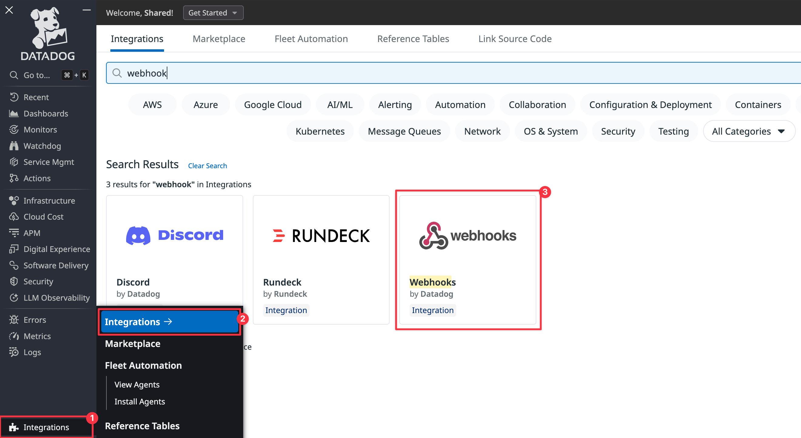

- Under **Webhooks**, at the bottom of the configuration page, click **New**.
  Set the **Name** to `ntfy`, the **URL** to `https://ntfy.sh/$YOUR_COMPANY`, and the **Payload** to **Blank**. Click **Save**.

  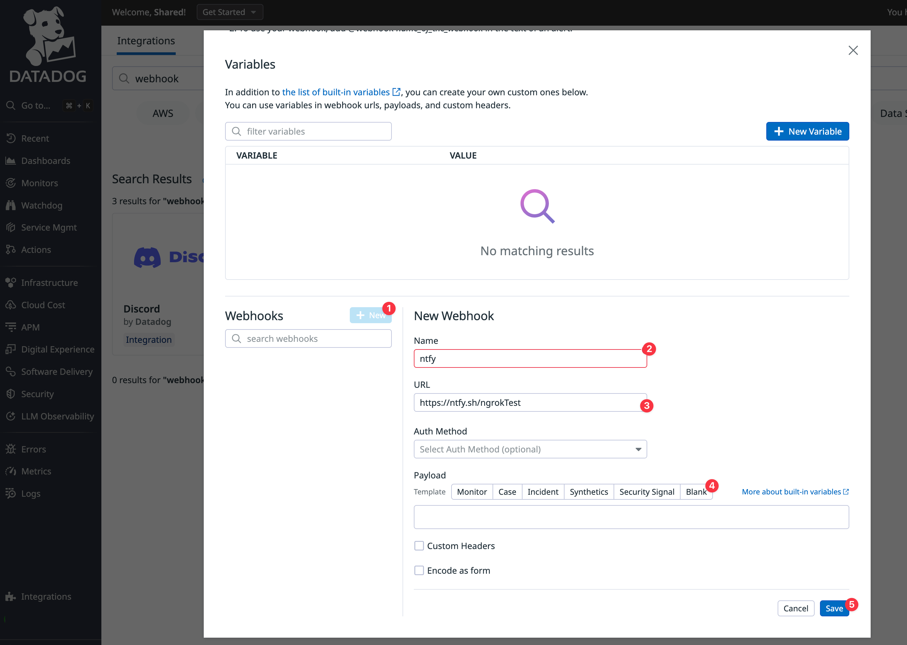

- In the Datadog navigation panel, browse to the **Monitors > New monitor**. Choose **Logs**.

- In the monitor configuration, choose **Query** for your monitor scope, set the search query to `@http.status_code:500`, the time to the **last 1 hour**, and the notification message:

  ```
  @webhook-ntfy Your API has errors. Investigate at https://app.datadoghq.eu/dashboard.
  ```

  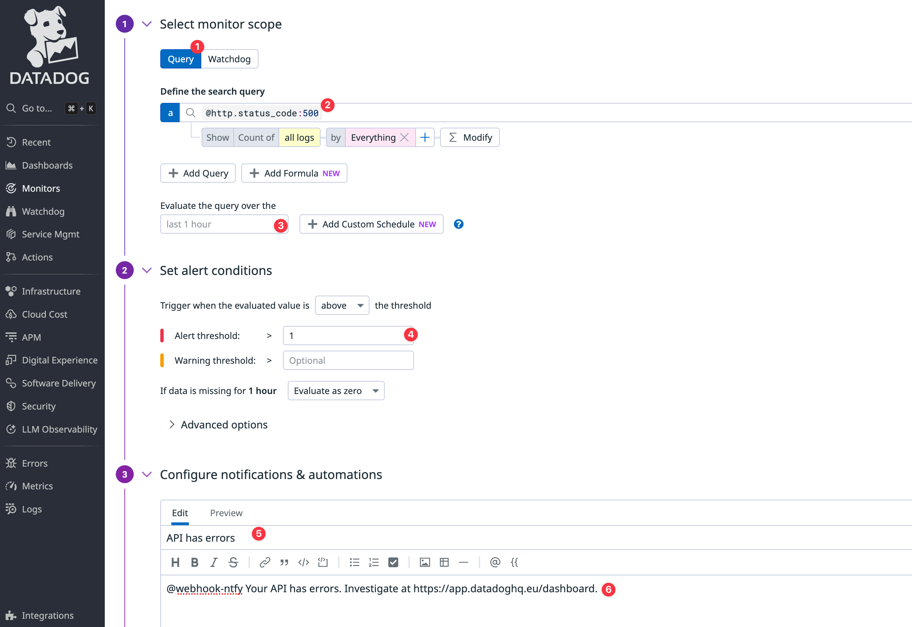

  It's important that the `@webhook` name matches the webhook integration you created earlier.
  If the names don't match, the notification won't arrive.

- Browse to the [ngrok test channel on the ntfy website](https://ntfy.sh/ngrokTest).

- Click **Test notifications** at the bottom of the Datadog page and send an alert with **Run tests**.

- Notice that the alert appears on the ntfy page.
  You can install ntfy as a mobile app so that you are always aware of whether your API has errors.

  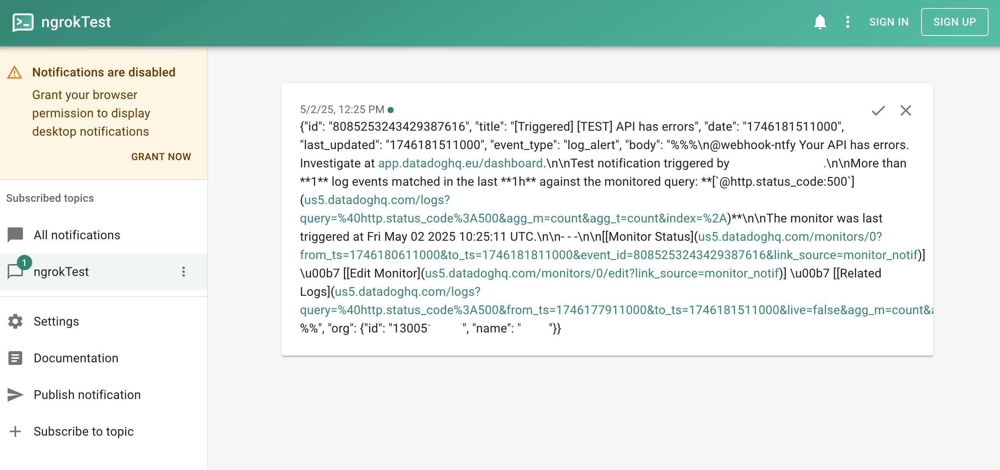

- Save the monitor.
  Now, after a delay and once you've refreshed the ngrok endpoint for your API, you will receive a notification if an error occurs.

## What should you monitor at your API gateway?

Now that you've seen how to connect your API traffic to Datadog, explore logs, create a dashboard with custom widgets, and send alerts, consider what exactly you should be monitoring.

There are three categories to consider: security, errors, and performance.

### Security

You need to monitor the security of your infrastructure and any attempts to hack
users' accounts.

As mentioned earlier, ngrok emits [audit logs](/obs/events/reference/#audit-events) for any security changes.
You should set up alerts for any changes to API keys, domains, and SSH certificates—anything that indicates attackers might gain access to your infrastructure.
Events like stopping and starting agents and endpoints are likely to happen frequently, so they don't need alerts (especially when running Kubernetes and multiple containers).
You still might want to add widgets to monitor these events on a dashboard, however, because surges in activity might indicate problems with your system
Additionally, you can add monitors that trigger alerts when activity passes a certain threshold.

In terms of user security, you need to monitor anything that indicates attackers might be accessing a user's account.
This includes multiple requests from IP addresses in different countries in a short time span (though this has become common with the increasing use of VPNs), a high rate of failed login attempts, or an anomalous pattern of request access.
To make a monitoring rule that recognizes anomalies, you first need to track the average number of requests the average user makes to various endpoints in your API.

### Errors

Errors are the simplest category to monitor.
Generally, if your API returns status codes in the `500` range instead of the `200` range, you have some debugging and remediation to attend to.

Using Datadog monitoring, create an alert to send notifications to ntfy or Slack for all errors.
If a `500` error occurs, use the ngrok replay function to see whether it can be reproduced on a QA server, and send the bug to your developers to fix it.

### Performance

Performance metrics need monitoring but don't need to trigger alerts unless your service experiences a sudden spike in usage or growth.
The most important things to monitor are uptime, latency (response time), and throughput.

Unlike with audit events, there is only one traffic event to monitor: [HTTP Request Complete](/obs/events/reference/#http-request-complete).
This event, with multiple fields and the request and response bodies in the log, is enough to construct any metrics you need.

General statistics practices apply to metric monitoring.
Use medians instead of arithmetic averages, because extreme values disproportionately affect averages.

For latency, keep an eye on the median duration of a request and outliers—separate requests by endpoint to identify which endpoints take excessive time and could be improved.
For throughput, look at the median number of requests per minute.
For both metrics, also consider monitoring variance in addition to averages.
Even if an endpoint has a quick average response time, if the duration is highly variable, with many lower- and higher-than-average durations, your users will probably get annoyed.

## What's next?

By the end of this guide, you've set up ngrok as an API gateway with the agent or Kubernetes Operator and established fundamentals for observing it as a holistic system.

You're ready for production, but you still haven't reached the end of what's possible with Traffic Policy—explore the [Traffic Policy examples](/traffic-policy/examples) for even more ways you can filter, manage, and orchestrate traffic.

Looking for even more resilience?
[Endpoint Pooling](/universal-gateway/endpoint-pooling) offers a dead-simple path to load balancing across environments, clusters, and clouds.
