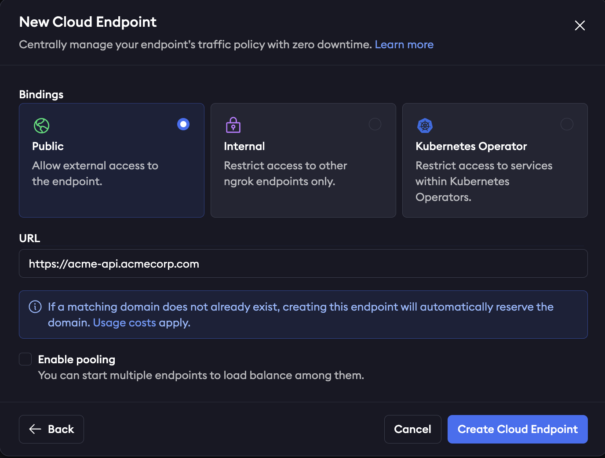

This guide walks you through a practical example of using the ngrok as an API gateway to securely expose and manage APIs running in Kubernetes clusters that span multiple cloud providers.

In this scenario, you'll see how to unify access to services deployed in different environments, simplify connectivity, and enforce consistent security policies—all without the complexity of managing separate ingress solutions in each cloud.

## Example scenario

You run Acme Corp, which has long operated its core infrastructure in AWS, where a Kubernetes cluster hosts a suite of APIs critical to your customers.

Recently, Acme acquired a subsidiary (Betatech) that built its own platform in GCP, also relying on Kubernetes to power customer-facing services.
Suddenly, Acme finds itself managing APIs in two separate clouds, each with its own networking stack, security controls, and exposure requirements.

In EKS, Acme runs a Catalog API, which provides product listings to customers, and an Orders API, which partners and users rely on to place and manage orders.
In GKE, Betatech maintains an Inventory API, exposing stock levels and reservation capabilities, along with a Webhook Receiver API, which ingests real-time events from third-party systems.

You need a way to expose these APIs to the public internet without the complexity of juggling multiple cloud-specific solutions.
This is where ngrok's API gateway comes into play with one secure and consistent entry point for all of your distributed services.

## Architectural reference


### What you'll need

- An ngrok account. If you don't have one, [sign up](https://dashboard.ngrok.com/signup).
- Two K8s clusters running on separate VMs (ideally each within a distinct cloud provider).
  - Not running kubernetes? Try [installing the ngrok agent](/getting-started) in your cloud infrastructure directly
- [An ngrok API Key](https://dashboard.ngrok.com/api/new). You'll need an account first.

## 1. Install the ngrok operator within each K8s cluster

The [ngrok Kubernetes Operator](https://ngrok.com/docs/k8s/index#kubernetes-operator) lets you declaratively expose cluster Services through ngrok by reconciling simple manifests into managed, secure endpoints.
Before you install the operator, save your ngrok authtoken and API key as environment variables.

To install the operator, run this command from inside each of your Kubernetes clusters that host your backend APIs:

```bash
helm install ngrok-operator ngrok/ngrok-operator \
--namespace ngrok-operator \
--create-namespace \
--set description="acme ngrok operator" \ # set this to "beta ngrok operator" for the other cluster
--set credentials.apiKey=$NGROK_API_KEY \
--set credentials.authtoken=$NGROK_AUTHTOKEN
```

## 2. Create an **internal** endpoint for each API

Use the [`AgentEndpoint` CRD](https://ngrok.com/docs/k8s/crds/agentendpoint) to register an **internal** endpoint per API in each cluster.

Internal endpoints are not internet-reachable; they're only targetable from other ngrok endpoints via the `forward-internal` Traffic Policy action—perfect for wiring a single public gateway to multiple cluster services.
To make an endpoint internal, set `spec.bindings: ["internal"]` **and** end `spec.url` with `.internal`.

<Tabs>

  <Tab title="EKS">

```yaml title="agentendpoints-eks.yaml"
# Orders API + Catalog API
apiVersion: ngrok.k8s.ngrok.com/v1alpha1
kind: AgentEndpoint
metadata:
name: catalog-internal
namespace: default
spec:
bindings:
- internal
url: https://catalog-eks.internal
upstream:
url: http://catalog-svc.default:80

---
apiVersion: ngrok.k8s.ngrok.com/v1alpha1
kind: AgentEndpoint
metadata:
name: orders-internal
namespace: default
spec:
bindings:
- internal
url: https://orders-eks.internal
upstream:
url: http://orders-svc.default:8443
```

</Tab>

  <Tab title="GKE">
  ```yaml title="agentendpoints-gke.yaml"
  # agentendpoints-gke.yaml: Inventory API + Webhook API
  apiVersion: ngrok.k8s.ngrok.com/v1alpha1
  kind: AgentEndpoint
  metadata:
  name: inventory-internal
  namespace: default
  spec:
  bindings:
  - internal
  url: https://inventory-gke.internal
  upstream:
    url: http://inventory-svc.default:80

---

apiVersion: ngrok.k8s.ngrok.com/v1alpha1
kind: AgentEndpoint
metadata:
name: webhooks-internal
namespace: default
spec:
bindings: - internal
url: https://webhook-gke.internal
upstream:
url: http://webhook-svc.default:9000

````
</Tab>
</Tabs>

Now, apply each YAML config in each cluster:

```bash
kubectl apply -f agentendpoints-eks.yaml --context eks
kubectl apply -f agentendpoints-gke.yaml --context gke
````

## 3. Create a public Cloud Endpoint and attach Traffic Policy

Cloud Endpoints are persistent, always-on endpoints you manage centrally via the [dashboard](https://dashboard.ngrok.com/) or [API](https://ngrok.com/docs/api).
Cloud Endpoints don't forward their traffic to an agent by default and instead only use their attached Traffic Policy to handle connections.

In this case, this single Cloud Endpoint will act as the gateway to receive incoming requests and route them to the correct internal endpoint based on a header (`X-Acme-Api`) sent with the request.

Create a public Cloud Endpoint in the ngrok dashboard by navigating to endpoints and clicking **new** as shown in the screenshot below:



Now that you've created the Cloud Endpoint, you need to configure it to route to the correct internal endpoint based on the request header.
Click on your Cloud Endpoint and replace the default Traffic Policy with:

```yaml
on_http_request:
  actions:
    - type: forward-internal
      config:
        url: https://${getReqHeader('X-Acme-Api')[0]}.internal
```

This Traffic Policy will read the value of the request header for `X-Acme-Api` and route it to that corresponding internal endpoint.
For example, a request sent with the header `X-Acme-Api: catalog-eks` will route to `https://catalog-eks.internal`, which is configured to point to the Catalog API in your EKS cluster.

## 4. Attach Traffic Policy to authenticate your Cloud Endpoint

Traffic Policy is ngrok's configuration language for endpoints.
In this example, the Traffic Policy for your Cloud Endpoint handles routing rules (seen in step 3), rate limiting, authentication, and firewall rules.
A full list of available Traffic Policy actions can be seen [here](https://ngrok.com/docs/traffic-policy/actions/).
Use these actions by themselves or layered on top of each other (executed sequentially from top to bottom).

Here's how your Traffic Policy YAML might look for your Cloud Endpoint:

```yaml
on_http_request:
  actions:
    # apply rate limiting
    - type: rate-limit
      config:
        name: Only allow 10 requests per second
        algorithm: sliding_window
        capacity: 10
        rate: 1s
        bucket_key:
          - "conn.client_ip"
    # apply OWASP Core Rule Set on request
    - type: owasp-crs-request
      config:
        on_error: halt
    # Block specific AI Bots and IPs on blocklist categorizations with IP Intel
    - expressions:
        - ("com.anthropic" in conn.client_ip.categories) ||
          ("com.openai" in conn.client_ip.categories) ||
          ("com.perplexity" in conn.client_ip.categories) ||
          ('tor' in conn.client_ip.categories) ||
          ('tor.exit' in conn.client_ip.categories) ||
          ('proxy' in conn.client_ip.categories) ||
          ('proxy.anonymous' in conn.client_ip.categories) ||
          ('vpn' in conn.client_ip.categories)
      actions:
        - type: deny
          config:
            status_code: 404
    # forward traffic to internal endpoint based on header
    - type: forward-internal
      config:
        url: https://${getReqHeader('X-Acme-Api')[0]}.internal
on_http_response:
  actions:
    # apply OWASP Core Rule Set on response
    - type: owasp-crs-response
      config:
        on_error: halt
```

## 5. Load balance with endpoint pooling

Load balancing at ngrok is done with [endpoint pooling](https://ngrok.com/docs/universal-gateway/endpoint-pooling/).
When multiple ngrok endpoints are created with the same URL and with the _pooling_enabled_ flag, ngrok automatically balances traffic across them.

For AgentEndpoint resources, pooling is always on: if more than one agent creates the same internal URL, requests are balanced across them.

Nothing changes in your Cloud Endpoint config—and ngrok now spreads requests across the pooled internal endpoints.

## Recap

You've successfully unified your APIs across EKS and GKE.
A single public ngrok Cloud Endpoint points to 2 pools of internal endpoints, and Traffic Policy is handling routing, authorization, and security.
To recap:

- Installed the ngrok Kubernetes Operator in both clusters (EKS and GKE)
- Created internal AgentEndpoints for Catalog, Orders, Inventory, and Webhooks using AgentEndpoint CRDs.
- Deployed one public Cloud Endpoint and routed by request headers to the correct internal backends with per-API security (rate limits, IP allowlists, OWASP).
- Achieved load balancing & resilience via endpoint pooling by running multiple agent replicas.
