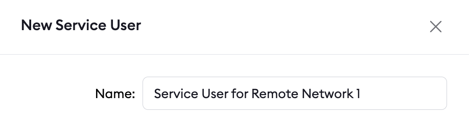
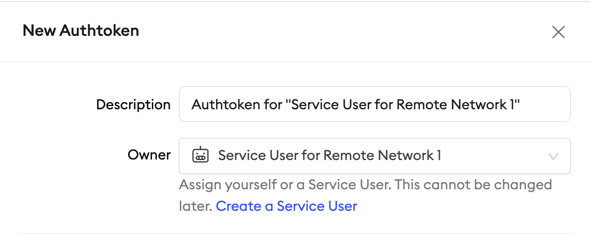
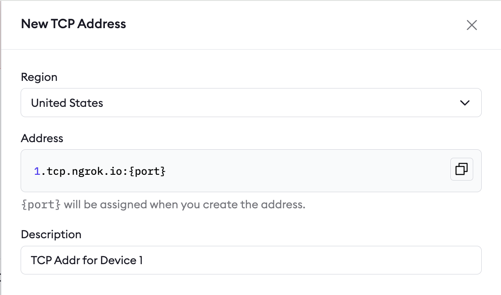
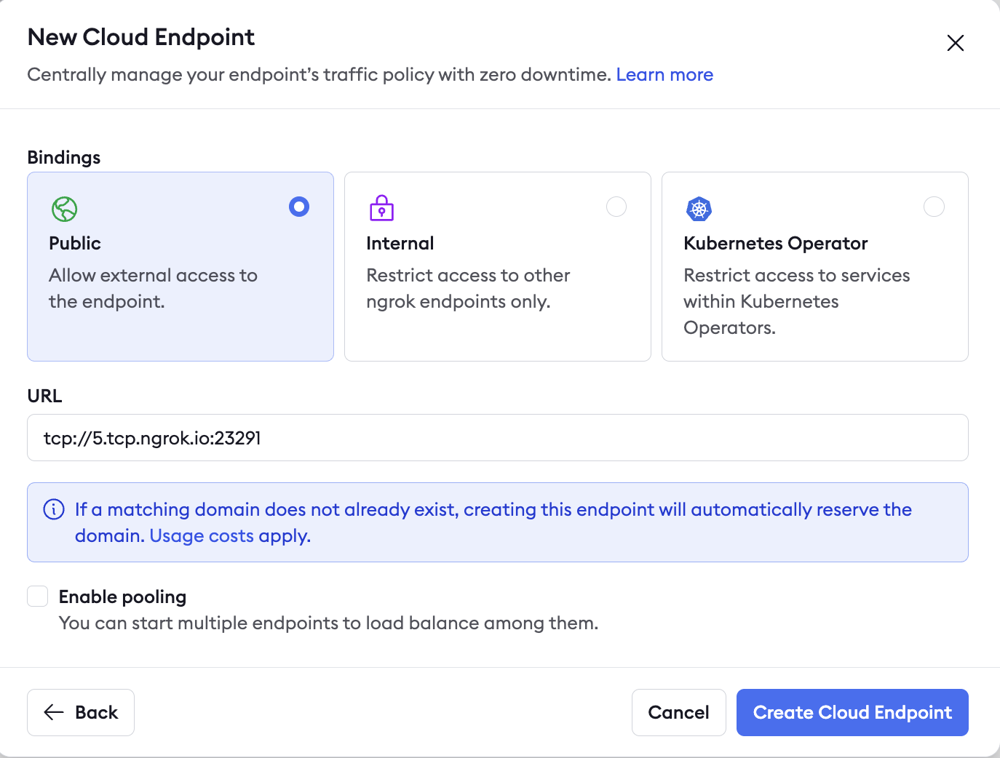

By creating secure TCP endpoints, ngrok enables easy, centralized access for technicians, engineers, and IT admins to maintain and update remote devices and services.
This guide helps you streamline connectivity without compromising security for remote access using SSH or RDP.

Use cases include secure SSH into remote IoT devices or connecting to a Windows RDP server in a remote network.
This guide demonstrates the setup for a single remote network.

## Architectural reference

.png)

### Why only one ngrok agent per remote network?

Traditionally, you might assume that every service or device inside the network needs its own ngrok agent, but this isn't necessary.
A single ngrok agent is installed on a network-accessible server inside the remote network.
The agent acts as a central gateway that can reach any service on the local network, eliminating the need for multiple agents.

## What you'll need

- An ngrok account. If you don't have one, [sign up](https://dashboard.ngrok.com/signup).
- An ngrok agent configured in a remote network or remote device. See the [getting started guide](https://ngrok.com/docs/getting-started/) for instructions on how to install the ngrok agent.

## 1. Create a service user and authtoken for isolated network access

First, create a service user and an associated authtoken for each of your customers.
A service user is intended for automated systems that programmatically interact with your ngrok account (other platforms sometimes call this concept a Service Account).
Create a separate service user and associated authtoken for each of your customers so that:

- Their usage of your ngrok account is isolated and scoped with a specific permission set
- If a customer is compromised, you can revoke their access independently
- Agent start/stop audit events are properly attributed to each customer
- Your ngrok agents don't stop working if the human user who set them up leaves your ngrok account

Navigate to the [Service Users](https://dashboard.ngrok.com/service-users) section of your dashboard and click **New Service User**.



Next, create an authtoken assigned to this specific service user.



## 2. Install the ngrok agent within your remote network and configure internal Agent Endpoints in ngrok.yml

Configure the agent to create internal Agent Endpoints that point to the devices you want to remotely access.
This connects the devices to your ngrok account, but nothing can connect to them until you complete the subsequent steps.
The configuration to achieve this is shown in the example agent configuration file below.

Internal Agent Endpoints are private endpoints that only receive traffic when forwarded through the [forward-internal Traffic Policy action](https://ngrok.com/docs/traffic-policy/actions/forward-internal).
This allows you to route traffic to an application through ngrok without making it publicly addressable.
Internal Agent Endpoint URL hostnames must end with `.internal`.

After installing the ngrok agent, define internal Agent Endpoints for each service you want to remotely access inside the ngrok configuration file.
You can install ngrok and its configuration file at `/path/to/ngrok/ngrok.yml` and the executable at `/path/to/ngrok/ngrok`.

```yaml
version: 3

agent:
  authtoken: AUTHTOKEN_CREATED_IN_STEP_1

endpoints:
  - name: Internal Endpoint for Device 1
    url: tcp://device1.internal:22
    upstream:
      url: 22 
  - name: Internal Endpoint for Device 2
    url: tcp://device2.internal:22
    upstream:
      url: 22 
  - name: Internal Endpoint for RDP Server
    url: tcp://rdp-server.internal:3389
    upstream:
      url: 3389 
```

## 3. Reserve a TCP address for each device and server

You need to reserve a TCP address to create a TCP Cloud Endpoint, which you'll do in the next step.
Reserving the address holds it exclusively for your ngrok account.
Do this for each device and for the RDP server.



## 4. Create your TCP Cloud Endpoints and attach a Traffic Policy

Cloud Endpoints are persistent, always-on endpoints whose creation, deletion, and configuration is managed centrally via the dashboard or API.
They exist permanently until explicitly deleted.
Cloud Endpoints don't forward their traffic to an agent by default—they only use their attached Traffic Policy to handle connections.



Click on your newly created Cloud Endpoint and replace the default Traffic Policy with:

```yaml
on_tcp_connect:
  - actions:
      - type: forward-internal
        config:
          url: tcp://device1.internal:22
```

## 5. Secure your Cloud Endpoint with IP restrictions

Navigate to your newly created Cloud Endpoint in the [Endpoints](https://dashboard.ngrok.com/endpoints) tab on your ngrok dashboard and apply a `restrict-ips` Traffic Policy action to enable a source IP allow list.
IP restrictions let you directly filter who can use the endpoint and prevent port scanners or other malicious actors.
You can add this action directly to the Cloud Endpoint's YAML configuration.
The final config for this action is shown below:

```yaml
on_tcp_connect:
  - actions:
      - type: restrict-ips
        config:
          enforce: true
          allow:
            - e680:5791:be4c:5739:d959:7b94:6d54:d4b4/128
            - 203.0.113.42/32
  - actions:
      - type: forward-internal
        config:
          url: tcp://device1.internal:22
```

## 6. Use your ngrok TCP endpoints with your SSH and RDP clients

Now that you've created and secured your TCP Cloud Endpoints, you can use them in your existing SSH and RDP client setups to test your remote connectivity.

## What's next

- [Install ngrok as a background service](/guides/site-to-site-connectivity/background-service) to ensure the agent starts on boot and recovers from failures.
- [Eliminate single points of failure with redundant agents](/guides/site-to-site-connectivity/redundant-agents) to achieve high availability.
