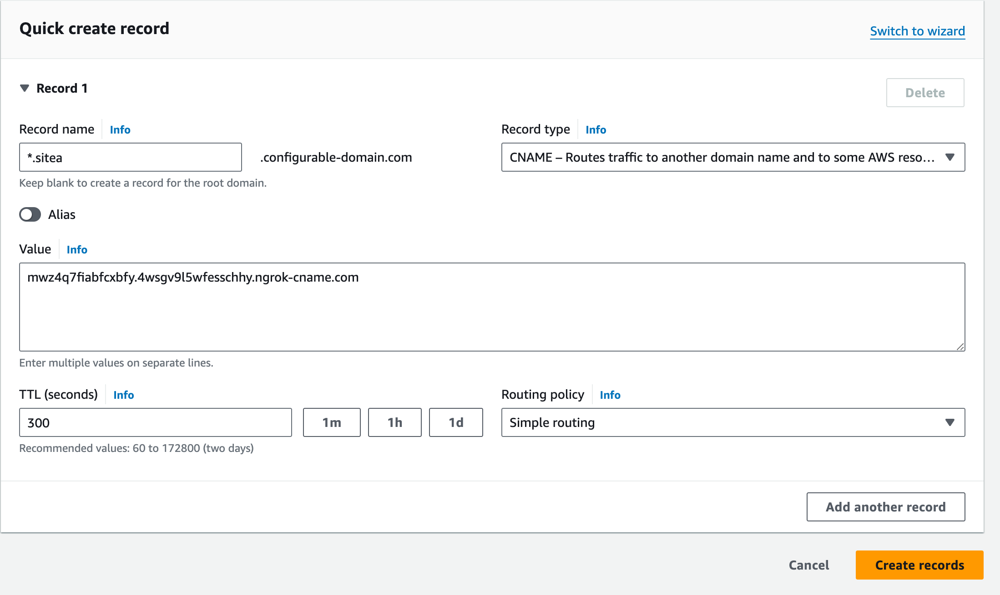
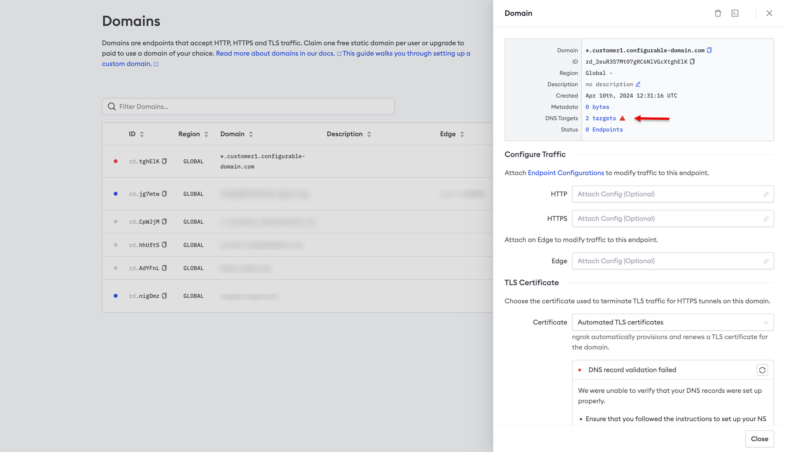
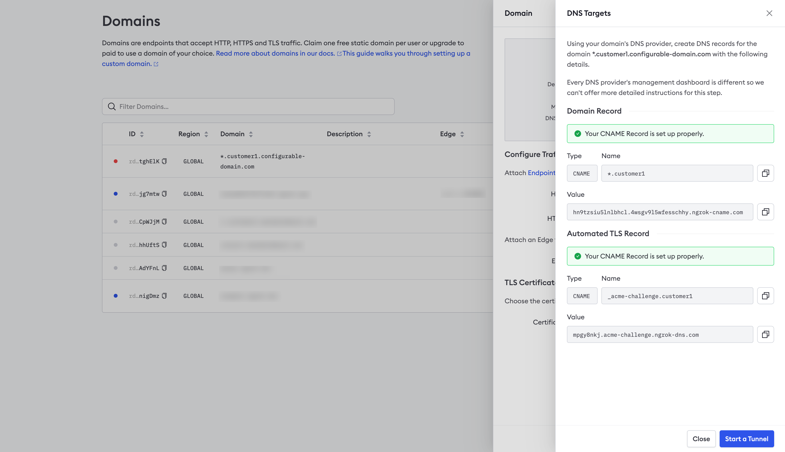
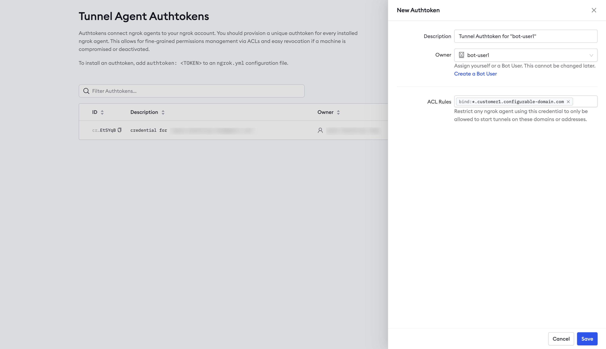

This guide provides step-by-step instructions for using ngrok as a device gateway.
This example shows you how to embed connectivity into an application using ngrok's Python SDK to access an API running on an IoT device.
All the Python code in this example is available in [the ngrok-samples/ngrok-python-iot-agent repo](https://github.com/ngrok-samples/ngrok-python-iot-agent).

## Prerequisites

To use the sample application, you need the following prerequisites on the device or device gateway you wish to connect to:

- Python 3.11
- [venv](https://docs.python.org/3/library/venv.html#) or another Python virtual environment manager

## Get an ngrok API key

[Create an ngrok API key](https://dashboard.ngrok.com/api/new) using the ngrok dashboard.
Make sure you save the API key before you leave the screen because it won't be displayed again.

## Reserve a domain for wildcard endpoints

Reserve a [wildcard domain](/api-reference/reserveddomains/list), which will allow you to create wildcard endpoints and receive traffic on any subdomain of your domain.
For billing information, see [wildcard endpoints pricing](/pricing-limits/#wildcard-endpoints).

For example, you might create `*.sitea.{YOUR_DOMAIN}`.
You would then be able to create endpoints on `device342.sitea.{YOUR_DOMAIN}` and `device896.sitea.{YOUR_DOMAIN}` without having to reserve them individually.
It can be helpful to create a separate subdomain for each site you wish to connect to.

Run the following command, substituting your API key for `{API_KEY}` and your domain for `{YOUR_DOMAIN}`:

```
curl \
-X POST \
-H "Authorization: Bearer {API_KEY}" \
-H "Content-Type: application/json" \
-H "Ngrok-Version: 2" \
-d '{"domain":"*.sitea.{YOUR_DOMAIN}","region":"us"}' \
https://api.ngrok.com/reserved_domains
```

You should receive a `201` response similar to the following:

```json
{
  "id": "rd_2euR3S7Mt07gRC6NlVGcXtghElK",
  "uri": "https://api.ngrok.com/reserved_domains/rd_2euR3S7Mt07gRC6NlVGcXtghElK",
  "created_at": "2024-04-10T12:31:16Z",
  "domain": "*.sitea.configurable-domain.com",
  "region": "",
  "cname_target": "mwz4q7fiabfcxbfy.4wsgv9l5wfesschhy.ngrok-cname.com",
  "http_endpoint_configuration": null,
  "https_endpoint_configuration": null,
  "certificate": null,
  "certificate_management_policy": {
    "authority": "letsencrypt",
    "private_key_type": "ecdsa"
  },
  "certificate_management_status": {
    "renews_at": null,
    "provisioning_job": {
      "error_code": null,
      "msg": "Managed certificate provisioning in progress.",
      "started_at": "2024-04-10T12:31:16Z",
      "retries_at": null
    }
  },
  "acme_challenge_cname_target": "f7ekwqdb.acme-challenge.ngrok-dns.com"
}
```

You'll need values from the response in the next section.

### Update DNS records

Next, add two `CNAME` records to your DNS provider's registry, providing values from the previous response.

Add a CNAME record for the domain you just reserved.



Then add another record for the [ACME (Automated Certificate Management Environment)](https://venafi.com/blog/what-acme-protocol-and-how-has-it-changed-pki/) validation.
For the record, enter `_acme-challenge.{SUBDOMAIN}`, and use the value of the `acme_challenge_cname_target` property from previous response for the value.
For the example above, the record name would be `_acme-challenge.sitea`.

### Verify DNS

Use the ngrok dashboard to verify that you’ve configured DNS correctly.

1. Login to the [ngrok dashboard](https://dashboard.ngrok.com/).
2. Click **Domains** in the left-hand navigation menu.
3. Click on your domain under _Domain_.
4. Click **2 targets** next to _DNS Targets_ in the panel displayed on the right-hand side of the screen,
   as denoted by the arrow in the screenshot below.



5. Click **Check Status**, as denoted by the arrow in the screenshot below.


6. You should see a successful response similar to the screenshot below.



## Create a Service User

You'll create a Service User so that in the next section, you can create an agent authtoken independent of any user account.
A Service User does not belong to a particular user account. Run the following command to create a new Service User, providing your API key and a description:

```
curl \
-X POST \
-H "Authorization: Bearer {API_KEY}" \
-H "Content-Type: application/json" \
-H "Ngrok-Version: 2" \
-d '{"name":"new Service User from API"}' \
https://api.ngrok.com/bot_users
```

You should receive a `201` response similar to the following:

```json
{
  "id": "bot_2fmwUXhnImKswMgZKCsx7cnbt2l",
  "uri": "https://api.ngrok.com/bot_users/bot_2fmwUXhnImKswMgZKCsx7cnbt2l",
  "name": "new Service User from API",
  "active": true,
  "created_at": "2024-04-29T19:39:36Z"
}
```

## Create the Agent authtoken

You should start each agent using a separate authtoken, and that token should belong to a Service User.

To create an authtoken, login to the ngrok dashboard and click [**Authtokens**](https://dashboard.ngrok.com/tunnels/authtokens) under _Tunnels_, then click **Add a Tunnel Authtoken**.
For **Owner**, select the Service User you use created, and select `bind:*.sitea.{YOUR_DOMAIN}` for the ACL Rules.
This ACL will allow an agent with the authtoken to create tunnels on any subdomain of `sitea.{YOUR_DOMAIN}`.



## Configure the sample Agent

The sample application uses the ngrok Python SDK to embed connectivity directly into the application rather than using the standalone ngrok agent, the CLI, or the ngrok Kubernetes Operator.
It serves a local REST API you can use to create, delete, and list tunnels.

### Clone the repo

Clone [the ngrok-samples/ngrok-python-iot-agent repo](https://github.com/ngrok-samples/ngrok-python-iot-agent) on the device or device gateway you wish to connect to.

### Create and activate a virtual environment

Run the following to create a virtual environment, providing a directory for `{PATH_TO_VENV}`:

`python -m venv {PATH_TO_VENV}`

Run the appropriate command for your O/S to activate the virtual environment:

- In cmd.exe:
  `{PATH_TO_VENV}\Scripts\activate.bat`
- In PowerShell:
  `{PATH_TO_VENV}\Scripts\Activate.ps1`
- Linux and macOS:
  `source {PATH_TO_VENV}/bin/activate`

### Install dependencies

Run `pip install -r requirements` to install the dependencies.

### Update the domain

Update line `109` with your domain.
Since you reserved a wildcard domain, you can create endpoints on any subdomain of that domain without reserving them individually.
For example, for the domain `*.sitea.configurable-domain.com`, you could create an endpoint at `api.sitea.configurable-domain.com`.

### Set your authtoken

This sample application is designed to read your ngrok credentials from the environment, so run the following command, replacing `{YOUR_AUTHTOKEN}` with the authtoken you created in the previous step:

```bash
export NGROK_AUTHTOKEN={YOUR_AUTHTOKEN}
```

## Use the sample app

This sample application is a custom ngrok agent built using the Python SDK.
In a previous step, you updated the domain on line `109` of `agent.py`.

This domain will be used to serve a local REST API built into the sample application using FastAPI.
You'll use this API to create, delete, and list tunnels remotely.

The application persists tunnels in a local JSON file, `ngrok_config.json`, and recreates them when the application is restarted. You could extend this application to store tunnel configuration in a backend database.

You may pass policy information directly in the body of the request.
The application includes a JSON file, `test.json`, which contains the default [policies](/traffic-policy/) it applies to any new request that doesn't specify policy information.
You could update this file to control policies applied to new tunnels rather than passing the policy information in each request.

### Start the app

Run the following to start the agent:

```python
python agent.py
```

### List tunnels

Run the following command to list tunnels started by this custom agent application, substituting the domain you set on line `109` for `{YOUR_AGENT_DOMAIN}`:

```curl
curl -k \
 -X GET \
 https://{YOUR_AGENT_DOMAIN}/tunnels
```

Initially, you should receive a `200` response with an empty array.

### Start a tunnel with default policies

Run the following command to start a tunnel to the device or device gateway where the custom agent application is running, substituting the appropriate values for the variables:

- `{HOST}` - the host where the API is running, leave blank and remove the colon for `localhost`
- `{PORT}` - the port where the API is running
- `{TUNNEL_DOMAIN}` - the domain you want to serve the API on the device or device gateway
- `{YOUR_AGENT_DOMAIN}` - the domain you set on line `109` of the code

```curl
curl -k \
 -X POST \
 -H "Content-Type: application/json" \
 -d '{"protocol": "http", "forwards_to": "{HOST}:{PORT}", "domain": "{TUNNEL_DOMAIN}"}' \
 https://{YOUR_AGENT_DOMAIN}/tunnels
```

You should receive a `200` response similar to the following:

```json
{
  "url": "https://device123.sitea.configurable-domain.com",
  "protocol": "http",
  "forwards_to": "localhost:8001",
  "domain": "agent.sitea.configurable-domain.com",
  "policy": null
}
```

You'll notice that the `policy` property is `null`.
This is because the request didn't include any [policies](/traffic-policy/).
However, this sample application applies the default policies defined in `test.json` if no policies are included in the request.

### List tunnels

If you run the request to list tunnels again, you should receive a `200` response similar to the following.
Notice that it includes the policies defined in `test.json`.
You can update the policies in this file to the defaults you want applied to new tunnels when no policies are specified in the request:

```json
[
  {
    "url": "https://device123.sitea.configurable-domain.com",
    "protocol": "http",
    "forwards_to": "localhost:8001",
    "domain": "device123.sitea.configurable-domain.com",
    "traffic_policy": "{\"on_http_request\": [], \"on_http_response\": [{\"expressions\": [], \"name\": \"Add headers to requests\", \"actions\": [{\"type\": \"add-headers\", \"config\": {\"headers\": {\"is-ngrok\": \"0000000000\"}}}]}]}"
  }
]
```

### Start a tunnel with policies

Run the following command, substituting the appropriate values for the variables to create a new tunnel, specifying [policies](/traffic-policy/) directly in the request.

```curl
curl -k \
 -X POST \
 -H "Content-Type: application/json" \
 -d '{"protocol": "http", "forwards_to": "{HOST}:{PORT}","domain":"{YOUR_DOMAIN}", "policy": \
 {"on_http_request":[],"on_http_response":[{"expressions":[],"name":"Add headers to requests","actions":[{"type":"add-headers","config":{"headers":{"is-ngrok":"444"}}}]}]}}' \
 https://{YOUR_AGENT_DOMAIN}/tunnels
```

You should receive a `200` response similar to the following:

```json
{
  "url": "https://device123.sitea.configurable-domain.com",
  "protocol": "http",
  "forwards_to": "localhost:8001",
  "domain": "device123.sitea.configurable-domain.com",
  "policy": {
    "on_http_request": [],
    "on_http_response": [
      {
        "expressions": [],
        "name": "Add headers to requests",
        "actions": [
          {
            "type": "add-headers",
            "config": {
              "headers": {
                "is-ngrok": "444"
              }
            }
          }
        ]
      }
    ]
  }
}
```

#### Delete tunnel

Run the following command to delete a tunnel, substituting `{YOUR_AGENT_DOMAIN}` with the value you set on line `109` of the code and `{URL_PART}` with the value of the `url_part` property of the list tunnels request:

```curl
curl \
 -X \
 DELETE \
 https://{YOUR_AGENT_DOMAIN}/tunnels/{URL_PART}
```

## Access the API running on the device or device gateway

You should now be able to access the API on the device or device gateway using the value from `{TUNNEL_DOMAIN}` in the request to remote manage your device fleet.
