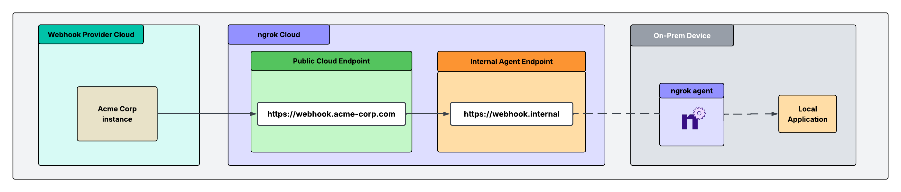

You want a third-party provider's webhooks to reach a service you run, you want to be sure each request really came from that provider, and you don't want to open your firewall or let every team expose things on its own. This guide sets up a single front door that does exactly that, then shows how to adapt it to the three situations teams hit most often.

<Note>
  ngrok can verify webhooks from 70+ providers out of the box. See the complete
  list of [supported webhook
  providers](/traffic-policy/actions/verify-webhook/#supported-providers) to
  confirm yours is covered before you begin.
</Note>

## How it works

A provider delivers its webhooks to one public address. A single Traffic Policy on that address checks the signature on every request, rejects anything that fails, and forwards only genuine requests inward to the private service that owns them. The service that receives webhooks connects outbound to ngrok—it never accepts inbound connections and is never publicly addressable.



## Three ways teams use this

The shape above is the same for everyone. What differs is where your service runs and what you most need to guarantee:

- **Behind a firewall.** Your service runs on-prem or in a private network that blocks inbound connections. The whole point is that webhooks reach it _without_ opening a port—outside things never touch inside things.
- **Regulated workloads.** Your service handles PHI or other regulated data, often in a cloud container. The path has to stay end-to-end encrypted and must not capture or store payloads.
- **Platform-governed.** A platform team owns what gets exposed. Endpoints and policy are declared as version-controlled config, and agents are scoped so developers can't create shadow exposure.

You'll build the shared front door in steps 1–4, then apply the guardrail for your scenario in step 5. The whole thing works the same whether one provider sends webhooks or several do.

## Tutorial

### What you'll need

- An ngrok account. If you don't have one, [sign up](https://dashboard.ngrok.com/signup).
- The [ngrok agent](/getting-started/), one of the [SDKs](/agent-sdks), or the [Kubernetes Operator](/k8s) installed where your service runs.
- The webhook signing secret for each provider you want to verify. You can find these in each provider's developer dashboard.

### 1. Give the receiving service a private address

Each service that handles webhooks gets an internal [Agent Endpoint](/gateway/agent-endpoints/): a private address that only receives traffic when it's forwarded through the [`forward-internal`](/traffic-policy/actions/forward-internal/) action. That's what keeps the service off the public internet. Internal endpoint hostnames must end with `.internal`.

How you create it depends on where the service runs.

<Tabs>
  <Tab title="On a server or VM">
    Run the agent next to your service. It connects outbound over TLS on port 443, so nothing needs to change on the firewall.

    ```bash
    ngrok http $SERVICE_PORT --url https://payment-service.internal
    ```

  </Tab>

  <Tab title="In a cloud container">
    Run the agent (or an [SDK](/agent-sdks)) inside the container alongside your app. The container only needs outbound network access—no ingress rule, no public IP—so a workload with an egress-only policy can still receive webhooks.

    ```bash
    ngrok http $SERVICE_PORT --url https://payment-service.internal
    ```

  </Tab>

  <Tab title="In Kubernetes">
    Let the [ngrok Operator](/k8s/) manage the endpoint as a version-controlled resource, so the platform team owns it in Git rather than in someone's shell history.

    ```yaml
    apiVersion: ngrok.k8s.ngrok.com/v1alpha1
    kind: AgentEndpoint
    metadata:
      name: payment-service
      namespace: webhooks
    spec:
      url: https://payment-service.internal
      upstream:
        url: http://payment-service.webhooks:8080
    ```

  </Tab>
</Tabs>

Repeat for every service that will receive webhooks—for example `notification-service.internal` and `deployment-service.internal`.

### 2. Reserve a public address

Providers need a single, stable URL to deliver to. Navigate to the [**Domains** section](https://dashboard.ngrok.com/domains) of the dashboard and click **New +** to reserve a free static domain like `https://your-service.ngrok.app`, or bring a [custom domain](/gateway/custom-domains/) you already own.

We'll refer to this domain as `$NGROK_DOMAIN` from here on out.

### 3. Create the front door

The public address is a [Cloud Endpoint](/gateway/cloud-endpoints/): a persistent, always-on endpoint whose configuration is managed centrally. It's where verification and routing happen, and it's the only thing providers ever talk to.

Navigate to the [**Endpoints** section](https://dashboard.ngrok.com/endpoints?sortBy=updatedAt&orderBy=desc) of the dashboard, click **New +**, then **Cloud Endpoint**, and enter the domain you reserved. (In Kubernetes, you can create this as a [`CloudEndpoint`](/k8s/crds/cloudendpoint/) resource instead—see step 5.)

### 4. (Recommended) Store your signing secrets in a vault

Each route verifies a provider's signature using that provider's signing secret. For production, keep those secrets in [Secrets for Traffic Policy](/traffic-policy/secrets) so they're encrypted and referenced by name rather than pasted in plaintext. This step is optional, but a vault keeps secrets out of your policy source and lets you rotate them without editing routes.

```bash
ngrok api vaults create --name "webhook-secrets" --description "Webhook validation secrets"
```

Add each provider's secret, changing `$VAULT_ID` to match the vault ID returned above:

```bash
ngrok api secrets create --name "github-secret" --value "your_github_webhook_secret_here" --vault-id "$VAULT_ID"
ngrok api secrets create --name "twilio-secret" --value "your_twilio_auth_token_here"    --vault-id "$VAULT_ID"
ngrok api secrets create --name "stripe-secret" --value "your_stripe_secret_here"        --vault-id "$VAULT_ID"
```

### 5. Verify the sender and route it inward

This is where the front door does its work. On your Cloud Endpoint's Traffic Policy, each rule matches a provider by request path, verifies the signature with [`verify-webhook`](/traffic-policy/actions/verify-webhook), and—only if verification passes—forwards the request to the matching internal service with [`forward-internal`](/traffic-policy/actions/forward-internal/). A request with a bad or missing signature is rejected with a `403` before it ever reaches your service.

<Tabs>
  <Tab title="Using Secrets (Recommended)">
    ```yaml
    on_http_request:
      - expressions:
          - "req.url.path.startsWith('/github')"
        actions:
          - type: verify-webhook
            config:
              provider: github
              secret: "${secrets.get('webhook-secrets', 'github-secret')}"
          - type: forward-internal
            config:
              url: https://deployment-service.internal

      - expressions:
          - "req.url.path.startsWith('/twilio')"
        actions:
          - type: verify-webhook
            config:
              provider: twilio
              secret: "${secrets.get('webhook-secrets', 'twilio-secret')}"
          - type: forward-internal
            config:
              url: https://notification-service.internal

      - expressions:
          - "req.url.path.startsWith('/stripe')"
        actions:
          - type: verify-webhook
            config:
              provider: stripe
              secret: "${secrets.get('webhook-secrets', 'stripe-secret')}"
          - type: forward-internal
            config:
              url: https://payment-service.internal
    ```

  </Tab>

  <Tab title="Using plaintext secrets">
    ```yaml
    on_http_request:
      - expressions:
          - "req.url.path.startsWith('/github')"
        actions:
          - type: verify-webhook
            config:
              provider: github
              secret: "your_github_webhook_secret_here"
          - type: forward-internal
            config:
              url: https://deployment-service.internal

      - expressions:
          - "req.url.path.startsWith('/twilio')"
        actions:
          - type: verify-webhook
            config:
              provider: twilio
              secret: "your_twilio_auth_token_here"
          - type: forward-internal
            config:
              url: https://notification-service.internal

      - expressions:
          - "req.url.path.startsWith('/stripe')"
        actions:
          - type: verify-webhook
            config:
              provider: stripe
              secret: "your_stripe_secret_here"
          - type: forward-internal
            config:
              url: https://payment-service.internal
    ```

  </Tab>
</Tabs>

### 6. Add the guardrail your use case needs

The front door verifies and routes for everyone. What you add on top depends on which scenario you're in.

<Tabs>
  <Tab title="Behind a firewall">
    Nothing more is required to keep traffic off the public internet—the agent's connection is outbound-only over port 443, and your `.internal` services are reachable *only* through `forward-internal`. There are no inbound ports to open and nothing inside is publicly addressable.

    To tighten it further, drop the provider's published IP ranges into a [`restrict-ips`](/traffic-policy/actions/restrict-ips) action ahead of `verify-webhook`, so only the provider's network can even reach the front door:

    ```yaml
    - type: restrict-ips
      config:
        enforce: true
        allow:
          - "provider IP ranges here (IPv4 or IPv6)"
    ```

  </Tab>

  <Tab title="Regulated workloads">
    For PHI or other regulated data, keep the payload encrypted the whole way and make sure ngrok never retains it:

    - **End-to-end encryption.** Terminate TLS at your service with [agent TLS termination](/agent/agent-tls-termination) so ngrok forwards ciphertext rather than terminating it at the edge.
    - **No stored payloads.** Leave traffic capture and the Traffic Inspector off for this endpoint so webhook bodies aren't recorded.
    - **Egress-only workload.** Because the service connects outbound (step 1, *In a cloud container*), it can run with no inbound rules at all.

    Review ngrok's compliance posture and request a BAA through the [Trust Center](https://trust.ngrok.com) before sending real regulated data.

  </Tab>

  <Tab title="Platform-governed">
    Give the platform team the pen. Two controls do most of the work:

    **Scope the agent's authtoken with an ACL** so it can only create the endpoints you intend—no shadow exposure, even if credentials leak:

    ```
    bind:*.internal
    ```

    See [Authtoken ACLs](/agent/cli-api) for the full syntax.

    **Declare endpoints and policy as version-controlled resources** with the Operator, so every exposure is reviewed in Git rather than clicked together in a dashboard. The front door and its verify-and-route policy live in a [`CloudEndpoint`](/k8s/crds/cloudendpoint/):

    ```yaml
    apiVersion: ngrok.k8s.ngrok.com/v1alpha1
    kind: CloudEndpoint
    metadata:
      name: webhook-front-door
      namespace: webhooks
    spec:
      url: https://$NGROK_DOMAIN
      trafficPolicy:
        inline:
          on_http_request:
            - expressions:
                - "req.url.path.startsWith('/github')"
              actions:
                - type: verify-webhook
                  config:
                    provider: github
                    secret: "${secrets.get('webhook-secrets', 'github-secret')}"
                - type: forward-internal
                  config:
                    url: https://deployment-service.internal
    ```

  </Tab>
</Tabs>

### 7. Point your providers at it and test

Point each provider at its path on your reserved domain, using the provider's webhook configuration dashboard:

- **GitHub**: `https://$NGROK_DOMAIN/github`
- **Twilio**: `https://$NGROK_DOMAIN/twilio`
- **Stripe**: `https://$NGROK_DOMAIN/stripe`

Most providers offer a "send test event" button. Trigger one and watch it flow through: a valid event is verified and forwarded to the matching internal service, while a request with a bad or missing signature is rejected at the front door. You can confirm what happened for each request in the [Traffic Inspector](https://dashboard.ngrok.com/traffic-inspector). (If you turned the inspector off for a regulated endpoint, verify against your own service logs instead.)

## Verifying a provider that isn't on the supported list

`verify-webhook` supports a fixed set of [providers](/traffic-policy/actions/verify-webhook/#supported-providers). If yours isn't one of them, you still have good options—but one thing to know up front: you **can't** reconstruct a provider's body-signature check in a Traffic Policy expression. Policy expressions can't read the raw request body, and there's no HMAC function available, so any scheme that signs the payload has to be verified somewhere the body is available.

Here are the approaches, in rough order of preference.

### Check whether it's already covered under another name

Many SaaS webhook systems are built on [Svix](https://www.svix.com/), so `provider: svix` may verify them even when the provider isn't listed by its own name. Anything delivered through [Amazon SNS](/traffic-policy/actions/verify-webhook) is covered by `provider: sns`. If either applies, you're done.

### Verify a shared secret or token at the edge

If the provider authenticates by sending a static secret in a header or query parameter—common for custom and internal webhooks—check it in an expression and reject anything that fails. This only needs headers, so it works entirely in Traffic Policy:

```yaml
on_http_request:
  - expressions:
      - "req.headers.get('x-webhook-secret') != '${secrets.get('webhook-secrets', 'shared-secret')}'"
    actions:
      - type: deny
        config:
          status_code: 403
  # ...your verify/forward rules follow
```

Pair it with [`restrict-ips`](/traffic-policy/actions/restrict-ips) locked to the provider's published IP ranges, or with `jwt-validation` if the webhook arrives as a signed JWT, for defense in depth.

### Verify the signature in your service

For a provider that signs the payload with HMAC (or a custom scheme) and isn't supported, keep the provider SDK's own signature check in your upstream service—or a small verifier sidecar in front of it—and let ngrok handle routing, IP allow-listing, TLS, and rate limiting. The webhook still lands on a private endpoint that's never publicly addressable; only the one crypto step moves inward.

### Ask us to add it

Supported providers are maintained on ngrok's side, and most follow a standard HMAC scheme that's quick to add. [Request your provider](/traffic-policy/actions/verify-webhook/#supported-providers) and include its signing details: the signature header name, the hash algorithm, the encoding (hex or base64), and whether it includes a timestamp.

## What's next

<CardGroup cols={2}>
  <Card title="Add more providers" icon="plus" href="/traffic-policy/actions/verify-webhook/#supported-providers">
    Browse the 70+ supported webhook providers, including Twilio, Shopify, and DocuSign, and add a route for each.
  </Card>

<Card
  title="Lock down what agents can do"
  icon="key"
  href="/agent/cli-api"
>
  Use authtoken ACLs to restrict exactly which endpoints each agent is allowed
  to create.
</Card>

<Card
  title="Log webhook events"
  icon="chart-line"
  href="/traffic-policy/actions/log"
>
  Add the `log` action to send webhook events to your observability platform for
  monitoring and debugging.
</Card>

  <Card title="How verification works" icon="shield-check" href="/traffic-policy/actions/verify-webhook">
    Read how signature verification works and review security best practices.
  </Card>
</CardGroup>
