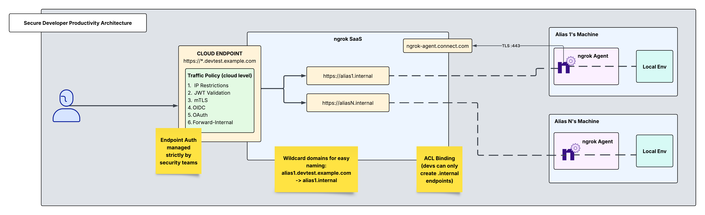
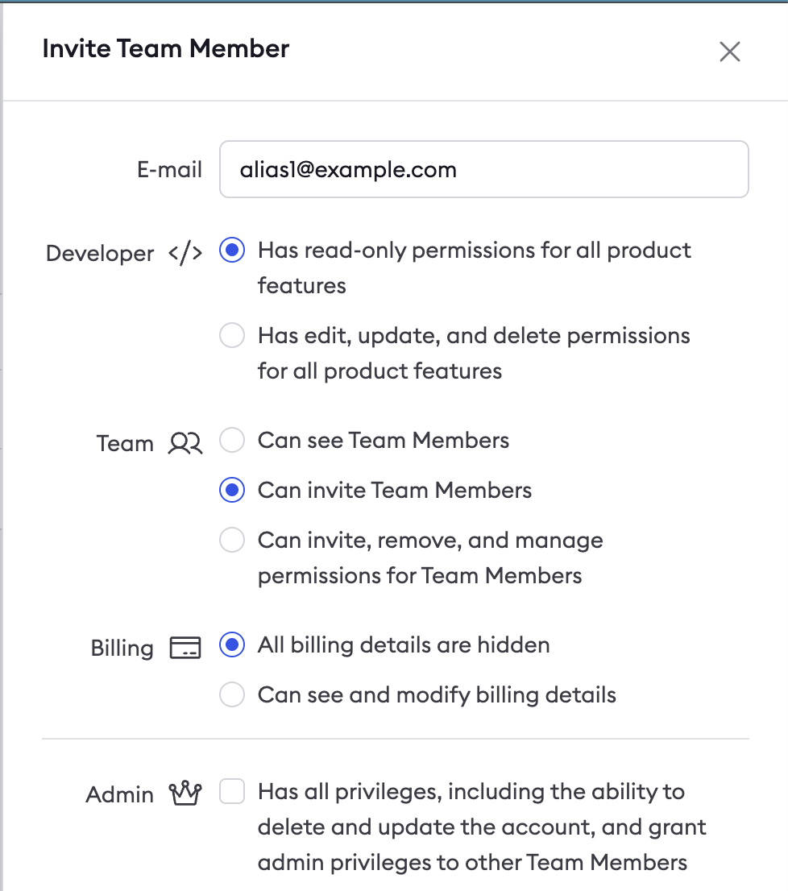
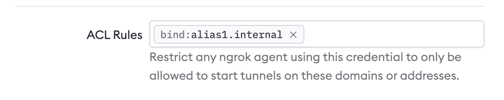
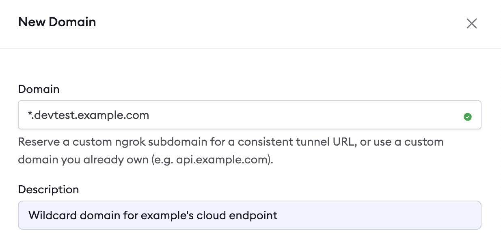

Organizations and enterprises must ensure robust security for their endpoints without causing any interruptions to their developers' experience and productivity.

This guide describes the best practices and features organizations can apply to consistently secure developers using ngrok.

## The "Front Door" method

Instead of exposing individual developer endpoints publicly, you can implement a more secure approach: Creating a single, centralized Cloud Endpoint managed by security teams. This endpoint can be customized with Traffic Policies while keeping developer endpoints private and protected.

## Architectural reference



Create one ngrok account, managed by security or DevOps. The following can be managed centrally at this account's dashboard:

- Cloud endpoint Traffic Policies
- Authtokens and ACL restrictions
- Users and access control

## Add developers as team members to your ngrok account

This will allow you to add each developer using ngrok to your central ngrok account. With RBAC (available on ngrok's pay-as-you-go plan), you also have the option to restrict their access to read-only.



Once the invite is sent, have the developer go to their email and sign up for their account which will be registered under the master account.

## Create an authtoken for each developer

Create a tunnel authtoken for each developer. This authtoken will be specific to each user and will be their key to setting up internal endpoints. Next, assign it an ACL rule. By assigning an ACL rule, you can ensure that this user with this authtoken may only create one internal endpoint bound to their alias. Navigate to the authtokens section on your dashboard and click "new authtoken" and set the description, set the owner to the developer email, and assign it an ACL rule as shown below:



## Developer installs ngrok Agent and defines an internal endpoint in ngrok.yml

Have the developer [install the ngrok agent](https://dashboard.ngrok.com/get-started/setup/) and then have them run the command below to ensure their agent uses the proper authtoken you provisioned for them in the previous step.

```bash
ngrok config add-authtoken <AUTHTOKEN_CREATED_ABOVE>
```

Internal Endpoints are private endpoints that only receive traffic when forwarded through the [forward-internal Traffic Policy action](/traffic-policy/actions/forward-internal/). This allows you to route traffic to an application through ngrok without making it publicly addressable.

Internal endpoint URLs must:

- End with the .internal domain extension
- Use the internal [binding](/universal-gateway/bindings/)

Each developer will have their own configuration file for their agent installed on their machine. As shown below, each config file will contain an internal endpoint unique to that developer's alias. The configuration file can be found at `/path/to/ngrok/ngrok.yml`. Have the developer add their internal endpoint in their configuration file. The final config file should look like this:

```yaml
version: 3
agent:
  authtoken: <AUTHTOKEN_CREATED_ABOVE>
endpoints:
  - name: Internal Endpoint for alias1
    url: https://alias1.internal
    upstream:
      url: {port serving alias1's local application}
```

Within this configuration file, developers have the ability to add any further Traffic Policy actions that may aid them in their testing.

In this way, developers only handle private endpoints and don't have permissions to alter any configurations on public endpoints.

## Reserve a domain for your wildcard Cloud Endpoint

Reserving a wildcard domain is the first step in creating a wildcard Cloud Endpoint to receive traffic on any subdomain of your domain. Navigate to the [domains](https://dashboard.ngrok.com/domains) section in your dashboard and click "new domain". Any naming convention you use for this domain will require proper DNS and CNAME records. These targets are returned after domain creation and can take 5-10 mins for ssl to be established. For billing information on wildcard endpoints, see [wildcard endpoints pricing](/pricing-limits/#wildcard-endpoints).



## Create a public Cloud Endpoint and Traffic Policy

Cloud Endpoints are persistent, always-on endpoints whose creation, deletion, and configuration are managed centrally via the Dashboard or API. 
They exist permanently until they are explicitly deleted. 
Cloud Endpoints do not forward their traffic to an agent by default and instead only use their attached Traffic Policy to handle connections.

This Cloud Endpoint will multiplex across several internal endpoints which point to their corresponding local development environments.

You can use Traffic Policy to forward traffic from your Cloud Endpoint to the correct internal endpoint based on the hostname of the Cloud Endpoint that developers make requests to. Since the Cloud Endpoint is set up as a wildcard URL, any text placed where the wildcard is will forward to its corresponding internal endpoint.

`alias1.devtest.example.com → alias1.internal → alias1's local env`

So, all alias1 has to do is go to that Cloud Endpoint URL in their browser and they will be able to access their local environment. Same goes for alias2, alias3, and aliasN.

To achieve this dynamic routing, replace the default Traffic Policy on the Cloud Endpoint in the dashboard with the following:

```yaml
on_http_request:
  - actions:
      - type: forward-internal
        config:
          url: https://${req.host.split(".devtest.example.com")[0]}.internal
```

## Secure your Cloud Endpoint

Now that traffic is forwarded correctly from the Cloud Endpoint to its corresponding internal endpoints, you can layer on security to the public Cloud Endpoint. There are a variety of Traffic Policy actions to choose from to achieve this. Listed below are YAML snippets and curl commands below for how to enable IP Restrictions, JWT Validation, and mTLS. There are many other actions to choose from which can be found in [Traffic Policy Actions](/traffic-policy/actions/). These actions will be added to your existing Traffic Policy config, preceding the forward-internal action.

### IP restrictions

For developers with a designated source IP, you can use the restrict-ips action to allowlist trusted source IPs where only these IPs will be able to access this Cloud Endpoint.

```yaml
on_http_request:
  - actions:
      - type: restrict-ips
        config:
          enforce: true
          allow:
            - e680:5791:be4c:5739:d959:7b94:6d54:d4b4/128
            - 203.0.113.42/32
      - type: forward-internal
        config:
          url: https://${req.host.split(".devtest.example.com")[0]}.internal
```

### JWT validation

You also have the option to send a JWT to ngrok, specify an allowlist of issuers/JWKS URLs, and ngrok will validate the JWT.

```yaml
on_http_request:
  - actions:
      - type: jwt-validation
        config:
          issuer:
            allow_list:
              - value: https://example.com/issuer
          audience:
            allow_list:
              - value: urn:example:api
          http:
            tokens:
              - type: access_token
                method: header
                name: Authorization
                prefix: "Bearer "
              - type: it+jwt
                method: body
                name: _id_token
          jws:
            allowed_algorithms:
              - RS256
              - ES256
            keys:
              sources:
                additional_jkus:
                - https://example.com/issuer/jku
      - type: forward-internal
        config:
          url: https://${req.host.split(".devtest.example.com")[0]}.internal
```

### mTLS

If you would rather use a CA or PEM version in this scenario, you can also enable mTLS where TLS termination will happen at the ngrok cloud edge.

```yaml
on_tcp_connect:
  - actions:
      - type: terminate-tls
        config:
          mutual_tls_certificate_authorities:
            - |-
              -----BEGIN CERTIFICATE-----
              ...your CA certificate PEM...
              -----END CERTIFICATE-----
on_http_request:
  - actions:
      - type: forward-internal
        config:
          url: https://${req.host.split(".devtest.example.com")[0]}.internal
```

For all of these options, you can either use one or layer multiple actions onto the Cloud Endpoint.

## Create a custom connect URL

Custom connect URLs are available with ngrok's pay-as-you-go plan. This provides a white-labeling capability so that your ngrok agents will connect to _connect.example.com_ instead of the default connection hostname (connect.ngrok-agent.com). Dedicated IPs that are unique for your account which your agents will connect to are also available.  This takes away any danger of rogue agents in your network trying to call home and adds an additional layer of security by specializing your ngrok connectivity.

```bash
curl \
-X POST \
-H "Authorization: Bearer {API_KEY}" \
-H "Content-Type: application/json" \
-H "Ngrok-Version: 2" \
-d '{"description":"Custom connect URL","domain":"connect.example.com"}' \
https://api.ngrok.com/agent_ingresses
```

Once you have created the custom connect url, specify this field within the agent configuration file. Add this section to your agent configuration file to specify the custom connect url:

```yaml
version: 3
agent:
  connect_url: connect.example.com:443
```

## Recap

You have now integrated a system that allows your security team to centrally manage and secure a Cloud Endpoint which developers can seamlessly use to access applications running in their local environments. To recap what you've built:

1. One ngrok agent per developer machine - ACL restricted authtokens provisioned by security specialists for developers.
2. Local, uninterrupted development and testing for engineers, made securely available via cloud and internal endpoints.
3. Granular access with a composable Traffic Policy offering refined and robust security measures for a singular public Cloud Endpoint.
