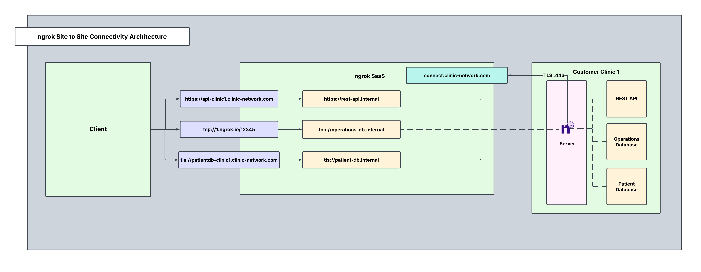

ngrok is a universal gateway, which means it allows you to create secure ingress to any app, IoT device, or service running in a secured customer environment.

This guide will walk you through an example scenario using ngrok to set up a secure, controlled remote access solution for services within a protected customer network. The solution will enable you to grant trusted parties access to critical systems without exposing those systems to the public internet or relying on complex VPN setups.

## Example scenario

Consider a situation where a you have a fleet of customers comprised of medical clinics. Each of these clinics has a host of services living behind a secure firewall which blocks inbound connections, but you require fine grained access to these critical resources. For the purposes of this example scenario, these resources include a REST API, a patient database, and a clinic operations database for each clinic. This guide will walk you through how to set up remote access to the resources in a single clinic (clinic 1), and the steps can be reproduced for each clinic in the customer fleet.

## Architectural reference



### Why only one ngrok Agent per clinic?

Traditionally, you might assume that every service inside the clinic needs its own ngrok agent, but this isn't necessary. A single ngrok agent is installed on a network-accessible server inside the clinic, and it:

1. Acts as a central gateway that can reach any service on the local network, eliminating the need for multiple agents.
2. Creates Internal Endpoints so that each API and database is securely exposed inside ngrok, never publicly visible.
3. Uses Cloud Endpoints for controlled, granular access. External cloud apps can access only what they need.
4. Runs as a background service configured to automatically start on boot, restart after crashes, and log events.

This setup minimizes security risks, simplifies deployment, and ensures continuous uptime for mission-critical services within your customer networks.

## Agent vs SDK vs ngrok Operator - which is right for you?

| **Tool**           | **Ideal Environment**                                                                                                                                                                          |
| ------------------ | ---------------------------------------------------------------------------------------------------------------------------------------------------------------------------------------------- |
| **Agent**          | Simple, lightweight, and quick deployment to connect to customer services on any platform (cloud, on-prem, VM, or physical server). No code changes or complex network configuration required. |
| **SDK**            | Embed ngrok connectivity directly into your application for programmatic control, or when you're building custom integrations (for example, device gateways, BYOC architectures).                     |
| **ngrok Operator** | Customer's environment is Kubernetes-based and you need to expose services securely from inside their cluster to your network, without configuring low-level networking.                       |

All three options leverage ngrok's global network for secure, low-latency access without requiring firewall/NAT changes

### What you'll need

- An ngrok account. If you don't have one, [sign up](https://dashboard.ngrok.com/signup).
- An ngrok agent configured on a customer integrated server. See the [getting started guide](/getting-started/) for instructions on how to install the ngrok agent.
- [An ngrok API Key](https://dashboard.ngrok.com/api/new). You'll need an account first.

### 1. Create a Service User and authtoken to enable isolated Agent management

Create a Service User so that you can create an agent authtoken independent of any user account. A Service User represents a service account, and allows each clinic to have its own authtoken. In the case one authtoken is compromised, only that clinic may be affected rather than all of them.

```bash
curl \
  -X POST \
  -H "Authorization: Bearer <NGROK_API_KEY>" \
  -H "Content-Type: application/json" \
  -H "Ngrok-Version: 2" \
  -d '{"name":"Service User for clinic 1"}' \
  https://api.ngrok.com/bot_users
```

Create an authtoken assigned to this specific Service User. Apply an ACL rule to ensure this Service User can only create internal endpoints for clinic 1.

```bash
curl -X POST \
  -H "Authorization: Bearer <NGROK_API_KEY>" \
  -H "Content-Type: application/json" \
  -d '{"description":"Authtoken for Clinic 1", "owner_id":"<BOT_USER_ID>", "acl": ["bind:*.clinic1.internal"]}' \
  "https://api.ngrok.com/credentials"
```

### 2. Define internal endpoints in ngrok.yml for privatized device access

An [internal endpoint](/universal-gateway/internal-endpoints/) enables a service inside the clinic to be reachable within ngrok, without being publicly exposed. They can:

1. Only receive traffic from Cloud Endpoints or internal services that explicitly route traffic to them.
2. Not be accessed directly from the internet.
3. Be used for telemetry APIs, databases, and dashboards.

After installing the ngrok agent, define all required internal endpoints inside the ngrok configuration file. You can install ngrok and its configuration file in `/path/to/ngrok/ngrok.yml` and the executable in `/path/to/ngrok/ngrok`.

```yaml
version: 3
agent:
  authtoken: AUTHTOKEN_CREATED_IN_STEP_1
endpoints:
  - name: rest-api
    url: https://rest-api.clinic1.internal
    upstream:
      url: 8080 # REST API
  - name: patient-db
    url: tls://patient-db.clinic1.internal
    upstream:
      url: 5432 # PostgreSQL Patient database
  - name: operations-db
    url: tcp://operations-database.clinic1.internal:433
    upstream:
      url: 1433 # SQL Operations database
```

### 3. Reserve a custom wildcard domain

---

Creating a custom wildcard domain will allow you to create endpoints and receive traffic on any subdomain of your domain. Wildcard domains are available on ngrok pay-as-you-go-plans when you verify with support. It can be helpful to create a separate subdomain for each clinic you wish to bring online and specify which resource the endpoint will point to for that clinic.

```bash
curl \
  -X POST \
  -H "Authorization: Bearer <NGROK_API_KEY>" \
  -H "Content-Type: application/json" \
  -H "Ngrok-Version: 2" \
  -d '{"domain":"*.clinic-network.com","region":"us"}' \
  https://api.ngrok.com/reserved_domains
```

### 4. Reserve a TCP address for your TCP-based Cloud Endpoint

When you reserve a TCP Address, you can create a TCP Cloud Endpoint that binds to that domain. Reserved TCP addresses are available on ngrok's pay-as-you-go plan.

```bash
curl -X POST \
  -H "Authorization: Bearer <NGROK_API_KEY>" \
  -H "Content-Type: application/json" \
  -H "Ngrok-Version: 2" \
  -d '{"description":"Operations DB TCP Addr for Clinic 1", "region":"us"}'\
  https://api.ngrok.com/reserved_addrs
```

### 5. Create your Cloud Endpoints for persistent API and database access

A [Cloud Endpoint](/universal-gateway/cloud-endpoints/) is a permanent, externally accessible entry point into the clinic that's also:

1. Managed centrally via the ngrok API or dashboard.
2. Always on, not tied to the lifecycle of the agent.
3. Does not forward traffic to the agent by default—it must be configured to route traffic to internal endpoints.
4. Used for exposing services to external cloud apps securely.

Since the REST API and databases must be always accessible, create permanent Cloud Endpoints that will route traffic to their internal endpoints.

With the reserved TCP address, create a TCP Cloud Endpoint for the clinic operations database:

```bash
curl -X POST \
  -H "Authorization: Bearer <NGROK_API_KEY>" \
  -H "Content-Type: application/json" \
  -H "Ngrok-Version: 2" \
  -d '{
    "url": "YOUR_RESERVED_TCP_ADDR_FROM_STEP_4",
    "type": "cloud",
    "bindings": ["public"]
  }'
  https://api.ngrok.com/endpoints
```

With the reserved wildcard domain from step 3, you don't need to reserve additional domains for the REST API and patient database, and can directly create HTTPS and TLS Cloud Endpoints:

```bash
curl -X POST https://api.ngrok.com/endpoints \
 -H "Authorization: Bearer <NGROK_API_KEY>" \
 -H "Content-Type: application/json" \
 -H "Ngrok-Version: 2" \
 -d '{
  "type": "cloud",
  "url": "https://api-clinic1.clinic-network.com",
 }'
```

```bash
curl -X POST https://api.ngrok.com/endpoints \
 -H "Authorization: Bearer <NGROK_API_KEY>" \
 -H "Content-Type: application/json" \
 -H "Ngrok-Version: 2" \
 -d '{
  "type": "cloud",
  "url": "tls://patientdb-clinic1.clinic-network.com",
 }'
```

### 6. Secure your endpoints with Traffic Policy

There are a variety of Traffic Policy actions to choose from to layer security on to endpoints. Listed below are YAML snippets and curl commands below for how to enable IP Restrictions, JWT Validation, and mTLS. There are many other actions to choose from which can be found in [Traffic Policy Actions](/traffic-policy/actions/). These actions will be added to the existing Traffic Policy config, preceding the forward-internal action.

Because patient data is extremely sensitive, you'll want to add an extra layer of protection for the TLS Cloud Endpoint. ngrok's [Traffic Policy](/traffic-policy/) is the perfect way to do this in a flexible and robust manner. You can use Traffic Policy's [forward-internal action](/traffic-policy/actions/forward-internal/) to forward traffic from public Cloud Endpoints to internal Agent Endpoints.

Navigate to your newly created TLS Cloud Endpoint in the [endpoints](https://dashboard.ngrok.com/authtokens) tab on the dashboard, and apply a terminate-tls Traffic Policy action to require a minimum tls version. Since this is a Cloud Endpoint, TLS will terminate at the ngrok edge by default, but you can also create an action within the agent configuration file if you wish to terminate TLS at the ngrok agent itself.

The Traffic Policy file for tls://patientdb-clinic1.clinic-network.com should look like this:

```yaml
on_tcp_connect:
  - actions:
    - type: terminate-tls
      config:
        min_version: "1.3"
    - type: forward-internal
      config:
        url: tls://patient-db.clinic1.internal:443
```

To deter port scanners or other malicious actors from the TCP Cloud Endpoint, add IP restrictions using the restrict-ips Traffic Policy action onto the clinic operations tcp endpoint.

The Traffic Policy file for the tcp Cloud Endpoint should look like this:

```yaml
on_tcp_connect:
  - actions:
    - type: restrict-ips
      config:
        enforce: true
        allow:
          - e680:5791:be4c:5739:d959:7b94:6d54:d4b4/128
          - 203.0.113.42/32
    - type: forward-internal
      config:
        url: tcp://operations-database.clinic1.internal:443
```

Finally, to secure the HTTPS Cloud Endpoint, add a check to make sure a specific header auth token is present in the request along with a JWT validation step before the REST API can be accessed.

The Traffic Policy file for https://api-clinic1.clinic-network.com should look like this:

```yaml
on_http_request:
  - expressions:
      - hasReqHeader('example-token')
  - actions:
      - type: jwt-validation
        config:
          issuer:
            allow_list:
              - value: 'https://example.com/issuer'
          audience:
            allow_list:
              - value: 'urn:example:api'
          http:
            tokens:
              - type: access_token
                method: header
                name: Authorization
                prefix: 'Bearer '
              - type: it+jwt
                method: body
                name: _id_token
          jws:
            allowed_algorithms:
              - RS256
              - ES256
            keys:
              sources:
                additional_jkus:
                  - 'https://example.com/issuer/jku'
  - type: forward-internal
    config:
      url: 'https://rest-api.clinic1.internal:443'
```

You can also create a Cloud Endpoint and attach its corresponding Traffic Policies with a single API call. Below are the curl commands to create each endpoint and attach its Traffic Policy.

#### TLS endpoint with minimum TLS version

```bash
curl -X POST https://api.ngrok.com/endpoints \
  -H "Authorization: Bearer <NGROK_API_KEY>" \
  -H "Content-Type: application/json" \
  -H "Ngrok-Version: 2" \
  -d '{
    "type": "cloud",
    "url": "tls://patientdb-clinic1.clinic-network.com",
    "traffic_policy": "{ \"on_tcp_connect\": [ { \"actions\": [ { \"type\": \"terminate-tls\", \"config\": { \"min_version\": \"1.3\" } } ] } ], { \"type\": \"forward-internal\", \"config\": { \"url\": \"tls://patient-db.clinic1.internal:443\" } } ] } ] }"
  }'
```

#### TCP endpoint with IP restrictions

```bash
curl -X POST https://api.ngrok.com/endpoints \
  -H "Authorization: Bearer <NGROK_API_KEY>" \
  -H "Content-Type: application/json" \
  -H "Ngrok-Version: 2" \
  -d '{
    "type": "cloud",
    "url": "RESERVED_TCP_ADDR_FROM_STEP_4",
    "traffic_policy": "{ \"on_tcp_connect\": [ { \"actions\": [ { \"type\": \"restrict-ips\", \"config\": { \"enforce\": true, \"allow\": [ \"e680:5791:be4c:5739:d959:7b94:6d54:d4b4/128\", \"203.0.113.42/32\" ] } }, { \"type\": \"forward-internal\", \"config\": { \"url\": \"tcp://operations-database.clinic1.internal:443\" } } ] } ] }"
  }'
```

#### HTTPS endpoint with JWT validation

```bash
curl -X POST https://api.ngrok.com/endpoints \
-H "Authorization: Bearer <NGROK_API_KEY>" \
-H "Content-Type: application/json" \
-H "Ngrok-Version: 2" \
-d '{
"type": "cloud",
"url": "https://api-clinic1.clinic-network.com",
"traffic_policy": "{ \"on_http_request\": [ { \"actions\": [ { \"type\": \"jwt-validation\", \"config\": { \"issuer\": { \"allow_list\": [ { \"value\": \"https://example.com/issuer\" } ] }, \"audience\": { \"allow_list\": [ { \"value\": \"urn:example:api\" } ] }, \"http\": { \"tokens\": [ { \"type\": \"access_token\", \"method\": \"header\", \"name\": \"Authorization\", \"prefix\": \"Bearer \" }, { \"type\": \"it+jwt\", \"method\": \"body\", \"name\": \"_id_token\" } ] }, \"jws\": { \"allowed_algorithms\": [ \"RS256\", \"ES256\" ], \"keys\": { \"sources\": { \"additional_jkus\": [ \"https://example.com/issuer/jku\" ] } } } } }, { \"type\": \"forward-internal\", \"config\": { \"url\": \"https://rest-api.clinic1.internal:443\" } } ] } ] }"
}'
```

---

## Additional ngrok features

### Enable Endpoint Pooling

You can use Endpoint Pooling with multiple internal Agent Endpoints to achieve redundancy and high availability for services inside your network. If desired, you can install a second agent within the customer network as a failover in case agents in the wild go offline.

Configure each Agent Endpoint to use the same ngrok internal URL. This automatically forms an endpoint pool. Incoming traffic to the pooled URL is automatically distributed among all healthy endpoints in the pool. If one endpoint goes offline, traffic is seamlessly routed to the remaining endpoints, ensuring redundancy and failover

```yaml
version: 3
agent:
  authtoken: <YOUR_NGROK_AUTHTOKEN>
  endpoints:
    - name: service-a
      url: 'https://service.internal'
      pooling_enabled: true
      upstream:
        url: 8080
    - name: service-b
      url: 'https://service.internal'
      pooling_enabled: true
      upstream:
        url: 8081
```

### Create a custom Connect URL

This provides a white-labeling capability so that your ngrok agents will connect to `connect.example.com` instead of the default connection hostname (connect.ngrok-agent.com). Dedicated IPs that are unique for your account which your agents will connect to are also available. This takes away any danger of rogue agents in your network trying to call home and adds an additional layer of security by specializing your ngrok connectivity. Custom connect URLs are available with ngrok's pay-as-you-go plan as an additional paid feature.

```bash
curl \
  -X POST \
  -H "Authorization: Bearer {API_KEY}" \
  -H "Content-Type: application/json" \
  -H "Ngrok-Version: 2" \
  -d '{"description":"Custom connect URL","domain":"connect.example.com"}' \
  https://api.ngrok.com/agent_ingresses
```

Once you have created the custom connect url, specify this field within the agent configuration file. Add this section to your agent configuration file to specify the custom connect url:

```yaml
version: 3
agent:
  connect_url: connect.example.com:443
```

### Install ngrok as a background service

Install and start the service:

```bash
ngrok service install --config /etc/ngrok.yml
ngrok service start
```

<Note>
In most cases, installing ngrok as a service requires administrator privileges.
</Note>

This will start all tunnels defined in the configuration file, ensure ngrok runs persistently in the background, and integrate with native OS service tooling.

## Recap

You have now integrated a system that allows you to seamlessly and securely access any and all remote resources within your customer's network. To recap what you've built:

1. One ngrok agent per clinic and no need for multiple installs.
2. Always-online API and databases, securely available via cloud and internal endpoints.
3. ngrok runs as a background service, which means it's reliable and will always auto-restart.
4. Granular access with a composable Traffic Policy offering refined and robust security measures for endpoints.

Not sure how to explain ngrok to your end users? Check out [the guide on ngrok's standards on security, trust, compliance, and privacy](/guides/site-to-site-connectivity/end-customers/).
