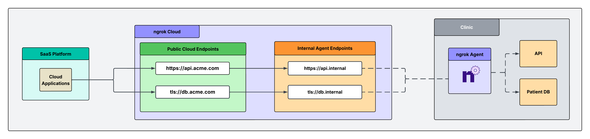
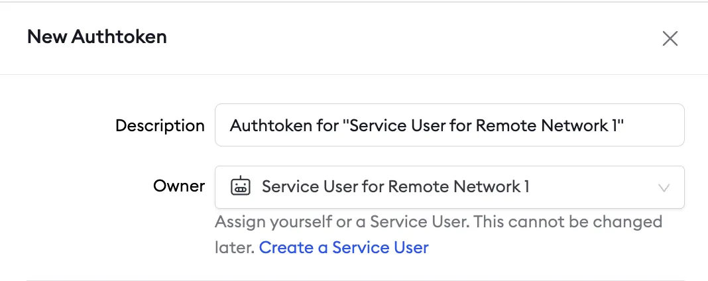
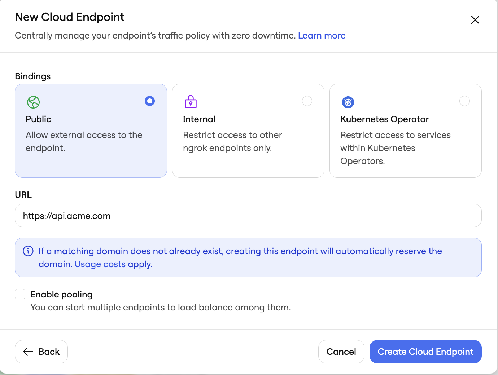

ngrok is a universal gateway, which means it allows you to connect to any app, IoT device, or service without networking expertise.

This guide will walk you through an example scenario using ngrok to set up secure, remote access to APIs and DBs running in your customer's on prem, private network. The solution will enable you to grant trusted parties access to critical systems without exposing those systems to the public internet or relying on complex VPN setups.

## Example scenario

Consider a situation where your company (Acme Corp.) needs direct access to resources running in your customer's private network. This network is a clinic that runs a third party API and a DB containing sensitive patient information. In this scenario, this clinic blocks inbound connections. However, your SaaS applications need to reach that API to make requests and fetch data from that DB for mission critical operations. Specifically, the patient DB needs to be e2e TLS encrypted, with mTLS terminating in the customer's network.

## Architectural reference



### Why only one ngrok Agent per network?

Traditionally, you might assume that every server inside the network needs its own ngrok agent, but this isn't necessary. A single ngrok agent is installed on a network-accessible machine inside the network. The agent acts as a central gateway (jumpbox) that can reach any machine on the local network, eliminating the need for multiple agents.

## What you'll need

- An ngrok account. If you don't have one, [sign up](https://dashboard.ngrok.com/signup).
- An ngrok agent configured in a remote network. See the [getting started guide](/getting-started/) for instructions on how to install the ngrok agent.

### Step 1. Create a Service User and authtoken for isolated network access

First, you'll create a service user and an associated authtoken for each of your customers. A Service User is intended for automated systems that programmatically interact with your ngrok account (other platforms sometimes call this concept a Service Account). Create a separate Service User + associated authtoken for each of your customers so that:

1. Their usage of your ngrok account is isolated and scoped with a specific permission set
2. If a customer is compromised you can revoke their access independently
3. Agent start/stop audit events are properly attributed to each customer
4. Your ngrok agents don't stop working if the human user who set them up leaves your ngrok account.

Navigate to the [Service Users](https://dashboard.ngrok.com/service-users) section of your dashboard and click "new Service User".


Next, create an authtoken assigned to this specific bot user.



### Step 2: Install the ngrok Agent within your remote network and configure internal Agent endpoints in ngrok.yml

Configure the agent to create internal Agent Endpoints that point to the services you want to remotely access. This will connect the services to your ngrok account but nothing will be able to connect to them until completing the subsequent steps. The configuration to achieve this is shown below in the example agent configuration file.

Internal Endpoints are private endpoints that only receive traffic when forwarded through the [forward-internal Traffic Policy action](/traffic-policy/actions/forward-internal/). This allows you to route traffic to an application through ngrok without making it publicly addressable. Internal endpoint URL hostnames must end with `.internal`.

After installing the ngrok agent, define internal endpoints for each service you want to remotely access inside the ngrok configuration file. Additionally, here is where you'll configure the agent to terminate mTLS for the patient DB endpoint. You can install ngrok and its configuration file in `/path/to/ngrok/ngrok.yml` and the executable in `/path/to/ngrok/ngrok`.

```yaml
version: 3

agent:
  authtoken: AUTHTOKEN_CREATED_IN_STEP_1

endpoints:
  - name: Internal Endpoint for API
    url: https://api.internal
    upstream:
      url: 8080

  - name: Internal Endpoint for patient DB
    url: tls://patient-db.internal
    upstream:
      url: 8081
    agent_tls_termination:
      server_certificate: /path/to/your-cert.crt
      server_private_key: /path/to/your-key.key
      mutual_tls_certificate_authorities:
        - "list CAs here"
```

### Step 3: Create your Cloud Endpoints and attach a Traffic Policy

Cloud Endpoints are persistent, always-on endpoints whose creation, deletion, and configuration is managed centrally via the Dashboard or API. They exist permanently until they are explicitly deleted. Cloud Endpoints do not forward their traffic to an agent by default and instead only use their attached **Traffic Policy** to handle connections.

Create a public Cloud Endpoint in the ngrok dashboard by navigating to endpoints and clicking **new** as shown in the screenshot below:



Additionally, create a Cloud Endpoint for the patient DB: `tls://db.acme.com`.

Click on your newly created API Cloud Endpoint and replace the default Traffic Policy with:

```yaml
on_http_request:
  - actions:
      - type: forward-internal
        config:
          url: https://api.internal
```

Click on your newly created DB Cloud Endpoint and replace the default Traffic Policy with:

```yaml
on_tcp_connect:
  - actions:
      - type: forward-internal
        config:
          url: tls://db.internal
```

### Step 4: Secure your API Cloud Endpoint with IP restrictions

Navigate to your newly created Cloud Endpoints in the [endpoints](https://dashboard.ngrok.com/endpoints) tab on your ngrok dashboard, and apply a Traffic Policy action to each. For this example, you can apply IP restrictions to your API endpoint. Browse through the full list of Traffic Policy actions listed [here](/traffic-policy/actions/). You can add this action directly to the Cloud Endpoint's YAML configuration. The final Traffic Policy config for each endpoint can be seen below:

**https://api.acme.com**

```yaml
on_http_request:
  - actions:
      - type: restrict-ips
        config:
          enforce: true
          allow:
            - "allowed ips here (IPv4 or IPv6)"

      - type: forward-internal
        config:
          url: https://api.internal
```

Now that you have this Traffic Policy action in place, you have IP restrictions layered in front of your API endpoint, and your connection to the patient DB is end-to-end encrypted, with the ngrok agent validating mTLS.

## Additional ngrok features

### Set up a custom connect URL

When the ngrok agent starts, it makes an outbound connection via TLS over port 443 to the ngrok cloud service. This connection is made to the "agent connect URL". By default, [this connect URL](/agent/connect-url/) is `connect.ngrok-agent.com`, but it can be white-labeled so that your ngrok agents will connect to `connect.acme.com` instead of the default connection hostname. This is highly recommended because your customers may need to whitelist egress traffic out of their networks and customers will see this traffic in their network logs. You can also request dedicated IPs for your connect URL that are unique to your account.

```bash
curl \
-X POST \
-H "Authorization: Bearer {API_KEY}" \
-H "Content-Type: application/json" \
-H "Ngrok-Version: 2" \
-d '{"description":"Custom connect URL","domain":"connect.acme.com"}' \
https://api.ngrok.com/agent_ingresses
```

Once the custom connect url has been created, specify this field within the agent configuration file. Add this section to your agent configuration file to specify the custom connect url:

```yaml
version: 3
agent:
  connect_url: connect.acme.com:443
```

### Install ngrok as a background service

You can install ngrok in your customer's network as a native background system service. This ensures the ngrok agent starts on boot and that it will be restarted if it crashes for any reason. This helps ensure that you recover connectivity in the case of unexpected software or hardware failures. When you do so, ngrok will start all endpoints defined in the configuration file.

```bash
ngrok service install --config /etc/ngrok.yml
ngrok service start
```

<Note>
In most cases, installing ngrok as a service requires administrator privileges.
</Note>

### Eliminate single points of failure with redundant agents

Running a single agent in your customer's network is a single point of failure. If that agent or the hardware it runs on fails for any reason, you can no longer connect to the remote services in your customer's network. You can run multiple agents to achieve redundancy and high availability in the case of these failures.

To do this, you will run a separate, second ngrok agent in the customer's network (ideally on a different machine) with an identical configuration file with one small tweak: on each endpoint definition you must specify `pooling_enabled: true`. This is ngrok's Endpoint Pooling feature. When two endpoints start with the same URL and have pooling enabled, they form an endpoint pool. Incoming traffic to the pooled URL is automatically distributed among all healthy endpoints in the pool. If one endpoint goes offline, traffic is seamlessly routed to the remaining endpoints, ensuring redundancy and failover.

```yaml
# Server 1 (agent1.yml)
version: 3
agent:
  authtoken: <YOUR_NGROK_AUTHTOKEN>
endpoints:
  - name: my-service
    url: 'https://service.internal'
    pooling_enabled: true
    upstream:
      url: http://localhost:8080
```

```yaml
# Server 2 (agent2.yml)
version: 3
agent:
  authtoken: <YOUR_NGROK_AUTHTOKEN>
endpoints:
  - name: my-service
    url: 'https://service.internal'  # Same URL as Server 1
    pooling_enabled: true
    upstream:
      url: http://localhost:8080
```
