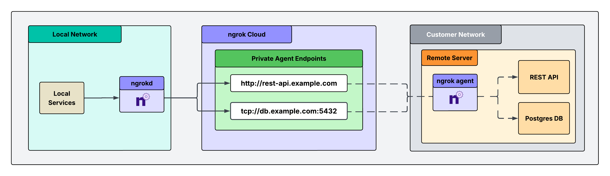
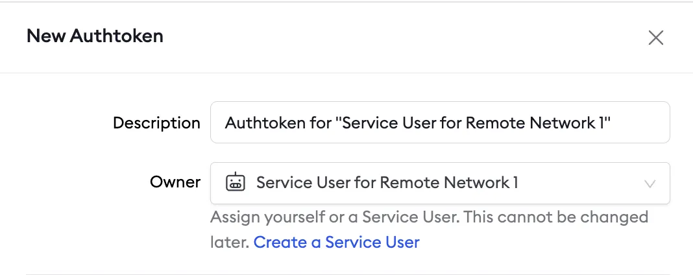
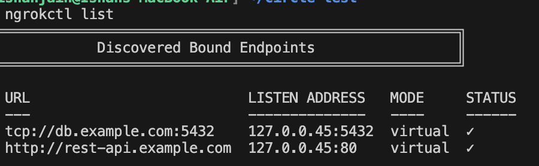

ngrok's Gateway allows you to connect to any app, IoT device, or service without networking expertise.

This guide walks you through how to configure `ngrokd`: an ngrok component that enables a private, end-to-end solution for accessing remote services in a customer's private network. This solution lets you securely access critical systems remotely without exposing them through public, authenticated endpoints. Instead, it leverages private endpoints that are only reachable from your local environment, eliminating your external attack surface while maintaining full access.

## Architectural reference



## What you'll need

- An ngrok account. If you don't have one, [sign up](https://dashboard.ngrok.com/signup).
- An ngrok API key. You'll need an account first.
- An ngrok agent installed in a remote customer network. See the [Agent CLI Quickstart](/gateway/agent-cli-quickstart/) for instructions on how to install the ngrok agent.

## 1. Install ngrokd in your local environment, start it, and set your API key

`ngrokd` is a lightweight daemon that makes your ngrok endpoints privately accessible and locked down to your local services. It automatically discovers your endpoints, assigns them local addresses, and forwards traffic through ngrok's secure infrastructure, allowing your apps to reach remote services without any network configuration. Think of it as a local proxy that turns ngrok endpoints into services that feel like they're running on your machine.

<Tabs>
  <Tab title="Mac">
    ```bash
    curl -fsSL https://raw.githubusercontent.com/ngrok/ngrokd/main/install.sh | sudo bash
    sudo ngrokd install
    sudo ngrokd start
    ngrokctl set-api-key YOUR_NGROK_API_KEY
    ```
  </Tab>
  <Tab title="Linux">
    ```bash
    curl -fsSL https://raw.githubusercontent.com/ngrok/ngrokd/main/install.sh | sudo bash
    sudo ngrokd install
    sudo ngrokd start
    ngrokctl set-api-key YOUR_NGROK_API_KEY
    ```
  </Tab>
  <Tab title="Windows">
    ```powershell
    # Run as Administrator
    iwr -useb https://raw.githubusercontent.com/ngrok/ngrokd/main/install.ps1 | iex
    Start-Process ngrokd -ArgumentList '--config=C:\ProgramData\ngrokd\config.yml' -WindowStyle Hidden
    ngrokctl set-api-key YOUR_NGROK_API_KEY
    ```
  </Tab>
  <Tab title="Docker">
    ```bash
    docker pull ngrok/ngrokd:latest
    docker run -d \
      --name ngrokd \
      --cap-add=NET_ADMIN \
      -e NGROK_API_KEY=<YOUR_NGROK_API_KEY> \
      -v ngrokd-data:/etc/ngrokd \
      ngrok/ngrokd:latest
    ```
  </Tab>
</Tabs>

## 2. Create a service user and authtoken for isolated network access

Create a service user and an associated authtoken for each of your customers.
A service user is intended for automated systems that programmatically interact with your ngrok account (other platforms sometimes call this concept a Service Account).
Create a separate service user and associated authtoken for each customer so that:

- Their usage of your ngrok account is isolated and scoped with a specific permission set
- If an agent is compromised, you can revoke its access independently
- Agent start/stop audit events are properly attributed to each customer
- Your ngrok agents don't stop working if the human user who set them up leaves your ngrok account

Navigate to the [Service Users](https://dashboard.ngrok.com/service-users) section of your dashboard and click **New Service User**.


Next, create an authtoken assigned to this specific service user.



## 3. Install the ngrok agent within your remote network and configure private Agent Endpoints in ngrok.yml

First, install the agent in the customer's remote network, either on a gateway or directly on a device.
Follow the [Agent CLI Quickstart](/gateway/agent-cli-quickstart/) for installation instructions.

Then, configure the agent to create private Agent Endpoints pointing to the services you want to remotely access.
This connects the services to your ngrok account, and the configuration is shown in the example agent configuration file below.

**Private Agent Endpoints** are private endpoints that can **only** receive traffic from services on your local network where `ngrokd` is installed.
These endpoints are not publicly addressable anywhere on the internet, and access is **completely locked down** to your local environment.

After installing the ngrok agent, define private Agent Endpoints for each service you want to remotely access inside the ngrok configuration file at `/path/to/ngrok/ngrok.yml`:

```yaml
version: 3

agent:
  authtoken: AUTHTOKEN_CREATED_IN_STEP_2

endpoints:
  - name: Internal Endpoint for Controller
    url: http://controller.example.com
    upstream:
      url: 9080
    bindings:
      - kubernetes
  - name: Internal Endpoint for Database
    url: tcp://db.example.com:5432
    upstream:
      url: 5432
    bindings:
      - kubernetes
```

Once you've saved the configuration, activate your endpoints by running:

```bash
ngrok start --all
```

## 4. Test end-to-end connectivity from your local environment to upstream services

From the machine where `ngrokd` is running, run:

```bash
ngrokctl list
```

You should see your private endpoints listed:



From here, you can curl your HTTP endpoint and verify you get the expected response.
The same can be done for your TCP endpoint, for example connecting to a database:

```bash
psql -h db.example.com -p 5432 -U myuser mydb
```

## What's next

- [Install ngrok as a background service](/guides/site-to-site-connectivity/background-service) to ensure the agent starts on boot and recovers from failures.
- [Eliminate single points of failure with redundant agents](/guides/site-to-site-connectivity/redundant-agents) to achieve high availability.
