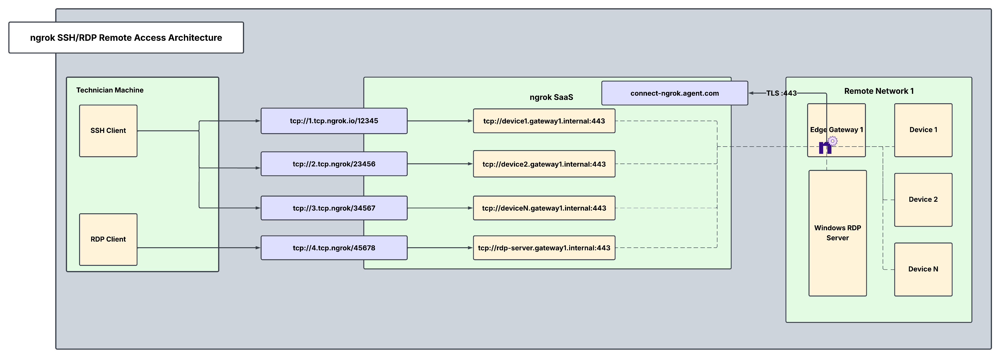

By creating secure TCP endpoints, ngrok enables easy, centralized, access for technicians, engineers, and IT admins to maintain and update remote devices and services. This guide will help you to streamline connectivity without compromising security when it comes to remote access using SSH or RDP.

Examples where this is applicable include secure SSH into remote IoT devices or connecting to a Windows RDP server in a remote network. This guide demonstrates usability for a single remote network with an edge gateway per network (edge gateway 1). It can be scaled to many networks either with or without a central gateway.

## Architectural reference



### Why only one ngrok agent per remote network?

Traditionally, you might assume that every service/device inside the network needs its own ngrok agent, but this isn't necessary. A single ngrok agent is installed on a network-accessible server inside the remote network, and it:

1. Acts as a central gateway that can reach any service on the local network, eliminating the need for multiple agents.
2. Creates Internal Endpoints so that each server/device is securely exposed inside ngrok, never publicly visible.
3. Uses Cloud Endpoints for controlled, granular access. External cloud apps can access only what they need.
4. Runs as a background service configured to automatically start on boot, restart after crashes, and log events.

This setup minimizes security risks, simplifies deployment, and ensures continuous uptime for mission-critical connections within your remote devices and servers.

## What you'll need

- An ngrok account. If you don't have one, [sign up](https://dashboard.ngrok.com/signup).
- An ngrok agent, configured on your edge gateway or remote device/service. See the [getting started guide](/getting-started/) for instructions on how to install the ngrok agent.
- [An ngrok API Key](https://dashboard.ngrok.com/api/new). You'll need an account first.

### 1. Create a Service User and authtoken to enable isolated agent management

Create a Service User so that you can create an agent authtoken independent of any user account. A Service User represents a service account, and allows each server to have its own authtoken. In the case one authtoken is compromised, only that agent may be affected rather than all of them.

---

```bash
curl \
-X POST \
-H "Authorization: Bearer <NGROK_API_KEY>" \
-H "Content-Type: application/json" \
-H "Ngrok-Version: 2" \
-d '{"name":"Service User for Edge Gateway 1"}' \
https://api.ngrok.com/bot_users
```

Create an authtoken assigned to this specific Service User. Apply an ACL rule to ensure this Service User can only create internal endpoints for edge gateway 1.

```bash
curl -X POST \
 -H "Authorization: Bearer <NGROK_API_KEY>" \
 -H "Content-Type: application/json" \
 -d '{"description":"Authtoken for Gateway 1", "owner_id":"<BOT_USER_ID>", "acl": ["bind:*.gateway1.internal"]}' \
 "https://api.ngrok.com/tunnel_credentials"
```

### 2. Define internal endpoints in ngrok.yml for privatized device access

An [internal endpoint](/universal-gateway/internal-endpoints/) enables a service inside the network to be reachable within ngrok, without being publicly exposed. They can:

1. Only receive traffic from cloud endpoints or internal services that explicitly route traffic to them.
2. Not be accessed directly from the internet.
3. Be used for telemetry APIs, databases, and dashboards.

After installing the ngrok agent, define all required internal endpoints inside the ngrok configuration file. You can install ngrok and its configuration file in `/path/to/ngrok/ngrok.yml` and the executable in `/path/to/ngrok/ngrok`.

```yaml
version: 3
agent:
  authtoken: AUTHTOKEN_CREATED_IN_STEP_1
endpoints:
  - name: Internal Endpoint for Device 1
    url: 'tcp://device1.gateway1.internal:443'
    upstream:
      url: 22
  - name: Internal Endpoint for Device 2
    url: 'tcp://device2.gateway1.internal:443'
    upstream:
      url: 22
  - name: Internal Endpoint for Device N
    url: 'tcp://deviceN.gateway1.internal:443'
    upstream:
      url: 22
  - name: Internal Endpoint for RDP Server
    url: 'tcp://rdp-server.gateway1.internal:443'
    upstream:
      url: 3389
```

If there is no edge gateway present in your network, you must configure each agent on each device with an internal endpoint for that device.

### 3. Reserve a tcp address for each device/server

Reserving a TCP address is required for creating a cloud endpoint which will be done in a later step. By reserving a TCP address, this address is held specifically for your ngrok account. You will do this for each device connected to an edge gateway as well as for the rdp server.

---

```bash
curl \
-X POST \
-H "Authorization: Bearer {API_KEY}" \
-H "Content-Type: application/json" \
-H "Ngrok-Version: 2" \
-d '{"description":"TCP Addr for Device 1","region":"us"}' \
https://api.ngrok.com/reserved_addrs
```

Repeat the above command for each device/server you need remote access to.

### 4. Create your TCP cloud endpoint and attach a Traffic Policy

A [cloud endpoint](/universal-gateway/cloud-endpoints/) is a permanent, externally accessible entry point into the network that's also:

1. Managed centrally via the ngrok API or dashboard.
2. Always on, not tied to the lifecycle of the agent. Configuration can be modified at the cloud level via the dashboard/API (no need to change the config at the device itself)
3. Does not forward traffic to the agent by default—it must be configured to route traffic to internal endpoints.
4. Used for exposing services to external cloud apps securely.

The curl command below leverages ngrok's platform API to create a cloud endpoint and attach a traffic policy to it. ngrok's [Traffic Policy](/traffic-policy/) is the perfect way to forward and manipulate traffic in a flexible and robust manner. In this case, this command creates the endpoint and attaches a [forward-internal](/traffic-policy/actions/forward-internal/) action which will forward traffic from the cloud endpoint to the internal endpoint. This will also need to be done for each device connected to the edge gateway where the agent sits.

---

```bash
curl \
- X POST \
- H "Authorization: Bearer <NGROK_API_KEY>" \
- H "Content-Type: application/json" \
- H "Ngrok-Version: 2" \
- d '{ "bindings": ["public"], "description": "TCP cloud endpoint for Device 1", "metadata": "{\"environment\\": \"staging\"}", "traffic_policy": "{\"on_tcp_connect\":[{\"actions\":[{\"type\":\"forward-internal\",\"config\":{\"url\":\"tcp://device1.gateway1.internal:443\"}}]}]}", "type": "cloud", "url": "<YOUR_RESERVED_ADDR_FROM_STEP_3>"}'
\ https://api.ngrok.com/endpoints
```

### 5. Secure your cloud endpoint with IP restrictions

Navigate to your newly created cloud endpoint in the [endpoints](https://dashboard.ngrok.com/authtokens) tab on your ngrok dashboard, and apply a restrict-ips traffic policy action to enable a source IP whitelist. By enabling IP restrictions, we can directly filter who/what can use the endpoint and prevent port scanners or other malicious actors. You can add this action directly to the cloud endpoint's YAML configuration. The properly formatted config for this action can be seen below:

```yaml
version: 3
agent:
  authtoken: AUTHTOKEN_CREATED_IN_STEP_1
endpoints:
  - name: Internal Endpoint for Device 1
    url: 'tcp://device1.gateway1.internal:443'
    upstream:
      url: 22
  - name: Internal Endpoint for Device 2
    url: 'tcp://device2.gateway1.internal:443'
    upstream:
      url: 22
  - name: Internal Endpoint for Device N
    url: 'tcp://deviceN.gateway1.internal:443'
    upstream:
      url: 22
  - name: Internal Endpoint for RDP Server
    url: 'tcp://rdp-server.gateway1.internal:443'
    upstream:
      url: 3389
```

You can also create the TCP endpoint and attach its traffic policy with the forward-internal and restrict-ips actions all in one API call:

```bash
curl -X POST https://api.ngrok.com/endpoints \
 -H "Authorization: Bearer <NGROK_API_KEY>" \
 -H "Content-Type: application/json" \
 -H "Ngrok-Version: 2" \
 -d '{
  "type": "cloud",
  "url": "RESERVED_TCP_ADDR_FROM_STEP_3",
  "traffic_policy": "{ \"on_tcp_connect\": [ { \"actions\": [ { \"type\": \"restrict-ips\", \"config\": { \"enforce\": true, \"allow\": [ \"e680:5791:be4c:5739:d959:7b94:6d54:d4b4/128\", \"203.0.113.42/32\" ] } }, { \"type\": \"forward-internal\", \"config\": { \"url\": \"tcp://device1.gateway1.internal:443\" } } ] } ] }"
 }'
```

### 6. Use your ngrok TCP endpoints with your SSH/RDP clients

Now that you have created and secured your tcp cloud endpoints and they forward to the correct upstream devices, you can use these TCP endpoints in your existing SSH/RDP client setups to test your remote connectivity.

## Additional ngrok features

### Enable endpoint pooling

You can use endpoint pooling with multiple internal agent endpoints to achieve redundancy and high availability for services inside your network. If desired, you can install a second agent within the remote network as a failover in case agents in the wild go offline.

Configure each agent endpoint to use the same ngrok internal URL. This automatically forms an endpoint pool. Incoming traffic to the pooled URL is automatically distributed among all healthy endpoints in the pool. If one endpoint goes offline, traffic is seamlessly routed to the remaining endpoints, ensuring redundancy and failover

```yaml
version: 3
agent:
  authtoken: <YOUR_NGROK_AUTHTOKEN>
  endpoints:
    - name: service-a
      url: 'https://service.internal'
      pooling_enabled: true
      upstream:
        url: 8080
    - name: service-b
      url: 'https://service.internal'
      pooling_enabled: true
      upstream:
        url: 8081
```

### Create a custom connect URL

This provides a white-labeling capability so that your ngrok agents will connect to _connect.example.com_ instead of the default connection hostname (connect.ngrok-agent.com). Dedicated IPs that are unique for your account which your agents will connect to are also available. This takes away any danger of rogue agents in your network trying to call home and adds an additional layer of security by specializing your ngrok connectivity. Custom connect URLs are available with ngrok's pay-as-you-go plan as an additional paid feature.

```bash
curl \
 -X POST \
 -H "Authorization: Bearer {API_KEY}" \
 -H "Content-Type: application/json" \
 -H "Ngrok-Version: 2" \
 -d '{"description":"Custom connect URL","domain":"connect.example.com"}' \
 https://api.ngrok.com/agent_ingresses
```

Once you have created the custom connect url, specify this field within the agent configuration file. Add this section to your agent configuration file to specify the custom connect url:

```yaml
version: 3
agent:
  connect_url: connect.example.com:443
```

### Install ngrok as a background service

Install and start the service:

```bash
ngrok service install --config /etc/ngrok.yml
ngrok service start
```

<Note>
In most cases, installing ngrok as a service requires administrator privileges.
</Note>

This will start all tunnels defined in the configuration file, ensure ngrok runs persistently in the background, and integrate with native OS service tooling.

## Recap

You have now integrated a system that allows you to seamlessly and securely access any and all devices/servers within your remote network. Let's recap what you've built:

1. One ngrok agent per remote network and no need for multiple installs.
2. Always-online devices and servers, securely available via cloud and internal endpoints.
3. Granular access with a composable traffic policy offering refined and robust security measures for our endpoints.
4. Not sure how to explain ngrok to your end users? Check out [this guide which details ngrok's standards on security, trust, compliance, and privacy](/guides/site-to-site-connectivity/).
