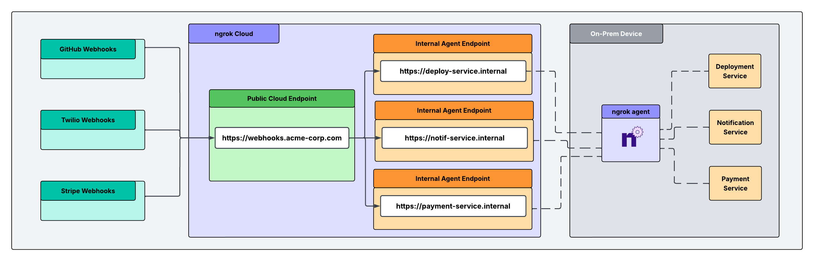

This guide sets up a single entry point where webhooks access your internal services. Verify and route requests from third-party providers without opening your firewall or using a VPN. 

<Note>
  ngrok can verify webhooks from 70+ providers out of the box. See the complete
  list of [supported webhook
  providers](/traffic-policy/actions/verify-webhook/#supported-providers).
</Note>

## How it works

Webhooks hit one public address that you configure for your Cloud Endpoint. A single Traffic Policy on that address checks the signature on every request, rejects anything that fails, and only forwards verified requests. The ngrok agent opens an outbound connection to ngrok and forwards webhook traffic to your internal service, so you never have to open an inbound port or touch your firewall.



## Three ways teams use this

The webhook gateway shape is the same for everyone. What differs is where your service runs and what you most need to guarantee:

- **Behind a firewall:** Your service runs on-prem or in a private network that blocks inbound connections. Webhooks reach your port without you having to open inbound connections.
- **Regulated workloads:** Your service handles PHI or other regulated data, often in a cloud container. The path has to be end-to-end encrypted and must not capture or store payloads.
- **Platform-governed:** A platform team owns which internal services can be . Endpoints and policy are declared as version-controlled config, and agents are scoped so developers can't create shadow exposure.

In this tutorial, you'll build the shared front door in steps 1–4, then apply the guardrail for your scenario in step 5.

## Tutorial

### What you'll need

- An ngrok account. If you don't have one, [sign up](https://dashboard.ngrok.com/signup).
- The [ngrok agent](/getting-started/), one of the [SDKs](/agent-sdks), or the [Kubernetes Operator](/k8s) installed where your service runs.
- The webhook signing secret for each provider you want to verify. You can find these in each provider's developer dashboard.
- (Optional) The ngrok agent CLI if you want to create a vault for your webhook secrets.

### 1. Give the receiving service a private address

Each service that handles webhooks gets an internal [Agent Endpoint](/gateway/agent-endpoints/): a private address that only receives traffic when it's forwarded through the [`forward-internal`](/traffic-policy/actions/forward-internal/) action. That's what keeps the service off the public internet. Internal endpoint hostnames must end with `.internal`.

How you create it depends on where the service runs.

<Tabs>
  <Tab title="On a server or VM">
    Run the agent next to your service. It connects outbound over TLS on port 443, so nothing needs to change on the firewall.

    ```bash
    ngrok http $SERVICE_PORT --url https://payment-service.internal
    ```

  </Tab>

  <Tab title="In a cloud container">
    Run the agent (or an [SDK](/agent-sdks)) inside the container alongside your app. The container only needs outbound network access—no ingress rule, no public IP—so a workload with an egress-only policy can still receive webhooks.

    ```bash
    ngrok http $SERVICE_PORT --url https://payment-service.internal
    ```

  </Tab>

  <Tab title="In Kubernetes">
    Let the [ngrok Operator](/k8s/) manage the endpoint as a version-controlled resource, so the platform team owns it in Git rather than in someone's shell history.

    ```yaml
    apiVersion: ngrok.k8s.ngrok.com/v1alpha1
    kind: AgentEndpoint
    metadata:
      name: payment-service
      namespace: webhooks
    spec:
      url: https://payment-service.internal
      upstream:
        url: http://payment-service.webhooks:8080
    ```

  </Tab>
</Tabs>

Repeat for every service that will receive webhook, for example, `notification-service.internal` and `deployment-service.internal`.

### 2. Reserve a public address

Webhook providers need a stable URL to deliver to. Navigate to the [**Domains**](https://dashboard.ngrok.com/domains) section of the dashboard and click **New +** to reserve a free static domain like `https://your-service.ngrok.app` or bring a [custom domain](/gateway/custom-domains/) you already own.

This tutorial will refer to your public address as `$NGROK_DOMAIN` from here on out.

### 3. Create the front door

Navigate to the [**Endpoints**](https://dashboard.ngrok.com/endpoints) section of the dashboard, click **New +**, then **Cloud Endpoint**, and enter the domain you reserved. (In Kubernetes, you can create this as a [`CloudEndpoint`](/k8s/crds/cloudendpoint/) resource instead—see step 5.)

### 4. (Optional) Store your signing secrets in a vault

Each route verifies a provider's signature using that provider's signing secret. For production, keep those secrets in [Secrets for Traffic Policy](/traffic-policy/secrets) so they're encrypted and referenced by name rather than pasted in plaintext. This step is optional, but a vault keeps secrets out of your policy source and lets you rotate them without editing routes.

```bash
ngrok api vaults create --name "webhook-secrets" --description "Webhook validation secrets"
```

Add each provider's secret, changing `$VAULT_ID` to match the vault ID returned above:

```bash
ngrok api secrets create --name "github-secret" --value "your_github_webhook_secret_here" --vault-id "$VAULT_ID"
ngrok api secrets create --name "twilio-secret" --value "your_twilio_auth_token_here"    --vault-id "$VAULT_ID"
ngrok api secrets create --name "stripe-secret" --value "your_stripe_secret_here"        --vault-id "$VAULT_ID"
```

### 5. Verify the sender and route it inward

On your Cloud Endpoint's Traffic Policy, each rule matches a provider by request path, verifies the signature with [`verify-webhook`](/traffic-policy/actions/verify-webhook), and forwards verified requests to the matching internal service with [`forward-internal`](/traffic-policy/actions/forward-internal/). A request with a bad or missing signature is rejected with a `403`.

<Tabs>
  <Tab title="Using vaults and secrets">
    ```yaml
    on_http_request:
      - expressions:
          - "req.url.path.startsWith('/github')"
        actions:
          - type: verify-webhook
            config:
              provider: github
              secret: "${secrets.get('webhook-secrets', 'github-secret')}"
          - type: forward-internal
            config:
              url: https://deployment-service.internal

      - expressions:
          - "req.url.path.startsWith('/twilio')"
        actions:
          - type: verify-webhook
            config:
              provider: twilio
              secret: "${secrets.get('webhook-secrets', 'twilio-secret')}"
          - type: forward-internal
            config:
              url: https://notification-service.internal

      - expressions:
          - "req.url.path.startsWith('/stripe')"
        actions:
          - type: verify-webhook
            config:
              provider: stripe
              secret: "${secrets.get('webhook-secrets', 'stripe-secret')}"
          - type: forward-internal
            config:
              url: https://payment-service.internal
    ```

  </Tab>

  <Tab title="Using plaintext secrets">
    ```yaml
    on_http_request:
      - expressions:
          - "req.url.path.startsWith('/github')"
        actions:
          - type: verify-webhook
            config:
              provider: github
              secret: "your_github_webhook_secret_here"
          - type: forward-internal
            config:
              url: https://deployment-service.internal

      - expressions:
          - "req.url.path.startsWith('/twilio')"
        actions:
          - type: verify-webhook
            config:
              provider: twilio
              secret: "your_twilio_auth_token_here"
          - type: forward-internal
            config:
              url: https://notification-service.internal

      - expressions:
          - "req.url.path.startsWith('/stripe')"
        actions:
          - type: verify-webhook
            config:
              provider: stripe
              secret: "your_stripe_secret_here"
          - type: forward-internal
            config:
              url: https://payment-service.internal
    ```

  </Tab>
</Tabs>

### 6. Add the guardrail your use case needs

The front door verifies and routes for everyone. Layer on additional security depending on what you need most.

<Tabs>
  <Tab title="Behind a firewall">
    Nothing more is required to keep traffic off the public internet: the agent's connection is outbound-only over port 443, and your `.internal` services are only reachable through `forward-internal`.
  </Tab>

  <Tab title="Regulated workloads">
    For PHI or other regulated data, keep the payload encrypted the whole way and make sure ngrok never retains it:

    - **End-to-end encryption.** Terminate TLS within your network at [the ngrok agent](/agent/agent-tls-termination) or at your upstream service. With this configuration, ngrok forwards ciphertext rather than decrypting traffic at the edge.
    - **No stored payloads.** Leave full traffic capture off. Use TCP or TLS endpoints to bypass all traffic capture, including most request metadata.

    Review ngrok's compliance posture and request a BAA through the [Trust Center](https://trust.ngrok.com) before sending regulated data.

  </Tab>

  <Tab title="Platform-governed">
    Let the platform team issue ACL-bound authtokens and manage Traffic Policy config as code.

    - **Scope the agent's authtoken with an ACL** so you define what endpoints that agent can start. See [Authtoken ACLs](/agent/cli-api) for the full syntax, but as an example:

    ```
    bind:deployment-service.internal
    ```

    - **Declare endpoints and policy as version-controlled resources**.
  </Tab>
</Tabs>

### 7. Configure your webhook URL at each provider and test

Add your ngrok URL and provider-specific webhook path within each provider's dashboard:

- **GitHub**: `https://$NGROK_DOMAIN/github`
- **Twilio**: `https://$NGROK_DOMAIN/twilio`
- **Stripe**: `https://$NGROK_DOMAIN/stripe`

Most providers offer a "send test event" button. Trigger one and watch it flow through: a valid event is verified and forwarded to the matching internal service, while a request with a bad or missing signature is rejected at the front door. You can confirm what happened for each request in the [Traffic Inspector](https://dashboard.ngrok.com/traffic-inspector). If you turned the inspector off for a regulated endpoint, verify against your own service logs instead.

## Verifying a provider that isn't on the supported list

`verify-webhook` supports a fixed set of [providers](/traffic-policy/actions/verify-webhook/#supported-providers). If your webhook provider isn't on the list, here are your options:

### Use a Traffic Policy expression

If the provider authenticates by sending a static secret in a header or query parameter, check for the header in a Traffic Policy expression and reject anything that fails:

```yaml
on_http_request:
  - expressions:
      - "req.headers.get('x-webhook-secret') != '${secrets.get('webhook-secrets', 'shared-secret')}'"
    actions:
      - type: deny
        config:
          status_code: 403
  # forward-internal rules follow
```

Combine with the [`restrict-ips`](/traffic-policy/actions/restrict-ips) action locked to the provider's published IP ranges or with `jwt-validation` if the webhook arrives as a signed JWT.

### Ask us to add it

Email us at support@ngrok.com to [request your provider](/traffic-policy/actions/verify-webhook/#supported-providers).
