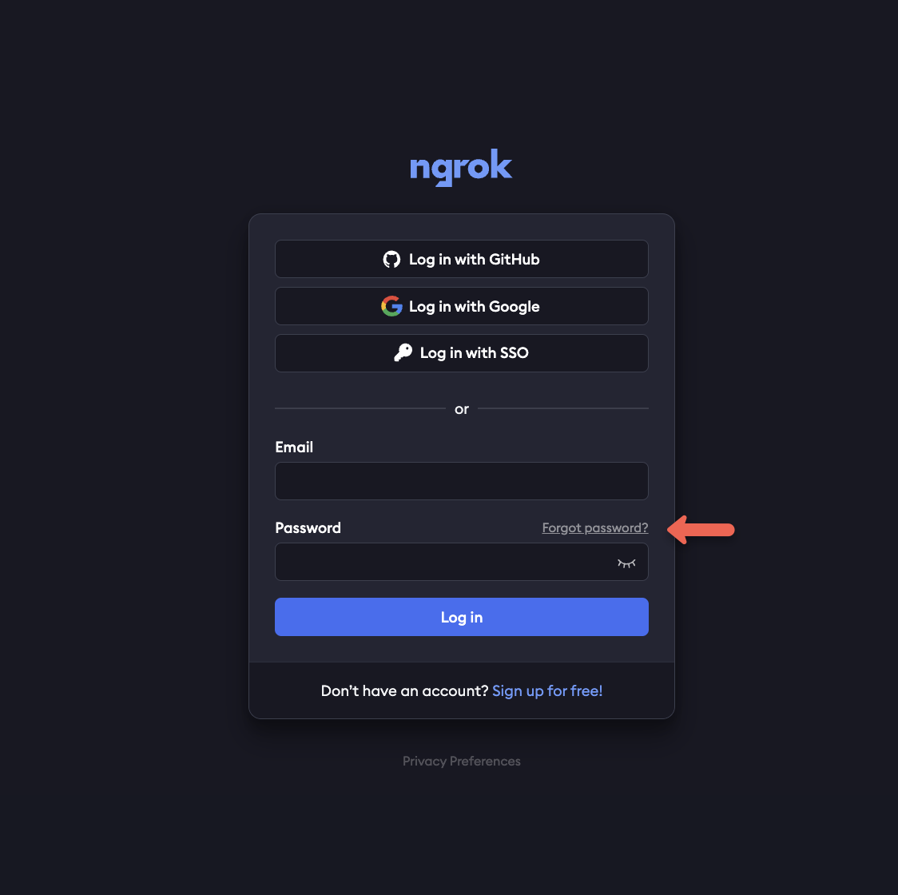
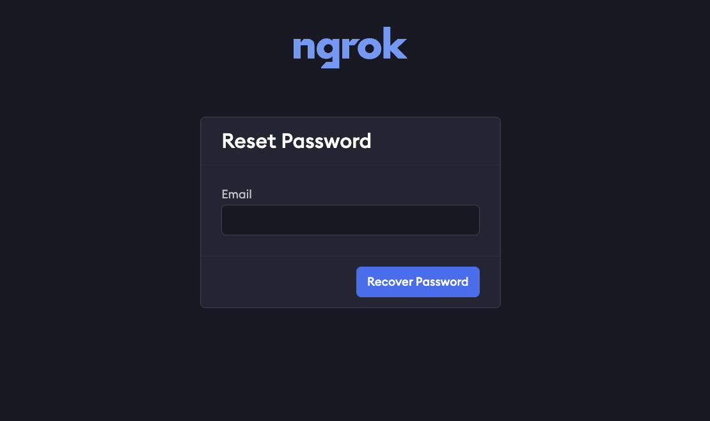
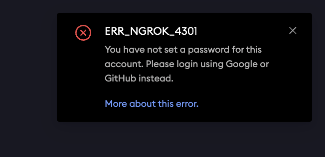
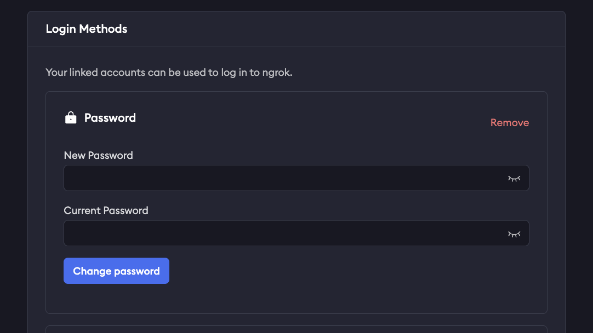
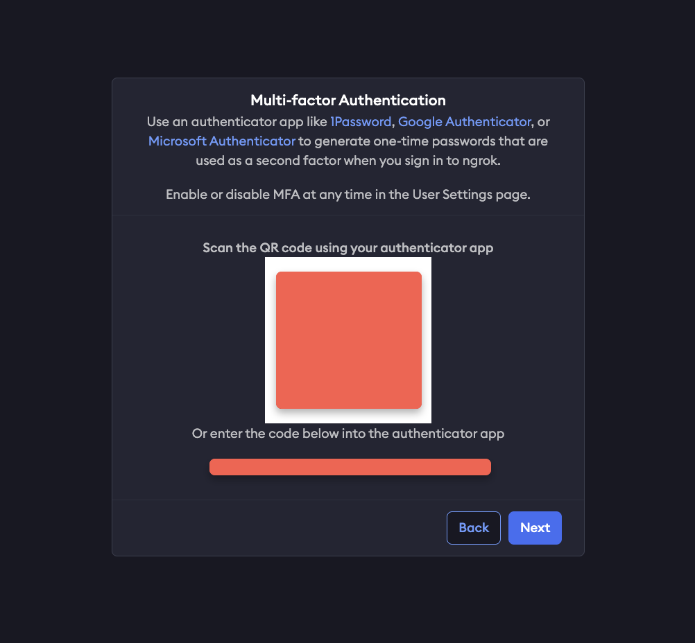
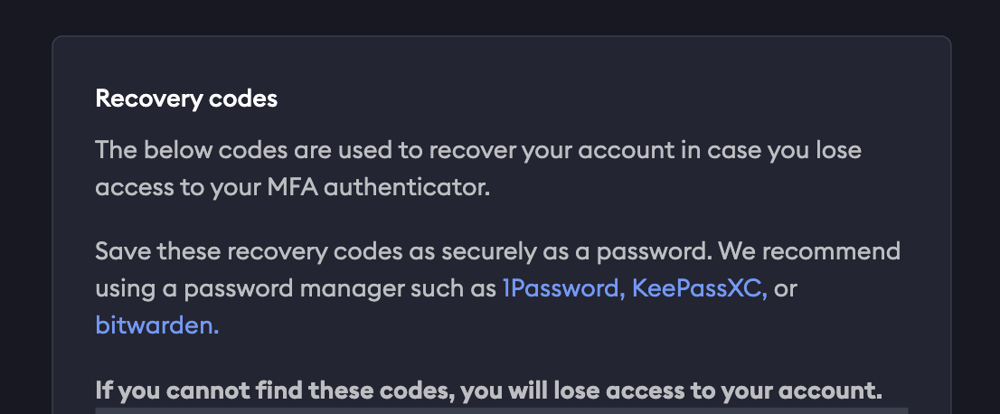
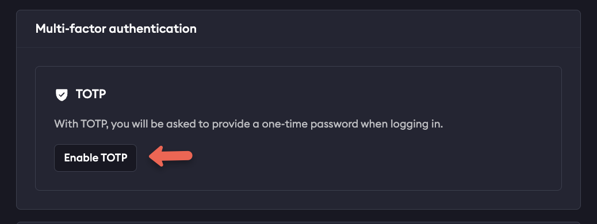
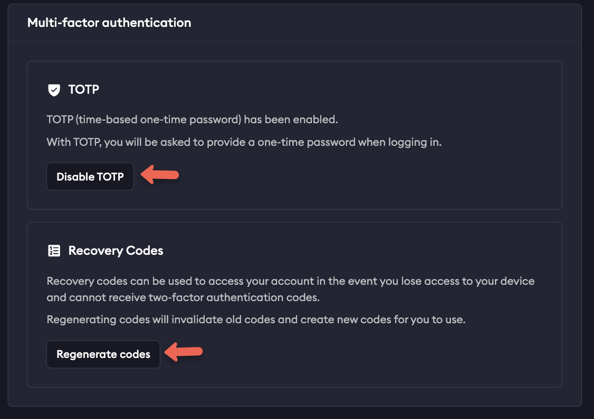

Users are members of your Account that may log into the dashboard, start
agents, create endpoints and access the API.

- Users have one or more [Credentials](#credentials) that they use to
  authenticate with the ngrok service.
- Users are not uniquely owned by an account. A User may be a member of more than
  one account.
- Users are subject to [Role Based Access Control](/iam/rbac) that allows you to
  restrict what actions Users may take within the account.
- Whenever a User takes an action within an account, the corresponding
  [Event Log](/obs/) will attribute the event to the User by recording it as the
  Principal.

## Dashboard Access

Users may log into the [ngrok dashboard](https://dashboard.ngrok.com). You may
configure your account to restrict how users authenticate to the dashboard.
ngrok supports dashboard authentication via an email and password, an IdP like
GitHub or Google or your own [Single Sign-On IdP](/iam/sso) like Okta or Azure
AD.

Users may log into your ngrok Account's dashboard. Normally, users enter an
email and password to log into the ngrok dashboard but you may configure your
ngrok account to require additional factors or require SSO.

[Service Users](/iam/service-users/), by contrast, may not log into the dashboard.

### Password Management

You can sign up for an ngrok account using an email and password, or using an SSO provider.

#### Resetting a Forgotten Password

If you've forgotten your password, it can be reset at any time via the [login page](https://dashboard.ngrok.com/login).

From there, enter the email address you used to sign into your ngrok account, and click **recover password**.

<Note>
If you use SSO to sign in, and haven't also added a password to your account, you won't be able to reset your password.
</Note>
Ensure you enter the correct email, and check your spam folder to confirm you've received the password reset email.
If you can't remember what email you used, you may want to try other possible addresses, or review past invoices to reference the correct email.

If you receive an `ERR_NGROK_4301` error, you'll need to try signing in with SSO, as you didn't set a password for the account.

If you don't receive the email after completing these steps, contact support for further assistance.

#### Changing Your Password

If you already have access to your account already, but want to change the password, you can do so via your user settings.
Select your username in the upper-left corner of the dashboard and selecting **User Settings**. 
From there, you'll enter your old password, and the new one you would like to use.

### MFA

Multi Factor Authentication (MFA) allows you to add an extra layer of security to your ngrok account by requiring an additional authentication factor to log in.
At the moment, MFA only supports one-time passwords ([TOTP](https://en.wikipedia.org/wiki/Time-based_one-time_password)) as an additional factor.

You may configure your ngrok account to enforce that all users have MFA enabled.

#### Setting Up MFA During Signup

When signing up for an ngrok account for the first time, you'll be prompted to set up Multi Factor Authentication with a QR code from us to use with your preferred authenticator.

From here, you'll want to open up your preferred authenticator (Google Authenticator, Microsoft Authenticator, Authy, Duo, Okta Authenticator, etc) and utilize the QR code provided.
Once you set up your preferred authenticator, you'll be asked to enter a code from that authenticator each time you log into your ngrok account.

#### Recovery Codes

You will also be provided a list of recovery codes, which you can copy and paste elsewhere or download directly.
Store these recovery codes in a secure location as they can be used to access your account if you lose access to your authenticator device.

#### Managing MFA Settings

You can enable or disable MFA at any time once logged into your account by selecting on your username in the upper left corner of your dashboard, and then **User Settings**.
Scroll down to **Multi Factor Authentication** and select **Enable** or **Disable**, as well as generate new recovery codes if needed.

#### Lost Access or Recovery

If you lose access to your authenticator or device and do not have recovery codes downloaded, or have used all available codes, email [support@ngrok.com](mailto:support@ngrok.com) with the email you use to sign into your ngrok account.

### Single Sign-On

Users may also log in with a federated IdP via single sign-on. Your ngrok
account may be configured to require the use of single sign-on for all of your
users to log in. Consult the [Single Sign-On documentation](/iam/sso) for
additional details on configuring it.

### IP Restrictions

In addition to the normal authentication factors required to log into the ngrok
dashboard, you may also configure your ngrok account to further restrict
dashboard access to a set of IP CIDR blocks.

Dashboard IP Restrictions should always be used in a warning mode first to test
that you won't accidentally lock yourself out of your account if you restrict
access to IPs that you can't use.

IP Restrictions can be configured manually on the ngrok dashboard or
programmatically via API with a `type` of `dashboard`.

- **[IP Restrictions on your ngrok dashboard](https://dashboard.ngrok.com/security/ip-restrictions)**
- **[IP Restrictions API Resource](/api-reference/iprestrictions/list/)**

## Credentials

Users own one or more credentials that enable them to start [Agents](/agent/)
and make API requests.

Credentials are assigned an owner when they are created and the owner cannot be
changed. All Credentials have a Principal owner which is either a User or a Bot
User.

Credentials are [Authtokens](/agent/#authtokens), [API
Keys](/api/#authentication) and [SSH Public
Keys](/agent/ssh-reverse-tunnel-agent/#authentication).

## Disabling

You may 'disable' users in your account. When a User is disabled it cannot log
into the dashboard, start an ngrok agent or make API requests. All of its
[Credentials](#credentials) remain but cannot be used. A User may be
re-enabled at any time.

Users may disabled and enabled [Administrators](/iam/rbac/#administrator) or
[Team Managers](/iam/rbac/#team).

## Deletion

When a User is deleted from an account, all of its [Credentials](#credentials)
for that account are revoked and any agents using them will stop working. If
you have an automated process or agent using ngrok, use a [Service
User](/iam/service-users) instead.

When you delete a User from your account, keep in mind that the User
itself is not deleted, it is only removed from the Account. It may continue to use
and access other Accounts it is a member of.

Users may deleted by [Administrators](/iam/rbac/#administrator) or
[Team Managers](/iam/rbac/#team).

## Provisioning

Provisioning is about how you add new users to your account. You may configure
your ngrok account with your preferred provisioning method on your [Account
Settings page](https://dashboard.ngrok.com/settings). By default, you provision
new users by inviting them to join your Account with Invitations.

If you have configured [SSO](#single-sign-on), you may also add users to your
account via the SCIM or JIT provisioning methods.

### Invitations

Invitations are the default user provisioning mechanism. You invite new users
by email address. They must log in or sign up with that email address to accept
the invitation. When you issue the invitation, if you are using
[RBAC](/iam/rbac) you may also choose the permissions they will receive when
they join the account by accepting the invitation.

### Just-in-Time

If you have configured a federated SSO IdP on your account, you may configure
Just-in-Time (JIT) provisioning. When JIT provisioning is enabled, if a user
signs in with your configured IdP and they do not have a matching ngrok User,
one will automatically be provisioned for them the first time they log in and
it that user will be added as a member of your account.

Users who are JIT provisioned are always assigned a Read/Write [Developer
role](/iam/rbac#developer) and an Invite [Team role](/iam/rbac#team).

### SCIM

If you have configured a federated SSO IdP on your account, you may configure
SCIM provisioning. When SCIM provisioning is enabled, the IdP is responsible for
making calls to ngrok's SCIM API

Users provisioned by SCIM are always assigned a Read/Write [Developer
role](/iam/rbac#developer) and an Invite [Team role](/iam/rbac#team).

Users provisioned by SCIM are not permitted to change their name or email
address because it is managed by the IdP.

Consult the [SCIM documentation](/iam/sso/#scim) for additional details.
