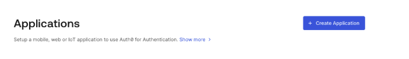
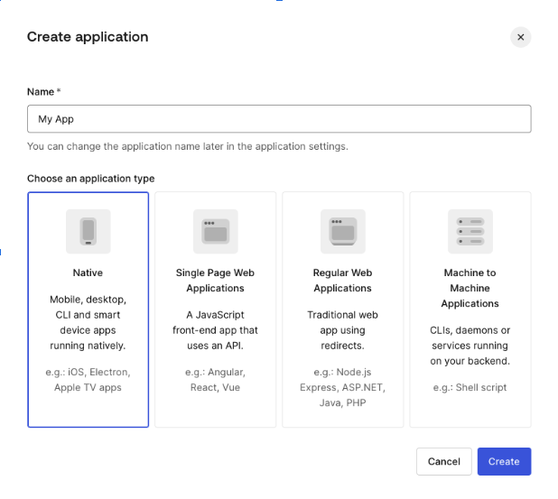
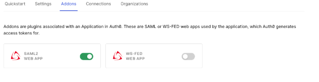
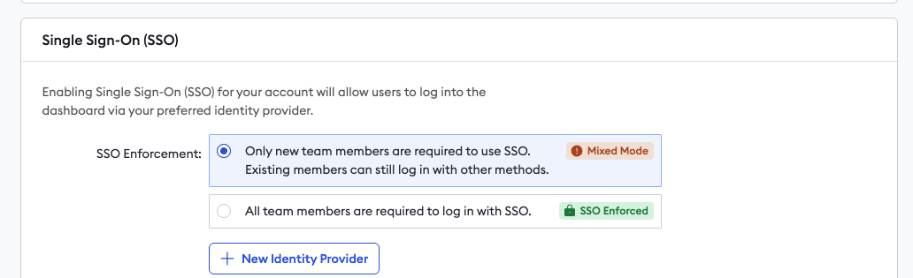
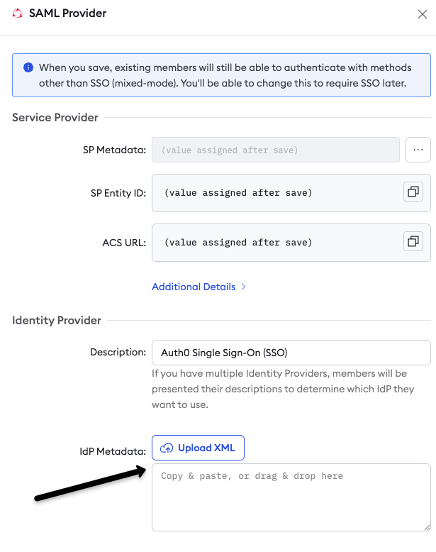
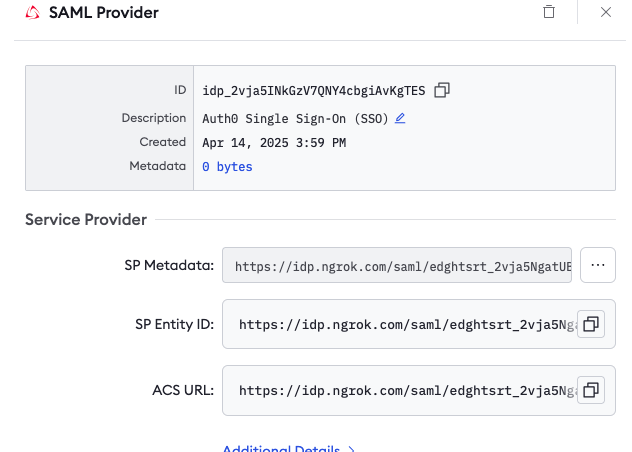

This guide walks you through configuring the ngrok dashboard to use Auth0 as an identity provider and enable single sign-on within SAML for your ngrok account.
This should not be confused with configuring an ngrok endpoint to allow your application users to log in using Auth0.

## What you'll need

- Admin access to create new applications in Auth0
- Admin access to edit your ngrok account settings
- An ngrok Enterprise account

## 1. Create an Application in Auth0

1. From the "Applications" menu, click the blue "Create Application" button.
   

2. Name your application, select the application type of Native and click the Create button.
   
3. Select your application and choose the Addons tab. Turn SAML2 support on.
   

4. In the popup window on the Usage tab download the Identity Provider Metadata from the provided link.

## 2. Configure Single Sign-On (SSO) for your ngrok account

1. Log into your ngrok dashboard and navigate to the "Settings > Account" section in the left navigation menu.
2. Select "+ New Identity Provider" button to add a new SAML identity provider.
   
3. Add a helpful description, and then upload the metadata.xml file from Auth0 into the ngrok dashboard.
4. In the Options section, select whether you'd like to allow users to log into the dashboard directly from their ngrok dashboard
   
5. Click "Save". Clicking Save will create the integration and generate the required URLs for your Auth0 Application.
   

## 3. Add the ngrok generated URLs to your Auth0 SAML application

1. Back in your Auth0 account, select your Application and click on the Addons tab. Again select the SAML2 Web App. In the popup window select the Settings tab.
   1. Paste in the Application Callback URL (ACS) obtained from the ngrok IdP settings - SAML Provider/Service Provider - ACS URL as seen above.
   2. In the settings code block window paste in the following and Save:
      ```json
      {
      	"nameIdentifierFormat": "urn:oasis:names:tc:SAML:1.1:nameid-format:emailAddress",
      	"nameIdentifierProbes": ["email"],
      	"mappings": {
      		"email": "email"
      	}
      }
      ```

You should now be configured to log into your ngrok account using Auth0.

By default, your ngrok account will still allow users to log in with their existing credentials as well as through Auth0 ("Mixed Mode").
Once you verify that everything is working properly with your integration, you can enable "SSO Enforced" in the ngrok Dashboard which will require all new users to log in through Auth0 for their ngrok account.
