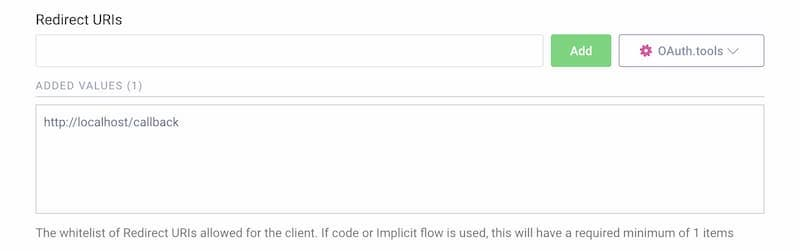
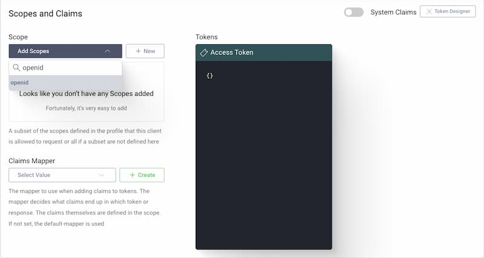

import Disclaimer from "/snippets/integrations/_endpoint-sso-disclaimer.mdx";

<Disclaimer />
<Tip>
**TL;DR**

To secure access to ngrok with Curity Identity Server using OpenID Connect:

1. [Configure Curity Identity Server](#configure-Curity-auth)
2. [Configure ngrok](#configure-ngrok)
3. [Test access to ngrok with Curity Identity Server](#test-sso)
</Tip>

This guide walks you through configuring Curity as the primary Identity Provider for ngrok tunnels using single sign-on (SSO).
By integrating Curity Identity Server with ngrok, you can:

- Restrict access to ngrok tunnels to only users who authenticated via Curity
- Use Curity security policies, MFA authenticators—including BankId, SITHS, and WebAuthn—to control access to ngrok tunnels
- Use Curity's Dashboard to facilitate access to ngrok apps

## What you'll need

- A Curity account with administrative rights to create clients.
- An ngrok Enterprise account with an authtoken or admin access to configure edges with OpenID Connect.

## 1. Configure Curity Authentication 

The Curity Identity Server provides an authenticator called `html-form` that is suitable for setting up a login with username and password. It uses a Credential Manager to verify the credentials, which in turn uses a data-source. There any many options for stronger authentication than username and password. A list of possible authentication methods is available [here](https://curity.io/product/authentication-service/ways-to-authenticate/).

### Add authentication

1. #### Add an Authenticator
   1. Navigate to Profiles > Authentication Service > Authenticators.
   1. Click **New Authenticator** on the authenticator page and give it a name.
   1. Select the `HTML-Form` Authenticator type in the grid of authenticators and click **Next**.
   1. Under **HTML Form Settings**, select the `default-account-manager` as account manager and `default-credential-manager` as credential manager.
      

2. #### Commit the changes
   1. Commit the changes via the **Changes** menu.

      

## 2. Configure Curity for OIDC 

### Add an openid client in Curity

1. #### Add New Client
   1. Navigate to **Profiles** > **Token Service** > **Clients** and click **+ New Client**.
   1. Give the client an ID (for example,  `www` for a website client) and click **Create**.

2. #### Add Capabilities
   1. Scroll down to the **Capabilities** section and click **Add capabilities**.
   1. Select the **Code Flow** capability and click **Next**.

      

   1. Enter `http://localhost/callback` as a **Redirect URI** and click **Add**.
      
   1. Click **Next**.
   1. On the **Client Authentication** screen, select **secret**.
   1. Click **Generate** to generate a new secret.
      
      1. Copy the **secret** since it cannot be retrieved later again (but can be reset).
   1. On the **User Authentication** screen, select the `HTML-form` authenticator created in **[Step 1](#configure-Curity-auth)**.
   1. Click **Done**.
   1. Scroll down on the newly created client page to **Scopes and Claims**.
   1. Select `openid` from the list of scopes in the dropdown menu.
      

3. #### Expose the metadata url

   ngrok makes a call to the `/.well-known/openid-configuration` endpoint at Curity to pull configuration data specific to your Authorization Server.
   1. Navigate to **Profiles** > **Token Service** > **General** page.
   1. Scroll down to the **OpenID Connect** section and enable the `Expose Metadata` toggle.
      

4. #### Commit the changes
   1. Commit the changes via the **Changes** menu.

      

## 3. Configure ngrok 

ngrok can use Curity Identity Server in two ways:

- From the ngrok CLI (using the `--oidc` parameter)
- From the ngrok dashboard

### **Option 1**: ngrok CLI

<Note>
This tutorial assumes you have an app running locally (for example, on `localhost:3000`) with the ngrok client installed.
</Note>

1. Launch a terminal.
2. Enter the following command to launch an ngrok tunnel with Curity Identity Server.
Replace `<curity_url>` with your Curity issuer address (for example, `https://acme.com/oauth/v2/oauth-anonymous`) and the `<curity_client_id>` and `<curity_client_secret>` with the respective values copied from the ngrok app registered at Curity:

   ```bash
   ngrok http 3000 --oidc <curity_url> \
   --oidc-client-id <curity_client_id> \
   --oidc-client-secret <curity_client_secret> \
   --url curity-sso-test.ngrok.dev
   ```

3. Skip to **Step 4** to test the integration.

### **Option 2**: ngrok edge

To configure an edge with Curity:

1. Go to dashboard.ngrok.com.
2. Click **Universal Gateway > Edges**.
3. If you don't have an edge already set to add Curity Identity Server, create a test edge:
   - Click **New Edge**.
   - Click **HTTPS Edge**.
   - Click the **pencil icon** next to "no description".
   Enter `Edge with Curity Identity Server` as the edge name and click **Save**.
4. On the edge settings, click **OIDC**.
5. Click **Begin setup** and enter the following:
   - **Issuer URL**: Your Curity issuer URL (for example, `https://acme.com/oauth/v2/oauth-anonymous`).
   - **Client ID**: The name of the client from Curity.
   - **Client Secret**: The client secret copied from Curity.
6. Click **Save**.
7. Launch a tunnel connected to your Curity edge:

   <Note>
   This step assumes you have an app running locally (for example, on `localhost:3000`) with the ngrok client installed.
   </Note>

8. Click **Start a tunnel**.
9. Click the **copy icon** next to the tunnel command.
10. Launch a tunnel:
    - Launch a terminal.
    - Paste the command.
    Replace `http://localhost:80` with your local web app address (for example, `http://localhost:3000`).
    - Press **Enter**.
    An ngrok tunnel associated with your edge configuration will launch.
11. To confirm that the tunnel is connected to your edge:
    - Return to the ngrok dashboard.
    - Close the **Start a tunnel** and the **Tunnel group** tabs.
    - Refresh the test edge page.
    Under traffic, you will see the message _You have 1 tunnel online. Start additional tunnels to begin load balancing_.
12. In the test edge, copy the **endpoint URL**.
You will use this URL to test the Curity authentication.

## 4. Test the integration

1. In your browser, launch an incognito window.
2. Access your ngrok tunnel (for example, `https://curity-sso-test.ngrok.app` or using a copied URL).
3. You should be prompted to log in with your Curity credentials.
4. After logging in, you should be able to see your web app.
