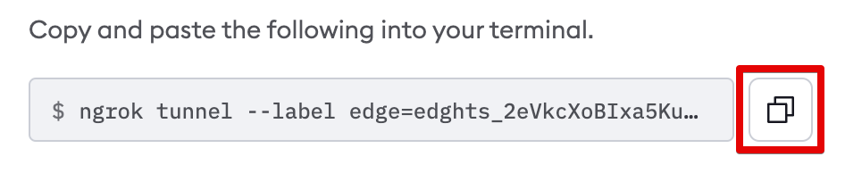

import Disclaimer from "/snippets/integrations/_endpoint-sso-disclaimer.mdx";

<Disclaimer />
<Tip>
**TL;DR**

To secure access to ngrok with Descope Single Sign-On using SAML:

1. [Configure Descope SSO](#configure-descope)
1. [Configure ngrok](#configure-ngrok)
1. [Test access to ngrok with Descope SSO](#test-sso)
</Tip>

This article details how to configure Descope as the primary Identity Provider for ngrok endpoints.
By integrating Descope SSO with ngrok, you can:

- **Restrict access to ngrok endpoints** only to users authenticated via Descope
- **Use Descope security policies and MFA authenticators**.
- **Use the Descope Console to facilitate access to ngrok apps**.

## Supported Features

The ngrok integration with Descope supports:

- **SP-Initiated SSO**: In this mode, users access ngrok edges and tunnels and are redirected to Descope for authentication.

## Requirements

To configure ngrok tunnels with Descope, you must have:

- A Descope project with administrative rights and an Enterprise license to be able to create [SAML Applications](https://docs.descope.com/manage/idpapplications/saml/)
- An [ngrok Enterprise Account](https://ngrok.com/pricing) with an authtoken or admin access to configure edges with SAML.

## Configuration Steps

To integrate ngrok with Descope SSO, you will need to:

1. Configure Descope with the ngrok app
1. Configure ngrok with the SSO settings provided by Descope

## **Step 1**: Fetch IdP Metadata 

### Add the ngrok App in Descope

1. Open the [Descope Console](https://app.descope.com).

1. On the left menu, click **Applications**, and then click **+ Application** in the top right corner.

1. In the popup window, enter `ngrok` in the **Name** field, make sure that `SAML` is selected under **Authentication protocol**, and then click **Create**.

1. On the **ngrok** application page, click on the download button next to **Descope Metadata (XML)** to download the Metadata file that you'll need later on. Make sure to leave this page open.

1. **Optional**: if you wish to change the [Auth Hosting URL](https://docs.descope.com/knowledgebase/general/authhostingapp/#usage), to use a different flow for ngrok SSO you can change that on this page, and click **Save**.

### **Step 2**: Configure ngrok 

To configure an edge with Descope:

1. Access the [ngrok Dashboard](https://dashboard.ngrok.com/) and sign in using your ngrok account.

1. On the left menu, click **Universal Gateway** and then click **Edges**.

1. If you don't have an edge already set to add Descope SSO, create a test edge:
   - Click **+ New Edge**.
   - Click **Create HTTPS Edge**.
   - Click the **pencil icon** next to "no description", enter `Descope SSO SAML` as the edge name, and click **Save**.

1. On the edge settings menu, click **SAML**.

1. On the **SAML** page, click **Begin setup**, click **Upload XML**, and then open the XML metadata file you downloaded from Descope (See [Fetch IdP Metadata](#idp-metadata)).
   

1. **Optional**: If you wish to enable IdP-initiated SSO, so that you can sign in directly from the Descope IdP-initiated SSO URL instead of from ngrok, you can check this box.
   

1. Click **Save** at the top.

1. Copy both the **Entity ID** and the **ACS URL** values for later use.

### **Step 3**: Configure Descope 

1. Back in the Descope Console, under your **ngrok** application, select **Enter the connection details manually** under **Service Provider (SP)**.

1. Enter the following values in the input fields and save the configuration.
   

   **Note**: Replace the following with the values copied on previous steps:
   - `NGROK_ACS_URL`: The value of the ngrok **Entity ID** copied from the edge SAML configuration.
   - `NGROK_ENTITY_ID_URL`: The value of the ngrok **ACS URL** copied from the edge SAML configuration.

### **Step 5**: Start a Tunnel 

1. Access the [ngrok edges page](https://dashboard.ngrok.com/edges), click your edge, and then click **Start a tunnel**.
<Tip>
**Note**

For this step, we assume you have an app running locally (i.e. on `localhost:3000`) with the ngrok client installed.
</Tip>

1. Click the **copy icon** next to the tunnel command.
   

1. Launch a tunnel:
   - Launch a terminal.
   - Paste the command but replace `http://localhost:80` with your localhost app address (i.e., `http://localhost:3000`).
   - Click **Enter** and an ngrok tunnel associated with your edge configuration will launch.

1. To confirm that the tunnel is connected to your edge:
   - Return to the ngrok dashboard
   - Close the **Start a tunnel** and the **Tunnel group** tabs
   - Refresh the test edge page. Under traffic, You will see the message _You have 1 tunnel online. Start additional tunnels to begin load balancing._
     

1. In the test edge, copy the **endpoint URL**. (you use this URL to test the Descope Authentication)
   

## Test the integration 

1. In your browser, launch an incognito window.

1. Access your ngrok endpoint (i.e., `https://descope-sso-test.ngrok.app` or use the copied URL).

1. You should be prompted to log in with Descope.

1. After logging in, you should be able to see your web app.
