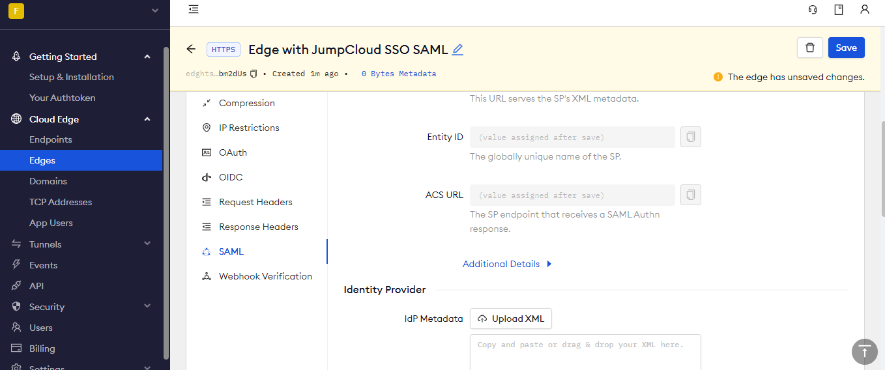
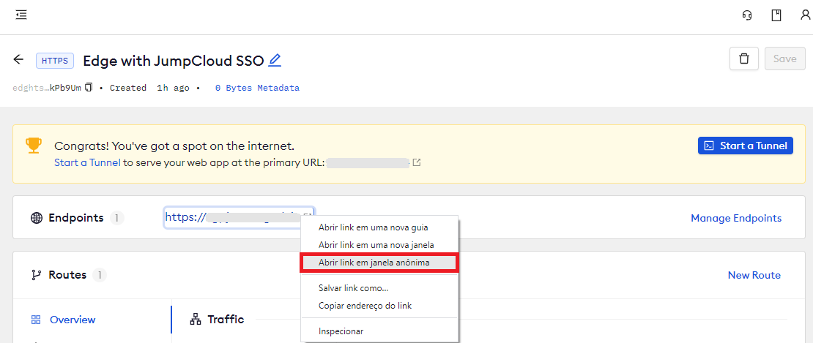

import Disclaimer from "/snippets/integrations/_endpoint-sso-disclaimer.mdx";

<Disclaimer />
<Tip>
**TL;DR**

To secure access to ngrok with JumpCloud Single Sign-On using SAML:

1. [Configure JumpCloud SSO](#configure-jumpcloud)
1. [Configure ngrok](#configure-ngrok)
1. [Test access to ngrok with JumpCloud SSO](#test-sso)
</Tip>

This article details how to configure JumpCloud as the primary Identity Provider for ngrok tunnels.
By integrating JumpCloud SSO with ngrok, you can:

- **Restrict access to ngrok tunnels** only to users authenticated via JumpCloud
- **Use JumpCloud security policies and MFA authenticators**.
- **Use JumpCloud's Dashboard to facilitate access to ngrok apps**.

## Requirements

To configure ngrok tunnels with JumpCloud, you must have:

- an JumpCloud account with administrative rights to create apps
- an [ngrok Enterprise Account](https://ngrok.com/pricing) with an authtoken or admin access to configure edges with SAML.

## Configuration Steps

To integrate ngrok with JumpCloud SSO, you will need to:

1. Configure JumpCloud with the ngrok app
1. Configure ngrok with the SSO settings provided by JumpCloud

## **Step 1**: Configure JumpCloud 

1. Access the [JumpCloud Console](https://console.jumpcloud.com/), and sign in using your JumpCloud administrator account.

1. On the left menu, click **SSO**, click **Get Started** or **+ Add New Application**, and then click **Custom SAML App**.

1. On the **New Application** popup, enter `ngrok saml` in the **Display Label** field.

1. Click the **SSO** tab, enter `https://ngrok-jumpcloud` in the **IdP Entity ID** field, enter temporary values (i.e., `https://temporary`) in both the **SP Entity ID** and the **ACS URL** fields, and then click **activate**.

### **Step 2**: Download the IdP metadata 

1. On the **SSO** page of the [JumpCloud Console](https://console.jumpcloud.com/), click your **Custom SAML App**, click the **SSO** tab, click **Export Metadata**, and then save the XML file on your desktop.

### **Step 3**: Configure ngrok 

To configure an edge with JumpCloud:

1. Access the [ngrok Dashboard](https://dashboard.ngrok.com/) and sign in using your ngrok account.

1. On the left menu, click **Universal Gateway** and then click **Edges**.

1. If you don't have an edge already set to add JumpCloud SSO, create a test edge:
   - Click **+ New Edge**.
   - Click **Create HTTPS Edge**.
   - Click the **pencil icon** next to "no description", enter `Edge with JumpCloud SSO SAML` as the edge name, and click **Save**.

1. On the edge settings menu, click **SAML**.

1. On the **SAML** page, click **Begin setup**, click **Upload XML**, and then open the XML metadata file you downloaded from JumpCloud (See [Download the IdP metadata](#idp-metadata)).
   

1. Click **Save** at the top.

### **Step 4**: Download the SP metadata 

1. On the **SAML** page of your [ngrok edge](https://dashboard.ngrok.com/edges), click the three dots close to the **SP Metadata** field, click **Download XML File**, and then save the XML file on your desktop.

### **Step 5**: Link JumpCloud with ngrok 

1. Access the [JumpCloud Console](https://console.jumpcloud.com/), click **SSO**, click your **Custom SAML App**, click the **SSO** tab, click **Upload Metadata**, and then open the XML metadata file you downloaded from ngrok (See [Download the SP metadata](#sp-metadata)).
   

1. Click **Save**.

### **Step 6**: Start a Tunnel 

1. Access the [ngrok edges page](https://dashboard.ngrok.com/edges), click your edge, and then click **Start a tunnel**.
<Tip>
**Note**

For this step, we assume you have an app running locally (i.e. on localhost:3000) with the ngrok client installed.
</Tip>

1. Click the **copy icon** next to the tunnel command.
   

1. Launch a tunnel:
   - Launch a terminal.
   - Paste the command but replace `http://localhost:80` with your localhost app address (i.e., `http://localhost:3000`).
   - Click **Enter** and an ngrok tunnel associated with your edge configuration will launch.

1. To confirm that the tunnel is connected to your edge:
   - Return to the ngrok dashboard
   - Close the **Start a tunnel** and the **Tunnel group** tabs
   - Refresh the test edge page. Under traffic, You will see the message _You have 1 tunnel online. Start additional tunnels to begin load balancing._
     

1. In the test edge, copy the **endpoint URL**. (You use this URL to test the JumpCloud Authentication)
   

## Grant access to JumpCloud users 

JumpCloud allows administrators to restrict access to SSO apps — such as ngrok — via user group assignments. By default, apps created in JumpCloud have no group assignments — in other words, nobody can use JumpCloud SSO to access ngrok until you assign a group to the app.

To assign JumpCloud groups to the ngrok app:

1. On the left menu of the [JumpCloud Console](https://console.jumpcloud.com/), click **SOO** and click the ngrok custom SAML app you created.

1. On the app popup, click the **User Groups** tab, click the checkbox of the **All Users** group, and then click **Save**.
   **Tip**: Make sure to add JumpCloud users to this group when you create or manage users that need access to the ngrok app.

## Test the integration 

1. In your browser, launch an incognito window.

1. Access your ngrok tunnel (i.e., `https://jumpcloud-sso-test.ngrok.app` or using the copied endpoint URL).

1. You should be prompted to log in with your JumpCloud credentials.

1. After logging in, you should be able to see your web app.
